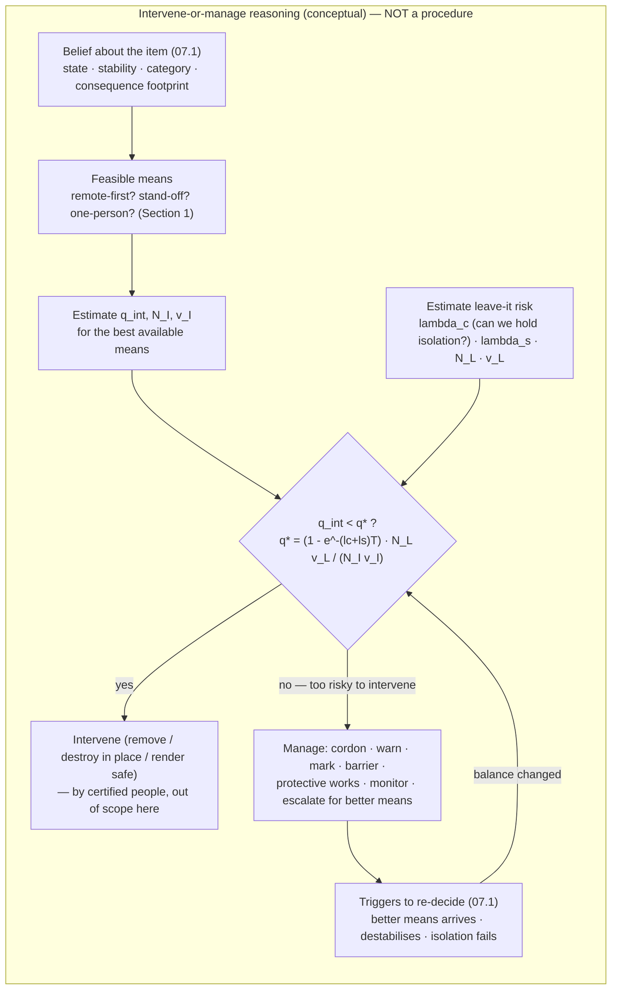

# 07.3 · Neutralisation and the decision *not* to intervene

<div class="module-card">

**Prerequisites** [07.1 Decisions under uncertainty](lessons/stage-07/lesson-01.md) (expected loss, exposure integral, VOI) · [07.2 Incident management](lessons/stage-07/lesson-02.md) (cordons, disposal-outcome families) · [03.4 Improvised hazards](lessons/stage-03/lesson-04.md) (victim-operated / command / time categories) · [03.2 Munitions & safety-and-arming](lessons/stage-03/lesson-02.md) (most-dangerous-state reasoning).

**Estimated time** 5 h (3 h theory · 1 h simulator · 1 h programming) · **Level** Advanced

**Next** the [Stage 7 gate](assessments/stage-07.md), then [08.1 The post-blast scene](lessons/stage-08/lesson-01.md).

<p class="tags"><span>neutralisation principles</span><span>render-safe as a decision</span><span>hands-off judgement</span><span>managed presence</span><span>residual risk</span><span>Sim A · Sim F</span></p>
</div>

## Why this matters

07.2 ended with three families of disposal outcome and a fourth in brackets: *monitor / manage*.
That bracket is the subject of this lesson. The most consequential judgement an explosive-hazard
organisation makes is not *how* to neutralise an item — that is certified, restricted, hands-on
craft — but **whether to put anyone near it at all**, and, when the honest answer is "not yet" or
"not ever", how to protect people while the item stays where it is. Sometimes the correct decision
is to *not* render an item safe even though leaving it means an uncontrolled person could one day
touch it: the SS *Richard Montgomery* has been left on the Thames estuary since 1944 precisely
because disturbing it is judged more dangerous than the managed risk of leaving it
([CS-9](case-studies/cs09-ss-richard-montgomery.md)). This lesson gives you the reasoning to defend
that kind of decision — and its opposite — quantitatively, and it states plainly the one
"disarming method" that is safe for anyone who is not a certified, equipped technician.

<div class="callout boundary">

**Scope — read this first.** This lesson teaches neutralisation as a *decision*, not as an
*action*. It contains **no render-safe procedure, no tool technique, no approach method, no
diagnostic step, no wiring, timing, initiation or component detail, and nothing about how any
outcome is physically achieved**. Those skills are taught only inside certified institutions under
supervision, because partial knowledge of them is more dangerous than none — knowing how a device
is taken apart is knowing how it is put together. What is in scope, and taught in the open, is: the
*principles* that govern every professional intervention (stated at the level of "minimise
exposure", not "do X to Y"); and the *decision* of when intervening is worse than not. All items,
yields (YU) and losses (LU) are abstract or fictional.

</div>

<div class="callout safety">

**The only disarming method for the untrained: positive separation.** If you are not a certified,
equipped explosive-ordnance technician, the correct and complete procedure is: **do not touch it,
do not move it, do not cover it, do not use radios or phones right beside it, move away, keep
others away, and call the professionals** (the 4Cs of [03.4](lessons/stage-03/lesson-04.md):
Confirm from a distance, Clear, Communicate, Control). "Disarming" for you means *creating and
holding distance*, not intervening on the item. Everything below is about how professionals decide
whether *they* should intervene — not an invitation to do it yourself.

</div>

## Learning objectives

1. State the neutralisation *principles* common to all professional intervention (remote-first,
   maximum stand-off, minimum exposure, most-dangerous-state, positive control, precaution) and
   explain each as an operation on the exposure integral of 07.1 — without any procedure.
2. Build the intervene-versus-leave decision as a comparison of two expected harms, and derive the
   threshold on intervention risk below which acting is justified.
3. Explain, quantitatively, when *leaving* an item under managed presence is correct **even though
   an uncontrolled person might contact it**, and identify the parameters that flip the decision.
4. Enumerate the recognition-level indicators that push a decision toward *hands-off*, and map each
   to a term in the decision model.
5. Place the *monitor / manage* outcome — cordon, warn, mark, barrier, protective works, long-term
   monitoring — into the disposal-outcome family set of 07.2 as a first-class choice, not a failure.
6. Explain why "an item nobody rendered safe" is not the same as "a failure", using outcome-bias
   reasoning from 07.1.

## Theory

### 1. The neutralisation principles (stated as constraints, never as procedures)

Every professional approach to an explosive hazard, whatever the item, is governed by a small set
of principles. They are safe to teach because they are *constraints on exposure*, not instructions
for acting on a device. Each is a lever on the 07.1 expected-harm integral
$\mathbb E[\text{harm}] = \sum_j \int P(H)\,\lambda(t)\,v(r_j(t))\,dt$.

| Principle | Plain statement | Term it acts on |
|---|---|---|
| **Remote-first** | prefer a means that puts a machine, not a person, at the item — the entire lineage from the "Wheelbarrow" ([CS-1](case-studies/cs01-wheelbarrow.md)) exists to remove people from the point of risk | drives the exposed count $n_j\to 0$ at the item |
| **Maximum practicable stand-off** | if a person must be involved, keep them as far away as the task allows | increases $r_j$, so $v(r_j)$ falls (04.2, 04.4) |
| **Minimum exposure (one-person, minimum-time)** | expose the fewest people for the shortest time — the "one-person risk" idea | minimises $\sum_j n_j\,t_j$ |
| **Most-dangerous credible state** | assume the item is armed and in the worst state consistent with the evidence (03.2, 03.4) | sets $P(H)$ and $\lambda$ conservatively |
| **Positive control & separation** | keep people, signals and energy away from the item until a qualified decision changes that | holds $v$ low by holding $r$ and access |
| **Precaution / reversibility** | prefer actions that do not commit you further than the evidence supports; gather information (07.1 VOI) before irreversible steps | keeps options open in the belief-state loop |

<div class="callout key">

**Why principles, not steps.** These six are the whole of what can be taught openly, and they are
enough to *reason* about any incident. The moment reasoning turns into "and then you do this to the
item", it becomes restricted craft. This course stops exactly at that line — and so should you.

</div>

### 2. Intervene or leave? Two expected harms

Model the choice at the point where information gathering (07.1) has done what it usefully can, and
a committed posture must be chosen for an item believed present. Compare two expected harms.

**Intervene** (any professional neutralisation family from 07.2 — render safe, destroy in place,
remove). The act itself carries a probability $q_{\text{int}}$ that the item functions harmfully
*during* the intervention, exposing $N_I$ people (ideally one technician, or zero if fully remote)
with conditional vulnerability $v_I$ at the intervention stand-off:

$$ \mathbb E_{\text{int}} = q_{\text{int}}\; N_I\; v_I . $$

**Leave** under managed presence (cordon, warn, mark, monitor — the *manage* outcome). Over a
horizon $T$ the item may harm people through two competing routes: an **uncontrolled contact**
(someone crosses the cordon, or the item sits somewhere that cannot be permanently denied) at rate
$\lambda_c$, or a **spontaneous function** (instability, ageing, environment) at rate $\lambda_s$.
Either way it exposes $N_L$ people with vulnerability $v_L$:

$$ \mathbb E_{\text{leave}} = \Big(1-e^{-(\lambda_c+\lambda_s)\,T}\Big)\; N_L\; v_L . $$

<div class="callout eq">

$$
\textbf{Intervene iff}\quad \mathbb E_{\text{int}} < \mathbb E_{\text{leave}}
\quad\Longleftrightarrow\quad
q_{\text{int}} \;<\; q^{\star} \;=\; \big(1-e^{-(\lambda_c+\lambda_s)T}\big)\,\frac{N_L\,v_L}{N_I\,v_I}.
$$

</div>

| Symbol | Meaning | Unit |
|---|---|---|
| $q_{\text{int}}$ | probability the item functions harmfully during the intervention | — |
| $q^{\star}$ | threshold: the largest intervention risk still worth accepting | — |
| $\lambda_c$ | rate at which an *uncontrolled* person contacts the item if left | time⁻¹ |
| $\lambda_s$ | spontaneous-function rate if left (instability, ageing) | time⁻¹ |
| $T$ | horizon over which the item would be left under management | time |
| $N_I, v_I$ | people exposed during intervention, and their vulnerability | —, — |
| $N_L, v_L$ | people exposed by a leave-it event, and their vulnerability | —, — |

**Intuition.** The render-safe / disposal attempt is justified only when the chance it goes wrong,
$q_{\text{int}}$, is below a threshold set by *how bad and how likely* the leave-it outcome is.
Remote-first and minimum-exposure exist to make the left side small (drive $N_I$ toward one, or
zero). A good cordon and a stable item make the right side small (drive $\lambda_c,\lambda_s\to0$),
which *raises the bar* for intervening. The uncomfortable corollary is Section 3.

**Numerical example (fictional).** A city-centre item: leaving it, the cordon is expected to hold
well ($\lambda_c=0.02\,\text{day}^{-1}$) but the item may be unstable ($\lambda_s=0.05$), horizon
$T=10$ days, and if it functions in place it would catch $N_L=200$ people at $v_L=0.03$.
Intervention exposes one technician, $N_I=1$, at $v_I=0.5$.

$$ q^{\star} = \big(1-e^{-0.07\cdot10}\big)\,\frac{200\cdot0.03}{1\cdot0.5} = 0.503\cdot12 = 6.0 . $$

A threshold above 1 means: *any* achievable intervention risk clears it — intervene. The exposure
asymmetry (200 members of the public over ten days versus one shielded technician for minutes)
dominates.

```python
import numpy as np

def q_star(lam_c, lam_s, T, N_L, v_L, N_I, v_I):
    q_leave = 1 - np.exp(-(lam_c + lam_s) * T)
    return q_leave * (N_L * v_L) / (N_I * v_I)

def decide(q_int, **kw):
    qs = q_star(**kw)
    return round(qs, 3), ("intervene" if q_int < qs else "hands-off / manage")

print(decide(0.4, lam_c=0.02, lam_s=0.05, T=10, N_L=200, v_L=0.03, N_I=1, v_I=0.5))
# (6.0, 'intervene')
```

<details class="answer"><summary>Exercise 1 — then reveal</summary>

Show that $q^{\star}$ is (a) increasing in $T$, (b) increasing in $N_L v_L$, (c) decreasing in
$N_I v_I$. Interpret each sign in one sentence.

*Answer.* (a) $\partial q^\star/\partial T = (\lambda_c+\lambda_s)e^{-(\lambda_c+\lambda_s)T}N_Lv_L/(N_Iv_I)>0$
— the longer you would have to hold the item, the more intervention risk is worth accepting.
(b) $\partial q^\star/\partial(N_Lv_L)>0$ — a worse leave-it consequence makes acting more
attractive. (c) $\partial q^\star/\partial(N_Iv_I)<0$ — the more the *act* would expose people
(no remote means, poor stand-off), the lower the tolerable intervention risk, i.e. the more you
should lean to managing instead.

</details>

### 3. When leaving it is correct — even though people might touch it

The case the introduction promised is the one where $q^{\star} < q_{\text{int,min}}$: the *lowest*
intervention risk any available method can achieve still exceeds the threshold. Then **hands-off is
the correct decision**, and it is correct *even though* $\lambda_c>0$ — even though the item is
somewhere people could reach it, and one day might.

This happens along two very different routes:

- **The item can be isolated, so waiting is nearly free.** If a durable exclusion can be held
  ($\lambda_c\to0$) and the item is stable ($\lambda_s\to0$), then $q^{\star}\to0$ and *no* manned
  intervention clears the bar. Leaving it under permanent management is optimal. This is the SS
  *Richard Montgomery* logic ([CS-9](case-studies/cs09-ss-richard-montgomery.md)): an exclusion
  zone, survey and monitoring for 80 years, because any disturbance carries more expected harm than
  the managed presence.
- **The item cannot be fully isolated, but intervening is worse anyway.** Here $\lambda_c>0$ — you
  genuinely cannot guarantee nobody approaches — yet $q_{\text{int}}$ is so high (suspected
  anti-handling or victim-operation, degraded and unstable, no viable remote means, uncertain or
  hazardous fill) that $q_{\text{int}}N_Iv_I$ still exceeds $q_{\text{leave}}N_Lv_L$. The correct
  posture is **maximal passive control**: warn, mark, barrier, restrict access, evacuate the
  immediate footprint, and accept the residual contact probability, because forcing an approach
  would raise expected harm, not lower it.

<div class="callout key">

**The hard truth stated plainly.** "Too risky to disarm" does not always mean "so we made it safe
another way". Sometimes it means: *the safest available action is to leave it, hold people back as
well as we can, and accept that our control is imperfect* — because every option that puts a person
on the item is worse. Choosing that is not giving up; it is the decision the mathematics supports
when $q_{\text{int}}$ cannot be brought below $q^{\star}$. It is defended by the *record of the
reasoning* (07.2 §10), not by the outcome.

</div>

**Numerical example (the uncomfortable case).** A degraded item with suspected anti-handling; the
best available means still carries $q_{\text{int,min}}=0.6$ and, because no remote option reaches
it, an approach would expose a small team $N_I=2$ at $v_I=0.6$. Left, it is in a semi-public
right-of-way that cannot be permanently closed: $\lambda_c=0.3\,\text{day}^{-1}$, plus
$\lambda_s=0.05$; but the immediate footprint is small, $N_L=8$, $v_L=0.2$, over $T=5$ days while a
better capability is requested (07.2 §9 escalation).

$$ q^{\star} = \big(1-e^{-0.35\cdot5}\big)\frac{8\cdot0.2}{2\cdot0.6} = 0.826\cdot1.333 = 1.10, $$

so $q_{\text{int,min}}=0.6 < 1.10$ ⇒ intervene *here*. But shrink the exposed-if-left group to
$N_L=2$ (a rarely used path, well warned) and widen the approach team to $N_I=3$: $q^\star =
0.826\cdot(2\cdot0.2)/(3\cdot0.6)=0.183 < 0.6$ ⇒ **hands-off**: manage, warn, and wait for a means
that lowers $q_{\text{int}}$. The decision turned on *who is exposed by each choice*, not on any
property of the device.

```python
def hands_off(q_int_min, **kw):
    qs = q_star(**kw)
    return round(qs, 3), ("hands-off / manage" if q_int_min >= qs else "intervene")

print(hands_off(0.6, lam_c=0.3, lam_s=0.05, T=5, N_L=8, v_L=0.2, N_I=2, v_I=0.6))  # 1.1  intervene
print(hands_off(0.6, lam_c=0.3, lam_s=0.05, T=5, N_L=2, v_L=0.2, N_I=3, v_I=0.6))  # 0.183 hands-off
```

<details class="answer"><summary>Exercise 2 — then reveal</summary>

In the second case, escalation (07.2 §9) is expected to deliver a remote means in 2 days that would
cut $q_{\text{int}}$ to 0.1 and $N_I$ to 0.2 (a robot, mostly). Should you wait? Model the wait as
leaving the item for $T=2$ days at the *manage* rates, then intervening with the better means.

*Answer.* Waiting-then-acting expected harm ≈ leave-harm over 2 days + better-intervention harm.
Leave 2 days: $(1-e^{-0.35\cdot2})\cdot2\cdot0.2 = 0.503\cdot0.4 = 0.20$. Better intervention:
$0.1\cdot0.2\cdot0.6 = 0.012$. Total ≈ 0.21. Compare intervening now at $q_{\text{int}}=0.6$:
$0.6\cdot3\cdot0.6 = 1.08$. Waiting for the remote means is far better — the *reason escalation
criteria are written in advance* (07.2 §9): the value of a lower-$q_{\text{int}}$ capability is
enormous when the manned risk is high.

</details>

### 4. Recognition-level indicators that push toward hands-off

These are drivers of $q_{\text{int}}$, $q^\star$ and the feasible set — stated at the same
recognition level as [03.4](lessons/stage-03/lesson-04.md), never as diagnostics to be performed on
an item. They are things an assessment (from a distance, by qualified people) may *raise as
concerns*, each shifting the decision.

| Indicator (concern raised at distance) | Effect on the decision |
|---|---|
| Any suggestion of **victim-operation or anti-handling** (03.4 categories) | raises $q_{\text{int}}$ sharply — handling/approach *is* the hazard |
| **Command** capability suspected (someone may function it deliberately) | raises $q_{\text{int}}$ and makes lingering — including a manned approach — dangerous |
| **Instability / degradation / ageing** (02.3) | raises both $q_{\text{int}}$ and $\lambda_s$ |
| **No viable remote means** (access, size, environment — 06.x limits) | raises $N_I, v_I$; lowers $q^\star$ |
| **Uncertain or hazardous fill** (possible CBRN — 04.4, 07.2 §9) | raises consequence and triggers escalation before any approach |
| **Large consequence footprint** that an intervention could initiate (dense population, critical infrastructure, heritage) | raises $N$ on *both* sides; demands the lowest-$q_{\text{int}}$ option or none |
| **Environment denies stand-off** (confined, underwater, structurally unsafe) | raises $v_I$; may make managing the only credible posture |
| **Effective, durable isolation is achievable** | lowers $\lambda_c$, hence $q^\star$ — waiting becomes cheap, hands-off becomes attractive |

The professional reads these as a *pattern*, under the most-dangerous-state assumption, and the
decision belongs to the responsible technical authority under doctrine (07.2 §10). The engineer's
contribution is sharper inputs: a better belief about the item, a better exposure estimate for each
option, and an honest $q_{\text{int}}$ for each available means.

### 5. *Monitor / manage* as a first-class outcome

07.2 listed four outcome families; this lesson promotes the fourth to full status:

| Family (07.2 §11) | One-line role | This lesson's decision role |
|---|---|---|
| Remove | move to where risk is managed | an *intervene* option; carries its own $q_{\text{int}}$ (movement) |
| Destroy in place | eliminate where it lies | an *intervene* option; consequence-in-place matters most |
| Render safe | neutralise the explosive risk | an *intervene* option; usually lowest $N_I$ when remote means exist |
| **Monitor / manage** | **cordon, warn, mark, barrier, protective works, long-term monitoring** | the *leave* option — correct whenever $q_{\text{int}}\ge q^\star$ |

Managing is an engineering programme, not inaction: exclusion that can actually be held, warning and
marking, physical barriers, sometimes protective works (04.3) to cap the consequence if the item
functions, survey and monitoring to detect a rising $\lambda_s$, and pre-agreed triggers (07.1)
that would reopen the intervene decision if the balance changes — a better remote means arrives, the
item destabilises, or the isolation can no longer be held.

## Visual explanation

The chart is a **reasoning framework, not a procedure**. It shows how the two expected harms are
compared; it contains no operational step and must not be read as a checklist.



Sim A makes the *leave* side visible: your cordon geometry and control points are exactly what set
$\lambda_c$ and $N_L$; the debrief's hazard ring shows whether your isolation actually protects the
people you left outside it. Sim F makes the *re-decide* triggers concrete as timed reports arrive.

<iframe class="sim-frame" src="sims/scene-assessment/index.html?embed=1" height="720" loading="lazy"></iframe>

<a class="sim-link" href="sims/scene-assessment/index.html" target="_blank">Open Sim A full-screen ↗</a>

## Worked example — a fictional degraded item under a live road

A fictional utility dig exposes a corroded legacy item directly beneath a minor but active road. A
distance assessment raises two concerns: heavy degradation (instability) and a shape consistent
with a class that *may* incorporate an anti-disturbance feature — neither confirmed. A remote means
exists but is awkward here; the best available manned option carries an estimated
$q_{\text{int}}=0.5$ and would expose a two-person team, $N_I=2$, $v_I=0.5$.

1. **Can it be isolated?** The road can be closed, but a footway and two premises abut it; a hard,
   durable exclusion is achievable but not free. Estimate $\lambda_c = 0.05\,\text{day}^{-1}$
   (a reasonably held cordon, not perfect), $\lambda_s=0.08$ (degradation is the bigger worry),
   $T=4$ days to bring in the better remote capability. If it functions in place it would catch
   $N_L=15$ at $v_L=0.2$.
2. **Threshold.** $q^\star = (1-e^{-0.13\cdot4})\,(15\cdot0.2)/(2\cdot0.5) = 0.405\cdot3 = 1.21$.
   The manned option's $q_{\text{int}}=0.5 < 1.21$ ⇒ on today's numbers, intervening beats leaving.
3. **But check the wait.** The remote means (07.2 §9 escalation) would cut $q_{\text{int}}$ to 0.1
   and $N_I$ to ~0.2. Wait-then-act (Exercise 2 method): leave 4 days $=0.405\cdot15\cdot0.2=1.22$;
   remote intervention $=0.1\cdot0.2\cdot0.5=0.01$; total ≈ 1.23, versus intervening now
   $0.5\cdot2\cdot0.5=0.5$. Here the *leave-while-waiting* harm is high (degrading item, imperfect
   cordon), so **intervening now with the manned option is preferred to waiting** — the instability
   makes delay expensive. The decision is sensitive to $\lambda_s$: halve it and waiting wins.
4. **Who decides.** The technical authority owns $q_{\text{int}}$ and the belief; command owns the
   road closure, the evacuation of the two premises, and the risk tolerance (07.2 §10). The log
   records every rate estimated and why — so a later review can judge the *reasoning*, not the roll
   of the dice (Section 6).
5. **If the numbers had said hands-off** — e.g. confirmed anti-disturbance pushing
   $q_{\text{int,min}}$ near 1 with no remote reach — the posture would be: hold the closure, warn
   and barrier, cap consequence where possible, monitor the degradation, and keep the escalation
   request open. People kept back as well as the geometry allows; residual risk accepted because
   every approach is worse.

## Simulation work

<div class="callout sim">

**Sim A — Scene Assessment (Advanced/Expert).** Run a scenario twice. First, set a cordon you can
plausibly *hold* and note the exposed-if-left population outside it — this is your $N_L$ and, through
how leaky the cordon is, your $\lambda_c$. Second, imagine you must instead put the robot (then,
hypothetically, a person) on the item: from the debrief's exposure read-out, estimate $N_I,v_I$ for
each. Compute $q^\star$ for both and decide. Compare with what the debrief rewards.

**Sim F — Incident Command (Expert).** Before starting, write the two triggers that would flip you
from *manage* to *intervene* and back: (a) the item destabilises (rising $\lambda_s$), (b) a
lower-$q_{\text{int}}$ means becomes available. As timed reports arrive, log when a trigger fires
and whether you re-decided. Score yourself on whether your *reasoning* — not the scenario's
outcome — was sound.

</div>

## Practical exercises

<details class="answer"><summary>Practical 1 — the isolation you can actually hold — then reveal</summary>

You are offered two cordons for a left item: a tight one that is convenient but porous
($\lambda_c=0.4\,\text{day}^{-1}$, $N_L=4$) and a wide one that is inconvenient but genuinely sealed
($\lambda_c=0.02$, $N_L=30$ outside it but far away, $v_L$ a third of the tight case's). For
$\lambda_s=0.03$, $T=7$, $N_I=1$, $v_I=0.5$, and tight-case $v_L=0.3$, compute $q^\star$ for each and
say which cordon makes hands-off management more defensible.

*Answer.* Tight: $q^\star=(1-e^{-0.43\cdot7})(4\cdot0.3)/(0.5)=0.951\cdot2.4=2.28$. Wide:
$v_L=0.1$, $q^\star=(1-e^{-0.05\cdot7})(30\cdot0.1)/(0.5)=0.295\cdot6=1.77$. Both exceed 1, but the
*wide sealed* cordon has the lower $q^\star$ — a smaller leave-it risk — so it makes leaving more
defensible: a cordon you can actually hold is worth more than one that is merely close. The lesson
of [CS-2 Harvey's](case-studies/cs02-harveys-1980.md): the evacuation and stand-off, held for over a
day, are what protected people, not the eventual intervention.

</details>

<details class="answer"><summary>Practical 2 — critique a "we must make it safe" instinct — then reveal</summary>

An after-action note reads: "We could not leave a live item in a public place, so we intervened
despite the anti-handling concern." Give two technical objections using the model.

*Answer.* (1) "Could not leave it in a public place" conflates *presence* with *exposure*: with a
held cordon and the footprint evacuated, $N_L$ and $\lambda_c$ can be driven low, so the leave-it
harm may be small even in a public place. (2) With an anti-handling concern, $q_{\text{int}}$ is
high; intervening is justified only if $q_{\text{int}}<q^\star$, which requires the leave-it harm to
be *large* — the opposite of what a good cordon achieves. The instinct optimised for "no live item"
rather than for expected harm; escalating for a remote means (Exercise 2) was likely better.

</details>

<details class="answer"><summary>Practical 3 — a monitoring programme as a decision object — then reveal</summary>

An item is left under long-term monitoring ([CS-9](case-studies/cs09-ss-richard-montgomery.md)-style).
What variable does monitoring actually estimate, and what should trigger re-opening the intervene
decision?

*Answer.* Monitoring estimates $\lambda_s$ (and changes in the environment that affect $\lambda_c$):
is the item destabilising, is the isolation still holding? Re-open the decision when a survey shows
$\lambda_s$ rising toward the point where $q_{\text{leave}}$ over the remaining horizon exceeds the
best achievable $q_{\text{int}}N_Iv_I/(N_Lv_L)$, or when a lower-$q_{\text{int}}$ capability becomes
available (07.1 triggers). Managing is a *standing* decision that is re-taken, not a one-off.

</details>

## Programming exercise — an intervene-or-manage decision aid

**Goal.** Build a planner that, given a belief and a set of available means, computes $q^\star$,
compares it against each means' $q_{\text{int}}$, evaluates the wait-then-act option, and returns a
recommendation with a plain-language rationale and the sensitivity of the decision.

- **Input:** leave-it rates $(\lambda_c,\lambda_s)$ with uncertainty, horizon $T$, exposed
  populations and vulnerabilities $(N_L,v_L,N_I,v_I)$ per option, a list of available means each
  with $(q_{\text{int}}, N_I, v_I)$ and an availability lead time, and 07.1 triggers.
- **Output:** $q^\star$ (median and interval via Monte Carlo over uncertain rates); per means, the
  intervene/manage verdict; the best wait-then-act plan; and the single parameter whose change would
  flip the decision (the "hinge").
- **Constraints:** NumPy/SciPy only; deterministic given a seed; no device data of any kind; all
  quantities abstract/fictional; the tool presents options and reasoning, never a verdict on how to
  act on an item.
- **Expected behaviour:** reproduces Sections 2–3 numbers for point inputs; as $\lambda_c\to0$ the
  recommendation moves to *manage* (waiting becomes free); as $N_L v_L$ grows the recommendation
  moves to *intervene*.
- **Test cases:** (i) $q^\star$ matches the closed form to 4 s.f.; (ii) $q_{\text{int}}=q^\star$ is
  the exact flip point; (iii) with a stable item and a held cordon, no manned means clears the bar;
  (iv) a lower-$q_{\text{int}}$ means with a short lead time always weakly dominates a higher one.
- **Extensions:** competing-risks leave model with time-varying $\lambda_s(t)$ (degradation);
  a value-of-information step that funds a survey to sharpen $\lambda_s$ before deciding; couple to
  [P12](projects/p12-hitl-decision/README.md) so the recommendation is presented as options with
  uncertainty, respecting the belief-owner / commitment-owner split (07.2 §10).

Pairs with [Project P12](projects/p12-hitl-decision/README.md) and the cordon planner of
[07.2](lessons/stage-07/lesson-02.md).

## Reading

- NATO, *AJP-3.18 Allied Joint Doctrine for EOD Support to Operations* (2023), ch. 1 and 3 —
  the EOD outcome set and command-and-control of the decision, at doctrine level.
  ([research/01](research/01-training-pathways.md) S15)
- UNMAS, *United Nations IEDD Standards* (2018) —
  https://unmas.org/sites/default/files/un_iedd_standards.pdf — read the IEDD *principles* and the
  national/area/scene threat-assessment levels; note that the standards describe *governance and
  principles*, not techniques. ([research/01](research/01-training-pathways.md))
- IMAS 09.30 / 07.10 (mine action) — *destroy-in-place vs removal* and the risk-management logic of
  when items are left, moved or destroyed, in humanitarian clearance.
  ([research/01](research/01-training-pathways.md) §4.1)
- Maritime & Coastguard Agency, *SS Richard Montgomery* survey reports —
  the public record of an 80-year *monitor / manage* decision and why disturbance is judged the
  greater risk ([CS-9](case-studies/cs09-ss-richard-montgomery.md)).
- CISA, *Suspicious Activity and Items* / ProtectUK *Incident procedures* — the public "positive
  separation" message of the safety callout, and the 4Cs of [03.4](lessons/stage-03/lesson-04.md).

## Assessment

1. *(Mathematical)* Derive $q^\star$ from $\mathbb E_{\text{int}}<\mathbb E_{\text{leave}}$ and show
   that at fixed $q_{\text{int}}$ the intervene region is exactly $\{\,q_{\text{int}}<q^\star\,\}$.
2. *(Conceptual)* Explain, using $q^\star$, why "we cannot leave a live item where the public could
   reach it" is *not*, by itself, a sufficient argument to intervene.
3. *(Interpretation)* An item was left under a cordon for a month and never functioned; a review
   calls the decision "lucky". Using outcome bias (07.1), say what the review should evaluate
   instead, and which fields of the decision log it needs.
4. *(Design)* You must brief command on a *hands-off* recommendation for an item in a semi-public
   place. List the four quantities you would present and the trigger that would reverse the
   recommendation.
5. *(Mathematical)* With $\lambda_c=0$ (a perfectly held exclusion) and $\lambda_s=0$ (a stable
   item), show $q^\star=0$ and interpret: what does this say about items that can be sealed off
   indefinitely?

<details class="answer"><summary>Answers to 1, 3 and 5</summary>

1. $q_{\text{int}}N_Iv_I < (1-e^{-(\lambda_c+\lambda_s)T})N_Lv_L$ ⇒ divide by $N_Iv_I>0$:
   $q_{\text{int}}<q^\star$. Since $\mathbb E_{\text{int}}$ is linear and increasing in
   $q_{\text{int}}$ and $\mathbb E_{\text{leave}}$ is constant in it, the intervene region is the
   half-line below the crossover.
3. It should evaluate whether $q_{\text{int}}<q^\star$ was a *defensible estimate at the time*, not
   whether the item functioned. Needed log fields: the rate estimates $(\lambda_c,\lambda_s)$ and
   their basis, the option exposures $(N_I,v_I,N_L,v_L)$, the means considered and their
   $q_{\text{int}}$, the triggers set, and who owned each judgement (07.2 §10).
5. $1-e^{0}=0$ ⇒ $q^\star=0$, so no manned intervention ($q_{\text{int}}>0$) is ever justified: if an
   item can be sealed off indefinitely and is stable, leaving it under permanent management strictly
   dominates. This is the formal case for long-term monitoring (CS-9).

</details>

## Expert extension

- **Time-varying instability.** Replace constant $\lambda_s$ with $\lambda_s(t)$ from a degradation
  model (02.3); the leave-it harm becomes $1-\exp(-\int_0^T(\lambda_c+\lambda_s(t))\,dt)$, and the
  optimal wait is an optimal-stopping problem — solve for the moment managing stops dominating.
- **Optimal monitoring interval.** Given a cost per survey and a value of detecting a rising
  $\lambda_s$ early, find the inspection cadence that minimises expected total loss — a renewal /
  inspection-policy problem.
- **Multi-item scenes.** With several items (03.4 §6 secondary-device awareness), the intervene
  decision on one changes exposure for the others; formulate as a sequence and note where a myopic
  per-item rule fails.
- **Robust decisions.** Treat $(\lambda_c,\lambda_s,q_{\text{int}})$ as intervals rather than points
  and choose the posture that is best in the worst case (minimax regret); compare with the expected-
  value decision and identify when they disagree.

## What comes next

If an item is intervened on and functions, or is left and later functions, the incident becomes a
[post-blast scene](lessons/stage-08/lesson-01.md) — where the decision log and evidence discipline
of 07.2 §8 are inherited. Take the [Stage 7 gate](assessments/stage-07.md), which now includes an
intervene-or-manage problem alongside the cordon, VOI and decision-log tasks.
