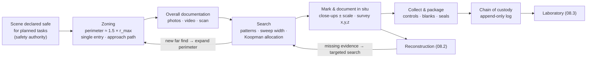

# 08.1 · The post-blast scene

<div class="module-card">

**Prerequisites** [07.2 Incident management](lessons/stage-07/lesson-02.md) (evidence preservation, secondary hazards, ICS) · [05.7 Search theory](lessons/stage-05/lesson-07.md) (sweep width, Koopman allocation) · [04.4 Injury, fragments & secondary hazards](lessons/stage-04/lesson-04.md) · basic statistics and error propagation.

**Estimated time** 6 h (3 h theory · 1 h simulator · 2 h programming) · **Level** Advanced

**Next** [08.2 Reconstruction as an inverse problem](lessons/stage-08/lesson-02.md), then [08.3 Laboratory & digital forensics](lessons/stage-08/lesson-03.md).

<p class="tags"><span>forensic science</span><span>search theory</span><span>metrology</span><span>chain of custody</span><span>Sim E</span></p>
</div>

## Why this matters

After an explosion, the scene is simultaneously a **hazard**, a **rescue site**, and the **only
data set that will ever exist** about what happened. Everything later — reconstruction (08.2),
laboratory identification (08.3), prosecution, lessons learned, design changes to buildings and
procedures — depends on what is found, how precisely it is located, and whether its integrity can
be demonstrated in court years later. The Boston 2013 investigation processed about 12 city
blocks over nine days and logged more than 3,500 evidence items
([research/03](research/03-detection-forensics-sources.md) C2); scale like that is only
manageable if the scene is run like a measurement campaign with a data model.

For an engineer, the post-blast scene is a familiar problem in unfamiliar clothes: **search**
under a detection function, **survey metrology** with error budgets, and an **append-only audit
log** whose integrity must be provable. The NIJ *Guide for Explosion and Bombing Scene
Investigation* (2000) lays out the workflow — initial response, evaluation, documentation,
evidence processing, completion — and this lesson gives each stage its mathematics.

<div class="callout boundary">

**Scope.** This lesson is about forensic *method*: safety management, search, measurement,
documentation and evidence integrity. It contains no information about device construction or
components, and residue chemistry is discussed only as what the laboratory needs from the scene.

</div>

## Learning objectives

1. Explain why scene safety precedes and constrains all forensic work, and list the classes of
   secondary hazard that persist after an explosion.
2. Size a scene perimeter from the evidence distribution and estimate the search effort it
   implies.
3. Compute coverage, probability of detection and time for spiral, strip/grid and zone searches,
   and allocate limited search effort optimally across zones (Koopman).
4. Specify a documentation plan — photography, sketches, measurements, total station and laser
   scanning — and propagate measurement uncertainty to evidence positions.
5. Design evidence collection, packaging and chain-of-custody records that prevent contamination
   and make integrity verifiable, following NIJ and NIST/NIJ guidance.
6. Summarise the TWGFEX guidelines' requirements at the scene–laboratory interface.

## Theory

### 1. Scene safety and secondary hazards

No forensic objective justifies additional casualties. The investigative phase begins only when
the responsible authority has declared the scene safe enough for the tasks planned, and it remains
subordinate to safety throughout (the priority order of 07.2 §8). Hazards that persist after an
explosion:

| Hazard class | Examples | Why it persists |
|---|---|---|
| Additional explosive hazards | further items, unconsumed material | an explosion does not prove the absence of others (07.2 §6) |
| Structural | damaged frames, hanging façade panels, glazing | blast load and fire weaken members; collapse may be delayed (04.3) |
| Fire and utilities | smouldering debris, gas leaks, live electrical conductors | damage to services; re-ignition |
| Chemical / biological | fuels, industrial chemicals, bodily fluids | released contents; biohazards |
| Physical | sharp metal and glass, unstable debris piles | fragmentation (04.4) |

Two consequences shape the method: every entry into the scene is an **exposure** (07.1 §5) — so
entries are minimised, planned and logged — and every entry is also a **contamination and
disturbance event** — so the same minimisation serves evidence integrity. Safety and evidence
align far more often than they conflict.

### 2. Zoning and the scene perimeter

The NIJ guide recommends establishing the scene perimeter at **1.5 times the distance from the
seat of the explosion to the farthest piece of evidence found**, and expanding it if further
evidence is discovered. Because area grows with the square of radius,

$$
A_{\text{scene}} = \pi\,(1.5\,r_{\max})^2 = 2.25\,\pi\, r_{\max}^2 ,
$$

| Symbol | Meaning | Unit |
|---|---|---|
| $r_{\max}$ | distance from seat to farthest evidence found so far | m |
| $A_{\text{scene}}$ | area enclosed by the (circular) perimeter | m² |

**Intuition.** The 1.5 margin is a hedge against an under-sampled tail: the farthest item *found*
is a biased estimate of the farthest item *thrown*. The quadratic growth is the planning lesson —
a 20 % increase in $r_{\max}$ is 44 % more ground to search.

**Numerical example.** Farthest fragment at 60 m → perimeter 90 m → $A = \pi\cdot90^2 =
25\,447$ m² (about 2.5 ha, three and a half football pitches).

Within the perimeter, practice distinguishes an **inner** (evidence) zone with a single
controlled entry/exit point and a common approach path, and an **outer** zone for command,
staging and media control. Buildings, vehicles and streets break the circle; the perimeter
follows physical boundaries that contain the circle, and zones are often divided into sectors
for assignment and record-keeping.

<details class="answer"><summary>Exercise 1 — then reveal</summary>

Assume fragment ranges follow an exponential tail beyond 20 m with mean excess 12 m, and 200
fragments travel beyond 20 m. (a) What is the expected maximum range? (b) What fraction of those
200 lie beyond 1.5× the 95th-percentile range? What does this say about the rule?

*Answer.* (a) The maximum of $n$ exponentials with mean $\mu$ has expectation $\mu H_n \approx
\mu(\ln n + 0.577)$ = $12(5.30+0.58) = 70.5$ m excess, i.e. ≈ 90 m. (b) 95th-percentile excess
$=12\ln 20 = 35.9$ m → range 55.9 m; 1.5× = 83.9 m → excess 63.9 m;
$P = e^{-63.9/12} = 0.0049$ → about 1 item expected outside. The rule is a heuristic: with
heavy-tailed throw, a few items land outside any fixed multiple, which is why the perimeter is
expanded as finds are made.

</details>

### 3. Search patterns and coverage mathematics

Search patterns are *track geometries*; their performance is governed by the same quantities as
in [05.7](lessons/stage-05/lesson-07.md): **sweep width** $W$ (the effective width within which a
searcher detects an item of a given type), **track spacing** $S$, speed $v$ and effort.

The **coverage factor** of a parallel-track search is $C = W/S$. Two limiting detection models
give

$$
\text{POD}_{\text{definite range}} = \min(1, C), \qquad
\text{POD}_{\text{random}} = 1 - e^{-C},
$$

and $k$ independent passes of coverage $C$ each give $1-e^{-kC}$ under the random model.
Real searches lie between the two: good line discipline approaches the first; tired searchers,
clutter and debris approach the second.

| Symbol | Meaning | Unit |
|---|---|---|
| $W$ | sweep width (item-, terrain- and searcher-dependent) | m |
| $S$ | lane / track spacing | m |
| $C=W/S$ | coverage factor | — |
| $v$ | search speed along track | m s⁻¹ |
| $L = A/S$ | track length needed to cover area $A$ | m |

**Patterns.**

| Pattern | Geometry | Strengths | Weaknesses |
|---|---|---|---|
| **Strip / line** | searchers abreast, parallel lanes of spacing $S$ | simple control, uniform coverage, easy to log | edges and obstacles break lanes |
| **Grid** | two strip searches at right angles | two looks from different angles (lighting, shadows): POD $1-e^{-2C}$ | double the effort |
| **Spiral** | Archimedean spiral $r = S\theta/2\pi$, inward or outward from the seat | follows the radial structure of the evidence field; one searcher | hard to hold spacing, hard to split between teams |
| **Zone / sector** | area partitioned into sectors searched separately (by any pattern) | effort allocation, parallel teams, per-zone records | seams between zones need overlap |

**Spiral length.** For $r=a\theta$ with $a=S/2\pi$, the arc length to radius $R$ is
$\int_0^{R/a}\sqrt{a^2\theta^2+a^2}\,d\theta \approx \pi R^2/S$ — exactly $A/S$, as for strips.
Geometry changes *which* ground is covered first, not the total effort.

**Numerical example.** The 25 447 m² scene, $W=S=1.0$ m ($C=1$): random-model POD 0.632 per
pass, 0.865 for a grid. Track length $L=25\,447$ m; with 8 searchers at 0.1 m/s,
$25\,447/(8\cdot0.1) = 31\,809$ s ≈ **8.8 h** per pass. A 30 m spiral at $S=1$ m is 2 828 m long
(numerical integral 2 827.9 m; approximation $\pi R^2/S = 2\,827.4$ m).

**Optimal effort allocation across zones.** Evidence density is not uniform: fragments thrown
from a point fall off roughly as $r^{-2}$ per unit area, so the *probability that a given item
lies in annulus* $[r_1,r_2]$ is $\propto \ln(r_2/r_1)$. If zone $i$ contains the item with
probability $p_i$ and receives effort $e_i$ (searcher-hours) with sweep rate $W v$, its detection
probability is $1-\exp(-k_i e_i)$ with $k_i = Wv/A_i$. Maximising
$\sum_i p_i\big(1-e^{-k_ie_i}\big)$ subject to $\sum_i e_i=E$ (Lagrangian, KKT) gives Koopman's
solution

$$
e_i^{*} = \frac{1}{k_i}\ln\!\frac{p_i k_i}{\lambda}\quad\text{for } p_i k_i > \lambda,\qquad e_i^{*}=0 \text{ otherwise},
$$

with the multiplier $\lambda$ set by the budget — a "water-filling" allocation that equalises the
*marginal* detection rate $p_i k_i e^{-k_i e_i}$ across searched zones.

**Numerical example.** Annuli with edges 2, 5, 10, 20, 40, 60 m; $W=1$ m, $v=0.1$ m/s (sweep rate
360 m² per searcher-hour); budget 40 searcher-hours.

| Annulus [m] | $p_i$ | $A_i$ [m²] | optimal $e_i$ [h] | POD$_i$ | area-proportional $e_i$ [h] |
|---|---|---|---|---|---|
| 2–5 | 0.269 | 66 | 1.10 | 0.997 | 0.23 |
| 5–10 | 0.204 | 236 | 2.90 | 0.988 | 0.83 |
| 10–20 | 0.204 | 942 | 7.97 | 0.952 | 3.34 |
| 20–40 | 0.204 | 3 770 | 17.37 | 0.810 | 13.35 |
| 40–60 | 0.119 | 6 283 | 10.67 | 0.457 | 22.25 |

Overall probability of finding a given item: **0.884** optimal vs **0.720** for spreading effort
uniformly over area — the same 40 hours.

```python
import numpy as np
from scipy.optimize import brentq

edges = np.array([2, 5, 10, 20, 40, 60.0])
p = np.log(edges[1:] / edges[:-1]); p /= p.sum()        # item-location prior for ~1/r^2 areal density
A = np.pi * (edges[1:]**2 - edges[:-1]**2)               # zone areas [m^2]
k = (1.0 * 0.1 * 3600) / A                               # W*v per searcher-hour / area  [1/h]

def koopman(p, k, E):
    alloc = lambda lam: np.where(p * k > lam, np.log(np.maximum(p * k / lam, 1e-300)) / k, 0.0)
    lam = brentq(lambda l: alloc(l).sum() - E, 1e-12, (p * k).max())
    return alloc(lam)

e = koopman(p, k, 40.0)
print(np.round(e, 2), round((p * (1 - np.exp(-k * e))).sum(), 3))    # ... 0.884
e_uniform = 40.0 * A / A.sum()
print(round((p * (1 - np.exp(-k * e_uniform))).sum(), 3))           # 0.72
```

<details class="answer"><summary>Exercise 2 — then reveal</summary>

(a) Derive the Koopman allocation from the Lagrangian. (b) Why does the optimal allocation
still leave the outer annulus with POD below 0.5, and what practical step follows? (c) If a second
pass is made in a zone already searched to POD 0.81 and the item was not found, what is the
posterior probability it is in that zone (prior 0.204, overall prior normalised over zones)?

*Answer.* (a) $\mathcal L = \sum p_i(1-e^{-k_ie_i}) - \lambda(\sum e_i - E)$;
$\partial/\partial e_i$: $p_ik_ie^{-k_ie_i}=\lambda$ ⇒ $e_i=\frac1{k_i}\ln\frac{p_ik_i}{\lambda}$,
clipped at 0 (KKT). (b) Low prior density per unit area: each hour there finds less. Practice:
record the achieved POD per zone, and if the missing item is important (e.g. a component the
reconstruction needs), re-allocate the *next* budget using posteriors. (c) Bayes on a failed
search: $p' = 0.204\cdot0.19/(1 - \sum_i p_i\text{POD}_i) = 0.0388/(1-0.884) = 0.334$. Unsuccessful
search of *other* zones raises the probability of the poorly searched ones — the logic of
search-and-rescue planning.

</details>

### 4. Documentation: photography, sketches and measurements

Documentation turns a transient physical scene into a durable, checkable data set. The NIJ guide
and the general NIJ crime-scene guide ([research/03](research/03-detection-forensics-sources.md)
B1, B2) converge on the same principles:

- **Document before disturbing.** Every item is photographed and located *in situ* before it is
  moved; the scene is photographed before and after each significant intervention (including
  rescue).
- **Photography** proceeds from overall (orientation, whole scene from several viewpoints) to
  mid-range (relationships between items and landmarks) to close-up (the item itself, filling
  the frame, with the camera perpendicular to the surface), with close-ups taken **with and
  without a scale**. A **photo log** records frame number, time, position and direction,
  subject and photographer; images are never deleted (gaps invite challenge), and digital
  originals are preserved unaltered with a cryptographic hash.
- **Sketches** — a rough sketch at the scene, a scaled final sketch later — record orientation
  (north), fixed reference points, zone boundaries and evidence markers with measured positions.
- **Measurement methods**: rectangular coordinates from a baseline; triangulation from two
  fixed points; polar (distance and bearing from a datum); and instrument surveys (total station,
  laser scanning, GNSS outdoors).

**Uncertainty of triangulation (geometric dilution of precision).** Locating a point by
two tape distances $r_1, r_2$ from reference points, each with standard uncertainty $\sigma_r$,
is a small least-squares problem with Jacobian rows equal to the unit vectors $\mathbf u_1,
\mathbf u_2$ toward the reference points. Its covariance is $\sigma_r^2(J^\top J)^{-1}$ and

$$
\sigma_{\text{pos}} = \sqrt{\operatorname{tr}\big[\sigma_r^2(J^\top J)^{-1}\big]} = \frac{\sqrt2\,\sigma_r}{\sin\gamma},
$$

where $\gamma$ is the angle between the two directions at the point.

| Symbol | Meaning | Unit |
|---|---|---|
| $\sigma_r$ | standard uncertainty of each tape distance | m |
| $\gamma$ | intersection angle of the two measurement directions | rad |
| $\sigma_{\text{pos}}$ | RMS 2D position uncertainty | m |

**Intuition.** Two ranges intersecting at a shallow angle define a long thin error ellipse —
the same geometry as poor GNSS satellite geometry. Choose reference points so evidence sees them
at close to 90°.

**Numerical example.** $\sigma_r=10$ mm: $\gamma=90°$ → 14.1 mm; 45° → 20.0 mm; 20° → 41.3 mm.

**Total station (polar survey).** A point at slope-corrected horizontal distance $d$ and bearing
$\theta$ from the instrument: $x = x_0 + d\cos\theta$, $y=y_0+d\sin\theta$. First-order error
propagation with $J=\partial(x,y)/\partial(d,\theta)$ gives a *radial* uncertainty $\sigma_d$ and
a *transverse* uncertainty $d\,\sigma_\theta$. A typical instrument class quotes $\sigma_d = 2$ mm
$+ 2$ ppm and $\sigma_\theta=5''$ ($2.42\times10^{-5}$ rad): at 50 m, $\sigma_d = 2.1$ mm and
$d\sigma_\theta = 1.2$ mm — an order of magnitude better than tape, with every point in one
coordinate frame and a digital record.

```python
def position_cov(J, sigmas):
    """First-order covariance of a position computed from measurements with std devs `sigmas`."""
    S = np.diag(np.asarray(sigmas, float) ** 2)
    return J @ S @ J.T

def triangulation_rms(sigma_r, gamma_deg):
    g = np.radians(gamma_deg)
    J = np.array([[1.0, 0.0], [np.cos(g), np.sin(g)]])      # rows: unit vectors of the two ranges
    return np.sqrt(np.trace(np.linalg.inv(J.T @ J))) * sigma_r

def total_station_cov(d, theta, sd=0.002, ppm=2e-6, s_theta=5 / 206265):
    J = np.array([[np.cos(theta), -d * np.sin(theta)],
                  [np.sin(theta),  d * np.cos(theta)]])
    return position_cov(J, [sd + ppm * d, s_theta])

print([round(triangulation_rms(0.01, g) * 1000, 1) for g in (90, 45, 20)])   # [14.1, 20.0, 41.3] mm
print(np.sqrt(np.linalg.eigvalsh(total_station_cov(50, 0.3))) * 1000)       # ~[1.2, 2.1] mm
```

**Laser scanning (LiDAR) and photogrammetry** capture the whole scene geometry as point clouds or
meshes, preserving relationships nobody thought to measure at the time. They are covered as
3D-reconstruction methods in [08.2](lessons/stage-08/lesson-02.md) (and in the NIJ-funded 2019
Whelan & Weggel study, [research/03](research/03-detection-forensics-sources.md) B8). They
complement, not replace, the evidence-marker survey: a point cloud does not know which point is
evidence item 147.

<details class="answer"><summary>Exercise 3 — then reveal</summary>

A fragment 35 m from the only two convenient reference points is seen at an intersection angle of
12°. Tape uncertainty is 15 mm. (a) Compute $\sigma_{\text{pos}}$. (b) A total station at 35 m
from the fragment: compute radial and transverse uncertainty. (c) What single change to the tape
method would do most good?

*Answer.* (a) $\sqrt2\cdot15/\sin12° = 21.2/0.208 = 102$ mm. (b) $\sigma_d = 2 + 0.07 = 2.07$ mm;
$35\cdot2.42\times10^{-5} = 0.85$ mm. (c) Add or choose a reference point that sees the fragment
near 90° from the first — $\gamma$ dominates; halving $\sigma_r$ helps only 2×.

</details>

### 5. Evidence collection, packaging and chain of custody

Collection follows documentation. The principles in the NIJ bombing guide and TWGFEX guidelines
([research/03](research/03-detection-forensics-sources.md) B1, B6) are driven by what the
laboratory must later be able to say:

- **Contamination control.** Clean tools and fresh gloves for each item; packaging that is new
  and itself tested (packaging and swab **blanks** travel with the samples); personnel who have
  handled energetic materials recently kept away from collection, because trace analysis (08.3)
  is sensitive enough to detect transfer.
- **Control (comparison) samples** from unaffected areas of the same surfaces and materials, so
  the laboratory can distinguish residue of the event from background.
- **Packaging matched to the analyte**: separate containers per item (no cross-transfer);
  airtight containers for items that may carry volatile residues; sturdy containers for sharp
  debris; labelled with item number, location, date/time and collector, and sealed so that any
  opening is evident.
- **Chain of custody**: a continuous, documented record of every person who had custody of an
  item, when, where, why, and the condition of its seal at each transfer. A break in the chain
  does not make an item worthless, but it opens a door for the defence that the prosecution must
  then close with other evidence.

The NIST/NIJ *Biological Evidence Preservation Handbook* (2013, [research/03](research/03-detection-forensics-sources.md)
B3) gives the clearest official *data model* for tracking — and it transfers directly to any
evidence type. In software terms, chain of custody is an **append-only, tamper-evident event
log** keyed by item identifier. The minimal fields:

| Field | Purpose |
|---|---|
| item id (unique, pre-printed) | joins the log, the photo log, the sketch and the lab request |
| event type | collected · sealed · transferred · opened · resealed · sub-sampled · returned · destroyed |
| from / to (person, organisation), location | continuity of possession |
| timestamp (with time source) | ordering; clock provenance matters (08.2) |
| seal id and condition | integrity of the physical container |
| digest of attached files (photos, forms) | integrity of the digital record |
| previous-record hash | tamper evidence for the log itself |

A hash chain makes silent edits detectable: each record contains the hash of its predecessor, so
changing any record changes every subsequent hash.

```python
import hashlib, json

def append(log, event):
    prev = log[-1]["hash"] if log else "0" * 64
    body = json.dumps({**event, "prev": prev}, sort_keys=True).encode()
    log.append({**event, "prev": prev, "hash": hashlib.sha256(body).hexdigest()})

def verify(log):
    prev = "0" * 64
    for rec in log:
        event = {k: v for k, v in rec.items() if k not in ("prev", "hash")}
        body = json.dumps({**event, "prev": prev}, sort_keys=True).encode()
        if rec["prev"] != prev or rec["hash"] != hashlib.sha256(body).hexdigest():
            return False
        prev = rec["hash"]
    return True

log = []
append(log, {"item": "E-0147", "event": "collected", "by": "ERT-3", "t": "2026-05-02T10:14Z", "seal": "S-88121"})
append(log, {"item": "E-0147", "event": "transferred", "by": "ERT-3", "to": "Lab intake", "t": "2026-05-02T16:40Z", "seal": "S-88121 intact"})
print(verify(log))              # True
log[0]["by"] = "ERT-5"          # a silent edit ...
print(verify(log))              # False
```

A hash chain proves *internal consistency*; it does not prove that the first record was true or
that the whole log was not regenerated. Real systems anchor the chain externally (periodic
signed timestamps, write-once storage, independent copies) and — most importantly — rely on
people and procedures: seals, signatures, witnessed transfers.

<details class="answer"><summary>Exercise 4 — then reveal</summary>

An adversary with write access regenerates the entire log with one record altered, recomputing
all hashes. (a) Does `verify` detect it? (b) Propose two measures that would.

*Answer.* (a) No — the chain is internally consistent. (b) Publish or countersign the head hash
periodically to an independent party (e.g. the laboratory's intake system records the head hash
on receipt; an RFC 3161-style timestamp authority), and keep write-once replicas; any later
regeneration then disagrees with an externally held hash.

</details>

### 6. TWGFEX at the scene–laboratory interface

The Technical Working Group for Fire and Explosions (TWGFEX) *Recommended Guidelines for Forensic
Identification of Post-Blast Explosive Residues* (hosted by NIST; now succeeded in part by OSAC
Registry standards, 08.3) group laboratory techniques by how much identifying information each
provides and require **independent (orthogonal) methods** before an identification is reported.
Scene consequences, at a high level:

- samples must be large enough, and preserved suitably, for **more than one** analytical method;
- **blanks and controls** must accompany samples so that a positive can be distinguished from
  contamination or background;
- the scene record must let the laboratory relate each sample to its location and context, since
  the interpretation (08.2) depends on *where* residue was and was not found.

## Visual explanation



The two back-edges are the point: the perimeter and the search plan are *updated* by what is
found, and reconstruction feeds requests back to the scene while it is still held.

## Worked example — a fictional car-park incident

A fictional explosion in an open-air car park. The scene is declared safe for search at T+6 h.

1. **Perimeter.** Initial walk-through finds debris out to 48 m; a later find at 60 m expands
   the perimeter from 72 m to 90 m radius: 16 286 m² → 25 447 m² (+56 %).
2. **Effort plan.** 8 searchers, 0.1 m/s, $W = S = 1$ m: 8.8 h per full pass. The team has
   40 searcher-hours on day 1: Koopman allocation (Section 3) gives expected POD 0.88 for any
   given item vs 0.72 for uniform coverage; the outer annulus is scheduled for a second day.
3. **Documentation.** Overall photographs from the four corners and from an elevated position;
   a terrestrial laser scan of the whole car park (08.2); a total-station datum network of three
   control points on permanent features; each evidence marker surveyed ($\sigma \approx 2$ mm
   at 50 m).
4. **Collection.** Swab blanks and packaging blanks opened at the scene; control swabs from an
   unaffected wall of the same material; volatile-residue candidates in airtight containers; each
   item sealed and entered in the custody log with photo-file hashes.
5. **Hand-off.** The log's head hash is countersigned by laboratory intake on receipt of the
   first batch; reconstruction (08.2) requests a targeted re-search of the 20–40 m annulus in the
   north-east sector where its seat estimate predicts a missing fragment class.

## Simulation work

<div class="callout sim">

**Sim E — Post-Blast Investigation** ([open full-screen](sims/post-blast/index.html)). In this
lesson use its scene-safety, search and evidence-log tools: (1) press *scene-safety assessment*
before you enter, then, from the damage visible in your first few searched cells, decide a scene
perimeter on paper; after searching, count the fragments you found outside it. (2) Searching
costs 1 minute per cell against the time budget: plan on paper an inner and an outer zone, a
pattern (strips or spiral) and the fraction of cells to search in each, and predict with Koopman
the fraction of fragments you will miss per zone. Drag-search accordingly, then compare the
fragments you found per zone with your prediction. (3) Photograph, mark and then collect (with a
description) at least five items, and check in the debrief that every item has an unbroken
custody record. The seat and yield panel is used in 08.2.

</div>

## Practical exercises

<details class="answer"><summary>Practical 1 — Search plan under a deadline (design) — then reveal</summary>

Weather will degrade small-fragment detectability ($W$ halves) after 6 h. You have 10 searchers.
For the 25 447 m² scene, which zones do you search first, and at what spacing?

*Answer.* The inner annuli have the highest $p_ik_i$ and suffer most from reduced $W$ in absolute
POD terms only if under-searched; Koopman with the *time-varying* sweep rate says: allocate the
first 60 searcher-hours by the water-filling rule using $W=1$ (inner zones to near-saturation,
then 10–40 m), and plan the outer zone for the degraded period with tighter spacing or a grid
(two looks). Record achieved coverage per zone so the posterior (Exercise 2c) is honest.

</details>

<details class="answer"><summary>Practical 2 — Error budget (calculation) — then reveal</summary>

The reconstruction needs fragment positions to ±5 cm (1σ) at up to 60 m. Can tape triangulation
with $\sigma_r=10$ mm achieve it? What about a total station? What else enters the budget?

*Answer.* Tape: $\sqrt2\cdot10/\sin\gamma \le 50$ mm needs $\sin\gamma\ge0.283$, $\gamma\ge16.4°$
— achievable with well-placed references, but 60 m tapes sag and wander, so real $\sigma_r$ is
larger. Total station: ≈ 2 mm radial, 1.5 mm transverse — easily. Other terms: the marker is not
at the item's centroid, items moved by rescue before documentation, and the datum's own
uncertainty. The instrument is rarely the dominant error.

</details>

<details class="answer"><summary>Practical 3 — Custody data model (design) — then reveal</summary>

Design a relational schema (tables and keys) for items, sub-samples, containers, custody events
and digital files, supporting "item E-0147 was split into three sub-samples at the lab".

*Answer.* `item(id PK, parent_id FK→item NULL, description, location_xyz, collected_at)`;
`container(id PK, item_id FK, seal_id)`; `custody_event(id PK, item_id FK, type, from_party,
to_party, t, t_source, seal_state, prev_hash, hash)`; `file(id PK, item_id FK, sha256, kind)`.
Sub-sampling is a `custody_event(type='subsampled')` on the parent plus new `item` rows with
`parent_id` — lineage as a tree, custody as an append-only log.

</details>

## Programming exercise — a search-effort planner with Bayesian updating

**Goal.** Plan and update a post-blast search over zones using Koopman allocation and the
posterior after unsuccessful search.

- **Input:** zone geometry (annuli or polygons), a prior density for item locations (e.g.
  $\propto r^{-2}$ areal density with a directional bias), sweep width per zone, speed, team size
  and budget per shift.
- **Output:** per-shift effort allocation, predicted POD per zone and overall, and updated zone
  probabilities after each shift given which items were found.
- **Constraints:** NumPy/SciPy only; allocation solved to < 0.01 searcher-hour; runs in < 1 s.
- **Expected behaviour:** reproduces the table in Section 3; the total expected POD is monotone
  in budget; zones never receive negative effort.
- **Test cases:** (i) equal $p_ik_i$ in all zones gives effort ∝ $1/k_i$ (∝ area);
  (ii) after a shift with no find, the posterior for searched zones falls and for unsearched
  zones rises, summing to 1; (iii) a zone with $p_i=0$ receives no effort.
- **Extensions:** multiple item classes with different sweep widths (small fragments vs large
  debris); directional throw (a wall shadowing one sector); scheduling searchers under the
  time-varying sweep width of Practical 1.

This feeds the search planning you do in [Sim E](sims/post-blast/index.html) and Capstone C3.

## Reading

- NIJ Technical Working Group for Bombing Scene Investigation, *A Guide for Explosion and Bombing
  Scene Investigation* (NCJ 181869, 2000), https://www.ojp.gov/pdffiles1/nij/181869.pdf — read the
  whole workflow once; focus on scene evaluation, documentation and evidence processing.
  ([research/03](research/03-detection-forensics-sources.md) B1)
- NIJ/BJA/NFSTC, *Crime Scene Investigation: A Guide for Law Enforcement* (2013),
  https://www.ojp.gov/pdffiles1/ncjrs/243598.pdf — the general principles of scene integrity,
  photography and custody that the bombing guide builds on. (B2)
- NIST/NIJ Technical Working Group, *Biological Evidence Preservation Handbook* (NISTIR 7928,
  2013), https://nij.ojp.gov/library/publications/biological-evidence-preservation-handbook-best-practices-evidence-handlers
  — the chain-of-custody tracking chapter as a data model. (B3)
- TWGFEX, *Recommended Guidelines for Forensic Identification of Post-Blast Explosive Residues*,
  https://www.nist.gov/document/twgfexrecommendedguidelinesfortheforensicidentificationofpost-blastexplosiveresiduespdf
  — the sections on sampling, controls and orthogonal methods. (B6)
- FBI, *Boston Marathon Bombing* (case history),
  https://www.fbi.gov/history/cases-and-criminals/boston-marathon-bombing — scale of scene
  processing and evidence handling. (C2; see [case study CS07](case-studies/cs07-boston-2013.md))
- IABTI, *CIPBI certification*, https://www.iabti.org/cipbi/ — the competency domains of a
  post-blast investigator. ([research/01](research/01-training-pathways.md) S31)

## Assessment

1. *(Conceptual)* Explain why minimising scene entries serves both safety and evidence integrity,
   and describe one situation where the two genuinely conflict and how priority resolves it.
2. *(Mathematical)* Show that the Archimedean spiral of spacing $S$ covering radius $R$ has
   length ≈ $\pi R^2/S$ and explain why this is unsurprising.
3. *(Mathematical)* For two zones with $p=(0.7, 0.3)$, $k=(0.5, 0.05)$ h⁻¹ and $E=10$ h, compute
   the Koopman allocation.
4. *(Interpretation)* A defence expert notes that 14 photographs are missing from a sequence of
   400. What is the likely consequence, and which practice would have prevented the argument?
5. *(Design)* Specify the blanks and controls you would require for residue sampling on a
   concrete wall and on a vehicle panel, and justify each.

<details class="answer"><summary>Answers to 2 and 3</summary>

2. $L=\int_0^{\Theta} a\sqrt{1+\theta^2}\,d\theta \approx a\Theta^2/2$ for large $\Theta = R/a$,
   so $L\approx R^2/(2a) = \pi R^2/S$. Any pattern with spacing $S$ must sweep area $A$ with a
   track of length $A/S$.
3. Both searched if $\lambda < 0.015$: $e_1 = 2\ln(0.35/\lambda)$, $e_2=20\ln(0.015/\lambda)$;
   $e_1+e_2=10$ ⇒ $22\ln(1/\lambda) + 2\ln0.35 + 20\ln0.015 = 10$ ⇒ $\ln(1/\lambda) = (10 + 2.100
   + 83.998)/22 = 4.368$, $\lambda=0.01267$. $e_1 = 2\ln(27.62) = 6.64$ h, $e_2 = 20\ln(1.184) =
   3.37$ h (sum 10.0). POD: $0.7(1-e^{-3.32}) + 0.3(1-e^{-0.168}) = 0.675 + 0.046 = 0.721$.

</details>

## Expert extension

- **Detection functions from data.** Estimate sweep width from seeded trials (known items placed
  in a representative area) — the method of CWA 14747 blind trials in 05.1 transfers directly.
- **Scene as a spatial point process.** Model fragment locations as an inhomogeneous Poisson
  process; fit its intensity from finds with a detection-thinned likelihood, and use it to
  predict unfound items and their locations.
- **Digital evidence management systems.** Survey how forensic laboratories implement custody
  (LIMS), and design a verification protocol (external anchoring, audits) for one.

## What comes next

With the scene documented and evidence in custody, [08.2](lessons/stage-08/lesson-02.md) inverts
the data: where was the seat, how large was the event (in abstract units, with honest
uncertainty), and in what order did things happen?
