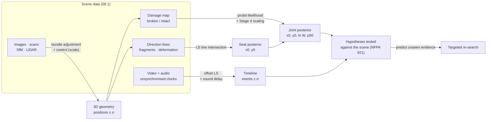

# 08.2 · Reconstruction as an inverse problem

<div class="module-card">

**Prerequisites** [08.1 The post-blast scene](lessons/stage-08/lesson-01.md) (survey data, uncertainty) · [04.2 Distance, reflection, confinement](lessons/stage-04/lesson-02.md) (scaled distance, Kinney–Graham fit) · [04.3 Structural effects](lessons/stage-04/lesson-03.md) (glazing, fragility) · [06.2 Spatial mathematics](lessons/stage-06/lesson-02.md) (camera frames) · [06.7 Mapping & SLAM](lessons/stage-06/lesson-07.md) (nonlinear least squares) · Bayesian statistics.

**Estimated time** 7 h (3 h theory · 1.5 h simulator · 2.5 h programming) · **Level** Advanced

**Next** [08.3 Laboratory & digital forensics](lessons/stage-08/lesson-03.md); Capstone C3 (post-blast digital reconstruction lab).

<p class="tags"><span>inverse problems</span><span>least squares</span><span>MCMC</span><span>photogrammetry</span><span>LiDAR</span><span>video forensics</span><span>Sim E</span><span>P10</span></p>
</div>

## Why this matters

The event itself was never observed by an instrument designed to measure it. What remains are its
*effects*: broken glazing out to some distance, fragments embedded in surfaces, objects thrown,
a damaged surface near the seat, and — increasingly — hundreds of phone videos with unsynchronised
clocks. Reconstruction asks the inverse questions: **where** was the seat, **how large** was the
event (in this course, only ever in abstract yield units, and only with honest uncertainty),
and **in what order** did things happen? These are textbook inverse problems — ill-posed, noisy,
with nuisance parameters — and the tools are ones an engineer already knows from SLAM and
computer vision: least squares, Bayesian inference, MCMC, bundle adjustment. The discipline
the forensic setting adds is that every conclusion must carry its uncertainty into a courtroom
(08.3).

<div class="callout boundary">

**Scope.** All reconstructions here use synthetic scenes and abstract yields (YU). Yield
estimation is presented to show *how uncertain* it is, never as a way to size anything.
Crater and damage patterns are interpreted conceptually; no relation between charge and crater
or damage is given for use. No device construction details appear.

</div>

## Learning objectives

1. Formulate seat location and yield estimation as inverse problems, and diagnose their
   ill-posedness (non-uniqueness, instability, nuisance parameters).
2. Derive and apply the closed-form least-squares intersection of direction lines, with its
   covariance.
3. Propagate threshold and measurement uncertainty through Stage 4 scaling to a yield estimate,
   and explain why damage-based yield estimates are uncertain by factors, not percent.
4. Build a Bayesian inversion of a binary damage map, sample it with Metropolis MCMC, fuse
   independent evidence, and identify degeneracies from the posterior.
5. Explain structure-from-motion and bundle adjustment (objective, sparsity, gauge freedom and
   scale) and quantify stereo triangulation error; describe LiDAR capture and registration.
6. Reconstruct a multi-camera timeline by estimating clock offsets with least squares, including
   sound-propagation delays.

## Theory

### 1. The inverse-problem view

A **forward model** $G$ maps unknown parameters $\mathbf m$ (seat position, yield, material
properties) to predicted observations; data are $\mathbf d = G(\mathbf m) + \boldsymbol\varepsilon$.
Hadamard called a problem *well-posed* if a solution exists, is unique and depends continuously
on the data. Post-blast reconstruction usually fails the last two:

- **Non-uniqueness / degeneracy:** a larger event further away and a smaller event nearer can
  produce similar damage at a given window; a weaker glazing stock mimics a larger yield.
- **Instability:** small errors in threshold or position data map to large changes in yield
  (Section 3).

The Bayesian answer is to report the **posterior** $p(\mathbf m\mid\mathbf d)\propto
p(\mathbf d\mid\mathbf m)\,p(\mathbf m)$, not a point. Priors encode physical constraints (the seat
is inside the scene; yields are positive); the likelihood encodes the measurement and model
errors. Least squares is the special case of Gaussian errors and flat priors.

### 2. Seat from direction evidence: least-squares line intersection

Many observations define a **direction** back toward the seat: fragment strike trajectories
(impact angle and a paired entry/exit), displacement of objects, the orientation of bent
members, the directional side of damage. Each gives a line $\mathbf x = \mathbf a_i + t\,\mathbf
d_i$ with unit direction $\mathbf d_i$ through the point $\mathbf a_i$ where it was measured. With
$P_i = I - \mathbf d_i\mathbf d_i^\top$ (projector onto the line's normal), the squared
perpendicular distance from a candidate seat $\mathbf x$ to line $i$ is $\|P_i(\mathbf x -
\mathbf a_i)\|^2$. Minimising the sum,

$$
\frac{\partial}{\partial\mathbf x}\sum_i \|P_i(\mathbf x-\mathbf a_i)\|^2 = 2\sum_i P_i(\mathbf x - \mathbf a_i) = 0
\;\Longrightarrow\;
\boxed{\hat{\mathbf x} = \Big(\sum_i P_i\Big)^{-1}\sum_i P_i\,\mathbf a_i}
$$

(using $P_i^\top P_i = P_i$). Its covariance is $\hat\sigma^2(\sum_i P_i)^{-1}$ with
$\hat\sigma^2$ = residual sum of squares / $(n-2)$ in 2D.

| Symbol | Meaning | Unit |
|---|---|---|
| $\mathbf a_i$ | surveyed point on direction line $i$ | m |
| $\mathbf d_i$ | unit direction toward the seat | — |
| $P_i$ | normal-space projector of line $i$ | — |
| $\hat{\mathbf x}$ | least-squares seat estimate | m |

**Intuition.** Each line constrains only the direction *across* it. $\sum P_i$ is an
"information matrix": if all lines are nearly parallel it is nearly singular and the seat is
unconstrained along them — the same geometry as the triangulation DOP of 08.1. Lines from all
around the seat give a well-conditioned estimate. A refinement: angular error $\sigma_\theta$
produces lateral error $\approx r_i\sigma_\theta$, so far lines should be *down-weighted*
(weights $1/(r_i\sigma_\theta)^2$) — which the Bayesian version in Section 4 does automatically.

**Numerical example (synthetic).** True seat (3.0, −2.0) m; 12 traces at 8–40 m, each direction
measured with 4° (1σ) error. The estimate is (3.66, −1.33) m with standard errors (0.64, 0.89) m;
actual error 0.94 m — consistent with the reported uncertainty.

```python
import numpy as np
rng = np.random.default_rng(7)

x_true = np.array([3.0, -2.0])
n = 12
ang = rng.uniform(0, 2 * np.pi, n); dist = rng.uniform(8, 40, n)
anchors = x_true + np.c_[np.cos(ang), np.sin(ang)] * dist[:, None]    # where each trace was found
dirs = anchors - x_true; dirs /= np.linalg.norm(dirs, axis=1)[:, None]
err = np.radians(rng.normal(0, 4.0, n))                               # direction measurement error
c, s = np.cos(err), np.sin(err)
dirs = np.c_[c * dirs[:, 0] - s * dirs[:, 1], s * dirs[:, 0] + c * dirs[:, 1]]

def intersect_lines(a, d):
    """Least-squares point closest to lines x = a_i + t d_i (unit d_i); returns estimate, covariance."""
    P = np.eye(2)[None] - d[:, :, None] * d[:, None, :]
    A = P.sum(0); b = (P @ a[:, :, None]).sum(0)[:, 0]
    x = np.linalg.solve(A, b)
    r = np.array([Pi @ (x - ai) for Pi, ai in zip(P, a)])
    s2 = (r ** 2).sum() / (len(a) - 2)
    return x, np.linalg.inv(A) * s2

x_hat, cov = intersect_lines(anchors, dirs)
print(x_hat.round(2), np.sqrt(np.diag(cov)).round(2), round(np.linalg.norm(x_hat - x_true), 2))
# [ 3.66 -1.33] [0.64 0.89] 0.94
```

<details class="answer"><summary>Exercise 1 — then reveal</summary>

(a) Show that if all $\mathbf d_i$ are identical, $\sum P_i$ is singular, and interpret. (b) All
12 traces come from one side (angles within ±30° of east). Predict how the error ellipse changes.
(c) Implement the weighted version and explain when it matters.

*Answer.* (a) $\sum P_i = n(I - \mathbf d\mathbf d^\top)$ has $\mathbf d$ in its null space: the
seat can slide along the common direction. (b) The ellipse becomes elongated east–west (along
the lines), with the minor axis north–south; the east–west standard error may grow several-fold.
(c) Weights $w_i = 1/r_i^2$ (up to a constant): $\hat{\mathbf x} = (\sum w_iP_i)^{-1}\sum
w_iP_i\mathbf a_i$. It matters when ranges differ a lot — a 40 m trace with 4° error has 2.8 m
lateral error, a 5 m trace only 0.35 m.

</details>

### 3. How big? Yield from a damage radius — and why it is so uncertain

Suppose glazing of a known type failed out to radius $R_b$ and the failure threshold is
$p_{\text{th}}$. Stage 4 scaling gives $Z_{\text{th}} = f^{-1}(p_{\text{th}}/p_0)$ and the point
estimate

$$ \hat W = \left(\frac{R_b}{Z_{\text{th}}}\right)^3 . $$

Propagate uncertainty in logs. Let $n = d\ln\Delta p/d\ln Z$ be the local log-slope of the
overpressure curve at $Z_{\text{th}}$. Then $\sigma_{\ln Z} = \sigma_{\ln p}/|n|$ and, with
independent radius error,

$$
\sigma_{\ln W} = 3\sqrt{\sigma_{\ln Z}^2 + \sigma_{\ln R}^2} = 3\sqrt{\Big(\frac{\sigma_{\ln p}}{|n|}\Big)^2 + \sigma_{\ln R}^2}.
$$

| Symbol | Meaning | Unit |
|---|---|---|
| $R_b$ | observed damage radius | m |
| $p_{\text{th}}$, $\sigma_{\ln p}$ | failure threshold and its log-uncertainty (fragility spread, orientation, size, pre-existing flaws) | kPa, — |
| $n$ | local log-slope of $\Delta p(Z)$ | — |
| $\sigma_{\ln W}$ | log-uncertainty of the yield estimate | — |

**Intuition.** Two amplifiers compound: the cube (from $W\propto R^3$) and the shallow far-field
slope ($|n|\approx1.1$ near 5 kPa, so a factor-of-$e^{0.5}$ uncertainty in threshold is nearly a
factor $e^{0.45}$ in $Z$). Damage thresholds of real building components vary by factors of two
or more; the result is that **a damage-map yield is uncertain by a multiplicative factor, often
several-fold**. This is the key humility lesson of forensic blast analysis.

**Numerical example.** $p_{\text{th}}=5$ kPa → $Z_{\text{th}}=17.79$ m YU⁻¹ᐟ³, $n=-1.114$;
$R_b = 40$ m → $\hat W = (40/17.79)^3 = 11.4$ YU. With $\sigma_{\ln p}=0.5$, $\sigma_{\ln R}=0.1$:
$\sigma_{\ln Z} = 0.449$, $\sigma_{\ln W} = 3\sqrt{0.449^2+0.1^2} = 1.38$ — a 1σ factor of
$e^{1.38}=4.0$ and a 90 % interval factor of $e^{1.645\cdot1.38}=9.7$: roughly 1.2 to 110 YU.

```python
from scipy.optimize import brentq
P0 = 101.325
def kg_ratio(Z):
    return 808 * (1 + (Z / 4.5)**2) / (np.sqrt(1 + (Z / 0.048)**2) *
                                       np.sqrt(1 + (Z / 0.32)**2) * np.sqrt(1 + (Z / 1.35)**2))
def z_threshold(p_kpa): return brentq(lambda Z: kg_ratio(Z) * P0 - p_kpa, 0.05, 500)

Zth = z_threshold(5.0); h = 1e-4
n_slope = (np.log(kg_ratio(Zth * (1 + h))) - np.log(kg_ratio(Zth * (1 - h)))) / (2 * h)
s_lnW = 3 * np.hypot(0.5 / abs(n_slope), 0.1)
print(round(Zth, 2), round(n_slope, 3), round((40 / Zth)**3, 1), round(s_lnW, 2), round(np.exp(1.645 * s_lnW), 1))
# 17.79 -1.114 11.4 1.38 9.7
```

<details class="answer"><summary>Exercise 2 — then reveal</summary>

Near the seat (say $Z\approx2$), $|n|$ is about 2.3 rather than 1.1. If you could use a damage
indicator with a threshold in that regime, with the same $\sigma_{\ln p}=0.5$ and
$\sigma_{\ln R}=0.1$, what would $\sigma_{\ln W}$ be? What practical difficulty offsets the gain?

*Answer.* $\sigma_{\ln Z}=0.5/2.33=0.215$; $\sigma_{\ln W} = 3\sqrt{0.046+0.01} = 0.71$ (factor 2.0 at 1σ) —
much better. But near-field indicators are few, strongly affected by reflection, confinement and
fireball effects (04.2), and their thresholds are themselves poorly characterised; and the seat
position error enters $R$ more strongly at short range. There is no free lunch.

</details>

### 4. Bayesian inversion of a damage map with MCMC

A damage survey gives, for each of $m$ surveyed windows at positions $\mathbf p_j$, a binary
outcome $y_j\in\{\text{broken},\text{intact}\}$. A **fragility curve** (04.3) models failure
probability as a function of peak overpressure:

$$
P(y_j = 1\mid \mathbf m) = \Phi\!\left(\frac{\ln\Delta p_j(\mathbf m) - \ln p_{50}}{\beta}\right),\qquad
\Delta p_j = p_0\,f\!\left(\frac{\|\mathbf p_j - \mathbf x_0\|}{W^{1/3}}\right),
$$

with unknowns $\mathbf m = (x_0, y_0, \ln W)$. The log-posterior is

$$
\ln p(\mathbf m\mid\mathbf y) = \sum_j \Big[y_j\ln\pi_j + (1-y_j)\ln(1-\pi_j)\Big] + \ln p(\mathbf m) + \text{const}, \qquad \pi_j = P(y_j=1\mid\mathbf m).
$$

| Symbol | Meaning | Unit |
|---|---|---|
| $\mathbf x_0$ | seat position | m |
| $W$ | abstract yield | YU |
| $p_{50}$, $\beta$ | fragility median and log-dispersion of the glazing stock | kPa, — |
| $\Phi$ | standard normal CDF (probit link) | — |

**Metropolis sampling.** Propose $\mathbf m' = \mathbf m + \boldsymbol\epsilon$,
$\boldsymbol\epsilon\sim\mathcal N(0,\Sigma)$, accept with probability
$\min\{1, p(\mathbf m'\mid\mathbf y)/p(\mathbf m\mid\mathbf y)\}$. Because the proposal is
symmetric, the chain satisfies **detailed balance** $p(\mathbf m)q(\mathbf m'\mid\mathbf m)\,
\alpha(\mathbf m\to\mathbf m') = p(\mathbf m')q(\mathbf m\mid\mathbf m')\,\alpha(\mathbf m'\to
\mathbf m)$, so the posterior is its stationary distribution; only *ratios* of the posterior are
needed, so the normalising constant never appears. Practical diagnostics: discard burn-in, aim
for acceptance ≈ 0.2–0.5 in low dimensions, run several chains from dispersed starts and compare
them (Gelman–Rubin $\hat R\approx1$), and inspect trace plots.

```python
from scipy.stats import norm

P50, BETA = 4.0, 0.3        # fictional glazing fragility: median [kPa], log-std
W_TRUE = 8.0                # YU -- hidden from the inversion
m = 80
r = rng.uniform(15, 110, m); t = rng.uniform(0, 2 * np.pi, m)
pts = x_true + np.c_[r * np.cos(t), r * np.sin(t)]                 # surveyed window positions

def p_fail(theta, pts, lnp50=np.log(P50)):
    x, y, lnW = theta
    R = np.hypot(pts[:, 0] - x, pts[:, 1] - y)
    dp = kg_ratio(R / np.exp(lnW / 3)) * P0
    return norm.cdf((np.log(dp) - lnp50) / BETA)

broken = rng.random(m) < p_fail((*x_true, np.log(W_TRUE)), pts)   # the observed damage map

def log_post_damage(theta):
    x, y, lnW = theta
    if abs(x) > 60 or abs(y) > 60:
        return -np.inf                                            # uniform prior on a 120 m box
    pf = np.clip(p_fail(theta, pts), 1e-12, 1 - 1e-12)
    return (np.where(broken, np.log(pf), np.log1p(-pf)).sum()
            + norm.logpdf(lnW, np.log(10), 1.5))                  # weak prior on log-yield

def metropolis(log_p, theta0, step, n_iter=40_000, seed=0):
    g = np.random.default_rng(seed)
    th = np.array(theta0, float); cur = log_p(th)
    chain = np.empty((n_iter, th.size)); acc = 0
    for i in range(n_iter):
        prop = th + step * g.normal(size=th.size)
        new = log_p(prop)
        if np.log(g.random()) < new - cur:
            th, cur, acc = prop, new, acc + 1
        chain[i] = th
    return chain, acc / n_iter

def summarise(name, chain, burn=10_000):
    post = chain[burn:]; W = np.exp(post[:, 2])
    q = lambda v: np.percentile(v, [5, 95]).round(2)
    print(f"{name}: x {post[:,0].mean():.2f} {q(post[:,0])}  y {post[:,1].mean():.2f} {q(post[:,1])}"
          f"  W median {np.median(W):.2f} {q(W)}")

chain, acc = metropolis(log_post_damage, [0, 0, np.log(10)], np.array([3, 3, 0.3]))
summarise("damage only", chain)
```

**Fusion with direction evidence.** The direction lines of Section 2 are independent evidence.
With angular error $\sigma_\theta$, the perpendicular miss of line $i$ is Gaussian with standard
deviation $r_i\sigma_\theta$; adding that log-likelihood fuses the two data sets (the sensor-fusion
logic of 05.6).

```python
SIG_DIR = np.radians(4.0)
def log_lik_lines(xy):
    d = anchors - np.asarray(xy)
    perp = d[:, 0] * dirs[:, 1] - d[:, 1] * dirs[:, 0]     # perpendicular miss distance of each line
    sd = np.linalg.norm(d, axis=1) * SIG_DIR               # angular error -> lateral error at range
    return -0.5 * np.sum((perp / sd) ** 2) - np.sum(np.log(sd))

def log_post_joint(theta):
    lp = log_post_damage(theta)
    return lp + log_lik_lines(theta[:2]) if np.isfinite(lp) else lp

chain, acc = metropolis(log_post_joint, [0, 0, np.log(10)], np.array([0.6, 0.6, 0.2]))
summarise("damage + directions", chain)
```

**Results** (synthetic truth: seat (3.0, −2.0) m, $W=8$ YU; 80 windows, 22 broken; 90 % credible
intervals):

| Evidence | $x_0$ [m] | $y_0$ [m] | $W$ [YU] |
|---|---|---|---|
| damage map only | 2.47 [−3.85, 8.33] | 0.65 [−7.26, 9.01] | 6.45 [4.41, 9.26] |
| damage + 12 direction lines | 3.23 [2.43, 4.04] | −1.80 [−2.89, −0.68] | 6.24 [4.41, 8.60] |
| + fragility median uncertain ($\sigma_{\ln p_{50}}=0.4$) | — | — | **7.66 [1.74, 30.1]** |

Three lessons, all general:

1. **Binary damage localises poorly** (±6 m) but constrains yield *given the fragility*;
   direction evidence localises well (±0.8 m) but says nothing about yield. Fused, each fixes the
   other's weakness.
2. **Fragility is a nuisance parameter that dominates.** Letting the glazing median be uncertain
   by a factor $e^{0.4}\approx1.5$ widens the 90 % yield interval from a factor of 2 to a factor
   of 17, and the posterior correlation between $\ln W$ and $\ln p_{50}$ is **0.97**: the data
   determine only the combination "yield relative to glazing strength". Any report that quotes a
   yield without the fragility assumption behind it is overstating what the damage shows.
3. **The truth lies inside the intervals, not at the point estimates** — which is what
   calibrated uncertainty means, and what a court (08.3) needs.

<details class="answer"><summary>Exercise 3 — then reveal</summary>

(a) Why does the damage-only posterior of $x_0$ have a larger spread than of $W$ in *relative*
terms? (b) Add fragility-median uncertainty to the model (a fourth parameter with prior
$\mathcal N(\ln4, 0.4^2)$) and reproduce the last row. (c) Suggest one additional data type that
would break the yield–fragility degeneracy.

*Answer.* (a) Binary outcomes near the break radius constrain $R/W^{1/3}$ along *every* bearing,
and the radius of the broken/intact boundary is determined fairly well (hence $W$ given $p_{50}$),
but shifting the centre by a few metres changes few outcomes because the boundary is at 30–50 m
and windows are sparse. (b) Extend `p_fail` with `lnp50` and the prior; a 60 000-step chain with
steps (0.6, 0.6, 0.25, 0.1) gives $W$ median ≈ 7.7, 90 % [1.7, 30]. (c) Any indicator with an
*independently known* threshold and a *different* scaling: e.g. calibrated pressure-sensitive
objects, a second glazing type with a separately characterised fragility, or arrival-time data
from audio (which constrains position and, weakly, strength via shock speed — 01.3's worked
example).

</details>

### 5. Crater and damage-pattern interpretation (conceptual)

Investigators read damage as a field of indicators, following the scientific method of NFPA 921
([research/03](research/03-detection-forensics-sources.md) B4): hypothesise a seat and sequence,
predict what else should be observed, test against the scene.

| Indicator (conceptual) | What it suggests | Main confounders |
|---|---|---|
| Crater or heavily damaged surface area | proximity of the seat to that surface | surface material and substrate, subsequent fire, rescue disturbance |
| Directional deformation (bent members, pushed-in panels) | direction of load → a line toward the seat | reflection, channelling (04.2), negative-phase "pull" failures that point the other way |
| Fragment strikes and embedded fragments | trajectories → lines (Section 2) | ricochet, secondary fragments from the environment |
| Glazing breakage extent | a *combination* of distance, yield and glazing strength (Section 4) | orientation, size, shielding, pre-existing damage |
| Thrown objects | directions (and, weakly, launch speeds) | drag, tumbling, obstacles, rescue movement |
| Soot, heat and residue distribution | proximity and orientation relative to the fireball | fire after the event, weather, contamination |

The course deliberately gives **no quantitative relation between crater or damage size and
charge size**: such relations are highly condition-dependent, and in this course yield is only
ever discussed as an abstract, uncertain inference (Sections 3–4).

### 6. 3D scene capture: photogrammetry and structure from motion

A pinhole camera maps a world point $\mathbf X$ to pixel $\mathbf x$ by

$$ \lambda\,\tilde{\mathbf x} = K\,[R\mid\mathbf t]\,\tilde{\mathbf X},\qquad K = \begin{bmatrix} f & 0 & c_x\\ 0 & f & c_y\\ 0&0&1\end{bmatrix} $$

(06.2). **Structure from motion (SfM)** recovers both cameras and points from many overlapping
photographs: detect and match features, estimate relative poses robustly (essential matrix with
RANSAC), triangulate, register new images incrementally, and finally refine everything by
**bundle adjustment**:

$$
\min_{\{R_j,\mathbf t_j,K_j\},\{\mathbf X_i\}} \sum_{(i,j)\in\mathcal V} \rho\Big(\big\|\mathbf x_{ij} - \pi(K_j,R_j,\mathbf t_j,\mathbf X_i)\big\|^2\Big),
$$

a nonlinear least-squares problem over reprojection errors ($\rho$ a robust loss, $\mathcal V$
the visibility set), solved by Levenberg–Marquardt. Its normal equations have a block
**arrowhead** sparsity: points couple only to the cameras that see them, so the Schur complement
eliminates the (many) points and leaves a small reduced camera system — the same trick as in
graph SLAM (06.7).

**Gauge freedom and scale.** Reprojection errors are unchanged by any similarity transform of the
whole reconstruction (3 rotation + 3 translation + 1 scale = 7 DoF). Photographs alone cannot
fix absolute size: **a scale bar or surveyed control points (from the 08.1 total-station
network) are mandatory** for forensic measurement, and they also let you quantify residual error
at independent check points.

**Triangulation uncertainty (rectified stereo).** Depth from disparity $\delta$ is $Z=fB/\delta$,
so with independent pixel noise $\sigma_x$ in each image ($\sigma_\delta=\sqrt2\,\sigma_x$),

$$ \sigma_Z \approx \frac{Z^2}{fB}\,\sqrt2\,\sigma_x . $$

| Symbol | Meaning | Unit |
|---|---|---|
| $f$ | focal length in pixels | px |
| $B$ | baseline between camera centres | m |
| $\delta$ | disparity | px |
| $\sigma_x$ | image-point localisation noise | px |

**Intuition.** Depth error grows with the *square* of distance and falls with baseline: take
photographs from widely separated positions and close to what matters.

**Numerical example.** $f=3000$ px, $B=2$ m, $Z=20$ m ($\delta=300$ px), $\sigma_x=0.5$ px:
$\sigma_Z = 400\cdot0.707/6000 = 0.047$ m. A Monte Carlo with a linear (DLT) triangulator gives
0.047 m.

```python
def triangulate(P1, P2, x1, x2):
    """Linear (DLT) triangulation of one point from two 3x4 camera matrices."""
    A = np.vstack([x1[0] * P1[2] - P1[0], x1[1] * P1[2] - P1[1],
                   x2[0] * P2[2] - P2[0], x2[1] * P2[2] - P2[1]])
    Xh = np.linalg.svd(A)[2][-1]
    return Xh[:3] / Xh[3]

K = np.array([[3000, 0, 2000], [0, 3000, 1500], [0, 0, 1.0]])
P1 = K @ np.c_[np.eye(3), np.zeros(3)]
P2 = K @ np.c_[np.eye(3), -np.array([2.0, 0, 0])]          # 2 m baseline along x
X = np.array([1.0, 0.5, 20.0, 1.0])
proj = lambda P, X: (P @ X)[:2] / (P @ X)[2]
g = np.random.default_rng(3)
Z = [triangulate(P1, P2, proj(P1, X) + g.normal(0, 0.5, 2), proj(P2, X) + g.normal(0, 0.5, 2))[2]
     for _ in range(2000)]
print(round(np.std(Z), 3), round(20**2 * np.sqrt(2) * 0.5 / (3000 * 2), 3))   # ~0.047 0.047
```

<details class="answer"><summary>Exercise 4 — then reveal</summary>

You need ±1 cm (1σ) depth at 15 m with a 24 MP camera ($f\approx4000$ px) and 0.3 px matching
noise. What baseline is needed? Why might SfM with many images beat this two-view bound?

*Answer.* $B = Z^2\sqrt2\sigma_x/(f\sigma_Z) = 225\cdot0.424/(4000\cdot0.01) = 2.39$ m. With $N$
views at diverse angles, the information adds (roughly $\propto N$ for independent noise) and
wide-angle geometry reduces the $Z^2$ penalty; bundle adjustment then yields sub-centimetre
accuracy — provided scale is fixed by control.

</details>

### 7. LiDAR and scene registration

A terrestrial laser scanner measures range by time of flight, $r = c\,\Delta t/2$ (or by phase
shift of a modulated beam), and direction by precise encoders, producing millions of points per
station. Two numbers govern what it can capture: **range noise** (millimetres for
survey-grade phase and pulse scanners; 1 ns of raw timing is 15 cm, so pulse systems depend on
waveform interpolation and averaging) and **point spacing** $r\,\Delta\theta$ (an angular step of
0.1° gives 3.5 cm spacing at 20 m — too coarse for small fragments, fine for structure).
Multiple stations are **registered** into one frame using targets or cloud-to-cloud alignment
(ICP — 06.7), and tied to the total-station control network.

The NIJ-funded study by Whelan and Weggel (2019, [research/03](research/03-detection-forensics-sources.md)
B8) combined low-cost scanning and photogrammetry with Applied-Element-Method structural
simulation to infer blast parameters from structural damage — Sections 4 and 6 of this lesson,
with a full structural forward model in place of a fragility curve. Its conceptual message
matches Section 4: the 3D capture must be accurate and complete enough that a *forward* model can
be tested against it, and the inference inherits the uncertainty of that forward model.

### 8. Timeline reconstruction from video

Modern incidents are recorded by dozens to thousands of cameras — CCTV, phones, dashcams. The
Boston 2013 investigation received more than **33 TB** of crowd-sourced photographs and video
through a digital tip line ([research/03](research/03-detection-forensics-sources.md) C2). To
build one timeline, every clip's clock must be mapped to a common reference. Each device $i$ has
an unknown offset $o_i$ (and, over long clips, a drift). A sharp common event $k$ (a flash, a
door slam, the explosion's sound) at reference time $t_k$ and position $\mathbf e_k$ is observed
by device $i$ at local time

$$ \tau_{ik} = t_k + o_i + \frac{\|\mathbf c_i - \mathbf e_k\|}{c_s} + \varepsilon_{ik} $$

for audio (sound travels at $c_s\approx343$ m/s: 0.29 s per 100 m — not negligible), or without
the propagation term for light. With device positions $\mathbf c_i$ estimated from the imagery,
the unknowns $\{t_k\},\{o_i\}$ enter linearly; fix the **gauge** $o_0 = 0$ and solve by least
squares. With more events than needed, residuals reveal misidentified events and drifting clocks.

```python
g = np.random.default_rng(3)
c_s = 343.0
cam = g.uniform(-80, 80, (4, 2))                                 # device positions [m]
ev = np.array([[0, 0], [5, 2], [30, -10.0]])                     # event positions [m]
t_true = np.array([0.0, 12.5, 47.2]); o_true = np.array([0.0, 3.21, -1.87, 0.66])
d = np.linalg.norm(cam[:, None] - ev[None], axis=2)
tau = t_true[None] + o_true[:, None] + d / c_s + g.normal(0, 0.02, d.shape)   # 20 ms onset noise

n_cam, n_ev = d.shape
rows, rhs = [], []
for i in range(n_cam):
    for k in range(n_ev):
        row = np.zeros(n_ev + n_cam - 1); row[k] = 1
        if i > 0: row[n_ev + i - 1] = 1                          # o_0 = 0 fixes the gauge
        rows.append(row); rhs.append(tau[i, k] - d[i, k] / c_s)
sol, *_ = np.linalg.lstsq(np.array(rows), np.array(rhs), rcond=None)
print(sol[:n_ev].round(3), sol[n_ev:].round(3))   # events ~[0.0 12.54 47.2]; offsets ~[3.2 -1.89 0.63]
```

The offsets are recovered to within ≈ 0.03 s from 20 ms onset noise — better than one video frame
(33 ms at 30 fps). Ignoring the $d/c_s$ term would bias each offset by up to 0.2 s here.

<details class="answer"><summary>Exercise 5 — then reveal</summary>

(a) Why is at least one gauge constraint necessary? (b) How many unknowns and equations are there
above, and what is the redundancy? (c) One phone's clock drifts at 50 ppm over a 20-minute clip.
How much timing error accumulates, and how would you extend the model?

*Answer.* (a) Adding a constant to every $o_i$ and subtracting it from every $t_k$ leaves all
$\tau_{ik}$ unchanged — a one-dimensional null space. (b) 3 + 3 = 6 unknowns, 12 equations,
redundancy 6. (c) $50\times10^{-6}\cdot1200$ s $=0.06$ s — two frames. Add a rate term:
$\tau_{ik} = t_k(1+\rho_i) + o_i + \dots$ — linear in $(o_i,\rho_i)$ given $t_k$, solvable by
alternating or joint nonlinear least squares, needing at least two well-separated events per
device.

</details>

## Visual explanation



Sim E puts you inside this loop with a synthetic scene: fragments, damage marks, displaced
objects, "photographs" and a tape tool; you place seat and sequence hypotheses and see how the
evidence constrains them.

<iframe class="sim-frame" src="sims/post-blast/index.html?embed=1" height="720" loading="lazy"></iframe>

<a class="sim-link" href="sims/post-blast/index.html" target="_blank">Open Sim E full-screen ↗</a>

## Worked example — a fictional plaza reconstruction

A fictional incident in a paved plaza. From the 08.1 survey: 12 fragment trajectories and
displaced objects with direction estimates (4°), 80 windows in the surrounding façades with
known glazing type (fragility median 4 kPa, $\beta=0.3$ from the manufacturer's test data,
uncertain by a factor ≈ 1.5 for age and fixing), a photogrammetric model with 180 photographs
tied to 5 total-station control points (check-point RMS 8 mm), and 4 public videos.

1. **Seat from directions:** (3.66, −1.33) ± (0.64, 0.89) m.
2. **Damage-map inversion:** seat poorly localised on its own; fused posterior seat (3.2, −1.8)
   m, 90 % intervals ±0.8 m and ±1.1 m — consistent with the damaged paving found at (3.1, −2.2).
3. **Yield (abstract):** with the fragility uncertainty honestly included, $W$ ≈ 7.7 YU,
   90 % interval 1.7–30 YU. The report states the interval and the fragility assumption; it does
   not state a single number.
4. **Timeline:** offsets of three videos relative to the CCTV reference recovered to ±0.03 s;
   the explosion's audio onset in each clip, corrected for 0.05–0.23 s of sound travel, agrees
   to within one video frame.
5. **Hypothesis testing:** the fused seat predicts a class of small fragments in the north-east
   20–40 m sector that the search has not found — a targeted re-search is requested (08.1).

## Simulation work

<div class="callout sim">

**Sim E — Post-Blast Investigation, reconstruction mode.** (1) Place a seat hypothesis using only
the damage marks; record your uncertainty. (2) Add the fragment directions and displaced objects;
compare your revised seat with the Section 2 least-squares estimate computed from the sim's
exported measurements. (3) Use the photograph mode to measure one displacement with and without
the scale bar; quantify the difference. (4) In the debrief, check whether the true seat fell
inside your stated uncertainty — the score rewards calibration, not just accuracy.

</div>

## Practical exercises

<details class="answer"><summary>Practical 1 — Designing a survey for inversion (design) — then reveal</summary>

You can survey only 40 more windows. Where should they be to best constrain yield (given
fragility) — near the seat, far away, or near the broken/intact boundary? Justify with the
likelihood.

*Answer.* Near the boundary. The Fisher information of a Bernoulli observation with probit link
is $\phi(z)^2/[\Phi(z)(1-\Phi(z))]\cdot(\partial z/\partial\theta)^2$, which peaks at $z\approx0$
($\pi_j\approx0.5$). Windows certain to break or survive carry almost no information — the same
principle as optimal experimental design and active learning.

</details>

<details class="answer"><summary>Practical 2 — Model error (interpretation) — then reveal</summary>

Half the façade is shielded by a parking structure between it and the seat. The inversion
ignores shielding. Predict the bias in seat and yield estimates.

*Answer.* Shielded windows survive "too often" for their distance, so the likelihood pushes the
seat *away* from the shielded side and lowers $W$. The posterior may look confident and be
wrong: model error is not captured by the likelihood's noise terms. Remedy: exclude shielded
windows, or include a line-of-sight attenuation term and test both models (posterior predictive
checks).

</details>

<details class="answer"><summary>Practical 3 — Scale in photogrammetry (calculation) — then reveal</summary>

An SfM model built without control is scaled afterwards with a single 1.000 m scale bar measured
in the model as 0.9870 ± 0.0020 m. What is the scale factor and its relative uncertainty, and how
does it propagate to a 25 m distance measured in the model?

*Answer.* $s=1/0.987=1.01317$; relative uncertainty $0.002/0.987=0.20\,\%$; a 25 m model distance
becomes $25.33$ m ± 0.05 m from scale alone. Multiple scale bars and control points spread
around the scene reduce this and test for model distortion.

</details>

## Programming exercise — a reconstruction lab

**Goal.** Build an end-to-end synthetic reconstruction: generate a scene, simulate the evidence,
invert it, and check calibration over many trials.

- **Input:** scene generator parameters (seat, abstract yield, window layout and fragility,
  number and noise of direction traces, number of cameras and event timings).
- **Output:** posterior samples of $(x_0,y_0,\ln W,\ln p_{50})$; offsets and event times with
  covariance; a calibration report: fraction of trials in which the truth lies in the 50 % and
  90 % credible intervals.
- **Constraints:** NumPy/SciPy only; an adaptive Metropolis (tune the proposal covariance during
  burn-in); ≤ 2 min for 50 trials.
- **Expected behaviour:** reproduces the Section 4 table for seed 7; empirical coverage of 90 %
  intervals within 0.80–0.97 over 50 trials when the model is correct; coverage *collapses* when
  data are generated with shielding the model ignores (Practical 2).
- **Test cases:** (i) line intersection exact for noise-free lines; (ii) MCMC on a Gaussian
  target recovers its mean and variance within 5 %; (iii) clock offsets exact for noise-free
  data; (iv) Gelman–Rubin $\hat R<1.05$ across four chains.
- **Extensions:** replace the probit fragility with a multi-state damage scale; add a structural
  SDOF forward model (04.3) for a few damaged panels; implement Hamiltonian Monte Carlo.

Use [Project P10](projects/p10-scene-generator/README.md) for synthetic scenes; this lab is the
core of Capstone C3.

## Reading

- M. Whelan, D. Weggel, *Post-Blast Investigative Tools for Structural Forensics by 3D Scene
  Reconstruction and Advanced Simulation* (NIJ, NCJ 252954, 2019),
  https://www.ojp.gov/library/publications/post-blast-investigative-tools-structural-forensics-3d-scene-reconstruction
  — read the methodology and the discussion of accuracy. ([research/03](research/03-detection-forensics-sources.md) B8)
- NFPA 921 (2024), explosions chapter — seat analysis and damage indicators within the scientific
  method, https://www.nfpa.org/product/nfpa-921-guide-for-fire-and-explosion-investigations/p0921code/nfpa-921-guide-for-fire-and-explosion-investigations-2024/92124 (B4)
- A. Beveridge (ed.), *Forensic Investigation of Explosions*, 2nd ed., CRC Press (2012),
  https://www.routledge.com/Forensic-Investigation-of-Explosions/Beveridge/p/book/9780367778200
  — scene and reconstruction chapters. (B5)
- R. Hartley, A. Zisserman, *Multiple View Geometry in Computer Vision*, 2nd ed., CUP (2004),
  https://www.robots.ox.ac.uk/~vgg/hzbook/ — triangulation and bundle adjustment.
  ([research/04](research/04-robotics-ai-sources.md) 3.9)
- R. Szeliski, *Computer Vision: Algorithms and Applications*, 2nd ed. (2022),
  https://szeliski.org/Book/ — structure from motion and 3D reconstruction chapters. (3.10)
- FBI, *Boston Marathon Bombing*, https://www.fbi.gov/history/cases-and-criminals/boston-marathon-bombing
  — the multimedia-evidence scale; see [case study CS07](case-studies/cs07-boston-2013.md).

## Assessment

1. *(Conceptual)* Explain, using the posterior correlation of 0.97, what a damage map can and
   cannot tell you about the size of an event.
2. *(Mathematical)* Derive the closed-form line intersection and its covariance; show how it
   changes with per-line weights.
3. *(Mathematical)* A glazing threshold is known to ±30 % (σ of ln ≈ 0.26) and the damage radius
   to ±5 %. Using $|n| = 1.1$, compute $\sigma_{\ln W}$ and the 90 % factor.
4. *(Interpretation)* An SfM model has 0.3 px mean reprojection error but a 4 cm error at an
   independent check point. What does this tell you?
5. *(Design)* Write the uncertainty statement you would put in a report for the worked example's
   yield, including assumptions.

<details class="answer"><summary>Answers to 3 and 4</summary>

3. $\sigma_{\ln Z}=0.26/1.1=0.236$; $\sigma_{\ln W}=3\sqrt{0.236^2+0.05^2}=0.72$; 90 % factor
   $e^{1.645\cdot0.72}=3.3$ — even with good data, a factor of ≈ 3 each way.
4. Low reprojection error shows internal consistency, not accuracy: the model can be
   self-consistent yet distorted or mis-scaled (gauge, lens-distortion model, weak geometry).
   Independent check points are the only test of accuracy; 4 cm may be unacceptable for
   fragment-level reconstruction.

</details>

## Expert extension

- **Full-waveform inversion analogy.** Treat pressure-sensitive observations over a street
  network as data for an adjoint-based inversion of a 2D Euler model (Sim D's solver): gradients
  of misfit with respect to source parameters via the adjoint equations.
- **Hierarchical fragility models.** Pool fragility parameters across window types with a
  hierarchical prior; show how partial pooling shrinks the yield–fragility degeneracy when some
  types have laboratory test data.
- **Neural radiance fields / Gaussian splatting for scene capture** — compare their geometric
  accuracy to SfM + MVS at check points; discuss evidential admissibility of learned
  reconstructions (08.3).
- **Simulation-based inference.** When the forward model is an expensive simulator (AEM, CFD),
  use neural posterior estimation and check calibration with simulation-based calibration (SBC).

## What comes next

[08.3](lessons/stage-08/lesson-03.md) follows the evidence into the laboratory: how residues are
identified (principles only), which standards govern the work, how computer vision triages
terabytes of media, and how error rates and reliability are presented in court.
