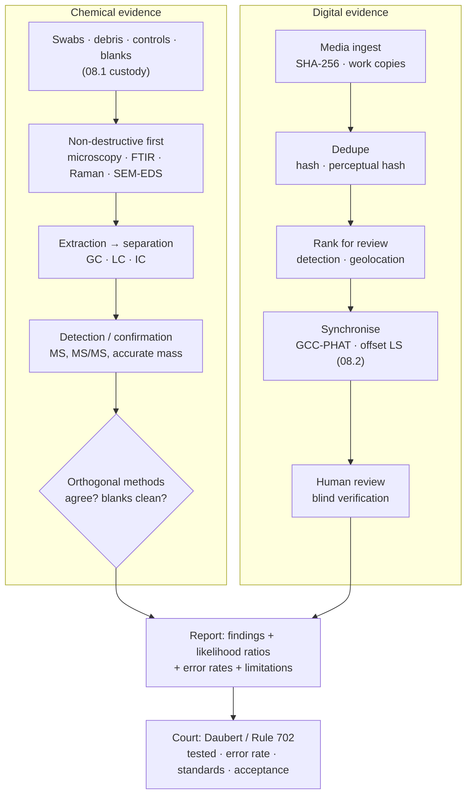

# 08.3 · Laboratory & digital forensics

<div class="module-card">

**Prerequisites** [08.1 The post-blast scene](lessons/stage-08/lesson-01.md) (controls, blanks, custody) · [08.2 Reconstruction](lessons/stage-08/lesson-02.md) (timeline, uncertainty) · [05.4 Trace & vapour detection](lessons/stage-05/lesson-04.md) (IMS/MS basics) · [05.1 Detection theory](lessons/stage-05/lesson-01.md) (likelihood ratios, base rates) · undergraduate chemistry and physics.

**Estimated time** 5 h (2.5 h theory · 0.5 h simulator · 2 h programming) · **Level** Advanced

**Next** [Stage 8 gate](assessments/stage-08.md), then [Stage 9 · AI & computer vision](lessons/stage-09/lesson-01.md) and [case study CS07 · Boston 2013](case-studies/cs07-boston-2013.md).

<p class="tags"><span>analytical chemistry</span><span>spectroscopy</span><span>standards</span><span>computer vision</span><span>statistics</span><span>expert evidence</span><span>Sim E</span><span>P09</span></p>
</div>

## Why this matters

The scene (08.1) and the reconstruction (08.2) produce *hypotheses*; the laboratory produces the
measurements that test them, and the court decides how much to trust those measurements. Two
laboratory worlds meet in a modern post-blast case. The **chemical** world identifies residues on
swabs and debris with separation science and spectroscopy, under consensus standards that demand
independent confirmation. The **digital** world ingests terabytes of photographs and video —
Boston 2013 brought in more than 33 TB through a public tip line
([research/03](research/03-detection-forensics-sources.md) C2) — and must find the few frames
that matter without breaking chain of custody. Both worlds end in the same place: an expert
explaining to non-experts what the evidence shows, **how often the method is wrong**, and what it
cannot show. For an AI engineer this last step is the most transferable lesson in the course: it
is exactly the problem of deploying a model whose errors have consequences.

<div class="callout boundary">

**Scope.** Analytical methods are explained by their physical and chemical *principles*, with
non-energetic textbook examples (nitrogen, carbon monoxide, iron, copper, fictional compounds A
and B). No explosive compositions, formulations, precursors or device components are named or
described; "residue" is discussed only as an analytical target.

</div>

## Learning objectives

1. Describe what a forensic explosives laboratory does in a post-blast case and how an
   examination scheme is structured.
2. Explain the principles of GC-MS, LC-MS, ion chromatography, FTIR, Raman and SEM-EDS, and
   compute chromatographic resolution, mass resolving power, Raman shift and characteristic X-ray
   energies.
3. Explain why consensus standards (TWGFEX guidelines, OSAC Registry, ASTM E2998 and E3253)
   require orthogonal methods, and combine independent results as likelihood ratios.
4. Describe the public role of the FBI's TEDAC in the US system.
5. Design a digital-evidence triage pipeline: hashing and custody, near-duplicate detection,
   object detection for review prioritisation, and audio-based timeline synchronisation — with
   quantified error rates.
6. Estimate method error rates with confidence bounds from validation data, and explain the
   Daubert reliability factors and how they apply to AI-assisted evidence.

## Theory

### 1. What the laboratory does

A post-blast laboratory case typically asks: *what energetic material, if any, is indicated by
the residues* (identification), *what other physical evidence links items, places and people*
(trace, fingerprints, DNA, toolmarks, digital media — each its own discipline), and *what does
the reconstruction require* (e.g. confirming a residue pattern consistent with the seat of
08.2). The work is organised as an **examination scheme**: a documented decision tree of
screening tests, separations and confirmatory methods, chosen so that each reported conclusion
rests on independent lines of evidence — the subject of ASTM E3253 for intact explosives and of
the TWGFEX post-blast guidelines ([research/03](research/03-detection-forensics-sources.md) B6,
B7). Every step consumes sample, so the order matters: non-destructive examinations (visual,
microscopy, imaging, spectroscopy) before destructive ones (extraction, chromatography).

Controls and blanks collected at the scene (08.1 §5) are analysed alongside samples: a positive
result means little unless the blank is negative and the control establishes background.

### 2. Separation science: GC, LC and ion chromatography

Chromatography separates a mixture by partitioning between a mobile phase (gas in GC, liquid in
LC) and a stationary phase in a column. A compound that spends more time in the stationary phase
elutes later. With column dead time $t_M$, a compound's **retention factor** is
$k = (t_R - t_M)/t_M$, and two neighbouring peaks are separated with **resolution**

$$ R_s = \frac{2\,(t_{R,2} - t_{R,1})}{w_1 + w_2}, $$

where $w$ are baseline peak widths. $R_s \ge 1.5$ is conventionally "baseline resolved"
(< 0.3 % overlap for Gaussian peaks of equal size).

| Symbol | Meaning | Unit |
|---|---|---|
| $t_R$, $t_M$ | retention time, dead time | min |
| $w$ | baseline peak width ($\approx 4\sigma$ of a Gaussian peak) | min |
| $R_s$ | chromatographic resolution | — |

- **GC** suits volatile, thermally stable organics; the column is heated in a temperature
  programme.
- **LC** (typically reversed-phase HPLC/UHPLC) suits non-volatile or thermally labile organics.
- **Ion chromatography (IC)** separates *ions* on ion-exchange columns, usually with suppressed
  conductivity detection — the workhorse for inorganic ionic residues extracted with water.

**Numerical example (fictional compounds A and B).** $t_{R,1}=10.20$ min, $t_{R,2}=10.45$ min,
$w_1=0.20$, $w_2=0.22$ min: $R_s = 2(0.25)/0.42 = 1.19$ — partially overlapping. A longer column
(resolution grows as $\sqrt N$ with plate number $N$) or a changed temperature programme would be
needed before quantifying either.

### 3. Mass spectrometry

A mass spectrometer ionises molecules and separates ions by mass-to-charge ratio $m/z$.
**Electron ionisation** (EI, standard after GC) fragments molecules reproducibly, giving spectra
that can be matched against libraries; **electrospray** and **APCI** (after LC) are softer and
often preserve the molecular ion (or an adduct). Tandem MS (MS/MS) selects an ion, fragments it
and records the fragments — a second, largely independent dimension of selectivity. The key
figure of merit is **resolving power**

$$ \mathcal R = \frac{m}{\Delta m}, $$

the ability to distinguish two ions of nearly equal mass.

| Symbol | Meaning | Unit |
|---|---|---|
| $m$ | ion mass (for $z=1$, equal to $m/z$) | Da (u) |
| $\Delta m$ | smallest resolvable mass difference | Da |
| $\mathcal R$ | resolving power | — |

**Numerical example (non-energetic).** N₂⁺ and CO⁺ are both nominal mass 28. Exact masses:
$2\times14.003074 = 28.006148$ and $12.000000 + 15.994915 = 27.994915$ Da, so $\Delta m =
0.011233$ Da and $\mathcal R = 28/0.01123 \approx 2\,490$. A unit-resolution quadrupole
cannot separate them; a high-resolution instrument (Orbitrap, TOF with $\mathcal R >
10^4$) easily can — and accurate mass then constrains the elemental formula. Selectivity comes
from *combining* retention time, mass and fragmentation.

```python
import numpy as np

def resolution(t1, t2, w1, w2):
    return 2 * (t2 - t1) / (w1 + w2)

m_N2, m_CO = 2 * 14.003074, 12.0 + 15.994915
print(round(resolution(10.20, 10.45, 0.20, 0.22), 2))      # 1.19
print(round(28 / (m_N2 - m_CO)))                            # ~2493
```

<details class="answer"><summary>Exercise 1 — then reveal</summary>

(a) For Gaussian peaks, $w=4\sigma$. What is the overlap fraction at $R_s=1.19$ and at 1.5 for
equal peaks? (b) Resolution scales as $\sqrt{N}$. By what factor must the plate number rise to
take $R_s$ from 1.19 to 1.5?

*Answer.* (a) The peak centres are $4R_s\sigma$ apart; each peak's tail past the midpoint is
$1-\Phi(2R_s)$: $R_s=1.19$ → $1-\Phi(2.38)=0.0087$ (0.9 %); $R_s=1.5$ → $1-\Phi(3)=0.0013$ (0.13 %).
(b) $(1.5/1.19)^2 = 1.59$ — about 60 % more plates, e.g. a 60 % longer column (with longer run
time).

</details>

### 4. Vibrational spectroscopy: FTIR and Raman

Molecules absorb infrared radiation at frequencies matching vibrational modes that **change the
dipole moment** (FTIR), and scatter light inelastically, shifted by vibrational energies, for modes
that **change the polarisability** (Raman). The two selection rules differ, so the techniques are
complementary: symmetric vibrations weak in IR are often strong in Raman, and vice versa. Both
give a "fingerprint" region useful for identifying compounds and, for crystalline inorganic
materials, specific ions. Portable Raman and ATR-FTIR allow rapid, largely non-destructive
screening; microscopic variants analyse single particles.

**Absorbance (Beer–Lambert).** $A = \log_{10}(I_0/I) = \varepsilon\,\ell\,c$. A band transmitting
25 % of the incident light has $A = \log_{10}4 = 0.602$.

**Raman shift.** With excitation wavelength $\lambda_0$ and scattered wavelength $\lambda_s$,

$$ \Delta\tilde\nu = \frac{1}{\lambda_0} - \frac{1}{\lambda_s} \quad[\text{cm}^{-1}]. $$

| Symbol | Meaning | Unit |
|---|---|---|
| $A$ | absorbance | — |
| $\varepsilon$, $\ell$, $c$ | molar absorptivity, path length, concentration | L mol⁻¹ cm⁻¹, cm, mol L⁻¹ |
| $\lambda_0$, $\lambda_s$ | excitation and Stokes-scattered wavelengths | cm (for cm⁻¹) |
| $\Delta\tilde\nu$ | Raman shift (vibrational wavenumber) | cm⁻¹ |

**Numerical example.** $\lambda_0 = 785$ nm, $\lambda_s = 850$ nm:
$\Delta\tilde\nu = 12\,738.9 - 11\,764.7 = 974$ cm⁻¹ — in the region where many symmetric
stretching modes of polyatomic ions lie. The shift is a property of the *molecule*, not the
laser: a 532 nm laser would scatter the same mode at $1/(1/532\text{ nm} - 974\text{ cm}^{-1}) =
561$ nm. Longer excitation wavelengths reduce fluorescence background (a major practical problem
with dirty post-blast debris) at the cost of $\lambda^{-4}$ weaker scattering.

```python
def raman_shift_cm1(lam0_nm, lams_nm):
    return 1e7 / lam0_nm - 1e7 / lams_nm

def scattered_nm(lam0_nm, shift_cm1):
    return 1e7 / (1e7 / lam0_nm - shift_cm1)

print(round(raman_shift_cm1(785, 850), 1), round(scattered_nm(532, 974.1), 1))   # 974.1 561.1
print(round(np.log10(1 / 0.25), 3))                                               # 0.602
```

### 5. SEM-EDS: morphology and elements

A scanning electron microscope images surfaces with a focused electron beam (secondary electrons
for topography, backscattered electrons for mean atomic number contrast). The beam also ejects
inner-shell electrons; when outer electrons fill the vacancy, **characteristic X-rays** are
emitted, measured by energy-dispersive spectroscopy (EDS). Moseley's law gives their energies
approximately; for Kα lines

$$ E_{K\alpha} \approx \tfrac34\,R_\infty h c\,(Z-1)^2 \approx 10.2\ \text{eV}\,(Z-1)^2 . $$

| Symbol | Meaning | Unit |
|---|---|---|
| $Z$ | atomic number | — |
| $R_\infty hc$ | Rydberg energy, 13.6 eV | eV |
| $E_{K\alpha}$ | Kα line energy | eV |

**Numerical example.** Fe ($Z=26$): $10.2\cdot625 = 6.38$ keV (measured 6.40 keV); Cu ($Z=29$):
$10.2\cdot784 = 8.00$ keV (measured 8.05 keV). The $(Z-1)$ reflects screening of the nucleus by
the remaining K-shell electron. SEM-EDS combines *shape* (particle morphology — spherical melt
products vs angular fragments) with *elemental composition*, particle by particle; automated
particle analysis scans thousands of particles, much as in gunshot-residue work. It gives
elements, not compounds — hence its role as one orthogonal line among several.

<details class="answer"><summary>Exercise 2 — then reveal</summary>

(a) Estimate the Kα energy of Zn ($Z=30$) and of Al ($Z=13$). (b) EDS detectors have ≈ 130 eV
energy resolution at 5.9 keV. Can they separate Kα lines of neighbouring elements near $Z=26$?

*Answer.* (a) Zn: $10.2\cdot841 = 8.58$ keV (measured 8.64); Al: $10.2\cdot144 = 1.47$ keV
(measured 1.49). (b) $dE/dZ = 20.4(Z-1) \approx 510$ eV at $Z=26$ — yes, adjacent Kα lines are
≈ 0.5 keV apart; overlaps arise instead between *different* line families (e.g. a K line of one
element with an L line of a heavier one), which software and standards must handle.

</details>

### 6. Orthogonal methods and likelihood ratios

TWGFEX groups techniques by how much identifying information they provide and requires
**orthogonal** (independent in principle) methods for identification; OSAC-listed ASTM standards
formalise examination schemes along the same lines ([research/03](research/03-detection-forensics-sources.md) B6, B7).
Probabilistically this is Stage 5 fusion again. For hypothesis $H_p$ ("the residue is compound
class X") versus $H_d$ ("it is not"), each method's result $E_i$ has a likelihood ratio
$\Lambda_i = P(E_i\mid H_p)/P(E_i\mid H_d)$, and if the methods' errors are **conditionally
independent**,

$$ \Lambda_{\text{total}} = \prod_i \Lambda_i, \qquad \text{posterior odds} = \Lambda_{\text{total}} \times \text{prior odds}. $$

**Why "orthogonal".** Two methods that share a failure mechanism (the same extraction step, the
same interferent co-eluting in two chromatographic runs) are not independent: multiplying their
LRs over-states the evidence (05.6's correlated errors). Orthogonality — different physical
principles (retention + mass; vibrational spectrum + elemental composition) — is the laboratory's
way of making the independence assumption defensible.

**Numerical example.** Method 1 (LC-MS/MS) $\Lambda_1=100$; method 2 (IC or spectroscopy,
orthogonal) $\Lambda_2 = 50$: $\Lambda = 5\,000$. With prior odds $10^{-3}$ the posterior odds are
5.0 and the posterior probability 0.83 — **not** 0.9998. Confusing "the evidence is 5 000 times
more probable under $H_p$" with "$H_p$ is 5 000 to 1 likely" is the **prosecutor's fallacy**.
Experts should report the likelihood ratio (or a verbal equivalent) and leave priors to the
fact-finder.

```python
def posterior(prior_odds, lrs):
    o = prior_odds * np.prod(lrs)
    return o, o / (1 + o)

print(posterior(1e-3, [100, 50]))    # (5.0, 0.833)
```

<details class="answer"><summary>Exercise 3 — then reveal</summary>

Method 2 shares an extraction step with method 1; an interfering compound that fools method 1
fools method 2 with probability 0.6 (it would do so with probability 0.02 if independent). If
$P(E_1\mid H_d)=0.01$, estimate the effective joint LR, assuming both methods detect a true
residue with probability 0.95.

*Answer.* $P(E_1,E_2\mid H_p)\approx0.95^2=0.9025$. $P(E_1,E_2\mid H_d) = 0.01\cdot0.6 = 0.006$
(instead of $0.01\cdot0.02=0.0002$). Joint LR ≈ 150, not ≈ 4 500 (the independent value
$0.9025/0.0002$). Dependence can erase more than an order of magnitude of apparent strength.

</details>

### 7. Standards and institutions

| Body / document | Role |
|---|---|
| **TWGFEX** guidelines (NIST-hosted) | legacy consensus guidance for post-blast residue and intact-explosive identification; technique categories; orthogonality |
| **OSAC Registry** (Organization of Scientific Area Committees, administered by NIST) | a registry of technically sound forensic standards that laboratories are encouraged to implement |
| **ANSI/ASTM E3253-21** | standard practice for establishing an examination scheme for intact explosives (on the Registry since July 2022) |
| **ANSI/ASTM E2998** | standard practice concerning the characterisation of smokeless powder |
| **NFPA 921** | scientific method for fire and explosion investigation; 2024 guidance on confirmation bias and on expressing certainty |
| Laboratory accreditation (ISO/IEC 17025 in most jurisdictions) | competence, validated methods, measurement uncertainty, proficiency testing |

**FBI TEDAC** (public description, [research/03](research/03-detection-forensics-sources.md) B9).
The Technology and Explosive Device Analysis Center (formerly the Terrorist Explosive Device
Analytical Center), created in 2003 and located in Huntsville, Alabama, is a multi-agency centre
(FBI, DoD, ATF and others) that serves as the US government's single repository for IED evidence
and associated intelligence, supporting forensic and technical exploitation across cases. It
illustrates the **"attack the network"** pillar of the counter-IED framework (03.4): laboratory
results aggregated across many incidents become intelligence, not just evidence.

### 8. Digital forensics and computer vision for evidence triage

The digital problem is one of **scale under custody constraints**. Illustrative workload: if
footage averaged 5 GB per hour (an assumption; it varies widely with resolution and codec),
33 TB would be ≈ 6 600 hours — 275 days of continuous viewing for one person. A triage pipeline:

| Stage | Method | Output | Failure mode to measure |
|---|---|---|---|
| Ingest & custody | cryptographic hash (SHA-256) of every original; work only on copies; log every transform | provable integrity (08.1 §5) | none if done; fatal if skipped |
| Metadata | container and EXIF metadata: device, timestamps, GPS | candidate time/place | metadata is editable and clocks are wrong (08.2 §8) |
| Deduplication | exact: hash equality; near-duplicate: perceptual hashes, embeddings | clusters of the same content | false merges; misses under crops |
| Relevance ranking | object/person detection, scene classification, geolocation to the scene | review queue ordered by predicted relevance | recall at the reviewer budget |
| Synchronisation | audio cross-correlation (GCC-PHAT), common-event alignment | common timeline | wrong peak under reverberation |
| Human review | examiners confirm every evidential finding | findings with provenance | automation bias |

**Near-duplicate detection with a perceptual hash.** dHash downsamples an image to 8×9, then
records the sign of each horizontal gradient: 64 bits. Robust to re-encoding and global
brightness/contrast changes; *not* robust to crops or shifts. Distance is the Hamming distance.
For unrelated images the bits behave roughly like fair coins, so $d\sim\text{Bin}(64, 1/2)$
(mean 32, s.d. 4). The false-match probability at threshold 10 is
$P(d\le10) = 1.0\times10^{-8}$ — tiny per pair, but a collection of $n=10^6$ images has
$n(n-1)/2 = 5\times10^{11}$ pairs, so **≈ 5 000 false pairs** are expected: the birthday problem.
Thresholds must scale with collection size, and matches must be verified.

```python
from scipy.ndimage import gaussian_filter
from scipy.stats import binom

def resize_mean(img, h, w):
    H, W = img.shape
    return img[: H - H % h, : W - W % w].reshape(h, H // h, w, W // w).mean(axis=(1, 3))

def dhash(img, size=8):
    small = resize_mean(img, size, size + 1)
    return (small[:, 1:] > small[:, :-1]).ravel()        # 64 bits

def hamming(a, b): return int(np.count_nonzero(a != b))

rng = np.random.default_rng(0)
scene = lambda: gaussian_filter(rng.random((72, 90)), 4) * 255   # synthetic "photograph"
base = scene()
variants = {"re-encoded": base + rng.normal(0, 2.0, base.shape),
            "brighter": 1.2 * base + 15,
            "shifted 3 px": np.pad(base[2:, 3:], ((0, 2), (0, 3)), mode="edge"),
            "unrelated": scene()}
h0 = dhash(base)
print({k: hamming(h0, dhash(v)) for k, v in variants.items()})
# {'re-encoded': 2, 'brighter': 0, 'shifted 3 px': 19, 'unrelated': 30}
p = binom.cdf(10, 64, 0.5)
print(p, 1e6 * (1e6 - 1) / 2 * p)        # ~1.0e-08, ~5.0e+03 expected false pairs
```

**Object detection for review prioritisation.** A detector (09.1) scores frames for relevant
content (people near the scene at the time, bags, vehicles). The right metric is not mAP but
**recall at the review budget**: if reviewers can examine $k$ items, what fraction of the truly
relevant items are in the top $k$? A detector that ranks well can cut review time by orders of
magnitude; one that is confidently wrong on a sub-population (night footage, unusual camera
angles — domain shift, 09.3) silently hides evidence. Two engineering rules: *never let the model
discard*, only reorder (everything remains reviewable), and *measure recall per stratum*
(camera type, lighting), not just overall.

**Audio-based synchronisation (GCC-PHAT).** Two recordings of the same sound field are related by
a delay. The generalised cross-correlation with phase transform whitens the cross-spectrum,
$R(f) = \frac{Y(f)X^{*}(f)}{|Y(f)X^{*}(f)|}$, and the inverse transform peaks sharply at the delay.
Delays then feed the offset least squares of 08.2 §8.

```python
def gcc_phat_lag(x, y):
    n = 2 * len(x)
    R = np.fft.rfft(y, n) * np.conj(np.fft.rfft(x, n))
    cc = np.fft.irfft(R / (np.abs(R) + 1e-12), n)
    return int(np.argmax(np.r_[cc[-len(x):], cc[:len(x)]])) - len(x)

fs = 8000; sig = rng.normal(size=2 * fs); lag = 1234
a = sig + 0.5 * rng.normal(size=sig.size)
b = np.r_[np.zeros(lag), sig[:-lag]] + 0.5 * rng.normal(size=sig.size)
print(gcc_phat_lag(a, b), gcc_phat_lag(a, b) / fs)    # 1234 0.15425 s
```

<details class="answer"><summary>Exercise 4 — then reveal</summary>

(a) With $n = 2\times10^5$ images, what dHash threshold $d^{*}$ keeps the expected number of
false pairs below 1? (b) Why is the "shifted 3 px" variant a problem, and what would you add?

*Answer.* (a) Need $\binom{n}{2}P(d\le d^{*}) < 1$ with $\binom{n}{2}\approx2\times10^{10}$, i.e.
$P < 5\times10^{-11}$. $P(d\le 7) = \sum_{j\le7}\binom{64}{j}2^{-64} \approx 3.8\times10^{-11}$
(0.76 expected false pairs), while $P(d\le8)\approx2.8\times10^{-10}$ (≈ 5.6 false pairs) →
$d^{*}=7$. A strict threshold lowers recall for genuine near-duplicates, so pair it with
verification. (b) dHash is a gradient-sign code on a fixed grid, so crops and shifts move content
across cells. Add a shift-robust representation (keypoint matching with geometric verification,
or learned embeddings with a calibrated threshold) in a second stage.

</details>

### 9. Evidential reliability: validation, error rates and bias

A laboratory method — chemical or computational — is only as good as its demonstrated error
rates *on representative cases*. Validation and blind proficiency testing produce counts: $k$
errors in $n$ tests. The **Clopper–Pearson** (exact binomial) interval is

$$
p_{\text{lo}} = B^{-1}\!\left(\tfrac{\alpha}{2};\, k,\, n-k+1\right),\qquad
p_{\text{hi}} = B^{-1}\!\left(1-\tfrac{\alpha}{2};\, k+1,\, n-k\right),
$$

with $B^{-1}$ the beta quantile function. For $k=0$ the one-sided 95 % upper bound is
$1-0.05^{1/n}\approx 3/n$ — the **rule of three**.

| Symbol | Meaning | Unit |
|---|---|---|
| $k$, $n$ | observed errors, number of tests | — |
| $1-\alpha$ | confidence level | — |
| $p_{\text{lo}}, p_{\text{hi}}$ | bounds on the true error rate | — |

**Numerical example.** 0 errors in 150 blind tests: one-sided 95 % upper bound $1-0.05^{1/150} =
0.0198$ (rule of three: 0.020). 2 errors in 150: two-sided 95 % interval [0.0016, 0.047].
"No errors observed" means "error rate plausibly up to 2 %", not "error-free".

```python
from scipy.stats import beta

def clopper_pearson(k, n, conf=0.95):
    a = (1 - conf) / 2
    lo = 0.0 if k == 0 else beta.ppf(a, k, n - k + 1)
    hi = 1.0 if k == n else beta.ppf(1 - a, k + 1, n - k)
    return lo, hi

print(round(1 - 0.05 ** (1 / 150), 4), [round(v, 4) for v in clopper_pearson(2, 150)])
# 0.0198 [0.0016, 0.0473]
```

**Cognitive and contextual bias.** Examiners exposed to task-irrelevant context (a confession, an
investigator's theory) interpret ambiguous data differently. Counter-measures mirror 07.1 §7:
**sequential unmasking** (examine the questioned item before learning reference or context
information), blind verification by a second examiner, and documenting the order in which
information was revealed. NFPA 921's 2024 edition added explicit guidance on confirmation bias
([research/03](research/03-detection-forensics-sources.md) B4).

**Expert testimony and the Daubert standard.** In US federal courts (and many states), *Daubert
v. Merrell Dow Pharmaceuticals* (1993) and Federal Rule of Evidence 702 make the judge a
gatekeeper for expert evidence. The Daubert factors ask whether the method:

| Factor | Laboratory chemistry | AI-assisted triage or analysis |
|---|---|---|
| can be and has been **tested** | validation studies | held-out and field evaluations |
| has been **peer reviewed / published** | literature, standards | published architecture and evaluation |
| has a **known or potential error rate** | proficiency tests (with intervals, above) | recall/precision at the operating point, per stratum, with intervals |
| is governed by **standards** controlling its operation | OSAC/ASTM, accreditation | documented model version, thresholds, change control |
| is **generally accepted** in the relevant community | TWGFEX/OSAC consensus | still emerging — a real weakness |

Other jurisdictions use different tests (e.g. general acceptance under *Frye* in some US
states), but the engineering substance is the same: *demonstrate* reliability, quantify error, and
state the limits. For AI tools, add reproducibility (fixed model versions and seeds), data
provenance, and the rule that a model's output is an **investigative lead** unless and until it
has been validated for the evidential use proposed.

<details class="answer"><summary>Exercise 5 — then reveal</summary>

A vendor reports "99.5 % accuracy" for a relevance classifier, from 2 000 test images of which
40 were relevant. It flags 36 of the 40 and 50 of the 1 960 irrelevant ones. (a) Compute recall,
precision and a 95 % interval for recall. (b) What would you ask before relying on it?

*Answer.* (a) Recall $36/40=0.90$, CP 95 % interval ≈ [0.76, 0.97]; precision $36/86=0.42$;
accuracy $(36+1910)/2000=0.973$ — the vendor's figure does not match, a first red flag. (b) Test
set provenance and similarity to this case (cameras, lighting, crowd density); per-stratum recall;
operating threshold and how it was chosen; version control; whether any items were *discarded*
rather than reordered; independent validation.

</details>

## Visual explanation



## Worked example — a fictional laboratory and media case

Following the 08.2 plaza incident (fictional):

1. **Intake.** 146 items with intact seals; custody log head hash matches the scene's
   countersigned value (08.1 §5). Blanks from each collection kit logged.
2. **Residues.** Swabs from the damaged paving and two façade panels: ATR-FTIR and Raman screening,
   then LC-MS/MS (organic) and IC (inorganic ions). All blanks negative; the control from an
   unaffected wall shows background ions at a level quantified for comparison. The examiner
   reports the combined result as a likelihood ratio with the independence argument stated, and
   the method's proficiency-test error bound (0/150 → ≤ 2 %, one-sided 95 %).
3. **Media.** 1.9 TB from 612 contributors. SHA-256 on ingest; exact duplicates remove 23 %;
   dHash clustering at a threshold scaled to the collection merges a further 11 % (all merges
   verified); a person/bag detector ranks the remaining clips; reviewers examine the top 5 % first
   and then the rest — recall on a seeded validation subset was 0.93 [0.84, 0.98] at that budget.
4. **Timeline.** GCC-PHAT aligns 41 clips with audible events; offsets solved jointly (08.2),
   residuals < 1 frame except two clips with drifting clocks, modelled with a rate term.
5. **Report.** Each finding with its method, standard, error rate and limitations; the AI
   components described as triage (ordering) tools, with every evidential frame confirmed by a
   human examiner.

## Simulation work

<div class="callout sim">

**Sim E — Post-Blast Investigation, laboratory mode** ([open full-screen](sims/post-blast/index.html)).
Submit sample requests from your scene log: (1) observe how missing blanks or controls change
what the lab can report; (2) request a second, orthogonal method and see how the reported
strength changes; (3) in the debrief, compare your stated confidence with the scenario's
ground truth — the score rewards calibrated statements over confident ones.

</div>

## Practical exercises

<details class="answer"><summary>Practical 1 — Examination-scheme design (design) — then reveal</summary>

You have one small swab. Order these steps and justify: LC-MS/MS, visual/microscopy, Raman,
water extraction for IC, organic-solvent extraction for LC.

*Answer.* Visual/microscopy → Raman (non-destructive, particle-level) → sequential extraction
(organic solvent, then water — or a split, depending on the validated scheme) → LC-MS/MS and IC
on the respective extracts. Non-destructive first; each destructive step chosen to leave material
for an orthogonal method; blanks processed identically.

</details>

<details class="answer"><summary>Practical 2 — Birthday-problem thresholds (calculation) — then reveal</summary>

Instead of all-pairs comparison you index 64-bit hashes and query each image's neighbours within
radius $d^{*}$. For $n=10^6$ and $d^{*}=10$, how many candidate pairs do you expect from unrelated
images, and how does using two independent 64-bit hashes (both must be within 10) change it?

*Answer.* ≈ 5 000 false candidates (Section 8). With two independent hashes: $p^2 \approx
10^{-16}$ per pair → $5\times10^{11}\cdot10^{-16} = 5\times10^{-5}$ expected false pairs —
provided the hashes' errors really are independent (they are not, for trivially related hash
functions: the orthogonality lesson again).

</details>

<details class="answer"><summary>Practical 3 — Communicating uncertainty (interpretation) — then reveal</summary>

Rewrite for a jury: "The residue matched with 99.98 % certainty."

*Answer.* "The combination of results is about 5 000 times more likely if the residue is of type X
than if it is not. How likely type X is overall also depends on other evidence, which is for the
court to weigh. The method has been tested in 150 blind trials with no errors, which means its
error rate is likely below about 2 %." — likelihood ratio, no transposed conditional, error
rate with its bound.

</details>

## Programming exercise — a digital-evidence triage pipeline

**Goal.** Build and evaluate a triage pipeline on synthetic media: hashing and custody,
near-duplicate clustering, relevance ranking, and audio synchronisation.

- **Input:** a directory of synthetic images and short audio clips (generated with
  [Project P10](projects/p10-scene-generator/README.md): re-encodings, crops, brightness
  changes, unrelated scenes; audio clips of a common event with random offsets and noise), plus
  ground-truth labels.
- **Output:** a custody manifest (SHA-256 per original, transform log), duplicate clusters,
  a ranked review queue, estimated clip offsets, and an evaluation report.
- **Constraints:** NumPy/SciPy for hashing and GCC-PHAT; a small detector from
  [Project P09](projects/p09-cv-detection/README.md) for ranking (CPU acceptable); nothing is
  ever deleted — only reordered.
- **Expected behaviour:** exact duplicates merged with no errors; near-duplicate precision
  ≥ 0.99 at a threshold chosen by the birthday calculation for the collection size; offsets
  within one frame for SNR ≥ 0 dB.
- **Test cases:** (i) manifest verification fails if any original byte changes; (ii) dHash
  distance 0 for a global brightness change; (iii) GCC-PHAT recovers a known lag exactly on
  noise-free data; (iv) report includes Clopper–Pearson intervals for recall at budget.
- **Extensions:** replace dHash by learned embeddings with a calibrated threshold (09.2);
  per-stratum recall (day/night); conformal guarantees on recall at a budget (09.2).

## Reading

- TWGFEX, *Recommended Guidelines for Forensic Identification of Post-Blast Explosive Residues*,
  https://www.nist.gov/document/twgfexrecommendedguidelinesfortheforensicidentificationofpost-blastexplosiveresiduespdf
  — technique categories and the orthogonality requirement. ([research/03](research/03-detection-forensics-sources.md) B6)
- NIST OSAC, *ANSI/ASTM E3253-21* registry entry, https://www.nist.gov/osac/standards-library/ansiastm-e3253-21
  and *ANSI/ASTM E2998*, https://www.nist.gov/osac/standards-library/ansiastm-e2998-25a — what
  a consensus examination scheme looks like. (B7)
- FBI, *TEDAC*, https://www.fbi.gov/investigate/terrorism/tedac — the institutional role. (B9)
- A. Beveridge (ed.), *Forensic Investigation of Explosions*, 2nd ed. (2012),
  https://www.routledge.com/Forensic-Investigation-of-Explosions/Beveridge/p/book/9780367778200
  — the residue-analysis and casework-management chapters. (B5)
- NRC, *Opportunities to Improve Airport Passenger Screening with Mass Spectrometry* (2004),
  https://www.nationalacademies.org/read/10996/chapter/1 — MS selectivity and false alarms as a
  system-requirements problem. (A4.1)
- C. Guo et al., "On Calibration of Modern Neural Networks" (2017), https://arxiv.org/abs/1706.04599
  — before any model confidence appears in a forensic report. ([research/04](research/04-robotics-ai-sources.md) 4.13)

## Assessment

1. *(Conceptual)* Explain why IR and Raman are complementary, and why SEM-EDS cannot by itself
   identify a compound.
2. *(Mathematical)* Two ions at nominal $m/z=44$ differ by 0.0364 Da (e.g. CO₂⁺ vs C₂H₄O⁺ —
   check with exact masses). What resolving power separates them?
3. *(Mathematical)* A method shows 1 error in 80 proficiency tests. Give the 95 % Clopper–Pearson
   interval and explain it to a lawyer in one sentence.
4. *(Interpretation)* A report multiplies LRs from GC-MS and a second GC-MS run on a different
   column from the same extract. Critique it.
5. *(Design)* Specify the validation study you would need before an object detector's ranking
   could be described in court as more than an investigative lead.

<details class="answer"><summary>Answers to 2 and 3</summary>

2. CO₂: $12.000000 + 2\cdot15.994915 = 43.989830$; C₂H₄O: $24.000000 + 4\cdot1.007825 +
   15.994915 = 44.026215$; $\Delta m=0.036385$; $\mathcal R = 44/0.0364 \approx 1\,210$.
3. $[B^{-1}(0.025;1,80),\ B^{-1}(0.975;2,79)] \approx [0.0003, 0.068]$: "Based on 80 tests, the
   method's true error rate is plausibly anywhere from well under 1 in 1 000 to about 7 in 100."

</details>

## Expert extension

- **Chemometrics.** Multivariate classification of spectra (PCA-LDA, PLS-DA) with proper
  validation; score-based likelihood ratios and their calibration (the ENFSI approach to
  evaluative reporting).
- **Error-rate study design.** Black-box studies for pattern-comparison disciplines; how
  inconclusive decisions should be counted; stratified sampling of difficulty.
- **Media authenticity.** Detecting edited or synthetic imagery (sensor noise PRNU, compression
  traces, generative-model artefacts), and the evidential burden it creates when any video might
  be challenged as fabricated.
- **Privacy-preserving triage.** Processing crowd-sourced media while minimising exposure of
  bystanders' personal data — a design constraint as real as recall.

## What comes next

Stage 8 is complete: take the [Stage 8 gate](assessments/stage-08.md). [Stage 9](lessons/stage-09/lesson-01.md)
develops the computer-vision and uncertainty tools used here — detection, calibration,
conformal prediction and trustworthy deployment — and [case study CS07](case-studies/cs07-boston-2013.md)
revisits Boston 2013 as a whole-system investigation.
