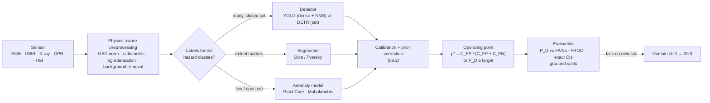

# 09.1 · Perception tasks for EOD: detection, segmentation, anomalies and the metrics that matter

<div class="module-card">

**Prerequisites** [05.1 Detection theory](lessons/stage-05/lesson-01.md) (ROC, base rates, costs) · [05.2 EMI & GPR](lessons/stage-05/lesson-02.md) (B-scans, hyperbolas) · [05.3 Penetrating radiation](lessons/stage-05/lesson-03.md) (attenuation, dual-energy) · [05.5 Imaging & remote sensing](lessons/stage-05/lesson-05.md) (thermal contrast, hyperspectral) · [05.6 Sensor fusion](lessons/stage-05/lesson-06.md) · working knowledge of CNNs, transformers and PyTorch.

**Estimated time** 8 h (4 h theory · 1 h simulator · 3 h programming) · **Level** Advanced

**Next** [09.2 Uncertainty-aware ML](lessons/stage-09/lesson-02.md), then [09.3 Synthetic data & sim-to-real](lessons/stage-09/lesson-03.md) and [09.4 Multimodal sensing](lessons/stage-09/lesson-04.md).

<p class="tags"><span>deep learning</span><span>object detection</span><span>anomaly detection</span><span>evaluation</span><span>Sim J</span><span>P09</span></p>
</div>

## Why this matters

Every modern EOD and mine-action programme now collects imagery: drone RGB and long-wave
infrared (LWIR) over suspected hazardous areas, radiographs of suspicious items, GPR B-scans from
handheld dual sensors and vehicle arrays, hyperspectral cubes from research campaigns. Machine
learning is the obvious way to turn that into declarations ("look here"), and the research
literature is full of detectors that report 0.9+ mAP. Almost none of those numbers answer the
question a clearance organisation actually asks: *at a false-alarm rate our teams can afford to
investigate, what fraction of the hazards in a field like this one will the system find, and how
sure are we of that fraction?*

The gap between the two questions comes from the data regime. EOD perception is the opposite of
ImageNet:

| Property | Typical benchmark | EOD / mine-action reality |
|---|---|---|
| Positives per class | thousands | tens to low thousands, often surrogates rather than real items |
| Prevalence | balanced or mildly skewed | 1 target per $10^2$–$10^4$ m², most images empty |
| Cost of error | symmetric (0–1 loss) | a miss can kill; a false alarm costs minutes of a technician's time |
| Test distribution | i.i.d. with training | new country, soil, season, altitude, vegetation, sensor firmware |
| Labels | cheap, many annotators | expert-only, ambiguous (partially buried, degraded), sometimes restricted |
| Open set | closed label set | unknown item types appear; "none of the above" matters |

This lesson builds the task vocabulary (classification, detection, segmentation, anomaly
detection) at the level of loss functions and assignment rules, then spends as much effort on
*evaluation* as on models, because in this domain the evaluation protocol is the product.

## Learning objectives

1. Derive the Bayes-optimal decision threshold under asymmetric costs and correct a classifier's
   posterior for a change in class prevalence between training and deployment.
2. Explain the loss design of dense one-stage detectors (YOLO family: box regression with IoU
   losses, objectness, focal-style classification) versus set-prediction detectors (DETR:
   Hungarian matching, no NMS), and predict how each fails on clustered small objects.
3. Choose between segmentation, detection and anomaly detection for a given EOD sensing task and
   justify the choice by label availability and the open-set nature of the problem.
4. Implement a PatchCore-style memory-bank anomaly score and a Mahalanobis (Gaussian) score, and
   state when each is appropriate.
5. Relate modality physics (RGB, thermal LWIR, X-ray transmission, GPR B-scans) to preprocessing,
   architecture and failure modes.
6. Evaluate a detector with recall at fixed false-alarm rate per unit area, FROC, and exact
   binomial confidence bounds; explain precisely why mAP misleads in low-prevalence fields.
7. Design a leakage-free evaluation split for a public dataset such as AMLID or SULAND v2.

## Theory

### 1. Decisions first: cost-weighted thresholds

A perception model outputs a score; an organisation acts on a decision. For a binary
"hazard-like / not" decision with calibrated posterior $p = P(y=1\mid x)$, declaring costs
$C_{FP}$ if the object is benign, and not declaring costs $C_{FN}$ if it is a hazard. Declare when
the expected cost of declaring is lower:

<div class="callout eq">

$$
(1-p)\,C_{FP} < p\,C_{FN} \;\Longleftrightarrow\; p > p^{*} = \frac{C_{FP}}{C_{FP}+C_{FN}} .
$$

</div>

| Symbol | Meaning | Unit |
|---|---|---|
| $p$ | calibrated posterior probability of the positive (hazard-like) class | — |
| $C_{FP}$ | cost of a false alarm (investigation time, excavation) | cost units (e.g. technician-minutes) |
| $C_{FN}$ | cost of a miss (residual risk to people) | same cost units |
| $p^*$ | Bayes-optimal threshold | — |

**Intuition.** The threshold is set by the *ratio* of costs, not by the model. When misses are
three orders of magnitude worse than false alarms, the optimal threshold sits near $10^{-3}$: you
declare almost anything with a non-negligible chance of being a hazard. This is why EOD detectors
are run at operating points that look absurdly "trigger-happy" to an ML engineer, and why
*calibration* (09.2) is a hard prerequisite: $p^*$ is meaningless if $p$ is not a probability.

**Numerical example.** $C_{FN}=1000$, $C_{FP}=1$: $p^* = 1/1001 = 0.000999$. If the miss is
"only" 50× worse (e.g. a secondary survey will re-sweep the area), $p^*=1/51=0.0196$.

```python
def bayes_threshold(c_fp: float, c_fn: float) -> float:
    """Declare positive when the calibrated posterior exceeds this value."""
    return c_fp / (c_fp + c_fn)

print(bayes_threshold(1, 1000), bayes_threshold(1, 50))   # 0.000999  0.0196
```

<details class="answer"><summary>Exercise 1 — then reveal</summary>

A land-release programme cannot express $C_{FN}$ in minutes; instead it mandates a minimum recall
of 0.99 on hazards. Show that this is equivalent to a Neyman–Pearson problem and explain how the
threshold is then chosen. Which quantity must you now estimate that the cost formulation hid?

*Answer.* Minimise the false-alarm rate subject to $P_D \ge 0.99$: by the Neyman–Pearson lemma
the optimal test still thresholds the likelihood ratio (equivalently a calibrated score), but the
threshold is the largest $t$ with $\hat P_D(t)\ge 0.99$ on *hazard examples*. You must now
estimate the score distribution of the positive class in its lower tail (the 1st percentile) —
which needs many positives (Section 7) — whereas the cost formulation needed a calibrated $p$
everywhere. The constraint implicitly defines a cost ratio: the Lagrange multiplier.

</details>

### 2. Classification under prevalence shift

Detectors are trained on curated, rebalanced data; they are deployed where hazards are rare.
Under **label (prior) shift** — $p(x\mid y)$ unchanged, $\pi(y)$ changed — Bayes' rule gives the
exact correction:

<div class="callout eq">

$$
p_{\text{dep}}(y\mid x) \;\propto\; p_{\text{tr}}(y\mid x)\,\frac{\pi_{\text{dep}}(y)}{\pi_{\text{tr}}(y)}
\quad\Longleftrightarrow\quad
z_y^{\text{dep}} = z_y^{\text{tr}} + \log\pi_{\text{dep}}(y) - \log\pi_{\text{tr}}(y).
$$

</div>

| Symbol | Meaning |
|---|---|
| $\pi_{\text{tr}}, \pi_{\text{dep}}$ | class priors in training data and in deployment |
| $z_y$ | logit for class $y$ (softmax input) |

**Intuition.** A classifier trained on 50/50 data has "baked in" a prior that hazards are common.
Adding $\log$ prior ratios to the logits removes it. The same algebra underlies *logit-adjusted*
training losses for long-tailed data.

**Numerical example.** Trained balanced (0.5/0.5); deployed at 1 % prevalence; model output 0.90.
Odds $9 \times \frac{0.01/0.99}{0.5/0.5} = 0.0909$, so $p_{\text{dep}} = 0.0833$. With the
$p^*=0.02$ threshold of Section 1 you would still declare — correctly — but a dashboard showing
"90 % hazard" is off by an order of magnitude.

```python
import numpy as np

def prior_shift(p_tr: np.ndarray, pi_tr: np.ndarray, pi_dep: np.ndarray) -> np.ndarray:
    """Re-weight posteriors (rows = samples, cols = classes) for new class priors."""
    w = p_tr * (pi_dep / pi_tr)
    return w / w.sum(axis=-1, keepdims=True)

print(prior_shift(np.array([[0.1, 0.9]]), np.array([0.5, 0.5]), np.array([0.99, 0.01])))
# [[0.9167 0.0833]]
```

<details class="answer"><summary>Exercise 2 — then reveal</summary>

You do not know $\pi_{\text{dep}}$ for a new field. Sketch how to estimate it from *unlabelled*
deployment predictions, and name one situation in EOD where the label-shift assumption itself is
false.

*Answer.* EM (Saerens–Latinne–Decaestecker): initialise $\hat\pi$; E-step re-weight each
prediction with the current prior ratio; M-step set $\hat\pi$ to the mean adjusted posterior;
iterate. Requires calibrated $p_{\text{tr}}$. The assumption fails whenever the *appearance* of
the classes changes too — e.g. a new soil type changes thermal contrast (covariate/conditional
shift), or a different mix of item types within the "hazard" class. Then $p(x\mid y)$ moves and
the correction is wrong (09.3).

</details>

### 3. Object detection

#### 3.1 Box geometry: IoU and GIoU

For boxes $A$ (prediction) and $B$ (ground truth), with $C$ the smallest enclosing box:

$$
\mathrm{IoU} = \frac{|A\cap B|}{|A\cup B|},\qquad
\mathrm{GIoU} = \mathrm{IoU} - \frac{|C| - |A\cup B|}{|C|}\in(-1,1].
$$

| Symbol | Meaning | Unit |
|---|---|---|
| $\lvert A\cap B\rvert$, $\lvert A\cup B\rvert$ | intersection, union area | px² (or m² after georeferencing) |
| $\lvert C\rvert$ | area of smallest box enclosing both | px² |

**Intuition.** IoU is scale-invariant and is both the matching criterion and (as $1-\mathrm{IoU}$)
a regression loss — but it has zero gradient when boxes do not overlap. GIoU adds a penalty for
empty space in the enclosing box, so disjoint predictions still get pulled toward the target.
CIoU/DIoU (used in YOLOv5–v8) further add centre-distance and aspect-ratio terms.

**Numerical example.** $A=[0,0,10,10]$, $B=[5,5,15,15]$: $|A\cap B|=25$, $|A\cup B|=175$,
IoU $=0.143$; $|C|=225$, GIoU $=0.143-50/225=-0.079$. For disjoint $A=[0,0,10,10]$,
$B=[20,0,30,10]$: IoU $=0$ everywhere nearby, GIoU $=-100/300=-0.333$ — a usable signal.

```python
def iou_giou(a, b):
    """Boxes as (x1, y1, x2, y2). Returns (IoU, GIoU)."""
    ix = max(0, min(a[2], b[2]) - max(a[0], b[0])); iy = max(0, min(a[3], b[3]) - max(a[1], b[1]))
    inter = ix * iy
    area = lambda r: (r[2] - r[0]) * (r[3] - r[1])
    union = area(a) + area(b) - inter
    c = (max(a[2], b[2]) - min(a[0], b[0])) * (max(a[3], b[3]) - min(a[1], b[1]))
    iou = inter / union
    return iou, iou - (c - union) / c

print(iou_giou((0, 0, 10, 10), (5, 5, 15, 15)))   # (0.143, -0.079)
```

<details class="answer"><summary>Exercise 3 — then reveal</summary>

A drone at 20 m altitude with a ground sampling distance of 5 mm/px images a fictional 8 cm
surface object as a 16×16 px box. A 2 px localisation error in both x and y is operationally
irrelevant (the technician walks to within a metre). What IoU does it produce, and what does that
tell you about scoring such detections at IoU ≥ 0.5 or averaging over IoU 0.5:0.95?

*Answer.* Overlap $14\times14=196$; union $2\cdot256-196=316$; IoU $=0.62$. A 3 px error in both
axes gives $169/343 = 0.49$ — a "miss" at IoU 0.5 for a 1.5 cm error. COCO-style mAP@[.5:.95]
heavily penalises localisation precision that has no operational value for small point-like
hazards. Use a centre-distance hit criterion in metres (Section 7) instead, as blind detector
trials do.

</details>

#### 3.2 Dense one-stage detectors (the YOLO family)

YOLO (Redmon et al., 2016) predicts, for every cell of an $S\times S$ grid (in modern versions,
every location of several feature-pyramid levels), a box, an objectness/quality score and class
scores in one forward pass. Training requires an **assignment rule** — which predictions are
responsible for which ground-truth boxes — and a composite loss:

$$
\mathcal L = \lambda_{\text{box}}\sum_{i\in\mathcal P}\big(1-\mathrm{CIoU}(\hat b_i,b_{g(i)})\big)
+ \lambda_{\text{obj}}\sum_{i}\ell_{\text{obj}}(\hat o_i, o_i)
+ \lambda_{\text{cls}}\sum_{i\in\mathcal P}\ell_{\text{cls}}(\hat c_i, c_{g(i)}) .
$$

| Symbol | Meaning |
|---|---|
| $\mathcal P$ | set of predictions assigned as positives; $g(i)$ their matched ground truth |
| $\hat b_i, \hat o_i, \hat c_i$ | predicted box, objectness (or IoU-aware quality), class scores |
| $\lambda$ | loss weights (hyperparameters; typically box ≫ cls) |

- **Anchors vs anchor-free.** YOLOv2–v5 regress offsets relative to *anchor boxes* (priors from
  k-means on training box sizes) and assign a ground truth to anchors whose shape matches.
  Anchors silently encode the training size distribution: fly higher and your 16 px objects become
  8 px, smaller than any anchor. YOLOX, YOLOv8 and later are **anchor-free**: they predict
  distances from a point to the four box edges, and assignment is dynamic (e.g. task-aligned
  assignment ranks candidate points by $s^{\alpha}\,\mathrm{IoU}^{\beta}$ of their own
  predictions).
- **Imbalance inside the image.** A 640×640 input at strides 8/16/32 yields 8,400 candidate
  locations; an EOD image has 0–3 positives. The easy negatives swamp the gradient. The standard
  fix is the **focal loss** (Lin et al., 2017):

<div class="callout eq">

$$
\mathrm{FL}(p_t) = -\alpha_t\,(1-p_t)^{\gamma}\,\log p_t, \qquad
p_t = \begin{cases} p & y=1\\ 1-p & y=0\end{cases}
$$

</div>

| Symbol | Meaning | Typical |
|---|---|---|
| $p_t$ | probability assigned to the true label | — |
| $\gamma$ | focusing parameter | 2 |
| $\alpha_t$ | class weight | 0.25 for positives |

**Intuition.** $(1-p_t)^\gamma$ shrinks the loss of well-classified examples. With $\gamma=2$ an
easy negative at $p_t=0.9$ contributes $100\times$ less than under cross-entropy; a hard example
at $p_t=0.1$ loses only a factor 1.2. The gradient budget moves to the ambiguous patches — the
half-buried item, the rock with the right thermal signature.

**Numerical example.** $p_t=0.9$: CE $=0.1054$, FL (ignoring $\alpha$) $=0.01\cdot0.1054=0.00105$.
$p_t=0.1$: CE $=2.303$, FL $=0.81\cdot2.303=1.865$. $p_t=0.99$: ratio $10^4$.

```python
def focal_loss(p: np.ndarray, y: np.ndarray, gamma: float = 2.0, alpha: float = 0.25) -> np.ndarray:
    p_t = np.where(y == 1, p, 1 - p)
    a_t = np.where(y == 1, alpha, 1 - alpha)
    return -a_t * (1 - p_t) ** gamma * np.log(np.clip(p_t, 1e-12, 1))
```

<details class="answer"><summary>Exercise 4 — then reveal</summary>

8,400 candidate locations, 2 positives. Assume after a few epochs all negatives sit at
$p_t=0.99$ and both positives at $p_t=0.3$. Compare the ratio (total negative loss)/(total
positive loss) under cross-entropy and under focal loss with $\gamma=2$, $\alpha=0.25$.

*Answer.* CE: negatives $8398\cdot0.01005=84.4$, positives $2\cdot1.204=2.41$, ratio ≈ 35.
FL: negatives $8398\cdot0.75\cdot10^{-4}\cdot0.01005=0.00633$; positives
$2\cdot0.25\cdot0.49\cdot1.204=0.295$; ratio ≈ 0.021. Under CE the negatives dominate the
gradient 35:1; under FL the positives dominate ≈ 47:1.

</details>

#### 3.3 Non-maximum suppression and why it hurts on clustered items

Dense detectors fire many overlapping boxes per object. **Greedy NMS** keeps the highest-scoring
box, deletes every remaining box with IoU > $\tau$ against it, and repeats. It is a hand-coded
post-processor outside the loss, with one knob $\tau$.

**Numerical example.** Scores 0.9, 0.8, 0.7 for boxes $[0,0,10,10]$, $[1,1,11,11]$,
$[8,8,18,18]$. IoU(1,2) $=81/119=0.68$; IoU(1,3) $=4/196=0.02$. With $\tau=0.5$: keep 1,
suppress 2, keep 3.

The failure mode matters in this domain: **scattered items occur in clusters** (submunition
footprints, dumped stockpiles, debris fields). If two genuine adjacent items produce boxes with
IoU above $\tau$, NMS deletes one — a *miss created by post-processing*, invisible in the model's
raw outputs. Raising $\tau$ keeps both but also keeps duplicates, inflating false alarms. Soft-NMS
(decay rather than delete), per-class NMS, and set-prediction detectors are the remedies.

```python
def nms(boxes: np.ndarray, scores: np.ndarray, tau: float = 0.5) -> list[int]:
    order, keep = list(np.argsort(-scores)), []
    while order:
        i = order.pop(0); keep.append(i)
        order = [j for j in order if iou_giou(boxes[i], boxes[j])[0] <= tau]
    return keep
```

<details class="answer"><summary>Exercise 5 — then reveal</summary>

Two identical 16×16 px fictional items lie side by side with a 4 px horizontal offset (they
touch/overlap in the image because of blur). The detector localises each perfectly. At what NMS
threshold does one get suppressed?

*Answer.* Overlap $12\times16=192$, union $512-192=320$, IoU $=0.60$. Any $\tau<0.60$ (including
the common default 0.45–0.5) deletes the lower-scoring one. Evaluate NMS-induced misses
explicitly: count ground truths that had a correct raw prediction but no surviving one.

</details>

#### 3.4 Set prediction (DETR)

DETR (Carion et al., 2020) replaces anchors, assignment heuristics and NMS by a transformer
decoder that emits a fixed set of $N$ predictions (e.g. 100), padded with a "no object" class
$\varnothing$, and trains with a **bipartite matching** between predictions and ground truth:

$$
\hat\sigma = \arg\min_{\sigma\in\mathfrak S_N}\sum_{i=1}^{N}\mathcal C_{\text{match}}\big(y_i,\hat y_{\sigma(i)}\big),\quad
\mathcal C_{\text{match}} = -\mathbb 1_{c_i\neq\varnothing}\,\hat p_{\sigma(i)}(c_i) + \mathbb 1_{c_i\neq\varnothing}\,\mathcal L_{\text{box}}(b_i,\hat b_{\sigma(i)}),
$$

solved exactly by the Hungarian algorithm in $O(N^3)$; the loss is then computed on the matched
pairs. Because each ground truth is matched to exactly one prediction, the loss itself penalises
duplicates — no NMS is needed.

**Numerical example.** Two ground truths, two predictions, cost matrix
$\begin{pmatrix}0.2&0.9\\0.4&1.5\end{pmatrix}$. Greedy (take the cheapest pair 0.2 first) gives
$0.2+1.5=1.7$; the Hungarian optimum is $0.9+0.4=1.3$. Greedy matching gives inconsistent
targets; exact matching gives a well-defined loss.

```python
from itertools import permutations
def hungarian_bruteforce(C: np.ndarray):
    n = C.shape[0]
    best = min(permutations(range(n)), key=lambda s: sum(C[i, s[i]] for i in range(n)))
    return best, sum(C[i, best[i]] for i in range(n))
print(hungarian_bruteforce(np.array([[0.2, 0.9], [0.4, 1.5]])))   # ((1, 0), 1.3)
# production: scipy.optimize.linear_sum_assignment
```

| | YOLO-family (dense) | DETR-family (set) |
|---|---|---|
| Assignment | heuristic / dynamic, many positives per GT | one-to-one Hungarian |
| Post-processing | NMS (threshold $\tau$) | none |
| Clustered objects | NMS suppression risk | handled by the loss |
| Small objects | strong (high-resolution pyramid levels) | historically weak; improved by deformable attention, multi-scale variants |
| Data hunger | moderate; fine-tunes well from COCO | original DETR converged slowly (500 epochs); later variants much faster |
| Edge latency | excellent | good for RT-DETR-class models |

<details class="answer"><summary>Exercise 6 — then reveal</summary>

Why does one-to-one matching make DETR converge slowly on a small EOD dataset, and what is the
effect of setting $N=100$ when images contain at most 3 objects?

*Answer.* Each ground truth supervises exactly one query per image, so positive supervision is
sparse (a few hundred positive signals per epoch on a small dataset vs thousands of assigned
positives in a dense detector), and the matching itself is unstable early in training (a GT can
switch queries between epochs). With $N=100$ and ≤ 3 objects, ≥ 97 queries learn "no object" —
another imbalance, handled by down-weighting the $\varnothing$ class (0.1 in the original paper).
Hybrid one-to-many auxiliary matching (e.g. in later DETR variants) was introduced precisely to
add positives.

</details>

### 4. Segmentation

Pixel-level labels are the right output when *extent* matters: delineating a GPR hyperbola
region, marking the outline of a suspicious object in a radiograph for a human, or mapping
disturbed soil or vegetation stress in multispectral imagery for non-technical survey
([05.7](lessons/stage-05/lesson-07.md)). Class imbalance is extreme (target pixels ≪ 1 %), so
region losses replace per-pixel cross-entropy:

$$
\mathrm{Dice}(A,B) = \frac{2|A\cap B|}{|A|+|B|},\qquad
\mathcal L_{\text{soft Dice}} = 1 - \frac{2\sum_i p_i g_i + \epsilon}{\sum_i p_i + \sum_i g_i + \epsilon}.
$$

| Symbol | Meaning |
|---|---|
| $p_i \in[0,1]$, $g_i\in\{0,1\}$ | predicted probability and label at pixel $i$ |
| $\epsilon$ | smoothing constant (avoids 0/0 on empty images) |

**Intuition.** Dice is F1 over pixels: background pixels that are correctly predicted do not
enter at all, so the 99 % of empty ground cannot dominate. The price: Dice is extremely sensitive
to small objects. **Numerical example:** a 10×10 px object predicted with a 1 px shift gives
Dice $2\cdot90/200=0.90$; a 40×40 px object with the same shift gives $2\cdot1560/3200=0.975$.

<details class="answer"><summary>Exercise 7 — then reveal</summary>

Why is the $\epsilon$ in soft Dice not a mere numerical nicety in EOD segmentation, where most
tiles contain no target?

*Answer.* On an empty tile ($\sum g_i=0$) the loss is $1-\epsilon/(\sum p_i+\epsilon)$: it is
0 only if $\sum p_i=0$ and grows toward 1 as soon as the model predicts any mass. With
$\epsilon$ tiny the loss saturates at ≈ 1 for any non-zero prediction — a huge, uninformative
penalty — so training oscillates. Practical recipes compute Dice per batch (not per tile), combine
Dice with BCE/focal, or use Tversky loss to weight false negatives more heavily than false
positives (weights $\beta>\alpha$) — the pixel-level analogue of $C_{FN}\gg C_{FP}$.

</details>

### 5. Anomaly detection: the open-set problem

Supervised detectors can only recognise categories they were trained on. In EOD the unknown
category is the important one: an improvised item, a type absent from the training set, a
corroded item that no longer resembles its catalogue picture. **Anomaly detection** learns only
"normal" (e.g. hundreds of radiographs or survey tiles of benign scenes) and flags deviations.

**Gaussian (Mahalanobis) scoring** — PaDiM-style — fits a mean and covariance to pretrained-CNN
features of normal data (per patch location or globally):

$$
s(x) = (\phi(x)-\mu)^\top\Sigma^{-1}(\phi(x)-\mu) \;\sim\; \chi^2_d \text{ under normality.}
$$

**Numerical example.** $d=2$, $\mu=0$, $\Sigma=\mathrm{diag}(1,4)$, $\phi(x)=(2,2)$:
$s=4+1=5$; the $\chi^2_2$ tail is $e^{-5/2}=0.082$ — unremarkable. Note the covariance matters:
Euclidean distance would rate $(0,4)$ and $(4,0)$ equally; Mahalanobis rates $(4,0)$ ($s=16$) far
more anomalous than $(0,4)$ ($s=4$).

**Autoencoders** score reconstruction error $\lVert x-D(E(x))\rVert^2$. Known failure: a
sufficiently expressive decoder reconstructs anomalies well too, and the error is dominated by
high-frequency texture (grass, gravel) rather than semantic novelty.

**PatchCore-style memory banks** (Roth et al., 2022) store mid-level patch features of all normal
training images in a memory bank $\mathcal M$ (subsampled by greedy *coreset* selection to ~1–10 %),
and score a test image by its most anomalous patch:

<div class="callout eq">

$$
s(x) = \max_{j\in\text{patches}(x)}\;\min_{m\in\mathcal M}\;\lVert \phi_j(x) - m\rVert_2 .
$$

</div>

| Symbol | Meaning |
|---|---|
| $\phi_j(x)$ | feature of patch $j$ (e.g. pooled layer-2/3 features of a frozen ImageNet backbone) |
| $\mathcal M$ | memory bank of nominal patch features |
| inner min | distance to the nearest *normal* patch (kNN, k = 1) |
| outer max | image score = worst patch; the per-patch map is the localisation heatmap |

**Intuition.** "Is there *any* part of this image that looks like nothing I have ever seen in a
normal image?" No training beyond feature extraction, so it works with tens to hundreds of
normal images — exactly the EOD regime. **Numerical example:** a test image whose three patches
have nearest-neighbour distances 0.4, 0.5 and 2.1 scores 2.1. If the 99th percentile of scores on
held-out normal images is 1.3, it is flagged; the heatmap points at patch 3.

```python
def patchcore_score(test_patches: np.ndarray, bank: np.ndarray) -> tuple[float, np.ndarray]:
    """test_patches: (P, d); bank: (M, d). Returns image score and per-patch scores."""
    d2 = (test_patches**2).sum(1)[:, None] - 2 * test_patches @ bank.T + (bank**2).sum(1)[None]
    patch_scores = np.sqrt(np.maximum(d2.min(axis=1), 0))
    return float(patch_scores.max()), patch_scores

def coreset(bank: np.ndarray, m: int, seed: int = 0) -> np.ndarray:
    """Greedy k-centre selection: repeatedly add the point farthest from the current set."""
    rng = np.random.default_rng(seed)
    idx = [int(rng.integers(len(bank)))]
    dmin = np.linalg.norm(bank - bank[idx[0]], axis=1)
    for _ in range(m - 1):
        idx.append(int(dmin.argmax()))
        dmin = np.minimum(dmin, np.linalg.norm(bank - bank[idx[-1]], axis=1))
    return bank[idx]
```

<details class="answer"><summary>Exercise 8 — then reveal</summary>

You build a PatchCore bank from drone tiles of one site in dry season. In the wet season the
flag rate on *empty* tiles rises from 1 % to 30 %. Is the model broken? What should the
deployment pipeline have done?

*Answer.* It is doing exactly what it was built for: everything unlike the nominal bank is
anomalous, and a seasonal change is a massive distribution shift. Anomaly detectors conflate
*novel nuisance* with *novel hazard*. The pipeline should (a) build banks per site/season or with
nominal data spanning the expected nuisance variation, (b) monitor the score distribution on
confirmed-empty tiles and re-fit the threshold (a conformal threshold, 09.2, gives a guaranteed
false-flag rate when re-calibrated on current nominal data), and (c) treat a sudden jump in flag
rate as a drift alarm rather than as 30× more hazards.

</details>

### 6. Modality specifics

| Modality | What the pixel means | Preprocessing that matters | Typical nuisance / failure | Notes |
|---|---|---|---|---|
| **RGB** (drone, robot camera) | reflected visible radiance | GSD normalisation (mm/px) across altitudes; colour constancy | vegetation occlusion, shadows, look-alike litter; motion blur | surface items only; GSD dominates small-object recall (Baur et al.) |
| **Thermal LWIR** | apparent temperature (radiometric) or AGC-scaled 8-bit | keep radiometric 14/16-bit data; avoid per-frame AGC; time-of-day metadata | diurnal **contrast crossover** (object warmer by day, cooler at night, zero at two times per day); moisture | can reveal shallow buried objects via soil thermal disturbance (05.5; physics in 09.3) |
| **X-ray transmission** (baggage, portable radiography) | line integral of attenuation $\int\mu\,dl$ | log transform $-\ln(I/I_0)$ makes superimposed objects additive; dual-energy → effective-Z pseudo-colour | clutter and superimposition; orientation; occlusion by dense items | Akcay & Breckon: threat image projection (TIP) synthetic insertion is standard augmentation; beware evaluation on TIP-only data |
| **GPR B-scan** | reflected field amplitude vs antenna position and two-way time | background removal (mean-trace subtraction), time-varying gain, migration | soil heterogeneity, roots, rocks, moisture; ringing | point scatterers produce **hyperbolas**; CNN/RNN on B-scans and 3D volumes (Moalla et al.) |
| **Hyperspectral** | radiance/reflectance cube, 100s of bands | radiometric correction to reflectance; band selection / PCA | illumination, BRDF, mixed pixels | spectral signatures of surface materials (RIT VNIR benchmark) |

The GPR hyperbola is worth deriving because it tells you what a B-scan CNN must learn. A point
scatterer at horizontal position $x_0$ and depth $d$, antenna at $x$, wave speed
$v = c/\sqrt{\varepsilon_r}$:

$$
t(x) = \frac{2}{v}\sqrt{(x-x_0)^2 + d^2}.
$$

| Symbol | Meaning | Unit |
|---|---|---|
| $t$ | two-way travel time | ns |
| $v$ | wave speed in soil | m/ns ($c\approx0.3$ m/ns) |
| $\varepsilon_r$ | relative permittivity of soil | — (≈ 4 dry sand … 25+ wet clay) |
| $x_0, d$ | scatterer position and depth | m |

**Numerical example.** $\varepsilon_r=9 \Rightarrow v=0.1$ m/ns; $d=0.10$ m: apex $t=2.00$ ns,
at 0.10 m offset $2.83$ ns, at 0.20 m offset $4.47$ ns. The *same* object in wetter soil
($\varepsilon_r=25$, $v=0.06$ m/ns) gives a narrower hyperbola at later time: the apex moves to
3.33 ns. A CNN trained on one soil sees a different shape in another — domain shift has a
physical formula here.

```python
def gpr_hyperbola(x: np.ndarray, x0: float, depth: float, eps_r: float) -> np.ndarray:
    v = 0.3 / np.sqrt(eps_r)          # m/ns
    return 2.0 / v * np.sqrt((x - x0) ** 2 + depth**2)   # ns

print(gpr_hyperbola(np.array([0.0, 0.1, 0.2]), 0.0, 0.10, 9.0))   # [2.0 2.83 4.47]
```

<details class="answer"><summary>Exercise 9 — then reveal</summary>

Show that the hyperbola's asymptotic slope $dt/dx$ for $|x-x_0|\gg d$ depends only on $v$, and
explain how this gives a *label-free* estimate of soil permittivity that can be fed to a model as
side information.

*Answer.* For $|x-x_0|\gg d$, $t\approx 2|x-x_0|/v$, so $|dt/dx|\to 2/v$. Fitting hyperbolas
(any scatterer, including rocks) in unlabelled B-scans estimates $v$ and hence
$\varepsilon_r=(c/v)^2$. Conditioning the detector on $\hat\varepsilon_r$ (or normalising the time
axis to depth using $\hat v$) removes a major physical nuisance variable — a physics-informed
alternative to learning invariance from data.

</details>

### 7. Metrics that matter

**7.1 Recall at fixed false-alarm rate, per unit area.** Clearance cost scales with the number of
false alarms per square metre that teams must investigate, not with per-image precision. Define
on a blind test area $A$ with $N_T$ ground-truth items:

<div class="callout eq">

$$
P_D(t) = \frac{\#\{\text{GT items with a declaration within } r_h \text{ at threshold } t\}}{N_T},\qquad
\mathrm{FAR}(t) = \frac{\#\{\text{declarations not within } r_h \text{ of any GT}\}}{A}.
$$

</div>

| Symbol | Meaning | Unit |
|---|---|---|
| $P_D$ | probability of detection (recall) | — |
| FAR | false alarms per unit area | m⁻² (report per ha or per 100 m²) |
| $r_h$ | hit ("halo") radius around each ground-truth location | m |
| $A$ | searched area | m² |

The **ROC-like curve** $P_D$ vs FAR, traced by sweeping $t$, is the primary result (CWA 14747-1
test logic). Report $P_D$ at the FAR the programme can afford.

**Numerical example.** Blind lane of 2 ha, 40 surrogate items; at threshold $t$: 38 hits,
120 false alarms. $P_D=0.95$, FAR $=60$ /ha $=0.006$ m⁻². Precision $=38/158=0.24$ — which
sounds terrible and is irrelevant: the question is whether 60 investigations per hectare fit the
budget.

**7.2 Uncertainty on recall is large.** $P_D$ is a binomial proportion; with 40 positives the
exact (Clopper–Pearson) 95 % interval for 38/40 is [0.83, 0.99]. To *demonstrate* $P_D\ge P$ with
confidence $1-\beta$ when **no** miss is observed you need

$$
n \;\ge\; \frac{\ln\beta}{\ln P}\quad\text{(zero-failure test; } n\approx 3/(1-P) \text{ for } \beta=0.05\text{, the "rule of three")}.
$$

**Numerical example.** $P=0.996$, $\beta=0.05$: $n\ge\ln0.05/\ln0.996 = 747.4$, so 748 target
presentations *with zero misses*. For $P=0.99$: 299; for $P=0.95$: 59. No public EOD image
dataset gives you 748 independent, representative positives at a single site.

```python
from scipy import stats

def recall_ci(k: int, n: int, conf: float = 0.95) -> tuple[float, float]:
    """Exact Clopper–Pearson interval for a binomial proportion."""
    a = 1 - conf
    lo = stats.beta.ppf(a / 2, k, n - k + 1) if k > 0 else 0.0
    hi = stats.beta.ppf(1 - a / 2, k + 1, n - k) if k < n else 1.0
    return lo, hi

def zero_miss_n(p_target: float, beta: float = 0.05) -> int:
    return int(np.ceil(np.log(beta) / np.log(p_target)))

print(recall_ci(38, 40), zero_miss_n(0.996))   # (0.831, 0.994) 748
```

**7.3 FROC.** For images with multiple targets (radiographs, B-scan swaths), the free-response
ROC plots sensitivity against *mean false positives per image* (FPPI); a single summary is the
mean sensitivity at predefined FPPI points. Example: sensitivities 0.70, 0.80, 0.88, 0.93 at
FPPI 0.5, 1, 2, 4 give a score of 0.8275. FROC is the per-image analogue of per-area FAR.

**7.4 Why mAP misleads.**

1. *Prevalence dependence.* Precision depends on how many targets there are. A detector with
   recall 0.9 and 0.2 FPPI has precision $0.9/1.1=0.82$ on a test set with one target per image,
   and $0.018/0.218=0.083$ in a field where 1 image in 50 has a target. Same detector, same
   ROC — mAP changes by 10×. Test sets are curated to contain targets; fields are not.
2. *IoU thresholds* reward box tightness that has no operational value for small items
   (Exercise 3).
3. *Class averaging* hides the rare class: mean over 21 classes can be high while the rarest
   (most dangerous-to-miss) class has recall 0.5.
4. *Area under the whole curve* averages over operating points you will never use; the region
   near high recall — where EOD operates — is a sliver of AP.
5. *Ignored empty images.* Many detection benchmarks drop images without annotations; FAR on
   empty ground is then never measured.

<details class="answer"><summary>Exercise 10 — then reveal</summary>

Your team reports "recall 1.00 (25/25)" on a new site. What is the one-sided 95 % lower
confidence bound on $P_D$, and how many more zero-miss presentations would demonstrate
$P_D\ge0.99$?

*Answer.* Lower bound $=0.05^{1/25}=0.887$. Demonstrating 0.99 needs $n\ge299$ in total with zero
misses, so 274 more. "25/25" is compatible with a true recall of 0.89.

</details>

### 8. Public datasets and how not to leak

| Dataset (research/04) | Content | What it is good for | Main caveat |
|---|---|---|---|
| **AMLID** (Gallagher & Oughton, 2025) | 12,078 labelled RGB + LWIR drone images, 21 mine types (inert/surrogate), several altitudes, seasons, lighting | multimodal detection; altitude/season shift studies | test on *held-out conditions*, not random frames |
| **RIT VNIR hyperspectral benchmark** (Lekhak et al., 2025) | 143 surrogate targets, 270 bands, radiance cubes, GCPs, reference spectra | spectral anomaly detection, band selection | few targets → recall CIs are wide |
| **SULAND v2** (Lekhak et al., 2026) | ≈ 33.8k RGB images, UAV/UGV, with explicit domain-shift benchmark | label-quality and OOD evaluation | shows in-distribution accuracy does not transfer OOD (09.3) |
| Baur et al. (2020) | UAV RGB/thermal, one scatterable surrogate type | first reproducible drone CNN baseline | single type, single site family |
| Roboflow LANDMINE v1 | ≈ 700 images, YOLO format | pipeline warm-up only | weak provenance and labels |
| Moalla et al. (2020) GPR | CNN/RNN on B-scans and 3D volumes over 120,000 m² | GPR architecture reference | data not public |

**Leakage.** Drone surveys produce video-like sequences: consecutive frames overlap 70–90 %. A
random frame split puts near-duplicates of every test object in training and inflates recall by
a large, unknowable amount. Split by **site, flight, date or lane** (grouped splits), keep
altitude and season as explicit held-out *conditions*, and freeze the test split before looking
at any model output.

## Visual explanation



Sim J lets you move a threshold on overlapping score distributions and watch recall, FAR, base
rate and expected cost interact — the same trade-off, stripped of the neural network.

<iframe class="sim-frame" src="sims/detection-theory/index.html?embed=1" height="720" loading="lazy"></iframe>

<a class="sim-link" href="sims/detection-theory/index.html" target="_blank">Open Sim J full-screen ↗</a>

## Worked example — choosing an operating point for a drone survey detector

A fictional NGO flies a 4 ha QA lane seeded with 25 inert surrogate items (locations known only
to the QA team). The drone detector (YOLO-family, RGB+LWIR early fusion) is scored with a 0.5 m
halo. Two candidate thresholds:

| Threshold | Hits | $P_D$ | 95 % one-sided lower bound | False alarms | FA/ha | Investigation time at 6 min/FA |
|---|---|---|---|---|---|---|
| A (low) | 24/25 | 0.96 | 0.824 | 380 | 95 | 38.0 h |
| B (high) | 22/25 | 0.88 | 0.718 | 90 | 22.5 | 9.0 h |

1. **Point estimates** say A gains 8 points of recall for 29 extra technician-hours on 4 ha.
2. **Uncertainty** says the intervals overlap heavily; 25 items cannot distinguish 0.96 from
   0.88 with confidence (Clopper–Pearson). The lower bounds (0.82, 0.72) are what a QA sign-off
   can defend.
3. **Role of the detector.** The programme's land-release policy (05.7) uses the drone only for
   *prioritisation* before full technical survey. Then misses are not residual risk — they are
   found later by the ground team — and B is preferable. If instead the drone is used to *release*
   land with no follow-up, neither threshold is acceptable: demonstrating $P_D\ge0.99$ needs ≥ 299
   zero-miss presentations under representative conditions.
4. **Decision.** Operate at B for prioritisation; record the recall bound in the dataset card;
   plan a 300-item blind trial before any use in release decisions. Report FA/ha, not mAP.

## Simulation work

<div class="callout sim">

**Sim J.** (1) Set prevalence to 50 % and choose the threshold minimising total cost with
$C_{FN}/C_{FP}=20$. (2) Drop prevalence to 1 % without moving the threshold: record how precision
and the cost-optimal threshold move, and check against $p^*=C_{FP}/(C_{FP}+C_{FN})$ applied to the
*prior-corrected* posterior (Section 2). (3) Increase the overlap of the score distributions (a
harder domain): how much FAR must you accept to keep $P_D=0.95$? That curve is what a domain
shift does to your detector.

</div>

## Practical exercises

<details class="answer"><summary>P1 · Per-area budget — then reveal</summary>

A team can investigate 40 false alarms per hectare per day and must clear 2 ha/day. A detector's
ROC on a representative blind lane gives $P_D$ = 0.97 at 30 FA/ha and 0.99 at 75 FA/ha. Which
operating point, and what would you ask for next?

*Answer.* Budget is 20 FA/ha (40 per day ÷ 2 ha). Neither point fits; 0.97 @ 30 FA/ha
over-runs by 50 %. Options: reduce area rate to 1.33 ha/day at 0.97; fuse with a second sensor to
cut FAR at fixed $P_D$ (05.6); or use the detector for prioritisation only. Ask for the $P_D$
confidence interval and the number of positives behind "0.97".

</details>

<details class="answer"><summary>P2 · Diagnose a suspicious result — then reveal</summary>

A paper reports mAP@0.5 = 0.96 on 12,000 drone frames split randomly 80/10/10. On your own
flights it scores 0.41. List three explanations in decreasing order of likelihood and the
experiment that tests each.

*Answer.* (1) Leakage via near-duplicate frames — re-split by flight and re-evaluate; (2) domain
shift (altitude/GSD, season, soil, sensor) — stratify your data by condition and evaluate per
stratum, compare feature statistics (09.3); (3) label definition mismatch (what counts as a box
on partially buried items; halo vs IoU scoring) — re-score both sets with the same protocol.

</details>

<details class="answer"><summary>P3 · Architecture choice — then reveal</summary>

X-ray radiographs of suspicious packages: 600 benign scans, 40 scans containing fictional
"category-K" test items, and a requirement to flag *anything unusual* for a human. Choose an
approach and justify it.

*Answer.* A supervised detector on 40 positives will learn category-K and nothing else; the
requirement is open-set. Use a PatchCore-style model on the log-attenuation images of the 600
benign scans, threshold on held-out benign scans (conformal, 09.2) to fix the flag rate, use the
40 positives only as a *validation* set for sensitivity, and present the patch heatmap to the
operator. Optionally add a supervised head for known categories and fuse.

</details>

## Programming exercise — detector evaluation harness

**Goal.** Build the evaluation half of [Project P09](projects/p09-cv-detection/README.md): a
protocol-correct scorer for point-like detections on georeferenced survey data.

- **Input:** ground-truth item locations (m, local ENU) with lane ids; detections with location,
  score, lane id; lane areas (m²).
- **Output:** $P_D$ vs FA/ha curve; $P_D$ at a requested FA/ha with Clopper–Pearson interval;
  FROC for per-image data; count of NMS-induced misses when raw detections are supplied.
- **Constraints:** NumPy/SciPy only; one-to-one matching of declarations to items within halo
  $r_h$ (use `linear_sum_assignment` on distances, not greedy); O(n log n) threshold sweep.
- **Expected behaviour:** duplicates on the same item count once as a hit and extra ones as false
  alarms; items near lane boundaries handled by lane id; empty lanes contribute to FAR.
- **Test cases:** (i) the Section 7 example reproduces $P_D=0.95$, 60 FA/ha, CI [0.831, 0.994];
  (ii) two detections 0.1 m apart on one item → 1 hit + 1 FA; (iii) a detection 0.6 m from an
  item with $r_h=0.5$ → 1 miss + 1 FA; (iv) `zero_miss_n(0.996) == 748`.
- **Extensions:** bootstrap CIs by resampling *lanes* (clustered data) and compare with the
  binomial interval; add per-condition (altitude, season) stratified reports; train a small
  YOLO-family model on AMLID with a flight-grouped split and report with your harness.

## Reading

- Redmon, J., Divvala, S., Girshick, R., Farhadi, A., *You Only Look Once* (CVPR 2016),
  https://arxiv.org/abs/1506.02640 — §2 (unified detection, loss). Read for the grid/assignment
  idea, then read current Ultralytics docs for the anchor-free descendants.
- Carion, N. et al., *End-to-End Object Detection with Transformers* (ECCV 2020),
  https://arxiv.org/abs/2005.12872 — §3.1 (set prediction loss, Hungarian matching).
- Akcay, S., Breckon, T., *Towards Automatic Threat Detection: A Survey of Advances of Deep
  Learning within X-ray Security Imaging* (2020), https://arxiv.org/abs/2001.01293 — sections on
  datasets, TIP and evaluation pitfalls.
- Gallagher, J. E., Oughton, E. J., *AMLID* (arXiv 2025), https://arxiv.org/abs/2512.18738 and
  Lekhak, S. et al., *SULAND v2* (arXiv 2026), https://arxiv.org/abs/2607.28996 — dataset
  construction, splits and shift experiments.
- Baur, J. et al., *Applying Deep Learning to Automate UAV-Based Detection of Scatterable
  Landmines*, Remote Sensing 12(5):859 (2020), https://www.mdpi.com/2072-4292/12/5/859 — the
  reference drone pipeline; note the evaluation protocol.
- CEN, *CWA 14747-1:2003 Humanitarian Mine Action — Test and Evaluation — Metal Detectors*,
  https://www.mineactionstandards.org/standards/07-05-2003/ — the blind-trial logic for $P_D$
  and FAR that ML evaluation should copy.

Full bibliographic entries: [curriculum/sources.md](curriculum/sources.md).

## Assessment

1. *(Conceptual)* Explain why a detector with better COCO mAP can be worse for a clearance
   programme than one with lower mAP. Give two distinct mechanisms.
2. *(Mathematical)* Derive $p^*=C_{FP}/(C_{FP}+C_{FN})$ and show how it changes if declaring
   also carries a fixed cost $C_D$ regardless of truth (e.g. marking time).
3. *(Interpretation)* A PatchCore heatmap on a radiograph lights up a dense but benign item
   (e.g. a battery-like cylinder in the fictional dataset) with the highest score. Is this a
   model error? What does it say about how you should present anomaly scores to an operator?
4. *(Computation)* With a GPR soil of $\varepsilon_r=16$, compute the apex time for a scatterer
   at 0.15 m depth and the time at 0.2 m horizontal offset.
5. *(Design)* Write the evaluation plan (splits, metrics, sample sizes, reporting) for a
   thermal-drone detector intended for prioritising survey in a new country.

<details class="answer"><summary>Answers to 2 and 4</summary>

2. Declare iff $C_D + (1-p)C_{FP} < pC_{FN}$, i.e. $p > (C_D + C_{FP})/(C_{FP}+C_{FN})$. A fixed
   declaration cost raises the threshold; it cannot be absorbed into $C_{FP}$ alone because it is
   paid on true positives as well.
4. $v=0.3/4=0.075$ m/ns. Apex: $2\cdot0.15/0.075=4.00$ ns. At 0.2 m:
   $\frac{2}{0.075}\sqrt{0.04+0.0225}=26.67\cdot0.25=6.67$ ns.

</details>

## Expert extension

- **Open-world detection.** Combine a closed-set detector with an objectness-only head trained
  class-agnostically, then score "unknown objects" by low class confidence but high objectness;
  compare with PatchCore on held-out item types (leave-one-type-out evaluation on AMLID).
- **Detection as point processes.** Model declarations on a lane as a marked point process;
  estimate FAR spatially (clutter density maps) rather than as a single number, and let the
  operating point vary with local clutter.
- **Evaluation power analysis.** Given a prior on true $P_D$ (Beta), design the smallest blind
  trial that distinguishes two detectors with 80 % power, and compare it to what the public
  datasets could support.
- **Differentiable NMS and one-to-many/one-to-one hybrids** (as in recent end-to-end YOLO
  variants) — read how they recover dense supervision without post-processing.

## What comes next

[09.2](lessons/stage-09/lesson-02.md) makes the scores in this lesson *mean something*:
calibration, ensembles, and conformal prediction sets with guaranteed coverage on the hazard
class. [09.3](lessons/stage-09/lesson-03.md) confronts the data scarcity head-on with synthetic
data and domain adaptation, and [09.4](lessons/stage-09/lesson-04.md) fuses the modalities
tabulated in Section 6.
