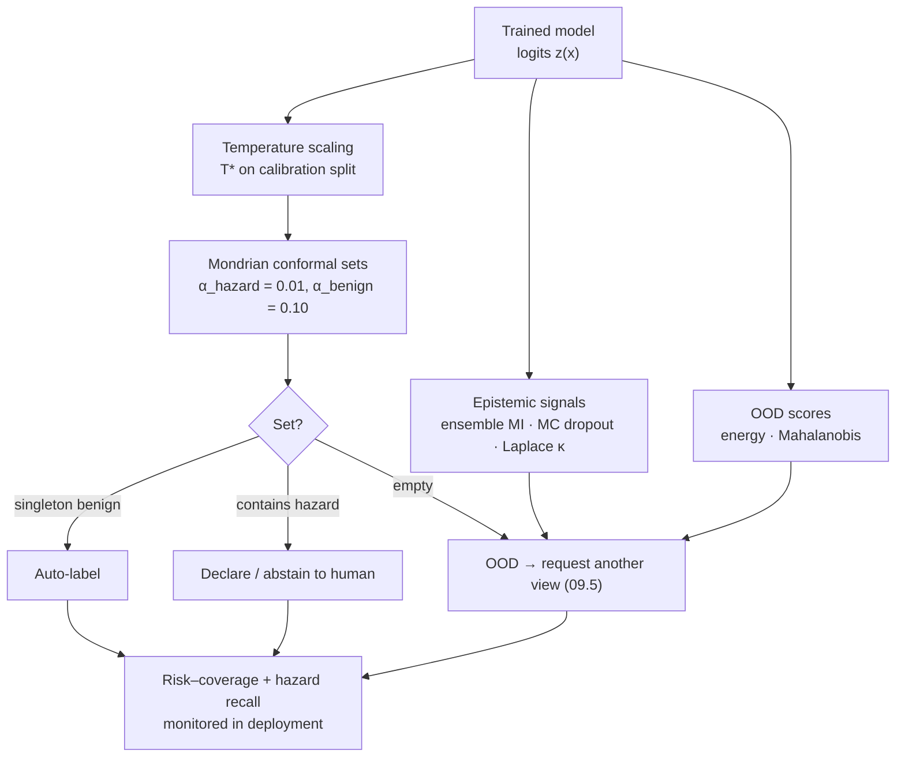

# 09.2 · Uncertainty-aware ML: calibration, ensembles, conformal prediction and abstention

<div class="module-card">

**Prerequisites** [09.1 Perception tasks](lessons/stage-09/lesson-01.md) (cost-weighted thresholds, recall at fixed FAR) · [05.1 Detection theory](lessons/stage-05/lesson-01.md) · [05.6 Sensor fusion](lessons/stage-05/lesson-06.md) (Bayesian updating) · probability (exchangeability, order statistics), information theory (entropy, mutual information).

**Estimated time** 8 h (4 h theory · 1 h simulator · 3 h programming) · **Level** Advanced → Expert

**Next** [09.3 Synthetic data & sim-to-real](lessons/stage-09/lesson-03.md), [09.5 Active perception](lessons/stage-09/lesson-05.md) (uses epistemic uncertainty to choose views) and [09.6 Trustworthy deployment](lessons/stage-09/lesson-06.md).

<p class="tags"><span>calibration</span><span>conformal prediction</span><span>Bayesian deep learning</span><span>selective prediction</span><span>OOD</span><span>Sim C</span><span>P09 · P12</span></p>
</div>

## Why this matters

In 09.1 the decision rule was "declare if $p > p^*$", with $p^*$ as small as $10^{-3}$. That rule
assumes $p$ is a probability. Modern networks trained with cross-entropy are typically
*over-confident*: when they say 0.99 they are right perhaps 95 % of the time, and on inputs unlike
their training data they can be confidently wrong. In EOD the people consuming model outputs —
an operator at a robot control unit, a survey team leader prioritising lanes — will calibrate
their trust to the displayed number. A miscalibrated "97 % benign" on a hazard is the worst
output a system can produce.

This lesson gives three layers of defence, in increasing strength of guarantee:

1. **Calibration** — make the numbers mean what they say, on average, in-distribution.
2. **Epistemic uncertainty** — know *when the model does not know* (ensembles, MC dropout,
   Bayesian last layers, OOD scores), so the system can ask for another view, another sensor, or
   a human.
3. **Conformal prediction** — distribution-free prediction *sets* with a finite-sample coverage
   guarantee, which can be made class-conditional so that the hazard class specifically is
   covered with probability ≥ 99 %.

All three meet in **selective prediction**: the system answers when it is safe to and abstains
otherwise, with a measurable risk–coverage trade-off. That is the core of
[P12](projects/p12-hitl-decision/README.md).

## Learning objectives

1. Decompose predictive uncertainty into aleatoric and epistemic parts via entropy and mutual
   information, and compute both for an ensemble.
2. Compute ECE and read a reliability diagram; derive the temperature-scaling optimality condition
   and implement it from scratch.
3. Compare deep ensembles, MC dropout and a Laplace (Bayesian) last layer in cost, quality and
   failure modes.
4. State and prove (sketch) the split-conformal coverage theorem; construct LAC, APS and RAPS
   sets.
5. Show, with a numerical experiment, that marginal coverage can hide catastrophic coverage on a
   rare class, and fix it with class-conditional (Mondrian) conformal prediction with asymmetric
   error budgets — including the minimum calibration-set size this requires.
6. Build risk–coverage curves and choose an abstention policy; evaluate OOD detectors with
   AUROC and FPR at 95 % TPR.

## Theory

### 1. Aleatoric vs epistemic uncertainty

**Aleatoric** uncertainty is noise in the world given the input: a thermal image taken at the
diurnal crossover genuinely carries no contrast; more training data will not fix it.
**Epistemic** uncertainty is ignorance in the model: the input is unlike anything in training, or
the training set was too small to pin down the parameters. More data (or another view) *does*
reduce it — which is why it drives active perception in 09.5.

With a distribution over models $p(\theta\mid\mathcal D)$ (approximated by an ensemble or by MC
samples $\theta_1,\dots,\theta_M$) the total predictive entropy splits exactly:

<div class="callout eq">

$$
\underbrace{\mathcal H\!\left[\bar p(y\mid x)\right]}_{\text{total}}
= \underbrace{\mathbb E_{\theta}\,\mathcal H\!\left[p(y\mid x,\theta)\right]}_{\text{aleatoric (expected entropy)}}
+ \underbrace{\mathcal I\!\left(y;\theta\mid x,\mathcal D\right)}_{\text{epistemic (mutual information)}},
\qquad \bar p = \mathbb E_\theta\, p(y\mid x,\theta).
$$

</div>

| Symbol | Meaning | Unit |
|---|---|---|
| $\mathcal H[p] = -\sum_y p(y)\ln p(y)$ | entropy | nats |
| $\bar p$ | model-averaged predictive distribution | — |
| $\mathcal I$ | mutual information between label and parameters ("BALD") | nats |
| $M$ | number of ensemble members / MC samples | — |

**Intuition.** If every member says "50/50", the input is intrinsically ambiguous (aleatoric,
MI = 0). If members disagree confidently — one says 0.9, another 0.1 — the *average* is 50/50 but
the cause is ignorance (high MI).

**Numerical example.** Binary, three members:

| Members | $\bar p$ | Total $\mathcal H$ | Expected $\mathcal H$ | MI |
|---|---|---|---|---|
| 0.9, 0.5, 0.1 | 0.50 | 0.693 | 0.448 | **0.245** |
| 0.5, 0.5, 0.5 | 0.50 | 0.693 | 0.693 | 0 |
| 0.95, 0.90, 0.97 | 0.94 | 0.227 | 0.219 | 0.008 |

```python
import numpy as np

def entropy(p, axis=-1):
    p = np.clip(p, 1e-12, 1)
    return -(p * np.log(p)).sum(axis)

def decompose(member_probs: np.ndarray):
    """member_probs: (M, K) class probabilities from M models for one input."""
    total = entropy(member_probs.mean(0))
    aleatoric = entropy(member_probs).mean()
    return total, aleatoric, total - aleatoric

print(decompose(np.array([[0.9, 0.1], [0.5, 0.5], [0.1, 0.9]])))   # (0.693, 0.448, 0.245)
```

<details class="answer"><summary>Exercise 1 — then reveal</summary>

Prove that MI ≥ 0 in this decomposition, and state when it equals zero. Why does this make MI
(rather than total entropy) the right trigger for "move the robot camera and look again"?

*Answer.* Entropy is concave, so by Jensen $\mathcal H[\mathbb E_\theta p] \ge \mathbb E_\theta
\mathcal H[p]$; equality iff all members give the same distribution. A new view reduces
uncertainty only if it can resolve *disagreement between plausible models*; ambiguity shared by
all models (e.g. zero thermal contrast) will persist in any view of the same kind. MI measures
the expected information gain about $\theta$ from observing $y$ — exactly the quantity maximised
by BALD-style active learning and by next-best-view selection (09.5).

</details>

### 2. Calibration and its measurement

A classifier is **calibrated** if $P(Y=\hat Y\mid \hat P = c) = c$ for all $c$, where $\hat P$ is
the reported confidence. Estimate the gap by binning confidences into $B$ bins:

<div class="callout eq">

$$
\mathrm{ECE} = \sum_{b=1}^{B}\frac{|S_b|}{n}\,\big|\mathrm{acc}(S_b) - \mathrm{conf}(S_b)\big| .
$$

</div>

| Symbol | Meaning |
|---|---|
| $S_b$ | samples whose confidence falls in bin $b$ |
| $\mathrm{acc}(S_b)$ | fraction correct in the bin |
| $\mathrm{conf}(S_b)$ | mean confidence in the bin |
| $n$ | number of evaluation samples |

A **reliability diagram** plots $\mathrm{acc}(S_b)$ against $\mathrm{conf}(S_b)$; the diagonal
is perfect calibration, points below it are over-confidence.

**Numerical example.** Three occupied bins: (conf 0.95, acc 0.80, 300 samples), (0.75, 0.70,
500), (0.55, 0.56, 200). ECE $=0.3\cdot0.15+0.5\cdot0.05+0.2\cdot0.01=0.072$. The high-confidence
bin contributes most — the typical over-confidence signature.

<div class="callout key">

**ECE is a weak metric for safety.** (i) It measures *top-label* calibration only; the hazard
class can be badly calibrated while ECE is small because hazards are 3 % of the data. Use
*class-wise* ECE or reliability diagrams for $P(y=\text{hazard})$ directly. (ii) It is biased and
bin-dependent; report NLL and Brier score (proper scoring rules) alongside. (iii) It says nothing
about out-of-distribution inputs.

</div>

<details class="answer"><summary>Exercise 2 — then reveal</summary>

Construct a trivial classifier with ECE = 0 that is useless, and explain why NLL would expose it.

*Answer.* Always predict the class priors, e.g. confidence 0.80 for "clutter" on every input
when 80 % of inputs are clutter: top-label accuracy in the single occupied bin is 0.80 = conf, so
ECE = 0. NLL equals the prior entropy (no discrimination); any informative model beats it. ECE
measures consistency, not resolution — proper scoring rules reward both (Brier = calibration −
resolution + uncertainty decomposition).

</details>

### 3. Temperature scaling

Guo et al. (2017) showed that a single scalar $T>0$, fitted after training on a held-out
calibration set, removes most of the miscalibration of modern networks:

<div class="callout eq">

$$
\hat p_k(x) = \frac{\exp(z_k/T)}{\sum_j \exp(z_j/T)},\qquad
T^* = \arg\min_T \; \mathrm{NLL}(T) = \arg\min_T\;\frac1n\sum_{i=1}^n\Big[-\frac{z_{i,y_i}}{T} + \log\sum_j e^{z_{ij}/T}\Big].
$$

</div>

| Symbol | Meaning |
|---|---|
| $z_{ij}$ | logit of class $j$ for calibration sample $i$ |
| $T$ | temperature ($T>1$ softens, $T<1$ sharpens) |

**Properties.** (i) Dividing all logits by $T$ does not change the argmax: accuracy is untouched.
(ii) With $\beta=1/T$, $\mathrm{NLL}$ is convex in $\beta$ (log-sum-exp is convex, the other term
linear), so the optimum is unique. (iii) Setting $d\,\mathrm{NLL}/d\beta=0$ gives the
**optimality condition**

$$
\frac1n\sum_i z_{i,y_i} \;=\; \frac1n\sum_i \sum_j \hat p_j(x_i)\,z_{ij},
$$

i.e. the average logit of the true class must equal the average logit *expected under the model*.
An over-confident model puts too much mass on high logits, so $T$ must rise until the two
match.

**Numerical example.** Logits $(4,1,0)$: at $T=1$ the top probability is 0.936; at $T=2$ it is
0.736; at $T=2.594$ (the value fitted in the lab below) it is 0.654.

<details class="answer"><summary>Exercise 3 — derive, then reveal</summary>

Derive the optimality condition above. Then explain why temperature scaling fitted on data from
site A may *increase* over-confidence at site B.

*Sketch.* $\mathrm{NLL}(\beta)=\frac1n\sum_i[-\beta z_{i,y_i}+\log\sum_j e^{\beta z_{ij}}]$;
$\partial_\beta\log\sum_j e^{\beta z_{ij}} = \sum_j \hat p_j z_{ij}$, so the derivative is
$\frac1n\sum_i[-z_{i,y_i}+\sum_j\hat p_jz_{ij}]$; set to zero. ∎ At site B accuracy falls (domain
shift) but logit magnitudes need not; $T$ was tuned for site-A accuracy, so confidences stay high
while accuracy drops. Calibration is a property of a model *and a distribution*. Re-calibrate on
labelled data from each deployment condition, or use shift-aware methods (Expert extension).

</details>

### 4. Epistemic methods: ensembles, MC dropout, Bayesian last layer

| Method | How | Cost at inference | Strengths | Weaknesses |
|---|---|---|---|---|
| **Deep ensembles** (Lakshminarayanan et al., 2017) | train $M\approx5$ networks from different random inits (optionally adversarial training), average probabilities | $M\times$ | best practical accuracy + calibration + OOD baseline; embarrassingly parallel | $M\times$ training and memory; members can share blind spots (same data, same architecture) |
| **MC dropout** (Gal & Ghahramani, 2016) | keep dropout on at test time, average $T$ stochastic passes; approximates variational inference | $T\times$ passes | free if the network already uses dropout | underestimates uncertainty; quality depends on dropout rate and placement |
| **Bayesian last layer / Laplace** | freeze features $\phi(x)$; Gaussian posterior $\mathcal N(\mu,\Sigma)$ over last-layer weights (Laplace at the MAP, or exact for linear-Gaussian) | ≈ 1× | cheap, post-hoc, analytic predictive | uncertainty only in the head; features may already have collapsed OOD inputs onto in-distribution ones |

For a binary Bayesian last layer, the logit $a=w^\top\phi(x)$ is Gaussian with mean
$\mu_a=\mu^\top\phi$ and variance $\sigma_a^2=\phi^\top\Sigma\phi$, and the predictive probability
is well approximated by the **probit approximation**:

<div class="callout eq">

$$
p(y=1\mid x) = \int \sigma(a)\,\mathcal N(a;\mu_a,\sigma_a^2)\,da \;\approx\; \sigma\!\big(\kappa(\sigma_a^2)\,\mu_a\big),\qquad
\kappa(\sigma^2) = \Big(1+\frac{\pi\sigma^2}{8}\Big)^{-1/2}.
$$

</div>

| Symbol | Meaning |
|---|---|
| $\sigma(\cdot)$ | logistic sigmoid |
| $\mu_a, \sigma_a^2$ | mean and variance of the logit under the weight posterior |
| $\kappa$ | shrinkage factor ∈ (0, 1] |

**Intuition.** Parameter uncertainty pulls the prediction toward 0.5 — more strongly the more
uncertain the logit. A point estimate ignores this and is over-confident exactly where the model
has seen little data.

**Numerical example.** $\mu_a=2$, $\sigma_a^2=4$: $\kappa=(1+\pi/2)^{-1/2}=0.624$, so
$p\approx\sigma(1.247)=0.777$ versus the plug-in $\sigma(2)=0.881$. Monte Carlo with $10^6$ samples
gives 0.775 — the approximation is good to 0.002.

```python
def probit_predictive(mu_a: np.ndarray, var_a: np.ndarray) -> np.ndarray:
    kappa = 1.0 / np.sqrt(1.0 + np.pi * var_a / 8.0)
    return 1.0 / (1.0 + np.exp(-kappa * mu_a))

print(probit_predictive(np.array(2.0), np.array(4.0)))   # 0.777
```

<details class="answer"><summary>Exercise 4 — then reveal</summary>

Five ensemble members are trained on the same 800 drone tiles from one site. On tiles from a new
site their mutual information is low, but accuracy has dropped from 0.93 to 0.71. How is that
possible, and what would you change?

*Answer.* Members share data, architecture and augmentation, so they share *systematic* errors:
they agree (low MI) while all being wrong. Ensembles capture uncertainty *consistent with the
training distribution's degrees of freedom*, not unknown unknowns. Remedies: diversity (different
architectures, pretraining, augmentations, bootstrap resampling of sites), explicit OOD scoring
on features (Section 7), and — the only real guarantee — labelled validation data from the new
site with conformal recalibration.

</details>

### 5. Conformal prediction

Calibration and Bayesian methods rely on the model being approximately right. **Conformal
prediction** (Angelopoulos & Bates, 2021) wraps *any* model and gives a guarantee that depends
only on **exchangeability** of calibration and test data.

**Split conformal (classification).**

1. Choose a *non-conformity score* $s(x,y)$ — large when $y$ looks wrong for $x$. The simplest
   (LAC): $s(x,y)=1-\hat p_y(x)$.
2. On $n$ held-out calibration points compute $s_i = s(x_i,y_i)$.
3. Let $\hat q$ be the $k$-th smallest $s_i$ with $k=\lceil (n+1)(1-\alpha)\rceil$ ($\hat
   q=+\infty$ if $k>n$).
4. For a new $x$, output the set $\mathcal C(x)=\{y: s(x,y)\le\hat q\}$.

<div class="callout eq">

**Theorem (marginal coverage).** If $(x_1,y_1),\dots,(x_n,y_n),(x_{n+1},y_{n+1})$ are
exchangeable and scores are almost surely distinct, then

$$
1-\alpha \;\le\; P\big(y_{n+1}\in\mathcal C(x_{n+1})\big) \;\le\; 1-\alpha+\frac{1}{n+1}.
$$

</div>

**Proof sketch.** By exchangeability, the rank $R$ of $s_{n+1}$ among $s_1,\dots,s_{n+1}$ is
uniform on $\{1,\dots,n+1\}$. The event $y_{n+1}\in\mathcal C(x_{n+1})$ is $s_{n+1}\le\hat q$,
which (distinct scores) is exactly $R\le k$. Hence the probability is $k/(n+1)$. Since
$(n+1)(1-\alpha)\le k<(n+1)(1-\alpha)+1$, dividing by $n+1$ gives both bounds. ∎ Note the
probability is over the draw of *both* calibration and test data; conditional on a fixed
calibration set, coverage is Beta-distributed around $1-\alpha$ with spread $\sim\sqrt{\alpha(1-\alpha)/n}$.

| Symbol | Meaning |
|---|---|
| $\alpha$ | target miscoverage (error budget) |
| $n$ | calibration-set size |
| $\hat q$ | conformal quantile of calibration scores |
| $\mathcal C(x)$ | prediction set; its *size* is the uncertainty signal |

**Numerical example.** $n=500$, $\alpha=0.1$: $k=\lceil 501\cdot0.9\rceil=\lceil450.9\rceil=451$,
so $\hat q$ is the 451st smallest score; coverage lies in $[0.900, 0.902]$. With $n=1000$:
$k=901$.

**Better scores.** LAC gives the smallest average sets but under-covers hard inputs and
over-covers easy ones. **APS** (adaptive prediction sets) uses the cumulative mass of classes
ranked above and including the true one, $s(x,y)=\sum_{j:\hat p_j\ge\hat p_y}\hat p_j$
(randomised at the boundary), so sets grow on ambiguous inputs. **RAPS** adds a penalty
$\lambda\,(\mathrm{rank}(y)-k_{\text{reg}})^+$ that discourages long tails of implausible labels —
useful with many classes (e.g. 21 item types in AMLID) where APS sets bloat.

#### 5.1 Marginal coverage can hide the class you care about

The guarantee is *marginal*: averaged over all inputs. When 97 % of inputs are clutter or
benign debris, the rare hazard class can be under-covered while the average looks perfect. The
lab below (Section 8) shows exactly this on synthetic data: at $\alpha=0.1$, marginal coverage is
0.904 but coverage **on the hazard-like class is 0.318**.

**Class-conditional (Mondrian) conformal** calibrates a separate threshold per class using only
calibration points of that class, with its own budget $\alpha_k$:

<div class="callout eq">

$$
\hat q_k = \text{the } \lceil (n_k+1)(1-\alpha_k)\rceil\text{-th smallest of } \{s_i : y_i = k\},\qquad
\mathcal C(x) = \{k : s(x,k)\le\hat q_k\},
$$

$$
\Rightarrow\quad P\big(y\in\mathcal C(x)\,\big|\,y=k\big)\ge 1-\alpha_k \quad\text{for every } k .
$$

</div>

The proof is the same rank argument applied within each class. **Asymmetric risk** is now
expressible directly: $\alpha_{\text{hazard}}=0.01$, $\alpha_{\text{benign}}=0.10$ — "the hazard
label is in the set for at least 99 % of hazards". The price is larger sets for everything else:
benign inputs that look even slightly hazard-like get $\{\text{benign},\text{hazard}\}$, i.e. a
flag for a human.

**Minimum calibration size.** $\hat q_k<\infty$ requires $\lceil(n_k+1)(1-\alpha_k)\rceil\le n_k$,
i.e. $n_k \ge (1-\alpha_k)/\alpha_k$. For $\alpha_k=0.01$: $n_k\ge 99$ hazard examples *in the
calibration set alone*. With fewer, $\hat q_k=+\infty$ and the hazard label is included in every
set — valid but uninformative. **Numerical example:** with $n_k=23$ (the lab's 1,000-point
calibration set at 3 % prevalence), $k=\lceil 24\cdot0.99\rceil=24>23$, so every set contains the
hazard class; with $n_k=137$ the threshold is finite and 75 % of test sets contain it.

```python
def conformal_threshold(scores: np.ndarray, alpha: float) -> float:
    n = len(scores)
    k = int(np.ceil((n + 1) * (1 - alpha)))
    return np.inf if k > n else float(np.sort(scores)[k - 1])

def min_class_calibration(alpha_k: float) -> int:
    return int(np.ceil((1 - alpha_k) / alpha_k))

print(min_class_calibration(0.01), min_class_calibration(0.05))   # 99 19
```

<details class="answer"><summary>Exercise 5 — then reveal</summary>

(a) An anomaly model (09.1) is to flag at most 2 % of *benign* radiographs. How do you set its
threshold with a guarantee, and how many benign calibration scans are needed at minimum?
(b) Why is exchangeability violated if the calibration scans come from the same week's traffic
as the training scans but deployment is at a different checkpoint?

*Answer.* (a) One-class conformal: the threshold is the $\lceil(n+1)(0.98)\rceil$-th smallest
anomaly score on benign calibration scans; then for a new benign scan $P(s>\hat q)\le0.02$.
Finite threshold needs $n\ge 0.98/0.02=49$; in practice use hundreds so the realised false-flag
rate concentrates near 2 %. (b) Different checkpoint → different bag mix, clutter, machine,
operators: a covariate shift. The guarantee holds for the calibration distribution only;
re-calibrate on local benign data (cheap: no expert labels needed for benign traffic if
confirmed by normal processing), or use weighted conformal methods.

</details>

### 6. Selective prediction and abstention

A **selective classifier** $(f,g)$ predicts $f(x)$ when $g(x)=1$ and abstains otherwise. With
confidence score $\kappa(x)$ and threshold $\tau$, $g(x)=\mathbb 1[\kappa(x)\ge\tau]$:

<div class="callout eq">

$$
\text{coverage}(\tau)=P(\kappa\ge\tau),\qquad
\text{risk}(\tau)=\frac{E\big[\ell(f(x),y)\,\mathbb 1[\kappa\ge\tau]\big]}{\text{coverage}(\tau)},\qquad
\mathrm{AURC}=\int_0^1 \text{risk}\,d(\text{coverage}).
$$

</div>

| Symbol | Meaning |
|---|---|
| $\kappa(x)$ | confidence / uncertainty score used for ranking (max prob, −MI, −set size, …) |
| coverage | fraction of inputs the system answers |
| risk | error rate on answered inputs (selective risk) |
| AURC | area under the risk–coverage curve (lower is better) |

**Chow's rule.** If abstaining costs $d$ (in units of an error's cost), the Bayes-optimal
selective classifier abstains iff $\max_y p(y\mid x) < 1-d$. With $d=0.1$ (a human review costs a
tenth of a wrong automated call), answer only when $\max_y p\ge0.9$ — which requires calibrated
$p$ again.

**Numerical example (lab below).** Calibrated model, 20,000 test points: risk 0.122 at full
coverage; 0.087 at 90 %; 0.058 at 80 %; 0.025 at 60 %; AURC 0.030. Abstaining on the least
confident 20 % halves the error rate.

**EOD caveat.** Selective *accuracy* is the wrong objective when errors are asymmetric: a
selective classifier can reach low risk by confidently answering "clutter" and abstaining on
ambiguous cases, while the rare hazards it confidently mislabels are few in number and barely
move the average. Measure **selective hazard recall** separately, and prefer abstention rules
built from class-conditional conformal sets ("abstain unless the set is a singleton *and*
excludes the hazard class only when the hazard threshold allows it").

<details class="answer"><summary>Exercise 6 — then reveal</summary>

Design an abstention policy for a robot-mounted classifier with three outputs
{clutter, benign debris, hazard-like} using Mondrian sets. Map each possible set to an action.

*Answer.* $\{\text{clutter}\}$ or $\{\text{debris}\}$ → auto-label, continue; $\{\text{hazard}\}$
→ declare, alert operator; any set containing hazard plus something else → abstain to human with
the set shown ("cannot exclude hazard"); $\{\text{clutter},\text{debris}\}$ → auto-label as
"benign, type uncertain" (no safety consequence); empty set (possible with Mondrian thresholds)
→ treat as OOD, abstain and request another view (09.5). The hazard class's $\alpha_k$ bounds the
rate of hazards that reach an auto-benign action.

</details>

### 7. Out-of-distribution detection

OOD inputs are those far from the training distribution: a new item type, a new sensor, a lens
covered in mud. Common scores, from cheapest:

| Score | Definition | Note |
|---|---|---|
| MSP | $-\max_k \hat p_k$ | baseline; softmax saturates far from data |
| Energy | $E(x)=-T\log\sum_k e^{f_k(x)/T}$ (higher ⇒ more OOD) | uses logit magnitudes, not just ratios; no retraining |
| Mahalanobis on features | class-conditional Gaussian distance (09.1 §5) | strong for far-OOD, weaker for near-OOD |
| Ensemble MI | Section 1 | captures model disagreement |
| Conformal set size / empty set | Section 5 | interpretable to operators |

**Numerical example (energy, $T=1$).** Logits $(6,1,0)$: $E=-\log(e^6+e^1+e^0)=-6.009$. Logits
$(1,0.9,0.8)$: $E=-2.002$. The second input has higher energy — weaker evidence for *any* class —
and is ranked more OOD; MSP (0.37 vs 0.99) agrees here. Energy separates cases where MSP ties:
logits $(6,5,5)$ and $(1,0,0)$ have *identical* MSP (0.576) but energies $-6.55$ and $-1.55$ — the
second input excites no class strongly, the typical signature of an unfamiliar input.

```python
def energy_score(logits: np.ndarray, T: float = 1.0) -> np.ndarray:
    m = logits.max(-1, keepdims=True)
    return -T * (np.log(np.exp((logits - m) / T).sum(-1)) + m.squeeze(-1) / T)

print(energy_score(np.array([[6., 1, 0], [1, 0.9, 0.8]])))   # [-6.009 -2.002]
```

Evaluate OOD detectors with **AUROC** and **FPR at 95 % TPR** on *realistic* OOD sets: the hard
case in EOD is **near-OOD** (same scene type, different soil or item wear), not "CIFAR vs SVHN".

<details class="answer"><summary>Exercise 7 — then reveal</summary>

Why can no OOD detector trained only on in-distribution data be guaranteed to catch all OOD
inputs, and what does that imply for system design?

*Answer.* OOD is defined relative to an unknown, unbounded set of alternatives; any score is a
function of features, and features learned for the in-distribution task may map a novel input
onto an in-distribution region (feature collapse). There is no distribution-free guarantee for
*detecting* OOD, only for *covering* in-distribution data (conformal). System design must
therefore include independent layers — sensor diversity (05.6), human review of flagged and
sampled cases, drift monitoring on score distributions — rather than rely on one OOD score.

</details>

### 8. Lab: temperature scaling and split/Mondrian conformal from scratch

The script below builds a fictional three-class problem — 0 *clutter* (80 %), 1 *benign debris*
(17 %), 2 *hazard-like target* (3 %) — with 2-D Gaussian features. To mimic an over-trained
network it multiplies the Bayes-optimal logits by 2.5 and adds noise (right ranking, wrong
confidence). Everything else is plain NumPy.

```python
import numpy as np

rng = np.random.default_rng(7)
K = 3                       # 0 clutter, 1 benign debris, 2 hazard-like target (fictional)
PRIOR = np.array([0.80, 0.17, 0.03])
MU = np.array([[0.0, 0.0], [1.6, 0.4], [1.2, 1.6]])
SIG = 0.8

def sample(n):
    y = rng.choice(K, size=n, p=PRIOR)
    x = MU[y] + SIG * rng.standard_normal((n, 2))
    return x, y

def bayes_logits(x):
    d2 = ((x[:, None, :] - MU[None]) ** 2).sum(-1)
    return -d2 / (2 * SIG**2) + np.log(PRIOR)

def softmax(z):
    z = z - z.max(1, keepdims=True)
    e = np.exp(z)
    return e / e.sum(1, keepdims=True)

def overconfident_model(x):
    """Stand-in for an over-trained network: right ranking, logits ~2.5x too large."""
    z = bayes_logits(x)
    return 2.5 * z + 0.3 * rng.standard_normal(z.shape)

def nll(z, y, T):
    p = softmax(z / T)
    return -np.mean(np.log(p[np.arange(len(y)), y] + 1e-12))

def fit_temperature(z, y, lo=0.05, hi=20.0, iters=80):
    """Golden-section search on log T (NLL is unimodal in T for fixed logits)."""
    g = (np.sqrt(5) - 1) / 2
    a, b = np.log(lo), np.log(hi)
    c, d = b - g * (b - a), a + g * (b - a)
    for _ in range(iters):
        if nll(z, y, np.exp(c)) < nll(z, y, np.exp(d)):
            b = d
        else:
            a = c
        c, d = b - g * (b - a), a + g * (b - a)
    return float(np.exp((a + b) / 2))

def ece(p, y, n_bins=15):
    conf = p.max(1); pred = p.argmax(1); acc = (pred == y).astype(float)
    edges = np.linspace(0, 1, n_bins + 1)
    e = 0.0
    for lo, hi in zip(edges[:-1], edges[1:]):
        m = (conf > lo) & (conf <= hi)
        if m.any():
            e += m.mean() * abs(acc[m].mean() - conf[m].mean())
    return e

def conformal_threshold(scores, alpha):
    n = len(scores)
    k = int(np.ceil((n + 1) * (1 - alpha)))
    if k > n:
        return np.inf
    return np.sort(scores)[k - 1]

x_cal, y_cal = sample(1000)
x_te, y_te = sample(20000)
z_cal, z_te = overconfident_model(x_cal), overconfident_model(x_te)

T = fit_temperature(z_cal, y_cal)
p_raw, p_ts = softmax(z_te), softmax(z_te / T)
print(f"T* = {T:.3f}")
print(f"NLL raw {nll(z_te, y_te, 1.0):.4f}  scaled {nll(z_te, y_te, T):.4f}")
print(f"ECE raw {ece(p_raw, y_te):.4f}  scaled {ece(p_ts, y_te):.4f}")
print(f"accuracy {np.mean(p_ts.argmax(1) == y_te):.4f} (unchanged by T)")

alpha = 0.10
p_cal = softmax(z_cal / T)
s_cal = 1 - p_cal[np.arange(len(y_cal)), y_cal]
qhat = conformal_threshold(s_cal, alpha)
sets = (1 - p_ts) <= qhat
cov = sets[np.arange(len(y_te)), y_te].mean()
print(f"marginal: qhat {qhat:.4f} coverage {cov:.4f} mean size {sets.sum(1).mean():.3f}")
for k in range(K):
    m = y_te == k
    print(f"   class {k}: coverage {sets[m, k].mean():.4f}")

alphas = np.array([0.10, 0.10, 0.01])
qk = np.array([conformal_threshold(s_cal[y_cal == k], alphas[k]) for k in range(K)])
print("n_cal per class", np.bincount(y_cal, minlength=K), "qhat_k", qk)
sets_m = (1 - p_ts) <= qk[None, :]
for k in range(K):
    m = y_te == k
    print(f"   mondrian class {k}: coverage {sets_m[m, k].mean():.4f}")
print(f"mondrian mean size {sets_m.sum(1).mean():.3f}; frac sets containing class 2 {sets_m[:,2].mean():.3f}")

# selective prediction: abstain on the least confident fraction
conf = p_ts.max(1); err = (p_ts.argmax(1) != y_te).astype(float)
order = np.argsort(-conf)
cum_risk = np.cumsum(err[order]) / np.arange(1, len(err) + 1)
for c in (1.0, 0.9, 0.8, 0.6):
    i = int(c * len(err)) - 1
    print(f"coverage {c:.1f}: selective risk {cum_risk[i]:.4f}")
print(f"AURC {cum_risk.mean():.4f}")
m = y_te == 2
print(f"hazard recall of argmax {np.mean(p_ts[m].argmax(1) == 2):.3f}")
```

Output (NumPy 2.x, seed 7):

```text
T* = 2.594
NLL raw 0.4829  scaled 0.3199
ECE raw 0.0772  scaled 0.0081
accuracy 0.8785 (unchanged by T)
marginal: qhat 0.6303 coverage 0.9036 mean size 1.065
   class 0: coverage 0.9764
   class 1: coverage 0.6740
   class 2: coverage 0.3180
n_cal per class [803 174  23] qhat_k [0.31080429 0.9289819         inf]
   mondrian class 0: coverage 0.9026
   mondrian class 1: coverage 0.9402
   mondrian class 2: coverage 1.0000
mondrian mean size 2.202; frac sets containing class 2 1.000
coverage 1.0: selective risk 0.1215
coverage 0.9: selective risk 0.0873
coverage 0.8: selective risk 0.0581
coverage 0.6: selective risk 0.0254
AURC 0.0301
hazard recall of argmax 0.273
```

**Read the output.** (1) Temperature scaling found $T^*\approx2.6$ (the true inflation was 2.5),
cut ECE ten-fold and NLL by a third, and left accuracy unchanged. (2) Marginal conformal met its
promise — 0.904 coverage — while covering only **32 % of hazard-like items**; the argmax
classifier finds just 27 % of them. (3) Mondrian with $\alpha_2=0.01$ had only 23 hazard
calibration points (< 99), so $\hat q_2=\infty$: every set contains "hazard" and every input goes
to a human. Re-running with a 5,000-point calibration set (137 hazard examples) gives a finite
$\hat q_2=0.9996$, hazard coverage 0.998, and 75 % of sets containing the hazard label — still
expensive, but now informative. The bottleneck is **labelled rare-class calibration data**, which
is exactly what 09.3 tries to manufacture and why real-data validation remains non-negotiable.

## Visual explanation



Sim C fuses noisy sensors with Bayes' rule. Ignoring correlation between sensors makes the fused
posterior *over-confident* — the same pathology temperature scaling corrects for a network.

<iframe class="sim-frame" src="sims/sensor-fusion/index.html?embed=1" height="720" loading="lazy"></iframe>

<a class="sim-link" href="sims/sensor-fusion/index.html" target="_blank">Open Sim C full-screen ↗</a>

## Worked example — from a raw classifier to an operator-facing output

A fictional robot-arm camera classifier labels close-up views of items on a search lane as
clutter, benign debris or hazard-like. The deployment requirement from the programme's safety
case: *no more than 1 % of hazard-like items may be auto-labelled benign*; operators can review
at most 30 % of items.

1. **Calibrate.** Temperature scaling on 1,000 held-out views: $T^*=2.59$, ECE 0.077 → 0.008.
   The display now shows meaningful probabilities.
2. **Check the rare class.** Argmax hazard recall is 0.27; marginal 90 % conformal sets cover
   only 32 % of hazards. Neither meets the requirement; marginal guarantees are the wrong tool.
3. **Mondrian sets** with $\alpha_{\text{hazard}}=0.01$: the requirement maps exactly to
   $P(\text{hazard}\in\mathcal C\mid\text{hazard})\ge0.99$. With 23 hazard calibration items the
   threshold is infinite → 100 % review. Infeasible (> 30 %).
4. **Data plan.** Need ≥ 99 hazard-like calibration examples; with 137 the lab shows sets contain
   "hazard" for 75 % of inputs → still 75 % review. To get below 30 % the *model* must separate the
   classes better (more sensors — 09.4; another view — 09.5), not just the calibration layer.
5. **Conclusion recorded in the safety case.** The uncertainty layer turned an unsafe
   over-confident classifier into a safe but expensive one, and quantified precisely what is
   missing. That is the correct outcome: conformal methods cannot create separability; they make
   its absence visible.

## Simulation work

<div class="callout sim">

**Sim C.** (1) Fuse two sensors that are strongly correlated but configured as independent;
record the fused posterior on known-benign cases. (2) Treat the fused probability as a
"classifier output" and estimate by hand how far the posterior log-odds should be shrunk
(a temperature) to match the empirical frequency of hazards in your runs. (3) Now enable the
correlation-aware fusion and check whether the shrinkage is still needed. Relate your answer to
the optimality condition in Section 3.

</div>

## Practical exercises

<details class="answer"><summary>P1 · Coverage arithmetic — then reveal</summary>

You calibrate a 90 % split-conformal predictor on $n=19$ points. What is $k$, what are the
coverage bounds, and what happens with $n=8$?

*Answer.* $k=\lceil 20\cdot0.9\rceil=18$; coverage ∈ [0.90, 0.95]. With $n=8$:
$k=\lceil 8.1\rceil=9>8$ ⇒ $\hat q=\infty$; every set is the full label set (coverage 1, useless).
You need $n\ge (1-\alpha)/\alpha=9$.

</details>

<details class="answer"><summary>P2 · Which uncertainty? — then reveal</summary>

Classify each as mainly aleatoric or epistemic and name the right response: (a) LWIR image at
thermal crossover; (b) first images from a new drone camera model; (c) item half occluded by a
rock; (d) an item type absent from training.

*Answer.* (a) aleatoric for that modality at that time — change time or modality; (b) epistemic
(sensor shift) — re-calibrate/fine-tune on the new camera, monitor OOD scores; (c) aleatoric for
this view, epistemic resolvable by another view — next-best-view (09.5); (d) epistemic/open-set —
anomaly detection and human review; no amount of calibration fixes it.

</details>

<details class="answer"><summary>P3 · Reading a reliability diagram — then reveal</summary>

A reliability diagram for $P(\text{hazard})$ (not top-label) shows points *above* the diagonal
for predicted 0.01–0.1 (observed hazard frequency 3–5× higher). Why is this the most dangerous
region, and what fix preserves ranking?

*Answer.* It is where $p^*\approx10^{-3}$–$10^{-2}$ thresholds operate: under-estimated low
probabilities mean hazards are auto-cleared. A monotone recalibration of the hazard score (Platt
on the hazard logit, or isotonic regression) fitted on hazard-rich calibration data preserves
ranking; temperature scaling (one scalar for all classes) may not fix a class-specific error.

</details>

## Programming exercise — an uncertainty layer for P09/P12

**Goal.** Wrap the P09 detector's per-detection classifier with calibration, Mondrian conformal
sets and an abstention policy, and evaluate the operator workload vs residual-risk trade-off.

- **Input:** logits for calibration and test detections; true labels; per-class $\alpha_k$;
  review budget (fraction of detections a human can see).
- **Output:** fitted $T$ (and optionally per-class Platt parameters); sets; action per detection
  (auto / declare / human / OOD); report of per-class coverage, workload, hazard auto-clear rate
  with Clopper–Pearson interval.
- **Constraints:** NumPy only for the core (no conformal libraries); deterministic under seed;
  vectorised (≤ 1 s for $10^5$ detections); compute $k=\lceil (n+1)(1-\alpha)\rceil$ robustly
  against floating-point error (e.g. subtract $10^{-9}$ before the ceiling) so that exact integers
  are not rounded up.
- **Expected behaviour:** reproduces the Section 8 numbers with seed 7; hazard auto-clear rate
  ≤ $\alpha_{\text{hazard}}$ within sampling error; raises a clear error or warning when
  $n_k<(1-\alpha_k)/\alpha_k$.
- **Test cases:** (i) `conformal_threshold` on `np.arange(10)/10` with $\alpha=0.2$ returns 0.8
  ($k=\lceil 8.8\rceil=9$); (ii) coverage over 1,000 random calibration/test splits averages within
  $[1-\alpha, 1-\alpha+1/(n+1)]$ ± MC error; (iii) temperature fit recovers $T=2.5$ ± 0.2 on the
  lab data; (iv) accuracy invariant under $T$.
- **Extensions:** APS/RAPS scores and compare set sizes; weighted conformal under a known
  covariate shift; plug into the VOI-based "ask human / look again / decide" policy of
  [P12](projects/p12-hitl-decision/README.md); detection-level conformal (conformal risk control
  on false-negative rate per image).

Related projects: [P09](projects/p09-cv-detection/README.md) ·
[P12](projects/p12-hitl-decision/README.md).

## Reading

- Guo, C., Pleiss, G., Sun, Y., Weinberger, K. Q., *On Calibration of Modern Neural Networks*
  (ICML 2017), https://arxiv.org/abs/1706.04599 — §2–3 (ECE, why networks miscalibrate), §4.2
  (temperature scaling).
- Angelopoulos, A. N., Bates, S., *A Gentle Introduction to Conformal Prediction and
  Distribution-Free Uncertainty Quantification* (2021), https://arxiv.org/abs/2107.07511 — §1–2
  (split conformal, APS/RAPS), §4.1 (class-conditional), §5 (shift); code at
  https://github.com/aangelopoulos/conformal-prediction.
- Lakshminarayanan, B., Pritzel, A., Blundell, C., *Simple and Scalable Predictive Uncertainty
  Estimation using Deep Ensembles* (NIPS 2017), https://arxiv.org/abs/1612.01474 — §2–3 and the
  OOD experiments.
- Gal, Y., Ghahramani, Z., *Dropout as a Bayesian Approximation* (ICML 2016),
  https://arxiv.org/abs/1506.02142 — §3 (the variational interpretation); read critically.
- Parasuraman, R., Sheridan, T. B., Wickens, C. D., *A model for types and levels of human
  interaction with automation*, IEEE Trans. SMC-A 30(3) (2000), https://doi.org/10.1109/3468.844354
  — how abstention maps to levels of automation.

Full bibliographic entries: [curriculum/sources.md](curriculum/sources.md).

## Assessment

1. *(Conceptual)* A vendor claims "our model is calibrated (ECE 0.01), so its 99.9 % benign
   outputs can be auto-cleared". Give three independent reasons this does not follow.
2. *(Mathematical)* Show that for split conformal with $n$ calibration points, the probability
   that the prediction set is the full label set (uninformative) is 1 whenever
   $n<(1-\alpha)/\alpha$, and compute the threshold for $\alpha=0.005$.
3. *(Interpretation)* In the lab output, class 0 (clutter) is over-covered (0.976) under marginal
   conformal. Explain why over-coverage of the majority class and under-coverage of the minority
   class go together.
4. *(Computation)* Three MC-dropout passes give hazard probabilities 0.2, 0.6, 0.7. Compute total,
   aleatoric and epistemic uncertainty (nats).
5. *(Design)* Specify the monitoring you would run in deployment to detect that the conformal
   guarantee has stopped holding, without waiting for a missed hazard.

<details class="answer"><summary>Answers to 2 and 4</summary>

2. If $n<(1-\alpha)/\alpha$ then $(n+1)(1-\alpha) > n$, so $k>n$ and $\hat q=\infty$ with
   certainty. For $\alpha=0.005$: $n\ge 0.995/0.005=199$.
4. $\bar p=0.5$: total $=\ln 2=0.693$. Entropies: $H(0.2)=0.500$, $H(0.6)=0.673$,
   $H(0.7)=0.611$; mean 0.595 (aleatoric). MI $=0.693-0.595=0.098$ (epistemic).

</details>

## Expert extension

- **Conformal under shift.** Weighted conformal prediction (likelihood-ratio weights between
  calibration and test covariates) restores coverage under known covariate shift; estimate the
  weights with a domain classifier (09.3) and study how the effective sample size collapses.
- **Conformal risk control / Learn-then-Test.** Control expected false-negative rate per image
  for detectors (not just set coverage) with finite-sample guarantees — directly applicable to
  "fraction of hazards missed per lane".
- **Training-time calibration.** Focal loss, label smoothing and mixup change calibration; compare
  post-hoc vs training-time methods on AMLID with flight-grouped splits.
- **Second-order methods.** Evidential deep learning and Dirichlet prior networks promise
  single-pass epistemic uncertainty; read the critiques and test whether they beat a 5-member
  ensemble on near-OOD soil shift.

## What comes next

[09.3](lessons/stage-09/lesson-03.md) attacks the bottleneck this lesson exposed — too few
labelled rare-class examples — with synthetic data, and shows how to measure whether synthetic
data transfers. [09.5](lessons/stage-09/lesson-05.md) turns the epistemic signals here into robot
behaviour (where to look next), and [09.6](lessons/stage-09/lesson-06.md) embeds the abstention
policy in a human-in-the-loop deployment.
