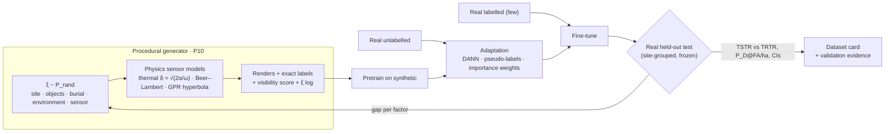

# 09.3 · Synthetic data & sim-to-real: generation, randomisation, adaptation and honest validation

<div class="module-card">

**Prerequisites** [09.1 Perception tasks](lessons/stage-09/lesson-01.md) (metrics, dataset leakage) · [09.2 Uncertainty-aware ML](lessons/stage-09/lesson-02.md) (calibration under shift, rare-class calibration) · [05.2 EMI & GPR](lessons/stage-05/lesson-02.md) · [05.3 Penetrating radiation](lessons/stage-05/lesson-03.md) · [05.5 Imaging & remote sensing](lessons/stage-05/lesson-05.md) · heat equation (01.2), PyTorch basics.

**Estimated time** 9 h (4 h theory · 1 h simulator · 4 h programming) · **Level** Advanced → Expert

**Next** [09.4 Multimodal sensing](lessons/stage-09/lesson-04.md) (registration of the modalities you learn to simulate here) and [09.6 Trustworthy deployment](lessons/stage-09/lesson-06.md) (test & evaluation).

<p class="tags"><span>synthetic data</span><span>domain randomisation</span><span>domain adaptation</span><span>sensor simulation</span><span>label noise</span><span>Sim H</span><span>P10</span></p>
</div>

## Why this matters

The central fact of EOD machine learning is that the positive class is scarce, restricted and
dangerous to collect. Real hazard imagery exists mostly as small sets of inert surrogates on test
lanes; field imagery of live items is collected incidentally, is rarely shareable, and is labelled
by a handful of experts. 09.2 ended with a concrete bottleneck: a class-conditional guarantee at
$\alpha=0.01$ needs ≥ 99 labelled hazard examples *just to calibrate*, before any training.

Synthetic data promises unlimited, perfectly labelled positives in any condition — any soil, any
time of day, any altitude, any burial depth. It also carries the most seductive failure mode in
applied ML: a model that scores 0.97 on synthetic test data and 0.5 in the field, and a team that
did not notice because every number they looked at was synthetic. This lesson treats synthetic
data as an engineering instrument with a measurable transfer function: how to generate it
(procedurally, with physics where physics is known), how to randomise what you cannot model, how
to adapt with little or no real labelled data, and — most importantly — how to prove on real data
that it worked.

<div class="callout safety">

**Content boundary.** All generated objects in this course are *fictional geometric objects*
(discs, cylinders, boxes with invented material parameters) standing in for "an item of
interest". The physics simulated is *detection* physics — heat conduction in soil, X-ray
attenuation, radar propagation — never anything about how an item functions.

</div>

## Learning objectives

1. State the Ben-David domain-adaptation bound, estimate its divergence term with a domain
   classifier (proxy A-distance), and explain why it motivates both randomisation and
   feature alignment.
2. Design a procedural scene generator with an explicit parameter distribution, and choose between
   photorealistic and randomised rendering for a given modality.
3. Derive and implement simple physics-based sensor models — diurnal thermal response of soil,
   Beer–Lambert X-ray transmission with photon noise, GPR hyperbolas — and identify which
   invariances they give that randomisation would have to guess.
4. Implement and critique domain adaptation: fine-tuning, DANN with gradient reversal,
   pseudo-labelling, and importance weighting (with effective sample size).
5. Measure the sim-to-real gap with TSTR/TRTR, feature distances (Fréchet, domain-classifier
   accuracy) and per-factor ablations, with confidence intervals.
6. Write a dataset card and a real-data validation protocol; quantify the effect of label noise on
   both training and measured metrics, using SULAND v2 as the case study.

## Theory

### 1. The formal problem: why source accuracy is not enough

Let $\mathcal S$ (source: synthetic) and $\mathcal T$ (target: real) be distributions over
inputs and labels, and $\varepsilon_{\mathcal S}(h)$, $\varepsilon_{\mathcal T}(h)$ the error of
hypothesis $h$ on each. Ben-David et al. (2010) proved, for a hypothesis class $\mathcal H$:

<div class="callout eq">

$$
\varepsilon_{\mathcal T}(h) \;\le\; \varepsilon_{\mathcal S}(h) \;+\; \tfrac12\, d_{\mathcal H\Delta\mathcal H}(\mathcal S_X,\mathcal T_X) \;+\; \lambda^{*},
\qquad \lambda^* = \min_{h'\in\mathcal H}\big[\varepsilon_{\mathcal S}(h')+\varepsilon_{\mathcal T}(h')\big].
$$

</div>

| Symbol | Meaning |
|---|---|
| $\varepsilon_{\mathcal S}, \varepsilon_{\mathcal T}$ | error on synthetic and real distributions |
| $d_{\mathcal H\Delta\mathcal H}$ | divergence between the *input* marginals as seen by classifiers in $\mathcal H$ (how well some pair of hypotheses can disagree on one domain but not the other) |
| $\lambda^*$ | error of the best joint hypothesis — small only if *one* model can do well on both domains |

**Intuition.** Real error is bounded by (synthetic error) + (how distinguishable the domains are
to your model class) + (whether the task is even the same in both domains). Randomisation and
feature alignment attack the middle term; getting the labels and physics right attacks
$\lambda^*$. If the synthetic labels mean something different from the real ones (e.g. synthetic
"positive" includes objects so deeply buried no sensor could see them), $\lambda^*$ is large and
nothing downstream can fix it.

**Estimating the divergence: proxy A-distance.** Train a classifier to tell synthetic from real
features; with held-out domain-classification error $\epsilon_d$,

$$
\hat d_{\mathcal A} = 2\,(1-2\epsilon_d)\in[0,2].
$$

**Numerical example.** A domain classifier separates synthetic from real LWIR tiles with 5 %
error: $\hat d_{\mathcal A}=2(1-0.1)=1.8$ — nearly maximal; your generator is trivially
recognisable. After adding randomisation, error rises to 40 %: $\hat d_{\mathcal A}=0.4$. At 50 %
(chance) it is 0. The bound itself is usually loose: with $\varepsilon_{\mathcal S}=0.05$,
$\tfrac12 d=0.3$, $\lambda^*=0.02$ the bound is 0.37 — informative as a *direction*, not a
prediction.

```python
import numpy as np

def proxy_a_distance(domain_clf_error: float) -> float:
    return 2.0 * (1.0 - 2.0 * domain_clf_error)

print([proxy_a_distance(e) for e in (0.05, 0.40, 0.50)])   # [1.8, 0.4, 0.0]
```

<details class="answer"><summary>Exercise 1 — then reveal</summary>

A domain classifier on *raw pixels* reaches 99 % accuracy, but one on your detector's
penultimate-layer features only 55 %. Which number matters for transfer, and what is the
remaining danger?

*Answer.* The divergence is defined relative to the hypothesis class that actually makes the
decision; the detector acts on its features, so 55 % ($\hat d_{\mathcal A}=0.2$) is the relevant
figure — the network has learned to ignore rendering artefacts. The danger is in $\lambda^*$:
indistinguishable *marginals* do not imply aligned *class-conditionals*. Features could map
synthetic positives onto real negatives. Only labelled real data can check this.

</details>

### 2. Procedural scene generation

A procedural generator is an explicit, sampleable generative model of scenes:

$$
p(\text{scene}) = p(\text{site})\;p(\text{objects}\mid\text{site})\;p(\text{poses, burial, occlusion}\mid\text{objects, site})\;p(\text{environment})\;p(\text{sensor}),
$$

and each render comes with *exact* labels: boxes, masks, depth, visibility fraction, and the
full parameter vector $\xi$ that produced it. The last point is underused: logging $\xi$ per image
enables per-factor error analysis (Section 6) and conditional evaluation ("recall vs burial
depth").

| Factor group | Example parameters (fictional objects) | Why it matters |
|---|---|---|
| Site | soil type (texture, permittivity, thermal diffusivity), vegetation cover, rocks and clutter density | dominant source of false alarms and shift |
| Objects | shape family, size, material parameters, surface wear | intra-class variation; open-set gaps |
| Pose & burial | orientation, tilt, depth, partial occlusion | recall vs depth is the real performance curve |
| Environment | sun elevation, time of day, moisture, wind | thermal contrast sign and magnitude (Section 4) |
| Sensor | GSD/altitude, gain/offset, noise, blur, compression, AGC, lens distortion | camera changes between programmes |
| Labelling policy | visibility threshold for a positive, box vs point | defines $\lambda^*$ |

**Levels of realism.** (i) *2D compositing* ("cut-and-paste" object crops onto real backgrounds):
cheap and uses real clutter, but blending boundaries are a shortcut the network learns — randomise
blending (Gaussian, Poisson, none) so no single artefact is predictive. X-ray security uses the
physics-correct version of this, **threat image projection**: attenuation images combine
*multiplicatively* in transmission (additively in log space), so insertion can be nearly exact
(Akcay & Breckon). (ii) *2.5D* height-field terrain with textured objects. (iii) *Full 3D* scenes
in a game or physics engine (PyBullet, Gazebo, Blender, Unreal) with sensor models.

<details class="answer"><summary>Exercise 2 — then reveal</summary>

You paste object crops onto real drone backgrounds. A model trained on this data reaches 0.98
recall on synthetic test tiles and 0.40 on real. Suggest two shortcut features the network might
be using and a test that detects each.

*Answer.* (1) Blending seams/halo or colour discontinuity at the crop boundary — test: evaluate
on synthetic images with pasted *empty* crops (background-only patches with the same blending);
if they fire, the seam is the feature. (2) Resolution/sharpness mismatch (crops captured at a
different GSD or focus) — test: compare frequency spectra of pasted vs real object regions, or
evaluate after degrading pasted objects to background blur. Also check lighting direction
consistency (shadow vs scene sun).

</details>

### 3. Domain randomisation

Tobin et al. (2017) trained an object localiser *only* on crude, non-photorealistic renders with
randomised textures, lighting, camera pose and distractors, and transferred it to a real robot
with ≈ 1.5 cm accuracy. The principle: rather than make the simulator match reality, make it
vary so widely that **reality looks like one more sample**:

<div class="callout eq">

$$
\theta^* = \arg\min_\theta\;\mathbb E_{\xi\sim P_{\text{rand}}(\xi)}\;\mathbb E_{(x,y)\sim\mathcal D_{\text{sim}}(\xi)}\big[\ell(f_\theta(x),y)\big].
$$

</div>

| Symbol | Meaning |
|---|---|
| $\xi$ | simulator parameters (textures, lighting, sensor gain, soil properties…) |
| $P_{\text{rand}}$ | randomisation distribution — the design choice |
| $\mathcal D_{\text{sim}}(\xi)$ | data rendered under $\xi$ |

**Intuition.** If the real-world $\xi_{\text{real}}$ lies inside the support of $P_{\text{rand}}$
and the network cannot rely on any factor that varies, it must learn the factors that *don't*
vary — ideally the object itself. Two failure modes: range too narrow (real is outside the
support: extrapolation), and range too wide or physically inconsistent (capacity spent on
impossible scenes; the task becomes harder than reality, lowering in-domain accuracy and sometimes
real accuracy).

| | Photorealistic rendering | Domain randomisation |
|---|---|---|
| Goal | minimise $d(\mathcal S,\mathcal T)$ by matching reality | make $\mathcal T$ one sample of a broad $\mathcal S$ |
| Cost | high (assets, materials, rendering time, expertise) | low per image |
| Strength | fine appearance cues, small-object texture; good for RGB | robustness to unknown nuisances; good when reality is poorly characterised |
| Weakness | still has a residual "sim look"; overfits to modelled conditions | may destroy informative cues; wasted capacity |
| Best combined as | photoreal base + randomised nuisances ("structured DR") | with physics-based sensor models for known invariances |

**Lab: randomisation vs a single simulator configuration.** The script renders 32×32
thermal-like patches of a fictional disc on correlated-noise ground, extracts centre–surround
contrast features and trains logistic regression. The "narrow" simulator uses one daytime
configuration (object warmer than soil). The stand-in "real" data mixes day and night (contrast
of either sign), a different soil texture scale, gain and noise. The randomised simulator
samples all of these, including the contrast sign.

```python
import numpy as np

rng = np.random.default_rng(3)
N = 32
yy, xx = np.mgrid[0:N, 0:N]

def box_blur(img, k):
    """Separable box blur with wrap-around (cheap correlated texture)."""
    if k <= 1:
        return img
    out = img.copy()
    for ax in (0, 1):
        acc = np.zeros_like(out)
        for s in range(-(k // 2), k // 2 + 1):
            acc += np.roll(out, s, axis=ax)
        out = acc / k
    return out

def render(has_target, p):
    """One thermal-like patch of a fictional disc object on textured ground."""
    bg = box_blur(rng.standard_normal((N, N)), p["L"])
    bg = p["A"] * bg / (bg.std() + 1e-9)
    if has_target:
        cx, cy = N / 2 + rng.uniform(-3, 3, 2)
        disc = ((xx - cx) ** 2 + (yy - cy) ** 2) <= p["r"] ** 2
        bg = bg + p["c"] * disc
    img = p["g"] * bg + p["o"] + p["sn"] * rng.standard_normal((N, N))
    return img

def params(domain):
    u = rng.uniform
    if domain == "narrow":      # one sim configuration, daytime only
        return dict(L=3, A=1.0, r=4, c=1.5, g=1.0, o=0.0, sn=0.3)
    if domain == "random":      # domain randomisation
        sign = rng.choice([-1, 1])
        return dict(L=int(rng.integers(1, 8)), A=u(0.5, 2.0), r=u(3, 6),
                    c=sign * u(0.5, 2.5), g=u(0.5, 1.5), o=u(-1, 1), sn=u(0.1, 0.8))
    if domain == "real":        # stand-in for field data: day AND night, other soil
        sign = rng.choice([-1, 1])
        return dict(L=5, A=1.3, r=u(3.5, 5), c=sign * u(0.8, 1.8),
                    g=u(0.7, 1.3), o=u(-0.5, 0.5), sn=0.5)

def features(img):
    """Centre-surround contrast (signed and absolute) normalised by local texture."""
    z = (img - img.mean()) / (img.std() + 1e-9)
    r = np.hypot(xx - N / 2, yy - N / 2)
    f = []
    for rad in (3, 5, 7):
        inner, ring = z[r <= rad].mean(), z[(r > rad) & (r <= rad + 4)].mean()
        f += [inner - ring, abs(inner - ring)]
    f.append(z[r <= 6].std())
    return np.array(f)

def dataset(domain, n):
    y = rng.integers(0, 2, n)
    X = np.stack([features(render(t, params(domain))) for t in y])
    return X, y

def fit_logreg(X, y, lr=0.1, steps=3000, l2=1e-3):
    mu, sd = X.mean(0), X.std(0) + 1e-9
    Xs = np.c_[(X - mu) / sd, np.ones(len(X))]
    w = np.zeros(Xs.shape[1])
    for _ in range(steps):
        p = 1 / (1 + np.exp(-Xs @ w))
        w -= lr * (Xs.T @ (p - y) / len(y) + l2 * w)
    return lambda Z: 1 / (1 + np.exp(-np.c_[(Z - mu) / sd, np.ones(len(Z))] @ w))

def recall_at_far(scores, y, far=0.05):
    thr = np.quantile(scores[y == 0], 1 - far)
    return np.mean(scores[y == 1] > thr)

def auc(scores, y):
    pos, neg = scores[y == 1], scores[y == 0]
    return np.mean(pos[:, None] > neg[None, :])

Xr, yr = dataset("real", 1000)
for dom in ("narrow", "random", "real"):
    X, y = dataset(dom, 3000)
    f = fit_logreg(X, y)
    s_in, s_real = f(X), f(Xr)
    print(f"{dom:7s} in-domain AUC {auc(s_in, y):.3f} | real AUC {auc(s_real, yr):.3f} "
          f"| real recall@5%FAR {recall_at_far(s_real, yr):.3f}")
```

Output (seed 3, ≈ 6 s):

```text
narrow  in-domain AUC 0.966 | real AUC 0.513 | real recall@5%FAR 0.128
random  in-domain AUC 0.796 | real AUC 0.694 | real recall@5%FAR 0.244
real    in-domain AUC 0.692 | real AUC 0.693 | real recall@5%FAR 0.214
```

**Read the output.** The narrow simulator is excellent on itself (AUC 0.97) and *at chance* on
real data (0.51): it learned "warm centre = target", which is false at night. Randomisation costs
in-domain accuracy (0.80, a harder task by design) but reaches real AUC 0.69 — equal to a model
trained on 3,000 labelled *real* patches (the "real" row is the oracle, trained on a separate
real sample). The recall difference 0.244 vs 0.214 is within sampling error (≈ ±0.04 at 95 % with
≈ 500 positives). Here the features cap performance; DR closed the gap to that cap. In-domain
synthetic accuracy was anti-correlated with real accuracy — never select models on synthetic
validation data.

<details class="answer"><summary>Exercise 3 — then reveal</summary>

Modify `params("random")` so that the contrast is always positive but everything else stays
randomised. Predict the real AUC before running, then explain which term of the Ben-David bound
changed.

*Answer.* Real AUC falls back toward ≈ 0.5–0.6: half the real positives (night) now have the
opposite sign from all training positives. Randomising nuisances (texture, gain, noise) cannot
cover a factor you held fixed. The domain-classifier divergence may barely change — the
marginals still overlap — but $\lambda^*$-like mismatch appears in the class-conditionals: the
labelling function in feature space differs between domains. Physics (Section 4) tells you the
sign flips; DR only covers it if you knew to randomise it.

</details>

### 4. Physics-based sensor simulation

Where the physics is known and cheap, simulate it: it gives the *correct* invariances and
co-variations (e.g. contrast sign vs time of day) that randomisation would otherwise have to
guess, and it lets you condition on physically meaningful parameters.

#### 4.1 Thermal: diurnal heating of soil

Treat the ground as a half-space with thermal diffusivity $\alpha$, driven at the surface by a
daily temperature oscillation of amplitude $A_0$. The periodic solution of
$\partial_t T=\alpha\,\partial_z^2T$ is

<div class="callout eq">

$$
T(z,t) = \bar T + A_0\,e^{-z/\delta}\cos\!\left(\omega t - \frac{z}{\delta}\right),\qquad
\delta = \sqrt{\frac{2\alpha}{\omega}},\quad \omega=\frac{2\pi}{86\,400\ \text{s}} .
$$

</div>

| Symbol | Meaning | SI unit |
|---|---|---|
| $\alpha = k/(\rho c_p)$ | thermal diffusivity | m² s⁻¹ (soil ≈ $2\times10^{-7}$–$10^{-6}$) |
| $\delta$ | diurnal damping depth | m |
| $\omega$ | angular frequency of the daily cycle | rad s⁻¹ ($7.27\times10^{-5}$) |
| $A_0$ | surface temperature amplitude | K |
| $z$ | depth | m |

**Intuition.** The daily heat wave diffuses into the ground, decaying by $e$ every $\delta$ and
lagging by one radian every $\delta$. A shallow object with different $k$ or $\rho c_p$ from the
soil stores and releases heat differently, so the *surface above it* runs slightly warmer or
cooler than the surrounding soil — and because the object's response is phase-shifted, the sign
of the surface contrast changes during the day. Twice a day it crosses zero: the **thermal
crossover**, when LWIR is blind to the object (05.5; framed as an inverse problem in the
IEEE TGRS thermography paper cited in research/03 A5.4).

**Numerical example.** $\alpha=5\times10^{-7}$ m²/s: $\delta=\sqrt{2\cdot5\times10^{-7}/7.27\times10^{-5}}=0.117$ m.
At $z=5$ cm the daily amplitude is $e^{-0.426}=0.65$ of the surface value (6.5 K for
$A_0=10$ K), lagging by 0.426 rad = 1.63 h; at 10 cm, 0.43 and 3.26 h. Wetter soil
($\alpha=10^{-6}$) gives $\delta=0.166$ m: the wave penetrates deeper and contrasts change.

```python
OMEGA = 2 * np.pi / 86_400.0

def soil_temperature(z, t, T_mean=293.0, A0=10.0, alpha=5e-7):
    """Diurnal temperature [K] at depth z [m] and time t [s] in a homogeneous half-space."""
    delta = np.sqrt(2 * alpha / OMEGA)
    return T_mean + A0 * np.exp(-z / delta) * np.cos(OMEGA * t - z / delta)

delta = np.sqrt(2 * 5e-7 / OMEGA)
print(round(delta, 3), round(np.exp(-0.05 / delta), 3), round(0.05 / delta / OMEGA / 3600, 2))  # 0.117 0.653 1.63
```

A generator uses this (or a 1D/3D finite-difference solver with the object as a region of
different $k,\rho c_p$) to produce the *time series* of surface contrast, then samples capture
times. The physics fixes which (time, soil, depth) combinations produce which contrast; DR is
then applied to what the model does *not* capture (vegetation, emissivity variation, sensor
non-uniformity).

<details class="answer"><summary>Exercise 4 — then reveal</summary>

Show that $T(z,t)$ satisfies the heat equation, and compute the depth at which the diurnal
temperature is exactly in antiphase with the surface for $\alpha=5\times10^{-7}$ m²/s. What does
this imply for objects buried near that depth?

*Answer.* With $\phi=\omega t-z/\delta$: $\partial_t T = -A_0\omega e^{-z/\delta}\sin\phi$;
$\partial_z^2T = \frac{2A_0}{\delta^2}e^{-z/\delta}(-\sin\phi)$ (the cosine terms cancel), so
$\alpha\partial_z^2T=-\frac{2\alpha}{\delta^2}A_0e^{-z/\delta}\sin\phi = -\omega A_0 e^{-z/\delta}\sin\phi$
since $\delta^2=2\alpha/\omega$. ✓ Antiphase at $z=\pi\delta=0.37$ m, where the amplitude is
$e^{-\pi}=4\%$ of the surface value. Objects that deep perturb the surface signal negligibly —
LWIR sensitivity is concentrated in the top ~10–15 cm, and label policy (Section 8) must reflect
it.

</details>

#### 4.2 X-ray-like transmission

Along each ray through materials $i$ with linear attenuation coefficients $\mu_i$ and path
lengths $t_i$ (Beer–Lambert, 05.3), with photon (Poisson) noise:

$$
I = I_0\exp\!\Big(-\sum_i\mu_i t_i\Big),\qquad N\sim\mathrm{Poisson}(N_0\,I/I_0),\qquad
\sigma\!\left[\ln\tfrac{N_0}{N}\right]\approx\frac{1}{\sqrt{N}} .
$$

| Symbol | Meaning | Unit |
|---|---|---|
| $\mu_i$ | linear attenuation coefficient (energy dependent) | cm⁻¹ |
| $t_i$ | path length through material $i$ | cm |
| $N_0, N$ | incident and detected photon counts per pixel | — |

**Numerical example.** Fictional materials P ($\mu=0.5$ cm⁻¹, 2 cm) and Q ($\mu=0.2$ cm⁻¹,
5 cm): transmission $e^{-2}=0.135$. With $N_0=10^4$, $N\approx1353$ and the log-image noise is
$1/\sqrt{1353}=0.027$. **Dual energy:** $\ln(I_0/I)$ at low and high energy scale with $\mu_L$ and
$\mu_H$, so their ratio is *thickness-independent* for a single material: fictional P with
$\mu_L=0.60$, $\mu_H=0.30$ gives ratio 2.0 at any thickness; fictional Q with 0.40/0.32 gives
1.25. That ratio is what effective-Z pseudo-colouring encodes, and a simulator that gets it right
teaches the network a physically valid cue.

```python
def xray_projection(mu_maps: np.ndarray, thickness: np.ndarray, N0: float = 1e4, rng=None):
    """mu_maps: (M, H, W) attenuation [1/cm] of M fictional materials; thickness: (M, H, W) [cm].
    Returns noisy log-attenuation image ln(N0/N)."""
    rng = rng or np.random.default_rng(0)
    line_integral = (mu_maps * thickness).sum(0)
    counts = rng.poisson(N0 * np.exp(-line_integral))
    return np.log(N0 / np.maximum(counts, 1))
```

#### 4.3 GPR

The B-scan hyperbola of 09.1 ($t(x)=\frac{2}{v}\sqrt{(x-x_0)^2+d^2}$) convolved with a source
wavelet, attenuated with depth, plus soil-layer reflections and random point clutter (rocks,
roots) gives a cheap generator. Full-wave FDTD solvers (e.g. the open-source gprMax) are the
photorealistic end. The physically important randomisation variable is permittivity
$\varepsilon_r$, which sets hyperbola width and apex time together — randomise $\varepsilon_r$,
not width and time independently, or you will create impossible B-scans.

<details class="answer"><summary>Exercise 5 — then reveal</summary>

In a synthetic X-ray set you randomise contrast by multiplying the *log-attenuation* image by a
factor in [0.5, 2]. Why is this physically inconsistent, and what should be randomised instead?

*Answer.* Scaling $\ln(I_0/I)$ by $s$ is equivalent to scaling every $\mu_i t_i$ by $s$ — it
changes all materials' thicknesses together and, applied to dual energy, preserves ratios only
by coincidence; it also scales noise wrongly (noise depends on counts $N$, not on the log image).
Randomise physical quantities instead: $N_0$ (dose/exposure → noise), material thicknesses and
$\mu$ within physically plausible ranges per energy, detector blur, scatter background.

</details>

### 5. Domain adaptation

When some real data exists (possibly unlabelled), adapt.

**5.1 Fine-tuning with a few real labels.** In practice the strongest method: pretrain on
synthetic (plus ImageNet/COCO), then fine-tune on the small real set with a low learning rate,
optionally freezing early layers. Plot the **real-data learning curve** (real AUC or $P_D$@FAR vs
number of real labels, with and without synthetic pretraining); the horizontal gap between the
curves is the "exchange rate" — how many real labels the synthetic data is worth.

**5.2 Adversarial feature alignment (DANN).** Ganin et al. (2016) learn features $F$ that are
good for the label classifier $C$ on source data and *uninformative* to a domain discriminator
$D$:

<div class="callout eq">

$$
\min_{F,C}\;\max_{D}\;\; \mathcal L_y\big(C(F(x_s)),y_s\big) \;-\; \lambda\,\mathcal L_d\big(D(F(x)),\,d\big),
\qquad \lambda_p = \frac{2}{1+e^{-\gamma p}}-1 .
$$

</div>

| Symbol | Meaning |
|---|---|
| $\mathcal L_y$ | task loss on labelled synthetic data |
| $\mathcal L_d$ | domain-classification loss on synthetic + unlabelled real |
| $\lambda$ | trade-off weight, ramped by schedule $\lambda_p$ over training progress $p\in[0,1]$ ($\gamma=10$) |

Implemented with a **gradient reversal layer**: identity forward, multiply gradient by $-\lambda$
backward, so a single backward pass trains $D$ to discriminate and $F$ to confuse it. Schedule
values: $\lambda=0, 0.462, 0.987$ at $p=0, 0.1, 0.5$.

```python
import math
import torch
from torch import nn

class GradReverse(torch.autograd.Function):
    """Identity in the forward pass; multiplies the gradient by -lambda in the backward pass."""
    @staticmethod
    def forward(ctx, x, lam):
        ctx.lam = lam
        return x.view_as(x)

    @staticmethod
    def backward(ctx, grad_out):
        return -ctx.lam * grad_out, None

def dann_lambda(progress: float, gamma: float = 10.0) -> float:
    """Ganin et al. schedule: 0 at the start of training, -> 1 at the end."""
    return 2.0 / (1.0 + math.exp(-gamma * progress)) - 1.0

def dann_step(feat, clf, dom, opt, xs, ys, xt, progress):
    """One step: labelled source (synthetic) batch xs, ys; unlabelled target (real) batch xt."""
    lam = dann_lambda(progress)
    fs, ft = feat(xs), feat(xt)
    loss_y = nn.functional.cross_entropy(clf(fs), ys)
    f_all = GradReverse.apply(torch.cat([fs, ft]), lam)
    d_true = torch.cat([torch.zeros(len(xs)), torch.ones(len(xt))]).long()
    loss_d = nn.functional.cross_entropy(dom(f_all), d_true)
    opt.zero_grad(); (loss_y + loss_d).backward(); opt.step()
    return loss_y.item(), loss_d.item()
```

<div class="callout hazard">

**The EOD-specific failure of marginal alignment.** Synthetic sets are typically balanced (50 %
positives); real survey data is ≈ 1 % positive. Forcing the *marginal* feature distributions to
match under such **label shift** pushes the model to map some synthetic positives onto the real
*negative* mass — alignment actively destroys recall. Use class-balanced sampling of the real
stream (impossible without labels), importance-weighted/conditional alignment, or synthesise at
the deployment prevalence for the adaptation phase.

</div>

**5.3 Pseudo-labelling (self-training).** Predict on unlabelled real data, keep predictions above
a confidence threshold $\tau$ as labels, retrain; typically with a teacher–student EMA and strong
augmentation. The pseudo-label noise rate is (1 − precision at $\tau$) — and precision at any
threshold is low in low-prevalence fields (09.1 §7.4). Confirmation bias follows: the model
learns its own false alarms. Use class-wise thresholds, keep only high-agreement ensemble
pseudo-labels, and never pseudo-label negatives of the rare class wholesale (every missed hazard
becomes a training "negative").

**5.4 Importance weighting for covariate shift.** If $p(y\mid x)$ is shared and only $p(x)$
differs, re-weight source samples by $w(x)=p_{\mathcal T}(x)/p_{\mathcal S}(x)$. A domain
classifier estimating $P(\text{real}\mid x)=q(x)$ gives

$$
w(x)=\frac{q(x)}{1-q(x)}\cdot\frac{n_{\mathcal S}}{n_{\mathcal T}},\qquad
\mathrm{ESS}=\frac{\big(\sum_i w_i\big)^2}{\sum_i w_i^2}.
$$

**Numerical example.** $q=0.8$, $n_{\mathcal S}=10{,}000$ synthetic, $n_{\mathcal T}=500$ real:
$w=4\cdot20=80$ (the snippet below clips weights at 50, a common variance guard). If 90 of 100 samples have $w=0.2$ and 10 have $w=5$, the effective sample size is
18.2 — weighting 100 samples buys the statistical power of 18. Large weights are the signature
of poor overlap: fix the generator rather than the weights.

```python
def importance_weights(q_real: np.ndarray, n_src: int, n_tgt: int, clip: float = 50.0):
    w = q_real / (1 - q_real) * (n_src / n_tgt)
    return np.minimum(w, clip)

def effective_sample_size(w: np.ndarray) -> float:
    return w.sum() ** 2 / (w**2).sum()

print(effective_sample_size(np.r_[np.full(90, 0.2), np.full(10, 5.0)]))   # 18.23
```

<details class="answer"><summary>Exercise 6 — then reveal</summary>

Rank fine-tuning, DANN, pseudo-labelling and importance weighting by the *kind of real data*
each needs, and name the one you would try first with 200 labelled real tiles containing 40
positives.

*Answer.* Importance weighting: unlabelled real inputs + the covariate-shift assumption. DANN:
unlabelled real inputs (and a prevalence match). Pseudo-labelling: unlabelled real inputs + a
reasonably precise model. Fine-tuning: labelled real data. With 200 labelled tiles, fine-tune
first (with synthetic pretraining), keep a separate real held-out set for evaluation, and use the
unlabelled methods only as additions whose benefit is measured on that held-out set. 40 positives
are too few to *also* serve as the test set.

</details>

### 6. Measuring the sim-to-real gap

1. **TSTR vs TRTR.** Train-on-synthetic-test-on-real vs train-on-real-test-on-real, same real test
   set, same metric ($P_D$ at fixed FA/ha), with CIs. The gap and the mixed-data learning curve
   (Section 5.1) are the primary evidence.
2. **Domain-classifier divergence** (Section 1) on the *model's* features, not pixels.
3. **Fréchet distance** between Gaussian fits of feature distributions (the FID recipe applied
   to a domain-relevant feature extractor):

$$
\mathrm{FD} = \lVert\mu_s-\mu_r\rVert^2 + \mathrm{Tr}\!\left(\Sigma_s+\Sigma_r-2\,(\Sigma_s\Sigma_r)^{1/2}\right).
$$

| Symbol | Meaning |
|---|---|
| $\mu_s,\Sigma_s$ / $\mu_r,\Sigma_r$ | mean and covariance of synthetic / real features |

**Numerical example (1-D).** Real $\mathcal N(0,1)$, synthetic $\mathcal N(0.5,0.8^2)$:
$\mathrm{FD}=0.25+1+0.64-2\cdot0.8=0.29$. FD is a *distributional* summary: it is biased at small
$n$ (compare only at equal sample sizes), uses ImageNet features by default (irrelevant to LWIR
or B-scans), and says nothing about which factor is wrong.

```python
def frechet_distance(mu1, S1, mu2, S2):
    """Fréchet distance between N(mu1,S1) and N(mu2,S2); sqrtm via eigendecomposition."""
    w, V = np.linalg.eigh(S1)
    s1h = V @ np.diag(np.sqrt(np.clip(w, 0, None))) @ V.T
    w2 = np.linalg.eigvalsh(s1h @ S2 @ s1h)            # Tr((S1 S2)^1/2) = Tr((S1^1/2 S2 S1^1/2)^1/2)
    return float(((mu1 - mu2) ** 2).sum() + np.trace(S1) + np.trace(S2) - 2 * np.sqrt(np.clip(w2, 0, None)).sum())

print(frechet_distance(np.array([0.0]), np.eye(1), np.array([0.5]), np.eye(1) * 0.64))   # 0.29
```

4. **Per-factor ablation.** Because the generator logs $\xi$, retrain with one factor frozen at a
   time (or evaluate real error conditioned on nearest-neighbour $\hat\xi$ of real images) and
   rank factors by the real-metric drop. This turns "the gap" into an engineering backlog.

<details class="answer"><summary>Exercise 7 — then reveal</summary>

Two generators give FD 12 and FD 30 against real data (same extractor and sample size), but the
FD-30 generator produces the better TSTR $P_D$ at 20 FA/ha. Is this contradictory?

*Answer.* No. FD measures global distributional similarity, dominated by background (99 % of
pixels/tiles), not the discriminative cue on rare positives. A randomised generator is
*deliberately* broader than reality (larger covariance → larger FD) yet transfers better (Section
3). Use FD for regression-testing a generator, not for model selection; select on real TSTR.

</details>

### 7. Dataset cards and validation on real data

A **dataset card** travels with every synthetic (and real) dataset in this course. Minimum
contents for [P10](projects/p10-scene-generator/README.md):

| Section | Content |
|---|---|
| Provenance | generator version + commit, random seeds, asset sources, licence |
| Parameter distribution | every randomised factor with its range/distribution; fixed factors listed explicitly |
| Labelling policy | what counts as a positive (visibility threshold, burial depth limit), box vs point vs mask, coordinate frames |
| Physics models | which sensor models are physics-based, which are heuristic, and their validity limits |
| Intended use | pretraining / augmentation / calibration-set expansion; **not** for final evaluation |
| Known gaps | modalities, conditions and object families not represented |
| Splits | how synthetic splits relate to real ones; no shared assets across synthetic train/test |
| Validation evidence | TSTR/TRTR results on named real sets with CIs, per-condition breakdown |
| Safety review | confirmation that only fictional objects and detection physics are modelled |

**Real-data validation rules.**

1. Synthetic data never appears in a test set whose results are reported as field performance.
2. Real test sets are split by site/flight/date (09.1 §8), frozen before model development, and
   sized with the binomial arithmetic of 09.1 §7.2 — the number of *real positives* sets what can
   be claimed.
3. Report per condition (time of day, soil, altitude), because synthetic data often helps some
   conditions and hurts others; an average can hide a regression on the condition that matters.
4. Calibrate (09.2) on real data only; synthetic calibration sets give guarantees about the
   simulator.

### 8. Label noise: the SULAND v2 lesson

SULAND v2 (Lekhak et al., 2026) re-annotated a ≈ 33.8k-image UAV/UGV surface-landmine RGB
dataset and reports that **label-quality fixes alone improved YOLOv8 results by 14.6–19.6
points**, and that strong in-distribution accuracy did **not** transfer to out-of-distribution
conditions. Two lessons: data work can beat model work by an order of magnitude, and a clean
in-distribution benchmark is not evidence of field performance.

Label noise acts in two places:

- **In training** it biases what the model learns. Missed annotations (a real object left
  unlabelled) are the typical EOD error and teach the detector that objects are background.
- **In testing** it biases what you *measure*. If 5 % of real objects in a test set are
  unlabelled, a *perfect* detector finds them and is charged with false positives: measured
  precision caps at 0.95, and a model that has learned the same annotators' blind spots looks
  better than one that has not.

A simple model is a **noise transition matrix** $\mathbf T_{jk}=P(\tilde y=k\mid y=j)$; observed
posteriors are $\tilde p = \mathbf T^\top p$. For a binary detector-classifier with missed-label
rate $e_{10}=P(\tilde y=0\mid y=1)$ and spurious-label rate $e_{01}=P(\tilde y=1\mid y=0)$:

$$
\tilde p(1\mid x) = (1-e_{10})\,p(1\mid x) + e_{01}\,\big(1-p(1\mid x)\big).
$$

**Numerical example.** $e_{10}=0.10$, $e_{01}=0.02$, true $p=0.30$: $\tilde
p=0.9\cdot0.3+0.02\cdot0.7=0.284$. **Forward correction** trains the model's $p$ through
$\mathbf T$ (loss on $\mathbf T^\top p$) so the network itself estimates the clean posterior —
provided $\mathbf T$ is known, e.g. from a doubly annotated subset.

```python
def noisy_posterior(p_clean: np.ndarray, T: np.ndarray) -> np.ndarray:
    """p_clean: (n, K); T[j, k] = P(noisy=k | clean=j). Returns (n, K) noisy-label posteriors."""
    return p_clean @ T

T = np.array([[0.98, 0.02],    # clean negative -> spurious positive label 2 %
              [0.10, 0.90]])   # clean positive -> missed label 10 %
print(noisy_posterior(np.array([[0.7, 0.3]]), T))   # [[0.716 0.284]]
```

**Synthetic labels are noise-free but can be wrong.** A generator labels every object it places,
including ones no sensor could perceive (buried below the thermal damping depth, fully occluded).
Such "impossible positives" teach the network to hallucinate. Label by *visibility* (computed from
the sensor model: contrast-to-noise above a threshold, visible fraction above a threshold), log
the visibility score, and evaluate recall as a function of it.

<details class="answer"><summary>Exercise 8 — then reveal</summary>

A real test set has 400 labelled objects; an audit finds 30 additional unlabelled objects.
Detector A reports 380 TP and 60 FP (of which 25 hit the unlabelled objects); detector B reports
370 TP and 40 FP (of which 5 hit unlabelled objects). Compute measured and corrected recall and
precision for both. Which ranking changes?

*Answer.* Measured: A recall 380/400 = 0.950, precision 380/440 = 0.864; B recall 0.925,
precision 370/410 = 0.902. Corrected (430 objects): A TP 405, FP 35 → recall 0.942, precision
0.920; B TP 375, FP 35 → recall 0.872, precision 0.915. Measured precision ranked B above A; after
correction A is ahead on both metrics. A detector that finds objects annotators missed is punished
by a noisy test set.

</details>

## Visual explanation



Sim H generates synthetic, category-level illustrations for recognition practice. Treat it here
as a *data generator under test*: which nuisance factors does it vary, and which does it hold
fixed?

<iframe class="sim-frame" src="sims/recognition-trainer/index.html?embed=1" height="720" loading="lazy"></iframe>

<a class="sim-link" href="sims/recognition-trainer/index.html" target="_blank">Open Sim H full-screen ↗</a>

## Worked example — a thermal-drone detector for a new region

A fictional mine-action programme wants a LWIR drone detector for prioritising survey in a
region with sandy soil. It has 60 real labelled positives (inert surrogates on a test lane, flown
at midday and at dusk) and 4,000 unlabelled real tiles.

1. **Generator.** Height-field terrain; fictional disc and cylinder objects; burial depth 0–15 cm
   (visibility-labelled); surface temperature from the diurnal model with $\alpha$ sampled over
   $[2\times10^{-7},10^{-6}]$ m²/s and capture time uniform over 24 h; randomised vegetation,
   emissivity, sensor gain/offset/noise, altitude 10–40 m.
2. **Split real data first.** 60 positives: 20 for fine-tuning, 40 frozen for testing, grouped
   by flight. Note what 40 can prove: 40/40 would only demonstrate $P_D\ge0.928$ at one-sided
   95 % ($0.05^{1/40}$).
3. **Gap diagnosis.** A domain classifier on detector features: 93 % accuracy
   ($\hat d_{\mathcal A}=1.72$). Per-factor analysis shows real tiles cluster at low
   vegetation-cover values the generator under-sampled; after widening, 68 %
   ($\hat d_{\mathcal A}=0.72$).
4. **Train.** Synthetic pretraining → fine-tune on 20 real positives + matching negatives;
   pseudo-labels from the unlabelled tiles are added only for *negatives with high ensemble
   agreement*, never as positives.
5. **Evaluate.** On the 40 frozen positives and their flights' empty tiles: TSTR (synthetic only)
   33/40 at 20 FA/ha; fine-tuned 37/40. Clopper–Pearson 95 % intervals: [0.67, 0.93] and
   [0.80, 0.98] — overlapping. Per condition: all 3 misses of the fine-tuned model are at dusk,
   near the modelled crossover.
6. **Conclusion for the dataset card.** The synthetic pipeline plausibly helps (not proven at
   this sample size); performance near thermal crossover is the documented weakness; the system
   is restricted to prioritisation and to capture windows away from crossover until a larger
   real trial (≥ 299 positives for a 0.99 claim) is run.

## Simulation work

<div class="callout sim">

**Sim H as a generator under test.** (1) Run 30 items and log every visual factor that changes
between instances (pose, scale, lighting, background, occlusion, rendering style). (2) Write a
one-page dataset card for Sim H's output using the table in Section 7, including "known gaps"
relative to real photographs. (3) Propose two additional randomisation factors and one factor
that should be *physics-based* rather than randomised, and justify each with the Ben-David terms.

</div>

## Practical exercises

<details class="answer"><summary>P1 · Randomisation ranges — then reveal</summary>

Your drone will fly at 15–30 m with a camera giving 4 mm/px at 20 m. What GSD range should the
generator cover, and why wider than the operating range?

*Answer.* GSD scales linearly with altitude: 3 mm/px at 15 m to 6 mm/px at 30 m. Randomise over
roughly 2–8 mm/px: a margin covers altitude-hold error, terrain relief (the ground is not at the
take-off height), and lens/camera changes, and keeps the real operating range strictly inside the
support (interpolation, not extrapolation). Do not go to extremes (e.g. 20 mm/px, where a small
object is 1–2 px) unless the task is defined there — that wastes capacity on unlabelable scenes.

</details>

<details class="answer"><summary>P2 · Diagnose a DANN regression — then reveal</summary>

Adding DANN raised the domain-classifier error to 49 % (good alignment) but real recall fell from
0.81 to 0.64. Synthetic training data was 50 % positive; the unlabelled real stream is 2 %
positive. Explain and fix.

*Answer.* Marginal alignment under label shift (Section 5.2 callout): to match a 2 %-positive
real feature distribution, the features must collapse half of the synthetic positives onto
negative-like regions. Fixes: sample synthetic data at ≈ real prevalence for the adversarial term
(keep balanced sampling for the task loss), use class-conditional alignment with pseudo-labels of
high confidence, or drop DANN in favour of fine-tuning on the few labelled real tiles.

</details>

<details class="answer"><summary>P3 · Photoreal or randomised? — then reveal</summary>

For each, choose photorealistic, randomised, or physics-based simulation and justify: (a) RGB
drone imagery of surface objects in vegetation; (b) X-ray transmission images of packages;
(c) GPR B-scans in variable soils.

*Answer.* (a) Structured DR over real background imagery with photorealistic object renders:
appearance cues are subtle, but real clutter is unmodellable, so composite onto real backgrounds
with randomised blending/lighting. (b) Physics-based (Beer–Lambert, dual energy, Poisson noise,
TIP-style insertion into real scans): the forward model is accurate and cheap. (c) Physics-based
(hyperbola + wavelet or FDTD) with randomised $\varepsilon_r$, conductivity, clutter density:
the invariance "width and apex time co-vary through $\varepsilon_r$" is known physics.

</details>

## Programming exercise — the P10 scene generator

**Goal.** Build [Project P10](projects/p10-scene-generator/README.md): a procedural generator of
2D/2.5D scenes with fictional objects, multimodal renders and a dataset card, and measure its
sim-to-real transfer on a held-out "real" set.

- **Input:** a YAML/JSON configuration of $P_{\text{rand}}(\xi)$ (every factor with a
  distribution); number of scenes; seed.
- **Output:** images for RGB-like, thermal-like (diurnal model), X-ray-like (Beer–Lambert with
  Poisson noise) and depth channels; labels (boxes, masks, visibility score); per-image $\xi$ log;
  an auto-generated dataset card (Markdown) with the parameter table and fixed factors.
- **Constraints:** NumPy (+ optional SciPy) only; deterministic given seed; ≥ 100 scenes/s at
  128×128 on a laptop CPU; only fictional geometric objects.
- **Expected behaviour:** thermal contrast changes sign over the simulated day for shallow
  objects; dual-energy log-ratio constant with thickness for a single material; objects below a
  visibility threshold are labelled "not visible" rather than positive.
- **Test cases:** (i) `soil_temperature` satisfies the heat equation numerically (finite
  differences, relative error < 1e-3); (ii) $\delta$ for $\alpha=5\times10^{-7}$ is 0.117 m;
  (iii) mean transmission of a uniform slab matches $e^{-\mu t}$ within 1 % at $N_0=10^5$;
  (iv) identical seeds give byte-identical outputs; (v) the dataset card lists every key of the
  config.
- **Extensions:** reproduce the Section 3 lab with your generator and a small CNN; a per-factor
  ablation report; DANN with prevalence-matched sampling; an FDTD-lite GPR channel.

## Reading

- Tobin, J. et al., *Domain Randomization for Transferring Deep Neural Networks from Simulation
  to the Real World* (IROS 2017), https://arxiv.org/abs/1703.06907 — §III (randomised factors)
  and the ablation on which factors matter.
- Lekhak, S. et al., *SULAND v2* (arXiv 2026), https://arxiv.org/abs/2607.28996 — label-refinement
  methodology and the in-distribution vs OOD results; the best current case study on data hygiene
  in this domain.
- Gallagher, J. E., Oughton, E. J., *AMLID* (arXiv 2025), https://arxiv.org/abs/2512.18738 — the
  condition metadata (altitude, season, lighting) you need to define shift-aware splits.
- Lekhak, S., Ientilucci, E. J., Baur, J., Ghosh, S., *A UAV-Based VNIR Hyperspectral Benchmark
  Dataset for Landmine and UXO Detection* (arXiv 2025), https://arxiv.org/abs/2510.02700 —
  reference spectra make it a natural target for physics-based spectral simulation.
- *Infrared Thermography for Buried Landmine Detection: Inverse Problem Setting*, IEEE TGRS
  (c. 2008), https://ieeexplore.ieee.org/document/4683351/ — the thermal forward model as a
  physics prior for simulation.
- PyBullet / Bullet Physics, https://github.com/bulletphysics/bullet3 — lightweight engine for
  domain-randomised 3D data generation.

Full bibliographic entries: [curriculum/sources.md](curriculum/sources.md).

## Assessment

1. *(Conceptual)* Explain, using the three terms of the Ben-David bound, why a perfectly
   photorealistic simulator can still transfer poorly.
2. *(Mathematical)* For $\alpha=3\times10^{-7}$ m²/s, compute $\delta$ and the amplitude ratio and
   time lag at 8 cm depth.
3. *(Interpretation)* A per-condition report shows synthetic pretraining improved real recall at
   midday by 12 points and reduced it at dusk by 6. The average improved. Would you ship it? What
   would you change in the generator?
4. *(Computation)* Domain-classifier weights on 50 synthetic samples: 40 have $w=0.5$, 10 have
   $w=8$. Compute the ESS and interpret.
5. *(Design)* Write the validation protocol (real data needed, splits, metrics, acceptance
   criteria) for claiming that a synthetic-pretrained X-ray anomaly detector achieves a false-flag
   rate ≤ 3 % on benign traffic at a new checkpoint.

<details class="answer"><summary>Answers to 2 and 4</summary>

2. $\delta=\sqrt{2\cdot3\times10^{-7}/7.272\times10^{-5}}=0.0908$ m; at 0.08 m amplitude ratio
   $e^{-0.881}=0.414$; lag $0.881/\omega=12{,}111$ s ≈ 3.36 h.
4. $\sum w=20+80=100$; $\sum w^2=10+640=650$; ESS $=10^4/650=15.4$. The 10 heavily weighted
   samples dominate: effectively ~15 samples, so estimates are noisy; the generator under-samples
   the region those 10 represent — widen the generator there instead of trusting the weights.

</details>

## Expert extension

- **Learned simulators and generative models.** Diffusion models can produce realistic LWIR or
  RGB tiles conditioned on layouts; study their failure modes for *evaluation* (memorisation of
  training images, label–image inconsistency, mode collapse on rare conditions) and why they are
  safer as augmentation than as test data.
- **Simulator parameter inference.** Infer $P(\xi\mid\text{real data})$ (likelihood-free
  inference, e.g. neural posterior estimation) and resample the generator from it — closing the
  loop between randomisation and system identification.
- **Active domain randomisation.** Treat $P_{\text{rand}}$ as a policy and search for the
  parameter regions where the current model fails on held-out real-like validation; relate to
  adversarial robustness in 09.6.
- **Digital twins of test lanes.** Photogrammetric or radiance-field reconstructions of a real
  lane (08.2 methods) with synthetic object insertion give paired real/synthetic imagery for
  measuring the gap object-by-object.

## What comes next

[09.4](lessons/stage-09/lesson-04.md) registers and fuses the modalities simulated here
(camera + depth + thermal), which also lets a generator render *consistent* multimodal scenes.
[09.5](lessons/stage-09/lesson-05.md) uses a generator as the world model for planning where to
look, and [09.6](lessons/stage-09/lesson-06.md) sets the test-and-evaluation regime in which the
real-data validation rules of Section 7 become acceptance criteria.
