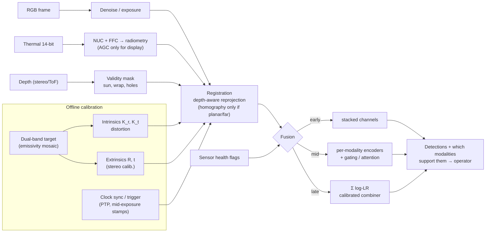

# 09.4 · Multimodal sensing: camera, depth and thermal fusion

<div class="module-card">

**Prerequisites** [09.1 Perception tasks](lessons/stage-09/lesson-01.md) (detectors, recall at fixed FAR) · [05.5 Imaging & remote sensing](lessons/stage-05/lesson-05.md) (thermal IR physics) · [05.6 Sensor fusion](lessons/stage-05/lesson-06.md) (Bayesian fusion, correlated errors) · [06.2 Spatial mathematics](lessons/stage-06/lesson-02.md) (SE(3), camera frames) · linear algebra incl. SVD.

**Estimated time** 7 h (3.5 h theory · 1 h simulator · 2.5 h programming) · **Level** Advanced

**Next** [09.5 Active perception & exploration](lessons/stage-09/lesson-05.md), then [09.6 Trustworthy deployment](lessons/stage-09/lesson-06.md).

<p class="tags"><span>computer vision</span><span>calibration</span><span>thermal IR</span><span>depth</span><span>fusion</span><span>Sim C</span><span>P09</span></p>
</div>

## Why this matters

An EOD robot's operator looks at a suspicious item through a colour camera on a pan–tilt head, a
long-wave infrared (LWIR) camera next to it, and a depth sensor that feeds the arm planner. Each
sees different physics: the RGB camera sees reflected visible light (texture, colour, markings,
but nothing at night); the LWIR camera sees emitted radiation at 8–14 µm (works in darkness,
reveals thermal contrast such as recently disturbed soil in its diurnal cycle, but is blurry,
low-resolution and opaque to ordinary glass); the depth sensor sees geometry (volume, ground plane,
grasp surfaces) but fails on dark, shiny or sunlit surfaces. Fusing them is only as good as the
**geometry and timing that align them**. If the thermal hot-spot is drawn 20 pixels to the left of
where it belongs, the operator — or a detector — attributes heat to the wrong object. If depth is
wrong by 30 cm, the arm planner is wrong by 30 cm. This lesson is about the unglamorous plumbing
that decides whether multimodal perception helps or quietly misleads: calibration, registration,
time synchronisation, sensor-specific image processing, fusion architecture, and behaviour when a
modality drops out.

## Learning objectives

1. Write the pinhole projection model with intrinsics and extrinsics, and compute pixel footprint,
   instantaneous field of view and pixels-on-target for RGB and thermal cameras.
2. Derive the **plane-induced homography** between two cameras, estimate a homography by the
   normalised **DLT**, and quantify the **parallax error** a homography incurs off its plane.
3. Budget registration error from **time offset** and motion, and specify synchronisation
   requirements.
4. Apply sensor-appropriate processing: photon-transfer noise model, histogram equalisation and
   CLAHE, **two-point non-uniformity correction** of a microbolometer, and the radiometric
   measurement equation with emissivity.
5. Predict depth error for stereo and time-of-flight sensors and list their outdoor failure modes.
6. Choose between early, mid and late fusion and design a **missing-modality** test matrix.

## Theory

### 1. Camera intrinsics: from a point to a pixel

A point $\mathbf{X}_c=(X,Y,Z)^\top$ in the camera frame projects to pixel coordinates

$$
\lambda\begin{pmatrix}u\\v\\1\end{pmatrix} = \mathbf{K}\,\mathbf{X}_c,\qquad
\mathbf{K}=\begin{pmatrix} f_x & s & c_x\\ 0 & f_y & c_y\\ 0&0&1\end{pmatrix},\qquad
f_x = \frac{f}{p_x},
$$

followed by a lens-distortion model (radial $k_1,k_2,k_3$ and tangential $p_1,p_2$ in the common
Brown–Conrady form) applied to normalised coordinates before $\mathbf{K}$.

| Symbol | Meaning | Unit |
|---|---|---|
| $(u,v)$ | pixel coordinates | px |
| $\lambda$ | projective depth (equals $Z$ here) | m |
| $f$ | focal length | m |
| $p_x$ | pixel pitch | m px⁻¹ |
| $f_x,f_y$ | focal length in pixels | px |
| $c_x,c_y$ | principal point | px |
| $s$ | skew (≈ 0 for modern sensors) | px |
| IFOV $=p_x/f$ | instantaneous field of view of one pixel | rad |

**Intuition.** $\mathbf{K}$ converts angles into pixels. A thermal camera has large pixels
(12–17 µm for uncooled microbolometers) and short lenses, so its pixels subtend large angles: the
same object covers far fewer thermal than RGB pixels. That asymmetry dominates everything that
follows — registration errors of a few *thermal* pixels are tens of *RGB* pixels.

**Numerical example.** An uncooled 640×512 LWIR core, $p_x = 17$ µm, $f=25$ mm:
$f_x = 0.025/17\times10^{-6} = 1470.6$ px; IFOV $= 0.68$ mrad; footprint at 10 m $= 6.8$ mm per
pixel. A 0.10 m object at 10 m spans $f_x\cdot0.10/10 = 14.7$ px — enough for a detector to
localise, rarely enough to *recognise* (09.1: recognition typically wants several tens of pixels
across the object).

```python
import numpy as np

def project(K: np.ndarray, Xc: np.ndarray) -> np.ndarray:
    """Pinhole projection of Nx3 camera-frame points to Nx2 pixels (no distortion)."""
    x = Xc @ K.T
    return x[:, :2] / x[:, 2:3]

f, pitch = 25e-3, 17e-6
fx = f / pitch
K_th = np.array([[fx, 0, 320], [0, fx, 256], [0, 0, 1]])
print(fx, 1e3 * pitch / f, project(K_th, np.array([[0.05, 0, 10.0], [-0.05, 0, 10.0]])))
# 1470.6 px, 0.68 mrad, u = 327.35 and 312.65  -> 14.7 px span
```

<details class="answer"><summary>Exercise 1 — then reveal</summary>

The RGB camera beside it has 3.45 µm pixels, $f = 8$ mm, 1920×1200. (a) Compute $f_x$, IFOV and
horizontal field of view. (b) How many RGB pixels does one thermal pixel cover (linearly) at the
same range?

*Answer.* (a) $f_x=8\times10^{-3}/3.45\times10^{-6}=2318.8$ px; IFOV $=0.431$ mrad; HFOV
$=2\arctan(960/2318.8)=45.0°$ (thermal: $2\arctan(320/1470.6)=24.6°$). (b)
$0.68/0.431\approx1.58$ RGB pixels per thermal pixel linearly (≈ 2.5 in area). Here the thermal
camera has the *narrower* lens, so the resolution gap is smaller than the raw pixel counts suggest
— a deliberate design choice on many EOD pan–tilt heads.

</details>

### 2. Extrinsics and the plane-induced homography

Let the thermal camera be related to the RGB camera by a rigid transform
$\mathbf{X}_t=\mathbf{R}\mathbf{X}_r+\mathbf{t}$ (06.2). For points on a plane
$\mathbf{n}^\top\mathbf{X}_r = d$ in the RGB frame, $\mathbf{t}=\mathbf{t}\,\mathbf{n}^\top\mathbf{X}_r/d$, so

$$
\mathbf{x}_t \simeq \mathbf{K}_t\!\left(\mathbf{R}+\frac{\mathbf{t}\,\mathbf{n}^\top}{d}\right)\!\mathbf{K}_r^{-1}\,\mathbf{x}_r \equiv \mathbf{H}\,\mathbf{x}_r .
$$

$\mathbf{H}$ is a 3×3 **homography** (8 degrees of freedom, defined up to scale). Off the plane,
the mapping is wrong by the **parallax**. For two parallel cameras separated by baseline $b$
along $x$, with the homography fitted at depth $Z_0$, a point at depth $Z$ lands with horizontal
error

$$ \Delta u = f_x\, b\left(\frac{1}{Z}-\frac{1}{Z_0}\right). $$

| Symbol | Meaning | Unit |
|---|---|---|
| $\mathbf{R},\mathbf{t}$ | rotation and translation RGB → thermal (extrinsics) | —, m |
| $\mathbf{n}, d$ | plane unit normal and distance in RGB frame | —, m |
| $\mathbf{x}_r,\mathbf{x}_t$ | homogeneous pixel coordinates | px |
| $b$ | baseline between optical centres | m |
| $Z_0, Z$ | calibration-plane depth, actual depth | m |
| $\Delta u$ | registration error in target-camera pixels | px |

**Intuition.** A homography is exact for a plane, for a pure rotation, or when the scene is far
away compared with the baseline ($b/Z\to0$). A robot inspecting an object at 1–5 m with a 5 cm
baseline is *none* of these. The error grows as $1/Z$: registrations that look perfect on the
calibration board drift apart on the object in front of the gripper.

**Numerical example.** $f_x=1470$ px (thermal), $b=0.05$ m, $Z_0=5$ m. Object at 2 m:
$\Delta u = 1470\cdot0.05\,(0.5-0.2)=22.1$ px. Object at 10 m: $-7.4$ px. A 22-pixel shift on a
15-pixel-wide object means the thermal signature is painted beside it, not on it.

```python
def parallax_px(fx, b, Z, Z0):
    return fx * b * (1.0 / Z - 1.0 / Z0)

for Z in (1.0, 2.0, 5.0, 10.0, 1e9):
    print(Z, round(parallax_px(1470, 0.05, Z, 5.0), 2))
# 1 m: 58.8 px; 2 m: 22.05; 5 m: 0; 10 m: -7.35; infinity: -14.7
```

The fix is **depth-aware reprojection**: lift each RGB pixel to 3D with a depth map,
$\mathbf{X}_r = Z\,\mathbf{K}_r^{-1}\mathbf{x}_r$, transform, and project with $\mathbf{K}_t$. It
needs full intrinsics and extrinsics — i.e. stereo calibration — and good depth (Section 6).

<details class="answer"><summary>Exercise 2 — then reveal</summary>

You may tolerate at most 2 thermal pixels of parallax over a working range 1.5–6 m with $f_x=1470$
px. (a) What is the best choice of $Z_0$ and the resulting maximum baseline? (b) Is that baseline
physically achievable for two co-mounted cameras?

*Answer.* (a) Balance the extremes: choose $1/Z_0$ midway between $1/1.5$ and $1/6$, i.e.
$1/Z_0 = (0.6667+0.1667)/2 = 0.4167$ ⇒ $Z_0 = 2.4$ m. Max $|1/Z-1/Z_0| = 0.25$ m⁻¹, so
$b \le 2/(1470\cdot0.25)=5.4$ mm. (b) No — camera bodies alone are wider. Either use a
beam-splitter (co-axial) optical design or accept depth-aware reprojection. Fitting the homography
in inverse depth, not depth, is the general lesson.

</details>

### 3. Estimating a homography: the normalised DLT, and thermal–RGB targets

Given correspondences $\mathbf{x}_i \leftrightarrow \mathbf{x}'_i$ with $\mathbf{x}'_i\simeq\mathbf{H}\mathbf{x}_i$,
the cross product $\mathbf{x}'_i\times\mathbf{H}\mathbf{x}_i=\mathbf{0}$ gives two independent
linear equations per point in the nine entries $\mathbf{h}=\mathrm{vec}(\mathbf{H})$:

$$
\begin{pmatrix}
-x_i & -y_i & -1 & 0&0&0 & u_i x_i & u_i y_i & u_i\\
0&0&0 & -x_i & -y_i & -1 & v_i x_i & v_i y_i & v_i
\end{pmatrix}\mathbf{h}=\mathbf{0}
\quad\Rightarrow\quad
\hat{\mathbf{h}}=\arg\min_{\Vert \mathbf{h}\Vert =1}\Vert \mathbf{A}\mathbf{h}\Vert _2 .
$$

The minimiser is the right singular vector of $\mathbf{A}$ ($2N\times9$) with the smallest singular
value. Four points in general position give the exact solution; more points give the algebraic
least-squares estimate. **Hartley normalisation** — translate each point set to zero centroid and
scale to mean distance $\sqrt2$ with similarity transforms $\mathbf{T},\mathbf{T}'$, solve, then
$\mathbf{H}=\mathbf{T}'^{-1}\hat{\mathbf{H}}\mathbf{T}$ — is not optional: raw pixel coordinates
of order $10^2$–$10^3$ make the columns of $\mathbf{A}$ differ by $10^6$ in scale and the solution
numerically poor.

| Symbol | Meaning | Unit |
|---|---|---|
| $(x_i,y_i)$, $(u_i,v_i)$ | source and destination pixel coordinates | px |
| $\mathbf{A}$ | stacked constraint matrix | mixed |
| $\mathbf{h}$ | 9-vector of homography entries (unit norm) | — |
| $\sigma_9$ | smallest singular value; ≈ 0 for noise-free data | — |
| reprojection error $e_i = \Vert \pi(\mathbf{H}\mathbf{x}_i)-\mathbf{x}'_i\Vert $ | geometric residual | px |

**Intuition.** The DLT minimises an *algebraic* error, which is fast and linear but not the
statistically right thing; a few Gauss–Newton or Levenberg–Marquardt steps on the geometric
reprojection error afterwards give the maximum-likelihood estimate under Gaussian pixel noise. In
practice: DLT for initialisation, RANSAC for outliers, nonlinear refinement for accuracy (Hartley &
Zisserman ch. 4).

**Numerical example.** One correspondence $(x,y)=(100,50)\mapsto(u,v)=(40,30)$ contributes the rows
$(-100,-50,-1,0,0,0,4000,2000,40)$ and $(0,0,0,-100,-50,-1,3000,1500,30)$: entries spanning four
orders of magnitude, which is exactly why normalisation matters. With 30 synthetic board corners
and 0.3 px noise (programming exercise), the normalised DLT gives an RMS reprojection error of
0.36 px — consistent with the noise floor $\approx\sqrt2\,\sigma\sqrt{1-8/2N}=0.39$ px.

```python
def dlt_rows(x, y, u, v):
    return np.array([[-x, -y, -1, 0, 0, 0, u * x, u * y, u],
                     [0, 0, 0, -x, -y, -1, v * x, v * y, v]], float)

A = dlt_rows(100, 50, 40, 30)
print(A, np.linalg.cond(np.vstack([A, dlt_rows(300, 60, 110, 35),
                                   dlt_rows(90, 400, 35, 160), dlt_rows(500, 420, 190, 170)])))
```

**Thermal–RGB calibration targets.** A printed chessboard is invisible in LWIR at uniform
temperature: black and white ink have nearly the same emissivity and temperature. Practical
targets create *co-located* contrast in both bands:

| Target type | How the LWIR contrast arises | Pitfalls |
|---|---|---|
| Heated/cooled board with printed pattern on a metal/paint mosaic | emissivity contrast (bare polished metal ε ≈ 0.05–0.1 vs matt paint ε ≈ 0.9+) → different radiance at the same temperature | reflections of the operator or sky in the low-ε squares; gradients as the board cools |
| Cut-out mask in front of a warm (or cold) background | temperature contrast through the holes | edges are at different depths (mask vs background) → parallax bias |
| Active target (small resistive heaters or lamps at known grid points) | point sources | blur makes centroids biased; slow thermal equilibrium |

Board corners detected in RGB and in thermal give the correspondences; Zhang's method on several
board poses gives $\mathbf{K}_r,\mathbf{K}_t$, distortion and $(\mathbf{R},\mathbf{t})$ (OpenCV
calibration tutorial). Report the **per-camera reprojection error** and, more usefully, the
**cross-modal transfer error** on held-out poses at the depths you will actually work at.

<details class="answer"><summary>Exercise 3 — then reveal</summary>

(a) Why does $\mathbf{H}$ have 8 degrees of freedom, and why is the minimum four points? (b) What
happens to the DLT if all correspondences are collinear? (c) Your thermal corner detector has
0.5 px noise while RGB has 0.1 px. Which image should be the "destination" in a one-sided
reprojection error, and what is the principled alternative?

*Answer.* (a) 9 entries minus overall scale; each point gives 2 constraints ⇒ $\lceil 8/2\rceil = 4$.
(b) $\mathbf{A}$ loses rank (the null space becomes at least 2-dimensional): any homography that
agrees on the line fits, so $\mathbf{H}$ is undetermined; the smallest two singular values are both
≈ 0. (c) Put the noisy thermal points as the measured destination so the error model matches the
noise; the principled alternative is the symmetric transfer error or, better, the Gold Standard
(reprojection) error that estimates corrected points in both images, weighted by each image's noise.

</details>

### 4. Time synchronisation

Registration is also temporal. If the pan–tilt head rotates at angular rate $\omega$ and the two
frames are stamped $\Delta t$ apart, the apparent displacement is

$$ \Delta\theta = \omega\,\Delta t, \qquad \Delta u \approx f_x\,\omega\,\Delta t . $$

| Symbol | Meaning | Unit |
|---|---|---|
| $\omega$ | angular rate of the sensor head or platform | rad s⁻¹ |
| $\Delta t$ | timestamp offset between modalities | s |
| $\Delta u$ | resulting pixel displacement | px |

**Intuition.** Rotation, not translation, dominates at short range: a slow pan sweeps the whole
scene across the image. Microbolometers add a second, subtler lag: each pixel is a thermal mass with
a time constant of order 10 ms, so a panning thermal image is smeared *and* delayed relative to the
RGB exposure. Timestamps must refer to the **mid-exposure** (or mid-integration) instant, not the
moment the driver received the frame; hardware triggering or IEEE 1588 PTP clock sync is standard.

**Numerical example.** $\omega = 30$ °/s $=0.524$ rad/s, $\Delta t=20$ ms: $\Delta\theta=10.5$
mrad ⇒ $1470\cdot0.0105=15.4$ thermal px — as bad as the parallax of Section 2.

```python
def sync_error_px(fx, omega_deg_s, dt_s):
    return fx * np.deg2rad(omega_deg_s) * dt_s

print(sync_error_px(1470, 30, 0.020))   # 15.4 px
print(1.0 / (1470 * np.deg2rad(30)))    # dt for 1 px: 1.3 ms
```

<details class="answer"><summary>Exercise 4 — then reveal</summary>

The thermal core runs at 30 Hz free-running, the RGB camera at 30 Hz hardware-triggered, and you
pair each RGB frame with the nearest thermal timestamp. (a) What is the worst-case and the RMS
offset if both clocks are perfect? (b) At what pan rate does the worst case exceed 1 thermal pixel?

*Answer.* (a) Offsets are uniform on $[-T/2,T/2]$ with $T=33.3$ ms: worst case 16.7 ms, RMS
$T/\sqrt{12}=9.6$ ms. (b) $\omega < 1/(1470\cdot0.0167)=0.0408$ rad/s $=2.3$ °/s. Either trigger
both sensors from one clock, interpolate poses to each timestamp (motion compensation using the
head encoders), or only fuse when the head is still.

</details>

### 5. Low-light and infrared image processing

**5a. Noise in low light (photon transfer).** For a pixel collecting mean signal $S$ photo-electrons,

$$ \sigma^2 = S + D\,t_{\text{exp}} + \sigma_r^2,\qquad \mathrm{SNR}=\frac{S}{\sqrt{S+D t_{\text{exp}}+\sigma_r^2}} . $$

| Symbol | Meaning | Unit |
|---|---|---|
| $S$ | mean signal (Poisson: variance = mean) | e⁻ |
| $D$ | dark-current rate | e⁻ s⁻¹ |
| $t_{\text{exp}}$ | exposure time | s |
| $\sigma_r$ | read noise | e⁻ rms |

**Intuition.** Bright scenes are shot-noise limited (SNR $\approx\sqrt S$); at dusk the read noise
takes over and SNR collapses faster than the light. Binning $k$ pixels multiplies signal by $k$
but noise only by $\sqrt k$ (shot-limited). Gain does not help SNR — it scales signal and noise.
Longer exposure helps SNR but blurs a moving robot's image.

**Numerical example.** $\sigma_r=3$ e⁻, dark current negligible: $S=100$ ⇒ SNR $=100/\sqrt{109}=9.6$;
$S=10$ ⇒ SNR $=10/\sqrt{19}=2.3$. Ten times less light, four times worse SNR.

```python
def snr(S, read=3.0, dark_rate=0.0, t=0.0):
    return S / np.sqrt(S + dark_rate * t + read**2)
print(snr(100), snr(10), snr(4 * 10))   # 9.6, 2.3, 5.7 (2x2 on-chip charge binning: one read)
```

**5b. Histogram equalisation and CLAHE.** For an image with $L$ grey levels and cumulative
histogram $\mathrm{CDF}(k)$ (fraction of pixels with level ≤ $k$),

$$ T(k) = \operatorname{round}\big[(L-1)\,\mathrm{CDF}(k)\big]. $$

**Intuition.** Levels that many pixels share get spread apart; empty ranges are squeezed. Thermal
cores deliver 14-bit data in which the interesting contrast may occupy 50 counts out of 16 384;
equalisation (or a smarter automatic gain control) is what makes it visible on an 8-bit display.
**CLAHE** (contrast-limited adaptive HE) does this per tile (e.g. 8×8 tiles), clips each tile's
histogram at a limit $\beta$ times the mean bin count and redistributes the excess (bounding the
slope of $T$ and hence noise amplification), then bilinearly interpolates between tile mappings to
avoid block seams.

**Numerical example.** A 16-pixel, 3-bit ($L=8$) patch has counts $[0,0,6,6,2,1,1,0]$ for levels
0–7. CDF $=[0,0,6,12,14,15,16,16]/16$; $T=\mathrm{round}(7\cdot\mathrm{CDF}) = [0,0,3,5,6,7,7,7]$.
Levels 2 and 3, which were one step apart, are now two apart; levels 5 and 6 merge into 7.

```python
counts = np.array([0, 0, 6, 6, 2, 1, 1, 0])
cdf = np.cumsum(counts) / counts.sum()
print(np.round(7 * cdf).astype(int))    # [0 0 3 5 6 7 7 7]
```

<div class="callout hazard">

**Processing is not neutral.** Equalisation, AGC and CLAHE are *display* transforms: they destroy
the monotone link to scene radiance and change frame to frame as the scene changes. Never feed an
AGC'd image into anything that reasons about temperature, and train and deploy an ML model with
*identical* preprocessing — a detector trained on one vendor's AGC and deployed on another's is a
distribution shift (09.3, 09.6).

</div>

**5c. Microbolometer non-uniformity correction (NUC).** Each pixel $i$ of an uncooled focal-plane
array has its own responsivity and offset; to first order raw counts are
$y_i = a_i\,\Phi + b_i$ for incident flux $\Phi$. The resulting **fixed-pattern noise** (stripes,
"salt", vignetting) can exceed the scene contrast. The two-point correction images two uniform
references (blackbody or shutter at temperatures $T_1,T_2$) and maps every pixel to the array mean
$\bar y(T_k)$:

$$ g_i=\frac{\bar y(T_2)-\bar y(T_1)}{y_i(T_2)-y_i(T_1)},\qquad o_i=\bar y(T_1)-g_i\,y_i(T_1),\qquad \hat y_i = g_i\,y_i + o_i . $$

| Symbol | Meaning | Unit |
|---|---|---|
| $y_i(T_k)$ | raw counts of pixel $i$ viewing reference $k$ | counts (DN) |
| $\bar y(T_k)$ | array-mean counts at reference $k$ | DN |
| $g_i,o_i$ | per-pixel gain and offset | —, DN |
| $\hat y_i$ | corrected counts | DN |

**Intuition.** Two points fix a line per pixel. Gains are stable for months; **offsets drift**
with focal-plane temperature within minutes. That is why uncooled cameras close an internal
shutter every few minutes for a *flat-field correction* (offset-only update) — the "click and
freeze" operators notice — and why scene-based NUC algorithms exist for shutterless operation.
A frozen frame during a critical manipulation is a human-factors issue; many systems let the
operator defer the shutter.

**Numerical example.** Array means 1000 DN ($T_1$) and 1500 DN ($T_2$); pixel reads 1030 and 1510.
$g=500/480=1.0417$, $o=1000-1.0417\cdot1030=-72.9$. A scene reading of 1270 DN corrects to
$1.0417\cdot1270-72.9=1250.0$ DN.

```python
def two_point_nuc(raw1, raw2, raw):
    """raw1, raw2: (H,W) frames of uniform references; raw: scene frame."""
    g = (raw2.mean() - raw1.mean()) / (raw2 - raw1)
    o = raw1.mean() - g * raw1
    return g * raw + o

g = 500 / 480; o = 1000 - g * 1030
print(g, o, g * 1270 + o)   # 1.0417 -72.92 1250.0
```

**5d. Radiometric vs non-radiometric thermal.** A *non-radiometric* camera outputs counts (usually
AGC'd) — good for seeing contrast, useless for temperature. A *radiometric* camera is calibrated so
that counts map to in-band radiance and, given object parameters, to temperature. Using the total
(Stefan–Boltzmann) approximation for intuition, the radiance the camera receives from an opaque
surface is

$$ W = \varepsilon\,\sigma_{\text{SB}}T_{\text{obj}}^4 + (1-\varepsilon)\,\sigma_{\text{SB}}T_{\text{refl}}^4 ,\qquad
T_{\text{app}} = (W/\sigma_{\text{SB}})^{1/4}\ \text{(if } \varepsilon=1 \text{ is assumed)} . $$

| Symbol | Meaning | Unit |
|---|---|---|
| $\varepsilon$ | emissivity (in-band) | — |
| $\sigma_{\text{SB}}$ | Stefan–Boltzmann constant, 5.670×10⁻⁸ | W m⁻² K⁻⁴ |
| $T_{\text{obj}}, T_{\text{refl}}$ | object and reflected-environment temperatures | K |
| $W$ | exitance reaching the camera (atmosphere neglected) | W m⁻² |

**Intuition.** A thermal image is a map of *radiance*, not temperature. Low-emissivity surfaces
(bare metal) mirror their surroundings — often the cold sky — and read "cold" regardless of their
true temperature. Real cameras integrate Planck's law over 8–14 µm and also correct for
atmospheric transmission over range; the $T^4$ form is a teaching simplification.

**Numerical example.** $\varepsilon=0.95$, $T_{\text{obj}}=300$ K, surroundings 280 K:
$W = 0.95\cdot459.3+0.05\cdot348.5 = 453.8$ W m⁻² ⇒ $T_{\text{app}}=299.1$ K (−0.9 K). Reflecting a
240 K clear sky instead: $T_{\text{app}}=297.8$ K. For a metal surface at $\varepsilon=0.1$ the
error is tens of kelvin.

```python
SB = 5.670374e-8
def apparent_T(eps, T_obj, T_refl):
    W = eps * SB * T_obj**4 + (1 - eps) * SB * T_refl**4
    return (W / SB) ** 0.25
print(apparent_T(0.95, 300, 280), apparent_T(0.95, 300, 240), apparent_T(0.1, 300, 240))
# 299.1  297.8  248.2
```

<details class="answer"><summary>Exercise 5 — then reveal</summary>

(a) After the two-point NUC above, the focal-plane temperature drifts and pixel $i$'s offset rises
by 12 DN while its gain is unchanged. What error appears in $\hat y_i$, and what does a shutter
flat-field correction do about it? (b) Using the $T^4$ model, a bare aluminium panel
($\varepsilon=0.1$) at 300 K under a 240 K sky: what apparent temperature, and what should an
operator conclude from a "cold" metallic object in LWIR?

*Answer.* (a) $\hat y_i$ is high by $g_i\cdot12=12.5$ DN — a fixed bright pixel. FFC images the
(uniform) shutter and recomputes $o_i$ so that every pixel equals the array mean, cancelling the
drift. (b) $T_{\text{app}}=248$ K (computed above). Nothing about its temperature: low emissivity
makes it a mirror of the sky. Thermal contrast must be interpreted with emissivity in mind; that is
why fusion with RGB (which reveals "shiny metal") is valuable.

</details>

### 6. Depth sensing and its outdoor failure modes

**Stereo.** Depth from disparity $\delta$: $Z = f_x b/\delta$. Propagating disparity noise
$\sigma_\delta$:

$$ \sigma_Z \approx \frac{Z^2}{f_x\,b}\,\sigma_\delta . $$

**Continuous-wave time-of-flight (ToF).** Phase $\varphi$ of modulated light at frequency
$f_{\text{mod}}$ gives range $R = \dfrac{c\,\varphi}{4\pi f_{\text{mod}}}$, unambiguous up to
$R_{\max}=c/(2f_{\text{mod}})$, with noise

$$ \sigma_R = \frac{c}{4\pi f_{\text{mod}}}\,\sigma_\varphi . $$

| Symbol | Meaning | Unit |
|---|---|---|
| $b$ | stereo baseline | m |
| $\delta,\sigma_\delta$ | disparity, disparity noise | px |
| $c$ | speed of light, 2.998×10⁸ | m s⁻¹ |
| $f_{\text{mod}}$ | ToF modulation frequency | Hz |
| $\varphi,\sigma_\varphi$ | measured phase and its noise | rad |
| $R_{\max}$ | ambiguity (wrap-around) range | m |

**Intuition.** Stereo error grows *quadratically* with range: good for the gripper's workspace,
poor for the far side of a road. ToF error is roughly range-independent in phase but depends on
returned signal versus background: sunlight adds background photons (shot noise) without adding
signal. Higher $f_{\text{mod}}$ improves precision but shortens $R_{\max}$; multi-frequency ToF
unwraps.

**Numerical examples.** Stereo $f_x=700$ px, $b=0.12$ m, $\sigma_\delta=0.25$ px: $\sigma_Z=7.4$ cm
at 5 m, 29.8 cm at 10 m. ToF at 20 MHz: $R_{\max}=7.5$ m; with $\sigma_\varphi=0.02$ rad,
$\sigma_R=2.4$ cm. An object at 9 m aliases to 1.5 m.

```python
C = 2.998e8
sigma_Z = lambda Z, fx, b, sd: Z**2 / (fx * b) * sd
print(sigma_Z(5, 700, 0.12, 0.25), sigma_Z(10, 700, 0.12, 0.25))    # 0.074, 0.298 m
print(C / (2 * 20e6), C / (4 * np.pi * 20e6) * 0.02)               # 7.5 m, 0.024 m
print((9.0 % (C / (2 * 20e6))))                                    # 1.5 m (wrapped)
```

| Failure mode outdoors | Stereo (passive) | Structured light (active IR pattern) | ToF (active IR) |
|---|---|---|---|
| Direct sunlight | fine (more light) | pattern washed out — often fails | background shot noise; range drops |
| Textureless / uniform surfaces | no matches → holes | fine | fine |
| Dark / low-albedo | fine if textured | weak pattern return | low SNR |
| Specular / wet / glass | wrong matches (reflections) | pattern lost | multipath, wrong range |
| Long range | error ∝ $Z^2$ | short range by design | phase wrap beyond $R_{\max}$ |
| Rain, dust, smoke | degraded | scattering | mixed pixels ("flying pixels") at edges |

Also note a physical cross-modal effect: ordinary glass and many plastics are **opaque in LWIR**
(transparent in visible). A thermal camera looking through a vehicle window sees the window. A
disagreement between modalities is often physics, not a fault — the fusion layer must know which.

<details class="answer"><summary>Exercise 6 — then reveal</summary>

An arm planner requires $\sigma_Z\le1$ cm at 1.5 m. (a) With $f_x = 700$ px and
$\sigma_\delta=0.25$ px, what stereo baseline is needed? (b) A 60 MHz ToF sensor has
$\sigma_\varphi=0.03$ rad. Does it meet the requirement, and what is its $R_{\max}$?

*Answer.* (a) $b \ge Z^2\sigma_\delta/(f_x\sigma_Z) = 2.25\cdot0.25/(700\cdot0.01) = 8.0$ cm.
(b) $\sigma_R = 2.998\times10^8/(4\pi\cdot6\times10^7)\cdot0.03 = 1.19$ cm — marginal; $R_{\max}=2.5$ m,
so anything beyond 2.5 m wraps into the workspace unless a second frequency disambiguates.

</details>

### 7. Fusion architectures: early, mid, late

| Architecture | What is combined | Pros | Cons |
|---|---|---|---|
| **Early** (data/pixel) | registered channels stacked (e.g. RGB + T + D → 5-channel input) | the network learns cross-modal correlations at full resolution | requires accurate pixel registration (Sections 2–4); one missing channel corrupts the input |
| **Mid** (feature) | per-modality encoders; features fused by concatenation, gating or cross-attention | tolerant of small misregistration; can learn modality weighting | more parameters; still fails silently if a stream is garbage but "present" |
| **Late** (decision) | per-modality detections/probabilities combined (Bayes, voting, learned combiner) | modular, auditable, graceful degradation, separate certification per sensor | misses joint evidence that is weak in each modality alone; independence assumption |

For late fusion with conditionally independent modalities (05.6), the posterior log-odds are

$$ \operatorname{logit} P(H\mid z_1,\dots,z_M) = \operatorname{logit}\pi + \sum_{m=1}^{M}\ln\Lambda_m,\qquad \Lambda_m=\frac{p(z_m\mid H)}{p(z_m\mid\bar H)} . $$

| Symbol | Meaning | Unit |
|---|---|---|
| $H$ | hypothesis "object of interest present" | — |
| $\pi$ | prior probability of $H$ | — |
| $z_m$ | evidence from modality $m$ | — |
| $\Lambda_m$ | likelihood ratio of modality $m$ | — |

**Intuition.** Each calibrated modality adds its log-likelihood ratio; a missing modality simply
contributes zero — graceful by construction. If modalities share a failure cause (both see the same
shadow edge), the sum double-counts evidence and the fused probability is overconfident.

**Numerical example.** Prior 0.01; RGB detector reports $\Lambda=8$, thermal $\Lambda=5$. Posterior
odds $=0.0101\cdot40=0.404$ ⇒ $P=0.288$. Without thermal: odds $0.0808$ ⇒ $P=0.075$.

```python
def late_fuse(prior, lrs):
    L = np.log(prior / (1 - prior)) + np.sum(np.log(lrs))
    return 1 / (1 + np.exp(-L))
print(late_fuse(0.01, [8, 5]), late_fuse(0.01, [8]))   # 0.288  0.075
```

<details class="answer"><summary>Exercise 7 — then reveal</summary>

Suppose RGB and thermal errors are strongly correlated so that, empirically, the joint likelihood
ratio of the pair is 16 rather than 40. (a) What is the correct posterior? (b) By what factor does
the independence assumption overstate the odds? (c) Name one way to learn the right combination.

*Answer.* (a) odds $=0.0101\cdot16=0.162$ ⇒ $P=0.139$. (b) 40/16 = 2.5× in odds. (c) Fit a
calibrated combiner (logistic regression on the two scores, or a small MLP) on held-out data from
the target environment — this learns the joint likelihood ratio including the correlation; then
recheck calibration (09.2).

</details>

### 8. Missing-modality robustness

Sensors fail in the field: the thermal core is in flat-field correction, the depth sensor is
blinded by sun, a connector has vibrated loose, the RGB camera is dark at night. The system must
(i) **know** a modality is missing or degraded — health signals, not just absence of data;
(ii) degrade **gracefully and predictably**; (iii) **tell the operator** which evidence the current
output rests on.

Techniques: **modality dropout** during training (randomly zeroing or masking entire streams so the
network cannot over-rely on one), **explicit mask tokens** or availability flags (so "zero pixels"
and "no sensor" are distinguishable), per-modality **gating** driven by quality estimates,
**distillation** from the full-modality model into subset models, and late-fusion fall-backs. The
test obligation is combinatorial: with $M$ modalities there are $2^M-1$ non-empty subsets, and each
needs a measured recall-at-fixed-FAR (09.1).

**Numerical example.** RGB, thermal, depth: $2^3-1=7$ configurations. With four environmental
conditions (day, dusk, night, rain), 28 evaluation cells — each needs enough positives for a
meaningful confidence interval (09.6 shows ~29 positives per cell for a zero-miss demonstration of
90 % recall at 95 % confidence).

```python
from itertools import combinations
mods = ["rgb", "thermal", "depth"]
subsets = [c for k in range(1, 4) for c in combinations(mods, k)]
print(len(subsets), subsets)
```

<details class="answer"><summary>Exercise 8 — then reveal</summary>

A mid-fusion detector trained without modality dropout scores recall 0.93 with all sensors and
0.41 when thermal is replaced by zeros; an RGB-only model scores 0.78. What does this tell you, and
what deployment rule follows?

*Answer.* The fused model has learned to depend on thermal and is *worse than a model that never
had it* when thermal is absent — the zero image is out of distribution. Rule: on thermal loss,
switch to the RGB-only model (or retrain with modality dropout until the degraded-mode recall
reaches ≥ 0.78), and surface the mode change to the operator.

</details>

## Visual explanation



<iframe class="sim-frame" src="sims/sensor-fusion/index.html?embed=1" height="720" loading="lazy"></iframe>

<a class="sim-link" href="sims/sensor-fusion/index.html" target="_blank">Open Sim C full-screen ↗</a>

## Worked example — registering thermal onto RGB for an inspection at dusk

*Fictional scenario.* A tracked robot inspects a fictional "item X" (a closed container on a
verge) at dusk. Sensor head: RGB (1920×1200, $f_x = 2319$ px), LWIR (640×512, $f_x = 1470$ px),
horizontal baseline 6 cm; stereo depth pair ($f_x=700$ px, $b = 0.12$ m). The factory registration
is a homography fitted at 5 m. Item X is at 2.5 m and is about 0.30 m wide.

1. **Pixels on target.** Thermal: $1470\cdot0.30/2.5=176$ px — ample.
2. **Homography parallax.** $\Delta u = 1470\cdot0.06\,(1/2.5-1/5)=17.6$ thermal px, i.e. 10 % of the
   object width. Any "warm patch at the left edge" shown on the RGB overlay could belong to the
   ground beside it. **Action:** switch to depth-aware reprojection.
3. **Depth quality.** $\sigma_Z = 2.5^2\cdot0.25/(700\cdot0.12)=1.9$ cm. Reprojected thermal error
   from depth noise: $f_x b\,\sigma_Z/Z^2 = 1470\cdot0.06\cdot0.019/6.25 = 0.26$ px — negligible.
   At dusk the stereo pair is noisier: if $\sigma_\delta$ triples, 0.8 px — still fine.
4. **Timing.** The operator pans at 10 °/s while framing; thermal free-runs at 30 Hz (worst-case
   offset 16.7 ms): $1470\cdot0.1745\cdot0.0167=4.3$ px. **Action:** fuse only frames captured
   while the head encoders report $|\omega|<1$ °/s, or motion-compensate using encoder angles.
5. **Radiometry.** The container lid is bare metal. Its LWIR reading reflects the cooling evening
   sky and is not its temperature (Section 5d); the painted body is interpretable. The overlay
   should grey-out low-emissivity regions rather than colour them "cold".
6. **Low light.** RGB SNR is falling; the display applies CLAHE for the operator, but the detector
   receives the raw linear image it was trained on.
7. **Output.** Late fusion reports $P$ with the list of contributing modalities and a flag that
   thermal on the lid is emissivity-limited. The operator sees *what the system believes and why*,
   the theme of 09.6.

## Simulation work

<div class="callout sim">

**Sim C (sensor fusion).** (1) With a fixed seed and *errors: independent*
(`?level=Intermediate&seed=8&corr=off`), fuse camera and thermal on several cells; then reload with
`&corr=on` (correlated errors: camera and thermal share an error term) and compare the fused
posterior with the independent-fusion formula (Exercise 7). (2) Lose a modality: stop using
thermal partway through (or set `&hour=23`, where the thermal gain collapses): does the fused
estimate degrade gracefully, and does the posterior stay appropriately uncertain? (3) In the
correlated setting each sensor also carries a persistent per-cell bias (a registration-offset
analogue): repeat one sensor on a cell and watch the naive posterior harden while the debrief's
exact posterior does not. Design a consistency (innovation) check — the reading's distance from
the spec-sheet mean of the currently most probable class, in σ units — and apply it by hand to
flag the biased input.

</div>

## Practical exercises

<details class="answer"><summary>P1 — calibration plan (design)</summary>

Design a thermal–RGB calibration procedure for a pan–tilt head used at 1–6 m. Specify target type,
number of poses and depths, what you report, and an acceptance criterion.

*Model answer.* Heated emissivity-mosaic board (painted squares on polished aluminium), allowed to
reach equilibrium; ≥ 15 poses spanning the image corners and tilts of ±30°, at depths 1, 2, 4,
6 m; indoor or overcast to avoid sky reflections in the metal squares. Estimate intrinsics per
camera and stereo extrinsics jointly; report per-camera RMS reprojection (expect < 0.5 px RGB,
< 0.3 thermal px is ambitious for blurred thermal corners), and **cross-modal transfer error on
held-out poses at each depth** after depth-aware reprojection. Accept if the 95th-percentile transfer
error < 2 thermal px at every depth. Re-verify after any mechanical shock to the head.

</details>

<details class="answer"><summary>P2 — error budget (calculation)</summary>

Combine independent registration error sources for Section 2's head ($f_x=1470$ px) at 3 m with
depth-aware reprojection: calibration residual 0.4 px, depth noise contribution 0.3 px, timing
(ω = 2 °/s, Δt RMS 9.6 ms), and thermal blur of ±0.5 px treated as uniform. What is the RMS total?

*Answer.* Timing: $1470\cdot0.0349\cdot0.0096=0.49$ px. Uniform ±0.5: $0.5/\sqrt3=0.29$ px. RSS:
$\sqrt{0.4^2+0.3^2+0.49^2+0.29^2}=0.76$ px. Timing is the largest term even at a slow pan.

</details>

<details class="answer"><summary>P3 — sensor selection (interpretation)</summary>

For each situation pick the depth modality and justify: (a) midday desert, 3–8 m; (b) indoor
corridor, white walls, 0.5–3 m; (c) wet road at night, 1–2 m.

*Answer.* (a) Passive stereo with a wide baseline (sun kills active IR; ToF $R_{\max}$ issues).
(b) Active (structured light or ToF): textureless walls defeat stereo; indoor light is benign.
(c) ToF or stereo with an IR projector — but expect specular multipath from the wet surface; mask
low-confidence pixels and verify with a second view (09.5).

</details>

<details class="answer"><summary>P4 — missing-modality policy (decision)</summary>

Write a mode table for RGB/thermal/depth availability that states, for each of the 7 subsets, which
model runs, what is shown to the operator, and which tasks are disallowed.

*Model answer (excerpt).* All three: fused model, full overlay. RGB+thermal, no depth: fused 2D
detection; arm auto-approach disabled (no metric depth), manual only. Thermal+depth (night): thermal
detector with depth; colour-dependent cues unavailable — flagged. Depth only: geometry only; no
object classification shown. Every degraded mode is displayed persistently, not as a transient
toast, and logged for T&E (09.6).

</details>

## Programming exercise — register a synthetic thermal image to RGB with a DLT homography

**Goal.** Implement the normalised DLT, estimate the RGB→thermal homography from noisy board
corners, and warp a synthetic thermal image into the RGB frame with bilinear inverse mapping.

- **Input:** 30 RGB corner locations of a (fictional) dual-band board; their thermal locations
  generated by a known $\mathbf{H}_{\text{true}}$ plus 0.3 px Gaussian noise; a 256×320 synthetic
  thermal frame containing a 35 °C disc on a 20 °C background.
- **Output:** $\hat{\mathbf{H}}$, RMS reprojection error, the thermal image resampled onto the
  480×640 RGB grid, the hot-spot centroid in RGB coordinates.
- **Constraints:** NumPy only; no OpenCV; vectorised warp; handle out-of-bounds pixels as NaN.
- **Expected behaviour:** RMS reprojection ≈ 0.36–0.40 px; hot-spot centroid within 0.5 px of
  RGB (320, 240).
- **Test cases:** (i) noise-free correspondences ⇒ $\hat{\mathbf{H}}$ equals $\mathbf{H}_{\text{true}}$
  to 1e-8 (after scaling $H_{33}=1$) and $\sigma_9\approx0$; (ii) four points only ⇒ zero residual;
  (iii) all points collinear ⇒ detect rank deficiency ($\sigma_8/\sigma_7 < 10^{-6}$) and raise;
  (iv) without normalisation, compare the error at 1 px noise — normalisation should win.
- **Extensions:** RANSAC with 10 % gross outliers; Levenberg–Marquardt refinement of reprojection
  error; replace the homography with depth-aware reprojection given a synthetic depth map and
  measure the parallax error you removed.

```python
import numpy as np
rng = np.random.default_rng(0)

def normalise(pts):
    """Hartley normalisation: centroid to origin, mean distance sqrt(2)."""
    c = pts.mean(axis=0)
    s = np.sqrt(2) / np.sqrt(((pts - c) ** 2).sum(axis=1)).mean()
    T = np.array([[s, 0, -s * c[0]], [0, s, -s * c[1]], [0, 0, 1]])
    ph = np.c_[pts, np.ones(len(pts))] @ T.T
    return ph[:, :2], T

def dlt_homography(src, dst):
    """Estimate H with dst ~ H src from N>=4 correspondences (normalised DLT)."""
    s, Ts = normalise(src)
    d, Td = normalise(dst)
    rows = []
    for (x, y), (u, v) in zip(s, d):
        rows.append([-x, -y, -1, 0, 0, 0, u * x, u * y, u])
        rows.append([0, 0, 0, -x, -y, -1, v * x, v * y, v])
    _, S, Vt = np.linalg.svd(np.asarray(rows))
    H = np.linalg.inv(Td) @ Vt[-1].reshape(3, 3) @ Ts
    return H / H[2, 2], S

def apply_h(H, pts):
    ph = np.c_[pts, np.ones(len(pts))] @ H.T
    return ph[:, :2] / ph[:, 2:3]

def warp_bilinear(img, H_out_to_img, out_shape):
    """Inverse warping: each output pixel p samples img at H p (bilinear); NaN outside."""
    h, w = out_shape
    yy, xx = np.mgrid[0:h, 0:w]
    p = apply_h(H_out_to_img, np.c_[xx.ravel(), yy.ravel()].astype(float))
    x, y = p[:, 0], p[:, 1]
    x0, y0 = np.floor(x).astype(int), np.floor(y).astype(int)
    ax, ay = x - x0, y - y0
    Hh, Ww = img.shape
    valid = (x0 >= 0) & (y0 >= 0) & (x0 < Ww - 1) & (y0 < Hh - 1)
    x0, y0 = np.clip(x0, 0, Ww - 2), np.clip(y0, 0, Hh - 2)
    out = ((1 - ax) * (1 - ay) * img[y0, x0] + ax * (1 - ay) * img[y0, x0 + 1]
           + (1 - ax) * ay * img[y0 + 1, x0] + ax * ay * img[y0 + 1, x0 + 1])
    out[~valid] = np.nan
    return out.reshape(h, w)

# synthetic dual-band board: RGB (480x640) and thermal (256x320)
H_true = np.array([[0.52, 0.03, -12.0], [-0.02, 0.50, 8.0], [2e-5, 1e-5, 1.0]])  # RGB px -> thermal px
gx, gy = np.meshgrid(np.linspace(120, 520, 6), np.linspace(100, 380, 5))
rgb_pts = np.c_[gx.ravel(), gy.ravel()]
th_pts = apply_h(H_true, rgb_pts) + rng.normal(0, 0.3, rgb_pts.shape)

H_est, sv = dlt_homography(rgb_pts, th_pts)
err = np.linalg.norm(apply_h(H_est, rgb_pts) - th_pts, axis=1)
print(f"RMS reprojection error = {np.sqrt((err**2).mean()):.3f} px")        # 0.361 px

th = np.full((256, 320), 20.0)
yy, xx = np.mgrid[0:256, 0:320]
cx, cy = apply_h(H_true, np.array([[320.0, 240.0]]))[0]
th[(xx - cx) ** 2 + (yy - cy) ** 2 < 15 ** 2] = 35.0
th_in_rgb = warp_bilinear(th, H_est, (480, 640))
print("hot-spot centroid (row, col):", np.round(np.argwhere(th_in_rgb > 27.5).mean(axis=0), 1))  # ~ (239.8, 320.1)
```

This is a building block for [Project P09](projects/p09-cv-detection/README.md) (multimodal
detection) and feeds the fusion work of [Project P03](projects/p03-bayesian-fusion/README.md).

## Reading

- Hartley, R. & Zisserman, A., *Multiple View Geometry in Computer Vision*, 2nd ed., Cambridge UP
  (2004), https://www.robots.ox.ac.uk/~vgg/hzbook/ — ch. 4 (DLT, normalisation, Gold Standard
  estimation, RANSAC) and ch. 13 (plane-induced homographies). The reference for Sections 2–3.
- Szeliski, R., *Computer Vision: Algorithms and Applications*, 2nd ed. (2022),
  https://szeliski.org/Book/ — chapters on image processing (histogram equalisation, noise),
  calibration, and depth estimation (stereo, active sensing).
- OpenCV.org, *Camera calibration* tutorial (4.x),
  https://docs.opencv.org/4.x/dc/dbb/tutorial_py_calibration.html — the practical Zhang pipeline
  and distortion model you will use in P09.
- Baur, J. et al., "Applying Deep Learning to Automate UAV-Based Detection of Scatterable
  Landmines", *Remote Sensing* 12(5):859 (2020), https://www.mdpi.com/2072-4292/12/5/859 — how RGB
  and thermal were used together in a real detection pipeline; read the data-acquisition and
  results sections with registration and diurnal timing in mind.
- Gallagher, J. E. & Oughton, E. J., "AMLID: An Adaptive Multispectral Landmine Identification
  Dataset for Drone-Based Detection", arXiv (2025), https://arxiv.org/abs/2512.18738 — an open
  RGB + LWIR dataset; examine how modalities are paired and what conditions vary.
- RIT DIRS Lab, *UXO and Landmine Detection using Drones and Multi-modal Imaging*,
  https://www.rit.edu/dirs/research/unexploded-ordinance-uxo-and-landmine-detection-using-drones-and-multi-modal-imaging
  — context for a many-sensor field campaign (HSI, LiDAR, thermal, magnetometer).

Full bibliographic entries: [curriculum/sources.md](curriculum/sources.md).

## Assessment

1. *(Conceptual)* Explain why a homography that registers thermal to RGB perfectly on a calibration
   board can misplace a hot-spot on an object at 1.5 m, and state the two conditions under which a
   homography is exact.
2. *(Mathematical)* Derive $\sigma_Z \approx Z^2\sigma_\delta/(f_x b)$ from $Z=f_xb/\delta$ and
   compute the range at which $\sigma_Z$ reaches 10 cm for $f_x=700$ px, $b=0.12$ m, $\sigma_\delta=0.25$ px.
3. *(Interpretation)* A thermal image shows a vertical stripe pattern that appears 3 minutes after
   a shutter click and grows until the next click. Diagnose it and propose a fix.
4. *(Computation)* Two-point NUC: array means 800/1400 DN; pixel reads 780/1410 DN. Find $g_i,o_i$
   and the corrected value of a scene reading of 1000 DN.
5. *(Design)* Argue for early, mid or late fusion for a robot whose thermal core must be
   certified and replaced independently of the RGB camera.

<details class="answer"><summary>Answers to 2 and 4</summary>

2. $d Z/d\delta = -f_xb/\delta^2 = -Z^2/(f_xb)$. For $\sigma_Z=0.10$:
   $Z=\sqrt{0.10\cdot700\cdot0.12/0.25}=\sqrt{33.6}=5.80$ m.
4. $g=600/630=0.9524$; $o=800-0.9524\cdot780=57.1$; $\hat y=0.9524\cdot1000+57.1=1009.5$ DN.

</details>

## Expert extension

- **Targetless extrinsic calibration.** Maximise mutual information or edge alignment between
  thermal and RGB/depth over $SE(3)$ during operation; monitor the drift of extrinsics online as a
  health signal.
- **Uncertainty-aware registration.** Propagate depth and extrinsic covariance through the
  reprojection (first-order Jacobians, 06.6) to get a per-pixel registration covariance; weight
  fusion by it.
- **Cross-modal learning.** Contrastive pre-training (thermal ↔ RGB), modality-agnostic
  transformers with mask tokens, and distillation into subset models; measure the full $2^M-1$
  robustness matrix.
- **Radiometric chain.** Replace $\sigma T^4$ with in-band Planck integration and an atmospheric
  transmission model; estimate emissivity jointly from multi-angle views.

## What comes next

[09.5](lessons/stage-09/lesson-05.md) turns the robot from a passive observer into an active one:
choosing *where to look next* to reduce uncertainty, under hazard-standoff constraints.
[09.6](lessons/stage-09/lesson-06.md) asks how these perception systems fail — including when
someone or something deliberately degrades a sensor — and how to present their output to an
operator who must stay in control.
