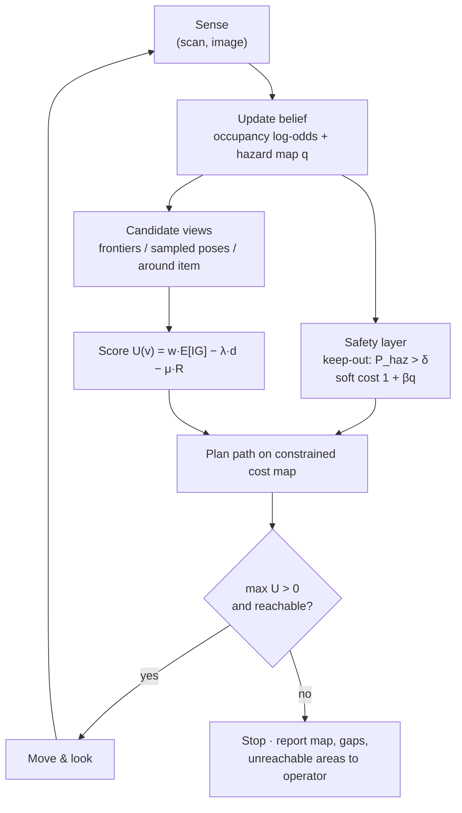

# 09.5 · Active perception & autonomous exploration

<div class="module-card">

**Prerequisites** [09.2 Uncertainty-aware ML](lessons/stage-09/lesson-02.md) (calibrated probabilities) · [05.6 Sensor fusion](lessons/stage-05/lesson-06.md) (expected information gain) · [06.7 Mapping & SLAM](lessons/stage-06/lesson-07.md) (occupancy grids, log-odds) · [06.8 Path & motion planning](lessons/stage-06/lesson-08.md) (Dijkstra/A*, cost maps) · [07.1 Decisions under uncertainty](lessons/stage-07/lesson-01.md) (value of information, POMDP framing).

**Estimated time** 7 h (3.5 h theory · 1 h simulator · 2.5 h programming) · **Level** Expert

**Next** [09.6 Trustworthy deployment](lessons/stage-09/lesson-06.md), then Capstone C1.

<p class="tags"><span>active perception</span><span>information theory</span><span>exploration</span><span>risk-aware planning</span><span>POMDP</span><span>multi-robot</span><span>Sim G · Sim A</span><span>P06 · P07</span></p>
</div>

## Why this matters

A robot is sent forward so that a person does not have to be. What the robot is *for* is
information: what is there, where exactly, what state it is in, which approach routes exist. Every
additional view costs time (and time on an incident is paid for by the cordon, the evacuated
public, the traffic diverted), battery, communications margin, and — close to a suspected hazard —
exposure of the platform itself. Classical EOD teleoperation leaves "where to look next" entirely to
the operator, who is simultaneously driving, framing the camera and communicating. **Active
perception** makes the choice of sensing action an explicit optimisation: maximise
task-relevant information per unit cost, subject to constraints such as keep-out zones around
uncertain hazards. The same machinery drives autonomous exploration of buildings, tunnels and
vehicles when communications are poor (the DARPA Subterranean Challenge is the public benchmark),
and multi-robot teams that divide the search. This lesson gives the mathematics; decisions about
the hazard itself remain human, as 07.x and 09.6 insist.

## Learning objectives

1. Define active perception (Bajcsy) and cast view selection as maximising expected utility of
   information minus cost.
2. Compute the entropy of an occupancy/belief map and the **expected information gain** (mutual
   information) of a measurement, including visibility through uncertain cells.
3. Implement **frontier-based exploration** (Yamauchi) and a next-best-view utility, and explain
   when greedy selection is near-optimal (submodularity).
4. Formulate **risk-aware** exploration with chance-constrained standoff from an uncertain hazard
   map, as hard keep-out and soft cost terms.
5. Explain exploration–exploitation trade-offs (UCB), the POMDP belief-update view of active
   sensing, and what reinforcement learning can and cannot responsibly do here (sim-to-real).
6. Allocate exploration targets across multiple robots with a sequential auction and state its
   failure modes.

## Theory

### 1. Active perception

Bajcsy (1988; revisited by Bajcsy, Aloimonos & Tsotsos, 2018) defined active perception as
*modelling and controlling the sensing process*: the agent chooses **why** to sense (the task),
**what** to sense (which variable), **where and how** (viewpoint, modality, resolution) and **when
to stop**. Formally, with belief $b$ over task-relevant state $X$, candidate sensing actions $a$
with cost $C(a)$, and future measurement $Z_a$:

$$ a^\star = \arg\max_{a}\; \underbrace{I(X;Z_a\mid b)}_{\text{expected information}} - \lambda\,C(a),
\qquad \text{stop when } \max_a\big[I(X;Z_a\mid b)-\lambda C(a)\big] \le 0 . $$

| Symbol | Meaning | Unit |
|---|---|---|
| $X$ | task-relevant hidden state (map cells, object class, pose) | — |
| $b$ | current belief (probability distribution over $X$) | — |
| $Z_a$ | (random) measurement produced by action $a$ | — |
| $I(X;Z_a\mid b)$ | mutual information = expected entropy reduction | bit |
| $C(a)$ | cost of the action (path length, time, energy, risk) | m, s, J, … |
| $\lambda$ | exchange rate between information and cost | bit per unit cost |

**Intuition.** Passive perception asks "what is in this image?". Active perception asks "which
image should I take?". The stopping rule is the value-of-information criterion of 07.1: stop when
the next look is not worth its price. $\lambda$ is not a tuning nuisance; it is a policy decision
about how much a bit is worth, and it changes with the incident phase.

### 2. Map entropy and the log-odds update

For an occupancy grid with independent cells of occupancy probability $p_c$ (06.7):

$$ H(\text{map}) = \sum_c h(p_c),\qquad h(p) = -p\log_2 p-(1-p)\log_2(1-p),\qquad
\ell_c \leftarrow \ell_c + \ln\frac{p(z\mid \text{occ})}{p(z\mid \text{free})} . $$

| Symbol | Meaning | Unit |
|---|---|---|
| $p_c$ | occupancy probability of cell $c$ | — |
| $h(p)$ | binary entropy | bit |
| $\ell_c = \ln\frac{p_c}{1-p_c}$ | log-odds of cell $c$ | nat |
| $p(z\mid\cdot)$ | sensor model (inverse sensor model in practice) | — |

**Intuition.** Unknown cells ($p=0.5$) carry 1 bit each; certain cells carry none. The map's total
entropy is a to-do list: exploration is the process of paying it down. Log-odds turn Bayesian
updating into addition — cheap enough to run for every ray.

**Numerical example.** A 50 m × 50 m area at 0.5 m resolution: 10 000 cells, 10 000 bits when
unknown. A single "hit" with $p(\text{hit}\mid\text{occ})=0.7$, $p(\text{hit}\mid\text{free})=0.3$
adds $\ln(0.7/0.3)=0.847$ nat to a cell's log-odds, moving $p$ from 0.5 to 0.7 and $h$ from 1 to
0.881 bit: 0.119 bit per observation. Weak sensors need many looks.

```python
import numpy as np

def h2(p):
    p = np.clip(p, 1e-12, 1 - 1e-12)
    return -(p * np.log2(p) + (1 - p) * np.log2(1 - p))

l = 0.0 + np.log(0.7 / 0.3)
p = 1 / (1 + np.exp(-l))
print(10_000 * h2(0.5), l, p, h2(p), 1 - h2(p))   # 10000 bits, 0.847, 0.7, 0.881, 0.119
```

<details class="answer"><summary>Exercise 1 — then reveal</summary>

A cell receives three independent "hit" observations with the 0.7/0.3 model, then one "miss". What
is its final probability and entropy? What would clamping log-odds at ±2 do after 10 hits?

*Answer.* Each hit adds 0.847, the miss subtracts 0.847: net $2\times0.847=1.695$ ⇒
$p=1/(1+e^{-1.695})=0.845$, $h=0.623$ bit. With clamping at +2, $p\le0.881$ ($h\ge0.527$ bit): the map
never becomes certain, so it can still change if the world changes — a deliberate trade of
confidence for adaptability.

</details>

### 3. Expected information gain of a measurement and of a view

For a binary cell with prior $p$ and a binary sensor with detection rate $\alpha=p(z{=}1\mid\text{occ})$
and false-alarm rate $\beta=p(z{=}1\mid\text{free})$:

$$ \mathrm{IG}(p) = h(p) - \Big[P(z{=}1)\,h\big(p^{+}\big) + P(z{=}0)\,h\big(p^{-}\big)\Big],\quad
P(z{=}1)=\alpha p+\beta(1-p),\ \ p^{+}=\frac{\alpha p}{P(z{=}1)},\ \ p^{-}=\frac{(1-\alpha)p}{P(z{=}0)} . $$

A view $v$ sees a cell only if the ray to it is not blocked. Treating cells along a ray as
independent, the probability that cell $k$ on a ray is reached is
$P_{\text{vis}}(k)=\prod_{j<k}(1-p_j)$, and

$$ \mathbb{E}[\mathrm{IG}(v)] \approx \sum_{c\,\in\,\text{rays}(v)} P_{\text{vis}}(c)\,\mathrm{IG}(p_c) . $$

| Symbol | Meaning | Unit |
|---|---|---|
| $\alpha,\beta$ | hit rate given occupied / given free | — |
| $p^{+},p^{-}$ | posterior after hit / after miss | — |
| $\mathrm{IG}$ | expected entropy reduction $=I(X;Z)$ | bit |
| $P_{\text{vis}}$ | probability the ray reaches the cell | — |

**Intuition.** Information gain is the *expected* drop in entropy — it is always ≥ 0 (a
measurement cannot increase expected uncertainty), largest where you are most uncertain *and* the
sensor discriminates well. The visibility term encodes the fact that unknown space may hide more
unknown space: a view into a doorway is worth less than its raw cell count suggests.

**Numerical example.** $\alpha=0.9$, $\beta=0.2$, $p=0.5$: $P(z{=}1)=0.55$, $p^+=0.818$,
$p^-=0.111$; $h(p^+)=0.684$, $h(p^-)=0.503$; $\mathrm{IG}=1-(0.55\cdot0.684+0.45\cdot0.503)=0.397$ bit.
For $p=0.9$: 0.163 bit; for $p=0.1$: 0.145 bit. A ray through cells with $p=[0.1,0.5,0.5,0.5]$ has
$P_{\text{vis}}=[1,0.9,0.45,0.225]$ and expected gain $0.145+0.397(0.9+0.45+0.225)=0.771$ bit,
versus 1.337 bit if occlusion is ignored.

```python
def ig_binary(p, a=0.9, b=0.2):
    pz1 = a * p + b * (1 - p)
    return h2(p) - (pz1 * h2(a * p / pz1) + (1 - pz1) * h2((1 - a) * p / (1 - pz1)))

def ray_ig(ps, a=0.9, b=0.2):
    vis = np.concatenate([[1.0], np.cumprod(1 - np.asarray(ps))[:-1]])
    return float(np.sum(vis * ig_binary(np.asarray(ps), a, b)))

print(ig_binary(0.5), ig_binary(0.9), ray_ig([0.1, 0.5, 0.5, 0.5]))   # 0.397 0.163 0.771
```

<details class="answer"><summary>Exercise 2 — then reveal</summary>

(a) Show that $\mathrm{IG}=0$ when $\alpha=\beta$. (b) For $p=0.5$, compare $\mathrm{IG}$ for a
sensor with $(\alpha,\beta)=(0.9,0.2)$ and one with $(0.6,0.4)$. (c) Why is summing per-cell IG
over a view an *upper bound* in practice even with the visibility term?

*Answer.* (a) If $\alpha=\beta$, $P(z{=}1)=\alpha$ and $p^+=p^-=p$: the measurement is independent of
the state. (b) 0.397 vs $1-h(0.6)=1-0.971=0.029$ bit — a weak sensor is worth 14× less per look.
(c) Cells are not truly independent (walls are continuous), sensor noise is correlated along a
ray and between successive views of the same region, and the robot may not reach the view pose
precisely — all of which reduce realised information below the sum.

</details>

### 4. Next-best-view and the greedy guarantee

Given candidate viewpoints $v$ (from frontiers, sampled poses, or around an object of interest),
**next-best-view** (NBV) picks

$$ v^\star = \arg\max_v \; U(v),\qquad U(v)=w_{\text{task}}\cdot\mathbb{E}[\mathrm{IG}(v)] - \lambda\,d(v) - \mu\,R(v), $$

where $d(v)$ is path cost from the current pose and $R(v)$ a risk term (Section 6). Weighting
matters: bits about a wall far away are not bits about the object's category. Task-weighted IG
uses entropy of the *task* variable (e.g. object class, orientation) rather than of the whole map.

If the information objective $F(S)$ of a set of views $S$ is **monotone submodular** (adding a view
never hurts, and helps less the more you already have — true for coverage-type objectives and, under
conditional-independence assumptions, for mutual information), greedy selection of $k$ views
satisfies

$$ F(S_{\text{greedy}}) \ge \left(1-\tfrac1e\right)F(S^\star_k) \approx 0.632\,F(S^\star_k). $$

**Intuition.** Greedy is not a hack: diminishing returns make myopic choices provably decent. The
guarantee breaks when path cost couples the views (the orienteering-style problem is harder),
which is why practical planners (e.g. the CERBERUS graph-based planner) use greedy local planning
plus a global re-positioning layer.

**Numerical example.** From the robot, view A yields 120 bit at path cost 60 m; view B 200 bit at
150 m. With $\lambda=0.5$ bit/m: $U_A=90$, $U_B=125$ ⇒ B. If B also passes near a suspected hazard
with risk term $R=3$ and $\mu=10$: $U_B=95$ — still B, narrowly; raise $\mu$ to 12 and A wins.

```python
def utility(ig, d, risk=0.0, lam=0.5, mu=10.0, w=1.0):
    return w * ig - lam * d - mu * risk
print(utility(120, 60), utility(200, 150), utility(200, 150, risk=3), utility(200, 150, risk=3, mu=12))
# 90 125 95 89
```

<details class="answer"><summary>Exercise 3 — then reveal</summary>

At what value of $\lambda$ are views A and B (without risk) equally good? Interpret $\lambda$ at an
incident where every minute of cordon costs a lot versus a slow survey task.

*Answer.* $120-60\lambda=200-150\lambda$ ⇒ $\lambda=0.889$ bit/m. Above it, A (short, cheap) wins.
When time is precious, $\lambda$ is high and the robot takes short, "good-enough" looks; on a
methodical survey (05.7), $\lambda$ is low and long detours for big information are acceptable.

</details>

### 5. Frontier-based exploration

Yamauchi (1997, "A frontier-based approach for autonomous exploration", Proc. IEEE CIRA) defined a
**frontier** as the boundary between known-free and unknown space: a free cell with at least one
unknown 4- or 8-neighbour. The algorithm:

1. Update the occupancy grid with the latest scan.
2. Detect frontier cells; cluster them (connected components) and discard small clusters.
3. Choose a target frontier — originally the *nearest reachable* one; modern variants maximise
   $U(v)$ from Section 4.
4. Plan a path on the cost map (06.8), drive, repeat. Terminate when no reachable frontier remains.

**Intuition.** Going to a frontier guarantees that the robot will see new space (the frontier is
by definition adjacent to unknown), so exploration is complete in a bounded, static environment.
Nearest-frontier greedy is simple and robust but causes back-and-forth "dithering"; utility-based
selection trades a little computation for much shorter total paths (see the programming exercise:
nearest-frontier travelled 415 cost units vs 296 for an information-weighted choice on the same
map).

| Variant | Target choice | Strength | Weakness |
|---|---|---|---|
| Nearest frontier (Yamauchi) | min path cost | simple, complete | dithering, ignores information |
| Utility frontier | max IG − λ·cost | efficient | needs IG prediction |
| Sampling-based NBV (RRT-style) | sample poses, score IG | 3D, sensor FOV aware | local minima; needs global layer |
| Coverage / boustrophedon | systematic sweep | provable coverage (05.7) | ignores map structure |

### 6. Risk-aware exploration: standoff from an uncertain hazard map

Suppose a (fictional) upstream detector provides a hazard belief $q_j$ for cells $j$ — the
probability that cell $j$ contains something the robot must not approach. A standoff radius $r_s$
(in abstract grid units here; real values come from organisational policy, 04.4) defines the
neighbourhood $\mathcal N_{r_s}(c)$. Assuming independence, the probability that *some* hazard lies
within standoff of cell $c$ is

$$ P_{\text{haz}}(c) = 1-\prod_{j\in\mathcal N_{r_s}(c)}(1-q_j), \qquad
\text{keep-out: } P_{\text{haz}}(c) > \delta,\qquad
\text{soft cost: } k(c) = 1+\beta\,q_c . $$

| Symbol | Meaning | Unit |
|---|---|---|
| $q_j$ | hazard probability of cell $j$ | — |
| $r_s$ | standoff radius | cells (m) |
| $P_{\text{haz}}(c)$ | probability of a hazard within standoff of $c$ | — |
| $\delta$ | acceptable risk level (chance constraint) | — |
| $\beta$ | soft-cost weight | cost per unit probability |

**Intuition.** A hard chance constraint expresses a rule ("never enter a cell where the chance of a
hazard within standoff exceeds $\delta$"); a soft cost expresses a preference. Use both: rules for
what must never happen, costs for what should be minimised. Two asymmetries matter. First,
**unknown is optimistic for exploration but pessimistic for safety** — a planner that treats unknown
cells as free to route through them will happily plan into unseen space next to a suspected
hazard. Second, the hazard map itself is uncertain and must be *calibrated* (09.2): a detector with
overconfident low scores silently shrinks the keep-out zone.

**Numerical example.** Three cells within standoff have $q=0.05,0.02,0.10$:
$P_{\text{haz}}=1-0.95\cdot0.98\cdot0.90=0.162$. With $\delta=0.05$ the cell is keep-out; with
$\delta=0.2$ it is allowed (with soft cost).

```python
def p_hazard_within(qs):
    return 1 - np.prod(1 - np.asarray(qs))
print(p_hazard_within([0.05, 0.02, 0.10]))   # 0.162
```

Richer formulations replace the expectation with a tail measure (conditional value-at-risk of path
cost), or plan in belief space so that the robot can take a *sensing* action that shrinks the
keep-out zone (a better look from standoff may reveal that $q$ was a false alarm) — active
perception serving safety.

<details class="answer"><summary>Exercise 4 — then reveal</summary>

A detector reports $q=0.02$ for each of 20 cells in a standoff window. (a) Keep-out at
$\delta=0.2$? (b) The detector is later found to be under-confident by a factor of 2 in odds.
Recompute. (c) Why does independence matter here?

*Answer.* (a) $1-0.98^{20}=0.332>0.2$ ⇒ keep-out. (b) Odds $0.0204\to0.0102$ ⇒ $q=0.0101$;
$1-0.9899^{20}=0.184<0.2$ ⇒ allowed — a calibration error flips a safety decision. (c) Neighbouring
detections are strongly correlated (one object spans many cells); treating them as independent
overstates $P_{\text{haz}}$ (conservative here). Cluster detections into objects before applying
the constraint to avoid an over-large, unusable keep-out map.

</details>

### 7. Exploration versus exploitation

Should the robot re-inspect the region that already looks interesting (exploit) or look somewhere
not yet examined (explore)? The multi-armed bandit abstraction, with Upper Confidence Bound (UCB1)
selection:

$$ a_t = \arg\max_a\; \hat\mu_a + c\sqrt{\frac{\ln t}{n_a}} . $$

| Symbol | Meaning | Unit |
|---|---|---|
| $\hat\mu_a$ | empirical mean reward of option $a$ | reward |
| $n_a$ | times $a$ has been chosen | — |
| $t$ | total choices so far | — |
| $c$ | exploration coefficient | reward |

**Intuition.** Optimism under uncertainty: rarely-tried options get a bonus that shrinks as they
are tried. In exploration the IG term *is* the optimism bonus — unknown space carries entropy. In a
safety context, the "reward" must never include approaching a hazard to learn about it; exploration
bonuses belong to information about the *environment*, bounded by the constraints of Section 6.

**Numerical example.** $t=100$, $c=2$. Region A: $\hat\mu=0.6$, $n=40$ ⇒ $0.6+2\sqrt{4.605/40}=1.279$.
Region B: $\hat\mu=0.4$, $n=5$ ⇒ $0.4+2\sqrt{4.605/5}=2.319$ ⇒ choose B.

```python
ucb = lambda mu, n, t, c=2.0: mu + c * np.sqrt(np.log(t) / n)
print(ucb(0.6, 40, 100), ucb(0.4, 5, 100))   # 1.279 2.319
```

<details class="answer"><summary>Exercise 5 — then reveal</summary>

How many visits must B accumulate (keeping $\hat\mu_B=0.4$, $t\approx100$) before A is preferred?

*Answer.* Need $0.4+2\sqrt{4.605/n_B}<1.279$ ⇒ $\sqrt{4.605/n_B}<0.4395$ ⇒ $n_B>23.8$ ⇒ 24 visits.

</details>

### 8. Belief-space planning and POMDPs

A POMDP $(\mathcal S,\mathcal A,\mathcal O,T,O,R,\gamma)$ plans over **beliefs** $b(s)$. After action
$a$ and observation $o$:

$$ b'(s') = \eta\; O(o\mid s',a)\sum_{s} T(s'\mid s,a)\,b(s) . $$

| Symbol | Meaning |
|---|---|
| $T(s'\mid s,a)$ | transition model |
| $O(o\mid s',a)$ | observation model (sensor) |
| $R(s,a)$ | reward (includes cost of time and risk) |
| $\eta$ | normaliser |
| $\gamma$ | discount factor |

**Intuition.** In a POMDP, information gathering is not a separate objective: it emerges because
better beliefs lead to better later decisions. That is the formal root of value of information
(07.1). Exact solution is intractable beyond toy sizes; practice uses point-based solvers, online
tree search (POMCP-style), or approximations such as planning over mean-and-covariance beliefs —
the "uncertainty-aware autonomy" of JPL's NeBula SubT architecture.

**Numerical example.** A static binary state "region contains an item of interest" with prior 0.2
and a look action whose sensor has $P(\text{alarm}\mid\text{item})=0.8$,
$P(\text{alarm}\mid\text{none})=0.1$. After one alarm: $b=0.16/(0.16+0.08)=0.667$; after a second
independent alarm: $0.941$.

```python
def belief_update(b, p_o_given_s1, p_o_given_s0):
    num = p_o_given_s1 * b
    return num / (num + p_o_given_s0 * (1 - b))
b1 = belief_update(0.2, 0.8, 0.1); print(b1, belief_update(b1, 0.8, 0.1))   # 0.667 0.941
```

<details class="answer"><summary>Exercise 6 — then reveal</summary>

Starting from $b=0.2$, what is the belief after one alarm followed by one no-alarm? Is the order
important?

*Answer.* After alarm 0.667; no-alarm likelihoods 0.2 vs 0.9: $0.667\cdot0.2/(0.1333+0.333\cdot0.9)=0.1333/0.4333=0.308$.
Order does not matter for a static state with conditionally independent observations (the
likelihood ratios multiply: $0.25\cdot8\cdot(0.2/0.9)=0.444$ odds ⇒ 0.308).

</details>

### 9. Reinforcement learning for navigation — and its caveats

RL learns a policy from interaction, e.g. tabular Q-learning:

$$ Q(s,a)\leftarrow Q(s,a)+\alpha\Big[r+\gamma\max_{a'}Q(s',a')-Q(s,a)\Big]. $$

| Symbol | Meaning |
|---|---|
| $\alpha$ | learning rate |
| $r$ | immediate reward |
| $\gamma$ | discount |
| $Q(s,a)$ | estimated return from taking $a$ in $s$ |

**Numerical example.** $Q=0$, $r=-1$ (time penalty), $\gamma=0.95$, $\max Q(s',\cdot)=2$,
$\alpha=0.1$: $Q\leftarrow0.1(-1+1.9)=0.09$.

```python
def q_update(q, r, q_next_max, alpha=0.1, gamma=0.95):
    return q + alpha * (r + gamma * q_next_max - q)
print(q_update(0.0, -1.0, 2.0))   # 0.09
```

Deep RL policies for local navigation, locomotion over rubble and exploration heuristics are
trained in simulation because real trials are slow and destructive. The **sim-to-real** caveats
(09.3) are acute:

| Caveat | Why it bites in EOD robotics | Mitigation |
|---|---|---|
| Dynamics gap (tracks on gravel, stairs, mud) | policy exploits simulator contact artefacts | domain randomisation (Tobin et al.), system identification, real-world fine-tuning |
| Perception gap (rendered vs real images, thermal) | features never seen in sim | train on privileged state; distil to sensors with augmentation; test on real data |
| Reward misspecification | "maximise area seen" learns to spin in place near a window | shaped, audited rewards; constraint terms, not just penalties |
| Unsafe exploration during learning | the robot cannot learn "keep-out" by violating it | constrained RL, **shielding** (a verified rule layer vetoes unsafe actions), offline RL |
| Verification | a neural policy has no inspectable logic | use RL for low-level skills inside a verifiable high-level planner; T&E in 09.6 |

<div class="callout key">

**Design rule.** Let learned policies decide *how* to move and possibly *where to look*; let
explicit, auditable constraints decide *where the robot must not go*; let a human decide what the
information means for the incident.

</div>

### 10. Multi-robot exploration and task allocation

Two or more robots should not explore the same frontier. A **sequential single-item auction**:
each round, every free robot bids its cost (e.g. path length minus task utility) for each
unassigned target; the lowest bid overall wins; repeat. Coordinated exploration (Burgard et al.)
additionally *discounts* the utility of targets near already-assigned ones, since their views
overlap.

**Numerical example.** Costs:

| | F1 | F2 | F3 |
|---|---|---|---|
| R1 | 4 | 7 | 9 |
| R2 | 5 | 3 | 6 |

Round 1: lowest bid R2→F2 (3). Round 2: R1's best remaining is F1 (4). Total 7, which is optimal for
two assignments here.

```python
def sequential_auction(C):
    C = np.array(C, float); assigned = {}
    while len(assigned) < min(C.shape):
        r, t = np.unravel_index(np.argmin(C), C.shape)
        assigned[int(r)] = int(t); C[r, :] = np.inf; C[:, t] = np.inf
    return assigned
print(sequential_auction([[4, 7, 9], [5, 3, 6]]))   # {1: 1, 0: 0}
```

**Intuition.** Auctions are decentralisable (robots only need to exchange bids), degrade gracefully
under partial communication, and are near-optimal when tasks are not strongly coupled. They are
greedy, though, and can be arbitrarily bad in adversarial cost structures; optimal assignment
(Hungarian algorithm, $O(n^3)$) is cheap for small teams if communication allows it. SubT lessons:
communications is the binding constraint — robots must carry out allocated work while
disconnected and re-synchronise maps when links return.

<details class="answer"><summary>Exercise 7 — then reveal</summary>

Construct a 2×2 cost matrix where the sequential auction is worse than optimal, and compute both.

*Answer.* R1: F1 = 1, F2 = 2; R2: F1 = 2, F2 = 10. Auction: R1→F1 (1), then R2→F2 (10): total 11.
Optimal: R1→F2, R2→F1: total 4. The greedy first win "steals" the target that the other robot
needed.

</details>

## Visual explanation



The loop is the whole lesson: belief → candidate actions → value minus cost, filtered by hard
constraints → act → belief. The operator sits outside it, setting $\lambda$, $\delta$ and the
standoff, and receives both the map and *what remains unknown*.

<iframe class="sim-frame" src="sims/robotics-engineering/index.html?embed=1" height="720" loading="lazy"></iframe>

<a class="sim-link" href="sims/robotics-engineering/index.html" target="_blank">Open Sim G full-screen ↗</a>

## Worked example — mapping approaches to a fictional item in a warehouse

*Fictional scenario.* A single UGV must map a 20 m × 20 m warehouse (0.5 m cells, 1600 cells,
initially 1600 bits of map entropy) and the approaches to "item X" reported near the north-east
racks. An upstream detector (calibrated per 09.2) provides a hazard map with a cluster of cells at
$q=0.6$ around the report. Policy provides standoff $r_s=3$ cells and $\delta=0.2$ (abstract units
for this exercise).

1. **Keep-out.** Any cell whose 7×7 window includes one $q=0.6$ cell has $P_{\text{haz}}\ge0.6>0.2$:
   keep-out. For a 3×3 cluster that is a 9×9 = 81-cell exclusion zone.
2. **Candidate views.** Frontier clusters F1 (along the west wall, 35 m away, predicted
   $\mathbb E[\mathrm{IG}]=180$ bit) and F2 (a doorway with an unknown room behind, 12 m away, 90 bit
   after the visibility discount — the raw cell count suggested 160).
3. **Utility with $\lambda=2$ bit/m.** $U_1=180-70=110$; $U_2=90-24=66$ ⇒ F1. With
   $\lambda=5$ (time pressure): $U_1=5$, $U_2=30$ ⇒ F2.
4. **Task weighting.** The operator's actual question is "what are the approach routes to item X?".
   Weight cells within 8 m of the report ×3 (outside keep-out): F2 overlooks those cells, its
   task-weighted IG becomes 200 bit, and it wins at either $\lambda$.
5. **Looking from standoff.** The best *sensing* view of item X itself is a pose just outside the
   keep-out with line of sight — an NBV problem around an object, scored on entropy of the object's
   category belief, not on map cells.
6. **Termination and reporting.** Stop when no reachable frontier has $U>0$. Report: the map,
   the keep-out zone, which areas remain unknown *because* they are only reachable through keep-out,
   and the belief about item X with its uncertainty. The human decides what happens next (07.2).

## Simulation work

<div class="callout sim">

**Sim G (robotics engineering)** — obstacle course with noisy sensors. (1) Drive the course
manually while logging the fraction of the map observed versus time. (2) Load or write a
frontier-following controller and compare coverage-versus-time with your manual run. (3) Add a
"no-go" region and observe how the planner's path and total time change as you enlarge it.

**Sim A (scene assessment)** — [open](sims/scene-assessment/index.html). Place the robot and sensors
around a fictional item and ask: which *next* sensing action most reduces uncertainty about the
scene, and does it respect the cordon and standoff? Compare your choice with the IG ranking.

</div>

## Practical exercises

<details class="answer"><summary>P1 — information per metre (calculation)</summary>

A robot with the (0.9, 0.2) sensor can reach two poses: pose A sees 60 unknown cells ($p=0.5$) at
10 m; pose B sees 200 cells of which 150 have $p=0.9$ and 50 have $p=0.5$, at 30 m. Which has more
information per metre?

*Answer.* A: $60\cdot0.397=23.8$ bit ⇒ 2.38 bit/m. B: $150\cdot0.163+50\cdot0.397=24.5+19.9=44.4$ bit ⇒
1.48 bit/m. A, despite seeing fewer cells: confirming what is already believed is worth little.

</details>

<details class="answer"><summary>P2 — keep-out sensitivity (interpretation)</summary>

Your programming-exercise map has 145 keep-out cells at $\delta=0.2$ and 141 at $\delta=0.5$. Why so
insensitive, and what does that say about where the risk decision really lives?

*Answer.* The keep-out region is dominated by the $q=0.6$ cluster, whose windows exceed both
thresholds; only the $q=0.3$ region's edge changes. The decision is controlled by the detector's
calibrated $q$ values and by $r_s$, not by $\delta$ — so validating calibration (09.2) and
setting standoff by policy matter more than tuning $\delta$.

</details>

<details class="answer"><summary>P3 — reward design (design)</summary>

Critique the RL reward "+1 per newly observed cell, −0.01 per step" for an exploration policy in a
building with a suspected hazard, and propose a better formulation.

*Model answer.* It ignores risk entirely (the policy will enter keep-out if it sees more there);
rewards cells regardless of task relevance; encourages spinning near windows or open spaces;
ignores comms loss and battery. Better: constrained MDP — reward task-weighted entropy reduction
minus time; hard constraints (shield) for keep-out and minimum battery/return reserve; train in
randomised simulation; verify the shield independently of the learned policy.

</details>

<details class="answer"><summary>P4 — two robots, one link (decision)</summary>

Two robots explore a building; only one has reliable communication to the operator. How would you
allocate frontiers and what fallback behaviour do you specify for the other?

*Model answer.* Auction frontiers with a bid term penalising expected comms loss for the
disconnected-prone robot (or assign it frontiers near the relay robot's coverage). Fallback: on link
loss, finish the current assigned frontier, then return to the last known comms point to sync the
map (06.9); never enter new keep-out regions without a map merge; log everything for the debrief.

</details>

## Programming exercise — frontier + information-gain explorer with a hazard standoff

**Goal.** Build an exploration loop on a grid: log-odds occupancy updates from a simulated range
sensor, frontier detection, expected-IG prediction on the *belief* map with visibility, Dijkstra
path cost on a map with soft hazard cost and hard chance-constrained keep-out, and utility-based
target choice.

- **Input:** 40×40 ground-truth grid with walls; fictional hazard-belief field $q$; standoff 3
  cells; $\delta=0.2$; $\lambda$ values.
- **Output:** number of views, total path cost, fraction of map known, keep-out cell count.
- **Constraints:** NumPy + standard library; the IG *prediction* must not use ground truth; the robot
  must never enter a keep-out cell; ≤ 5 s run time.
- **Expected behaviour:** > 99 % of the reachable map known; larger $\lambda$ shortens total path up
  to a point, while pure nearest-frontier ($\lambda\to\infty$) back-tracks and travels further.
- **Test cases:** (i) empty hazard map ⇒ 0 keep-out cells; (ii) a single $q=0.6$ cell ⇒ exactly
  $(2r_s+1)^2=49$ keep-out cells away from borders; (iii) assert every visited pose has
  `ko[pos] == False`; (iv) a map with a room reachable only through keep-out ⇒ it remains unknown and
  is reported.
- **Extensions:** replace $q$ by a belief that is itself updated by a noisy hazard sensor with
  limited range (active perception for safety); add a second robot with auction allocation; add
  a battery budget with a return-to-base constraint; replace grid IG with task-weighted IG around
  a point of interest.

```python
import heapq
from functools import lru_cache
import numpy as np

N = 40                                     # 40 x 40 cells (fictional site; abstract units)
L_HIT, L_MISS, L_CLAMP = 0.85, -0.85, 4.0  # log-odds increments and clamp

occ_true = np.zeros((N, N), bool)          # ground truth, used ONLY by the simulated sensor
occ_true[0, :] = occ_true[-1, :] = occ_true[:, 0] = occ_true[:, -1] = True
occ_true[12, 1:28] = True; occ_true[26, 12:39] = True; occ_true[1:10, 20] = True
haz_q = np.zeros((N, N))                   # fictional hazard belief from an upstream detector
haz_q[18:21, 30:33] = 0.6
haz_q[33:35, 6:8] = 0.3

def entropy(p):
    p = np.clip(p, 1e-9, 1 - 1e-9)
    return -(p * np.log2(p) + (1 - p) * np.log2(1 - p))

@lru_cache(maxsize=None)
def sensor_rays(r, c, R=6):
    """Simulated range sensor (uses ground truth): 72 rays; stop at first wall."""
    seen = {}
    for th in np.linspace(0, 2 * np.pi, 72, endpoint=False):
        for k in np.arange(0.5, R + 0.5, 0.5):
            i, j = int(round(r + k * np.sin(th))), int(round(c + k * np.cos(th)))
            if not (0 <= i < N and 0 <= j < N):
                break
            if occ_true[i, j]:
                seen[(i, j)] = True
                break
            seen.setdefault((i, j), False)
    return seen

RAYS = [[(k * np.sin(th), k * np.cos(th)) for k in np.arange(0.5, 6.5, 0.5)]
        for th in np.linspace(0, 2 * np.pi, 36, endpoint=False)]

def predicted_ig(p, H, r, c):
    """Expected information of a view, on the BELIEF map: entropy x P(ray reaches cell)."""
    seen = {}
    for ray in RAYS:
        vis, last = 1.0, None
        for di, dj in ray:
            i, j = int(round(r + di)), int(round(c + dj))
            if not (0 <= i < N and 0 <= j < N):
                break
            if (i, j) == last:
                continue
            last = (i, j)
            seen[(i, j)] = max(seen.get((i, j), 0.0), vis)
            vis *= 1 - p[i, j]
            if vis < 0.05:
                break
    return sum(v * H[cell] for cell, v in seen.items())

def sense(logodds, r, c):
    for (i, j), hit in sensor_rays(int(r), int(c)).items():
        logodds[i, j] = np.clip(logodds[i, j] + (L_HIT if hit else L_MISS), -L_CLAMP, L_CLAMP)

def keep_out(q, standoff=3, delta=0.2):
    """Forbidden if P(any hazard within standoff) = 1 - prod(1 - q) > delta."""
    logfree = np.log1p(-np.clip(q, 0, 0.999))
    ko = np.zeros((N, N), bool)
    for i in range(N):
        for j in range(N):
            w = logfree[max(0, i - standoff):i + standoff + 1, max(0, j - standoff):j + standoff + 1]
            ko[i, j] = 1 - np.exp(w.sum()) > delta
    return ko

def dijkstra(cost, start):
    dist = np.full((N, N), np.inf); dist[start] = 0.0; pq = [(0.0, start)]
    while pq:
        d, (i, j) = heapq.heappop(pq)
        if d > dist[i, j]:
            continue
        for a, b in ((i + 1, j), (i - 1, j), (i, j + 1), (i, j - 1)):
            if 0 <= a < N and 0 <= b < N and np.isfinite(cost[a, b]) and d + cost[a, b] < dist[a, b]:
                dist[a, b] = d + cost[a, b]; heapq.heappush(pq, (dist[a, b], (a, b)))
    return dist

def frontiers(p):
    free, unknown = p < 0.4, np.abs(p - 0.5) < 0.1
    f = np.zeros_like(free)
    f[1:-1, 1:-1] = free[1:-1, 1:-1] & (unknown[:-2, 1:-1] | unknown[2:, 1:-1]
                                        | unknown[1:-1, :-2] | unknown[1:-1, 2:])
    return [tuple(x) for x in np.argwhere(f)]

def explore(lam=0.5, beta=4.0, max_steps=80, start=(35, 35)):
    logodds, pos, path = np.zeros((N, N)), start, 0.0
    ko = keep_out(haz_q)
    for step in range(max_steps):
        assert not ko[pos], "entered keep-out"
        sense(logodds, *pos)
        p = 1 / (1 + np.exp(-logodds))
        cost = np.where(p > 0.65, np.inf, 1.0 + beta * haz_q)   # walls impassable; soft hazard cost
        cost[ko] = np.inf                                        # hard standoff constraint
        dist, H = dijkstra(cost, pos), entropy(p)
        cands = [f for f in frontiers(p) if not ko[f] and np.isfinite(dist[f])]
        if not cands:
            break
        best = max(cands, key=lambda f: predicted_ig(p, H, *f) - lam * dist[f])
        path += dist[best]; pos = best
    p = 1 / (1 + np.exp(-logodds))
    return step + 1, path, (np.abs(p - 0.5) > 0.1).mean(), int(ko.sum())

for lam in (0.1, 0.5, 2.0, 100.0):          # lambda -> large = nearest frontier (Yamauchi)
    n, plen, known, nko = explore(lam=lam)
    print(f"lambda={lam:5.1f}: {n:2d} views, path cost {plen:6.1f}, map known {known:5.1%}, keep-out {nko}")
```

This extends [Project P06](projects/p06-path-planning/README.md) (cost-map planning) and
[Project P07](projects/p07-slam/README.md) (occupancy mapping); replacing the perfect pose with
your P07 SLAM estimate is the natural next step toward Capstone C1.

## Reading

- Bajcsy, R., Aloimonos, Y. & Tsotsos, J. K., "Revisiting Active Perception", *Autonomous Robots*
  42(2):177–196 (2018), https://doi.org/10.1007/s10514-017-9615-3 — the definition and taxonomy
  (why/what/how/when/where); read sections 1–3 and the conclusions.
- Thrun, S., Burgard, W. & Fox, D., *Probabilistic Robotics*, MIT Press (2005),
  https://mitpress.mit.edu/9780262201629/probabilistic-robotics/ — ch. 9 (occupancy grids) and
  ch. 17 (exploration: information gain, frontier methods, multi-robot coordination).
- LaValle, S. M., *Planning Algorithms*, Cambridge UP (2006), https://lavalle.pl/planning/ —
  ch. 11–12 (planning under sensing uncertainty, information spaces): the formal backbone of
  belief-space planning.
- Tranzatto, M. et al., "Team CERBERUS Wins the DARPA Subterranean Challenge: Technical Overview and
  Lessons Learned" (2022), https://arxiv.org/abs/2207.04914 — the exploration-planner and
  single-operator sections: what information-driven exploration looks like in a fielded system.
- Agha, A. et al., "NeBula: Team CoSTAR at the DARPA Subterranean Challenge" (2021),
  https://arxiv.org/abs/2103.11470 — belief-space, uncertainty-aware autonomy architecture.
- Chung, T. H., Orekhov, V. & Maio, A., "Into the Robotic Depths: Analysis and Insights from the
  DARPA Subterranean Challenge", *Annu. Rev. Control Robot. Auton. Syst.* (2023),
  https://www.annualreviews.org/content/journals/10.1146/annurev-control-062722-100728 — comms-limited
  multi-robot lessons from the programme manager's view.

Also cited: Yamauchi, B., "A frontier-based approach for autonomous exploration", *Proc. IEEE CIRA*
(1997); Tobin et al., domain randomisation (2017), https://arxiv.org/abs/1703.06907. Full
bibliographic entries: [curriculum/sources.md](curriculum/sources.md).

## Assessment

1. *(Conceptual)* Explain why mutual information is non-negative and why a view's predicted IG
   must be computed on the belief map rather than on ground truth — what goes wrong in simulation
   if you do the latter?
2. *(Mathematical)* Compute $\mathrm{IG}$ for $p=0.5$ with a symmetric sensor $\alpha=1-\beta=0.95$.
   Compare with $\alpha=0.9,\beta=0.2$.
3. *(Interpretation)* An exploration run finishes with 12 % of the site unknown. List three distinct
   reasons, and which ones the operator must be told about.
4. *(Design)* Specify how you would combine a chance-constrained keep-out, a soft hazard cost and an
   RL local-navigation policy in one architecture, stating which component is allowed to override
   which.
5. *(Computation)* Five cells in a standoff window have $q=0.04$ each. For which $\delta$ values is
   the cell allowed?

<details class="answer"><summary>Answers to 2 and 5</summary>

2. Symmetric: $P(z{=}1)=0.5$, $p^+=0.95$, $p^-=0.05$, $h=0.286$ ⇒ $\mathrm{IG}=1-0.286=0.714$ bit
   (vs 0.397): the more discriminative sensor is worth nearly twice as much per look.
5. $P_{\text{haz}}=1-0.96^5=0.185$ ⇒ allowed for $\delta\ge0.185$.

</details>

## Expert extension

- **Adaptive submodularity.** When observations are revealed as you go, *adaptive* greedy policies
  retain constant-factor guarantees under adaptive submodularity — the right framework for
  sequential NBV.
- **Informative path planning.** Optimise whole paths (not single views) for information under a
  budget: orienteering-style formulations, branch-and-bound, or sampling-based (RRT-IG) planners.
- **Gaussian-process hazard maps.** Replace independent cells with a GP over space so that one
  detection raises nearby $q$ smoothly; derive the chance constraint with the GP predictive
  distribution.
- **Safe RL with shields.** Synthesise a shield from a formal specification ("never enter keep-out;
  always retain return energy") and prove that any policy composed with it is safe.
- **Multi-robot belief sharing under intermittent comms.** Map merging with unknown relative pose
  and consistent information fusion (covariance intersection) when double-counting is possible.

## What comes next

[09.6](lessons/stage-09/lesson-06.md) asks whether all of this can be trusted: how perception can be
fooled or degraded, how to monitor for shift, how to explain and present uncertain outputs to an
operator, and how to test and argue safety for a system that includes learned components. Capstone
C1 integrates 06.x and 09.4–09.5 into an autonomous inspection loop.
