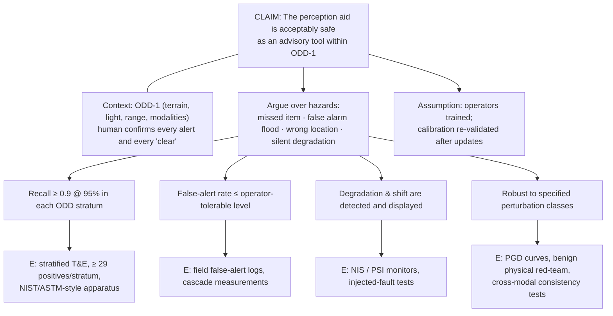

# 09.6 · Trustworthy deployment: robustness, explainability, edge inference and the human in the loop

<div class="module-card">

**Prerequisites** [09.1 Perception tasks](lessons/stage-09/lesson-01.md) (recall at fixed FAR) · [09.2 Uncertainty-aware ML](lessons/stage-09/lesson-02.md) (calibration, conformal prediction) · [09.3 Synthetic data & sim-to-real](lessons/stage-09/lesson-03.md) · [05.1 Detection theory](lessons/stage-05/lesson-01.md) (ROC, base rates) · [06.5 Teleoperation & HMI](lessons/stage-06/lesson-05.md) (supervisory control, workload) · [06.6 State estimation](lessons/stage-06/lesson-06.md) (innovation tests).

**Estimated time** 8 h (4 h theory · 1 h simulator · 3 h programming) · **Level** Expert

**Next** [Project P12 — Human-in-the-loop decision support](projects/p12-hitl-decision/README.md), Capstones, and the case studies of Stage 10 (e.g. [counter-IED robots](case-studies/cs06-counter-ied-robots.md)).

<p class="tags"><span>adversarial robustness</span><span>distribution shift</span><span>explainability</span><span>edge AI</span><span>human factors</span><span>T&amp;E</span><span>assurance</span><span>Sim J</span><span>P12</span></p>
</div>

## Why this matters

A detector that scores 0.95 mAP on its test set is not a deployable EOD capability. Deployment asks
different questions. *Does it still work* when the lens is dusty, the light is low, the soil is a
new colour, the thermal core is mid-recalibration? *Can it be fooled* — by accident or by someone
who wants it to miss, or to cry wolf until operators stop listening? *Does it run* inside the power,
heat and latency budget of a battery-powered robot? *Does it help the operator* — or does it breed
automation bias on good days and alarm fatigue on bad ones? And *how would you convince* an
accreditation authority, with evidence, that the answer to each is yes within a stated operating
envelope? This lesson is the engineering of trust: testing and hardening learned perception,
monitoring it in service, designing the human–machine team around it, and arguing its safety.

<div class="callout boundary">

**Boundary.** Adversarial robustness is taught here strictly as **testing and hardening**: how
perception systems can be degraded or fooled *in general*, and how engineers evaluate, monitor and
mitigate that. Nothing in this lesson describes, or should be used for, concealing any real object
from any real detector, and no content is specific to explosive devices. Red-team exercises use
benign test objects, synthetic data and published academic attack classes.

</div>

## Learning objectives

1. Explain why high-dimensional models are vulnerable to small perturbations (linearity argument),
   and use FGSM/PGD as **evaluation tools** to produce robust-accuracy curves under a stated threat
   model; state what certified defences guarantee.
2. Design a physical-robustness test programme inspired by adversarial-patch and RP2 methodology,
   and specify cross-modal consistency checks against sensor spoofing and degradation.
3. Monitor for distribution shift with input statistics (PSI), innovation tests and calibration
   drift, and define alarm and response rules.
4. Compute and critique Grad-CAM-style explanations and name their documented failure modes.
5. Budget edge inference (quantisation error, compute/memory roofline, energy per frame) against
   a robot's power and latency limits.
6. Design operator displays and alert policies that counter automation bias and alarm fatigue,
   using base rates, cost-weighted thresholds and cascades.
7. Size a test campaign statistically and structure an **assurance case** for a safety-relevant ML
   component.

## Theory

### 1. Adversarial examples and the linearity argument

For a classifier with loss $\mathcal L(\theta,\mathbf x,y)$, the **fast gradient sign method** (FGSM)
builds a worst-case perturbation inside an $L_\infty$ ball of radius $\varepsilon$:

$$ \mathbf x' = \mathbf x + \varepsilon\,\operatorname{sign}\big(\nabla_{\mathbf x}\mathcal L(\theta,\mathbf x,y)\big). $$

For a linear score $s(\mathbf x)=\mathbf w^\top\mathbf x+b$ the worst-case change of the score is
exactly

$$ \max_{\|\boldsymbol\delta\|_\infty\le\varepsilon} |\mathbf w^\top\boldsymbol\delta| = \varepsilon\,\|\mathbf w\|_1 . $$

| Symbol | Meaning | Unit |
|---|---|---|
| $\mathbf x\in\mathbb R^d$ | input (e.g. pixels scaled to [0,1]) | — |
| $\varepsilon$ | perturbation budget per input dimension | same as $\mathbf x$ |
| $\nabla_{\mathbf x}\mathcal L$ | gradient of loss w.r.t. the input | — |
| $\|\mathbf w\|_1=\sum_i|w_i|$ | L1 norm of weights | score per input unit |
| $d$ | input dimension | — |

**Intuition.** Each pixel moves by an imperceptible $\varepsilon$, but the effect adds coherently
over $d$ dimensions; the score change grows like $d$ while the perturbation's per-pixel size stays
fixed. Deep networks are piecewise-linear enough for this to dominate (the Goodfellow et al.
"linearity" explanation). This is a statement about the *geometry of the learned function*, and
it is exactly why robustness must be *measured*, not assumed.

**Numerical example.** A 224×224×3 input: $d=150\,528$. With mean $|w_i|=0.001$ and a barely visible
$\varepsilon=2/255$, the worst-case score change is $150\,528\cdot0.001\cdot0.00784=1.18$ logits —
enough to flip a prediction with a 76 %/24 % confidence split (logit 1.15).

```python
import numpy as np
d = 224 * 224 * 3
print(d, d * 0.001 * 2 / 255, np.log(0.76 / 0.24))    # 150528, 1.18, 1.15
```

<details class="answer"><summary>Exercise 1 — then reveal</summary>

(a) Show that $\boldsymbol\delta=\varepsilon\,\mathrm{sign}(\mathbf w)$ attains $\varepsilon\|\mathbf w\|_1$.
(b) What is the worst-case score change for an $L_2$ budget $\|\boldsymbol\delta\|_2\le\varepsilon$?
(c) For the numbers above, what $L_2$ radius gives the same 1.18-logit change if all $|w_i|=0.001$?

*Answer.* (a) $\mathbf w^\top\boldsymbol\delta=\varepsilon\sum_i w_i\,\mathrm{sign}(w_i)=\varepsilon\sum|w_i|$;
Hölder's inequality shows it is the maximum. (b) $\varepsilon\|\mathbf w\|_2$ (Cauchy–Schwarz),
attained at $\boldsymbol\delta=\varepsilon\mathbf w/\|\mathbf w\|_2$. (c) $\|\mathbf w\|_2=0.001\sqrt{150528}=0.388$
⇒ $\varepsilon_2=1.18/0.388=3.04$ — i.e. the same $L_\infty$ perturbation has $L_2$ norm
$0.00784\sqrt{d}=3.04$. Threat models in different norms are not comparable without this conversion.

</details>

### 2. PGD as an evaluation tool; adversarial training; certification

**Projected gradient descent** (PGD) iterates FGSM-like steps of size $\alpha$ and projects back onto
the allowed set $\mathcal B_\varepsilon(\mathbf x)$:

$$ \mathbf x^{(k+1)} = \Pi_{\mathcal B_\varepsilon(\mathbf x)}\!\Big(\mathbf x^{(k)} + \alpha\,\operatorname{sign}\nabla_{\mathbf x}\mathcal L\big(\theta,\mathbf x^{(k)},y\big)\Big),\qquad
\text{robust accuracy}(\varepsilon)=\Pr\big[f(\mathbf x^{(K)})=y\big]. $$

**Adversarial training** solves the min–max problem
$\min_\theta\mathbb E\big[\max_{\boldsymbol\delta\in\mathcal B_\varepsilon}\mathcal L(\theta,\mathbf x+\boldsymbol\delta,y)\big]$,
typically trading some clean accuracy for robustness. **Certified** defences give guarantees: if the
logit vector is $L$-Lipschitz in $L_2$, a prediction with top-two margin $m>\sqrt2\,L\,\varepsilon$
cannot be changed by any $\|\boldsymbol\delta\|_2\le\varepsilon$; randomised smoothing with Gaussian
noise $\sigma$ certifies radius $R=\sigma\,\Phi^{-1}(\underline{p_A})$ where $\underline{p_A}$ is a
lower confidence bound on the top-class probability under noise.

| Symbol | Meaning |
|---|---|
| $\Pi_{\mathcal B}$ | projection (clipping) onto the $\varepsilon$-ball (and valid pixel range) |
| $\alpha$, $K$ | step size, number of steps |
| $L$ | Lipschitz constant of the network |
| $m$ | logit margin between top class and runner-up |
| $\sigma$, $\Phi^{-1}$ | smoothing noise std, inverse standard normal CDF |

**Intuition.** PGD is a *search for failure* inside a declared envelope — the ML analogue of
fuzzing. A robustness claim is only meaningful with (i) the threat model (norm, $\varepsilon$, what
the adversary knows), (ii) an attack strong enough to find failures (multiple restarts, adaptive
to the defence — weak attacks create false confidence through "gradient masking"), and (iii) the
full curve, not a single point.

**Numerical example.** A linear classifier on synthetic data with 200 features, each carrying mean
signal $\pm0.1$ in unit noise (programming exercise). PGD-10 robust accuracy: 0.919 clean, 0.873 at
$\varepsilon=0.02$, 0.757 at 0.05, 0.498 at 0.1. Theory predicts $\Phi\big((0.1-\varepsilon)\sqrt{200}\big)$
= 0.921, 0.871, 0.760, 0.500: at $\varepsilon$ equal to the per-feature signal the attack erases the
signal entirely. Randomised smoothing with $\sigma=0.25$ and $\underline{p_A}=0.99$ certifies
$R=0.25\cdot2.326=0.58$ (in $L_2$).

```python
from statistics import NormalDist
Phi, Phinv = NormalDist().cdf, NormalDist().inv_cdf
print([round(Phi((0.1 - e) * np.sqrt(200)), 3) for e in (0, 0.02, 0.05, 0.1)])   # theory curve
print(0.25 * Phinv(0.99), np.sqrt(2) * 1.0 * 0.5)                                 # 0.58 ; margin needed 0.71
```

<details class="answer"><summary>Exercise 2 — then reveal</summary>

(a) A network is 1-Lipschitz ($L=1$) in $L_2$. What logit margin certifies robustness to
$\varepsilon_2=0.5$? (b) A defence reports 80 % robust accuracy against FGSM at $\varepsilon=8/255$ but
50 % against PGD-50 with 10 restarts. Which number do you put in the evaluation report, and what
does the gap suggest? (c) With randomised smoothing, what must $\underline{p_A}$ be for a radius of
0.5 at $\sigma=0.25$?

*Answer.* (a) $m>\sqrt2\cdot1\cdot0.5=0.707$. (b) The PGD number (the strongest attack found is an
upper bound on true robust accuracy); a large single-step vs multi-step gap is a classic sign of
gradient masking — test with adaptive and gradient-free attacks too. (c) $\Phi^{-1}(p)=2$ ⇒
$\underline{p_A}=\Phi(2)=0.977$.

</details>

### 3. Physical-world robustness: from adversarial patches to a test programme

Two papers define the physical threat class. Brown et al. (2017) showed that a **universal, printed
patch** placed in the scene can dominate a classifier's output regardless of the rest of the image.
Eykholt et al. (2018, RP2) showed that small **sticker perturbations** on a real object (road signs)
survive viewpoint, distance and lighting changes, and — importantly for us — contributed a
*methodology* for evaluating attacks in the lab and in the field. Both optimise an **expectation
over transformations** (EOT):

$$ \max_{\boldsymbol\delta\in\mathcal C}\;\mathbb E_{t\sim\mathcal T}\Big[\mathcal L\big(\theta,\,t(\mathbf x,\boldsymbol\delta),\,y\big)\Big], $$

where $\mathcal T$ is a distribution of physical conditions (pose, scale, lighting, blur, printing
and camera noise) and $\mathcal C$ the realisable perturbations.

| Symbol | Meaning |
|---|---|
| $\mathcal T$ | distribution over imaging transformations/conditions |
| $t(\mathbf x,\boldsymbol\delta)$ | image of the scene with the perturbation under condition $t$ |
| $\mathcal C$ | physically realisable set (location, size, printable colours) |

**Intuition (defensive reading).** EOT says a perturbation that must work across conditions is much
more constrained than a digital one — and gives the tester a *recipe for robustness evaluation*:
evaluate the model's worst case and average case over a realistic $\mathcal T$, not on pristine
images. For an EOD perception system the relevant failure classes are symmetric:

| Failure class | Consequence | Test (benign objects only) | Mitigations |
|---|---|---|---|
| Suppression (missed detection) | hazard not flagged | recall under scene clutter, occlusion, printed textures and patches placed *near* benign surrogate targets | multimodal corroboration (a printed pattern changes RGB, not thermal emission or depth geometry), ensembles with diverse architectures, human review of low-confidence regions |
| Induction (false alarm, decoy) | cordon time wasted; alarm fatigue; denial of service | false-alarm rate with patch-like textures on clutter objects | require cross-modal agreement before high-priority alerts; rate-limit and cluster alerts; operator feedback loop |
| Localisation shift | arm or robot directed to wrong place | box/segmentation error under patches | depth consistency check; confirm with second viewpoint (09.5) |

Additional practical hardening: input-anomaly detection (patches often create unusually
high-saliency, high-frequency regions), patch-robust architectures with bounded local receptive
influence, test-time augmentation consistency, and — most robust of all in this domain — keeping
the system in an **advisory** role where a human with independent evidence makes the call.

<details class="answer"><summary>Exercise 3 — then reveal</summary>

You have a fused RGB+thermal+depth detector. Design a physical robustness test matrix (factors and
levels) that is informative within a 2-day range-test budget, using only benign surrogate targets.

*Model answer.* Factors: illumination (day/dusk/night), range (3 levels), view angle (3), clutter
(low/high), printed high-contrast textures (none / on target surface / adjacent), sensor degradation
(clean / dusty lens / thermal FFC in progress). A full factorial is $3\cdot3\cdot3\cdot2\cdot3\cdot3=486$
cells — too many; use a fractional factorial or covering array (all pairs) (~20–30 runs) plus
repeats at the worst cells found. Measure recall at fixed FAR, per-modality contributions, and
whether cross-modal disagreement flags fired. Report worst-case and average, with confidence
intervals (Section 9).

</details>

### 4. Sensor spoofing and degradation; consistency checks

| Source | Natural / accidental | Deliberate (threat class, conceptual) | Typical detection |
|---|---|---|---|
| RGB camera | glare, low light, lens dirt, rain drops, motion blur | blinding with bright light | saturation fraction, sharpness metric, frame-to-frame consistency |
| Thermal (LWIR) | FFC freeze, thermal crossover (no contrast at dawn/dusk), emissivity | strong heat sources in view | NUC state flag, histogram collapse, cross-check with RGB edges |
| Depth (ToF/structured light/LiDAR) | sunlight, multipath, wet surfaces | injected or relayed returns | geometric consistency with stereo/odometry, returns violating physics (inside robot body) |
| GNSS | multipath in urban canyons | jamming, spoofing | innovation tests vs inertial/odometry; C/N0 anomalies |
| Radio link | fading, obstruction | jamming | link-quality metrics; loss-of-comms behaviours (06.9) |

The workhorse check is the **normalised innovation squared** (NIS) from a Kalman filter (06.6):

$$ \epsilon_k = \boldsymbol\nu_k^\top\mathbf S_k^{-1}\boldsymbol\nu_k \;\sim\; \chi^2_{m}\ \text{(if models are right)},\qquad
\text{flag if } \epsilon_k > \chi^2_{m,\,1-\alpha} . $$

| Symbol | Meaning |
|---|---|
| $\boldsymbol\nu_k=\mathbf z_k-\hat{\mathbf z}_{k\mid k-1}$ | innovation (measurement minus prediction) |
| $\mathbf S_k$ | innovation covariance |
| $m$ | measurement dimension |
| $\alpha$ | per-test false-alarm probability |

**Intuition.** A sensor that disagrees with everything else *more than its stated noise allows* is
either broken, in an unmodelled regime, or being interfered with. The test does not say which — it
says "stop trusting this input and tell someone".

**Numerical example.** $\boldsymbol\nu=(3,-1)$, $\mathbf S=\mathrm{diag}(4,1)$: $\epsilon=9/4+1=3.25<\chi^2_{2,0.95}=5.99$
⇒ consistent. At 10 Hz, a 5 % per-test threshold gives 30 false flags per minute — so use windowed
sums (the sum of $n$ NIS values is $\chi^2_{nm}$) or require persistence.

```python
nu, S = np.array([3.0, -1.0]), np.diag([4.0, 1.0])
print(nu @ np.linalg.solve(S, nu))   # 3.25 ; chi2(2) 95% = 5.991, 99% = 9.210
```

<details class="answer"><summary>Exercise 4 — then reveal</summary>

Show that for $m=2$ the $\chi^2$ threshold at level $1-\alpha$ is $-2\ln\alpha$, and compute the 99.9 %
threshold. Why is a closed form available here?

*Answer.* $\chi^2_2$ is exponential with mean 2: $P(\epsilon>x)=e^{-x/2}$ ⇒ $x=-2\ln\alpha$. For
$\alpha=0.001$: 13.8. (Check: $\alpha=0.05$ gives 5.99.)

</details>

### 5. Distribution-shift monitoring

Shift types: **covariate** ($p(\mathbf x)$ changes — new terrain, season, camera), **prior/label**
($p(y)$ changes — a different base rate of items), **concept** ($p(y\mid\mathbf x)$ changes — new item
types). A cheap first monitor is the **population stability index** on a scalar feature or score
binned into $B$ bins with reference proportions $e_i$ and live proportions $o_i$:

$$ \mathrm{PSI} = \sum_{i=1}^{B}(o_i-e_i)\ln\frac{o_i}{e_i} . $$

| Symbol | Meaning |
|---|---|
| $e_i$ | proportion in bin $i$ in the validation (reference) data |
| $o_i$ | proportion in bin $i$ in live data |
| PSI | symmetrised KL divergence between binned distributions (nats) |

**Intuition.** PSI is $\mathrm{KL}(o\|e)+\mathrm{KL}(e\|o)$ for the binned distributions. Common
industry heuristics treat < 0.1 as stable and > 0.25 as a major shift — these are rules of thumb,
not statistics; set thresholds by bootstrapping PSI on in-distribution data of the same sample size.
Monitor several signals: input statistics (brightness, thermal histogram, blur), model confidence
and OOD scores (ensembles, 09.2), **conformal coverage** on any labelled feedback, and alert rate.

**Numerical example.** Reference score bins $e=[0.25,0.25,0.25,0.25]$, live $o=[0.10,0.20,0.30,0.40]$:
contributions $0.137+0.011+0.009+0.071$ ⇒ PSI $=0.228$ — close to the "major" heuristic; investigate.

```python
e, o = np.full(4, 0.25), np.array([0.10, 0.20, 0.30, 0.40])
print(((o - e) * np.log(o / e)).sum())   # 0.228
```

<details class="answer"><summary>Exercise 5 — then reveal</summary>

(a) Why does PSI blow up when a live bin is empty, and what is the usual fix? (b) Prior shift:
the base rate of true items drops from 1 % in validation to 0.2 % in the new area, with the model
unchanged (sensitivity 0.95, FPR 0.05). What happens to PPV, and would PSI on the *input*
distribution necessarily detect it?

*Answer.* (a) $\ln(o_i/e_i)\to-\infty$; add a small pseudo-count (e.g. 0.5 per bin) or merge bins.
(b) PPV falls from $0.0095/(0.0095+0.0495)=0.161$ to $0.0019/(0.0019+0.0499)=0.037$. Inputs are
dominated by background, so the input distribution may barely change — prior shift is detected
through alert-rate and confirmation-rate monitoring, not input PSI.

</details>

### 6. Explainability — and how explanations fail

**Grad-CAM** for class $c$ and a convolutional layer with feature maps $A^k\in\mathbb R^{u\times v}$:

$$ \alpha_k^c=\frac{1}{uv}\sum_{i,j}\frac{\partial y^c}{\partial A^k_{ij}},\qquad
L^c_{\text{Grad-CAM}}=\mathrm{ReLU}\Big(\sum_k\alpha_k^c A^k\Big). $$

| Symbol | Meaning |
|---|---|
| $y^c$ | pre-softmax score of class $c$ |
| $A^k$ | $k$-th feature map of the chosen layer |
| $\alpha_k^c$ | importance of map $k$ for class $c$ (global-average gradient) |
| $L^c$ | coarse class-localisation heat map (upsampled to the image) |

**Intuition.** Weight each feature map by how much the class score increases with it, sum, keep the
positive part. The map lives at the layer's resolution (e.g. 7×7 for a 224-px input): each cell
covers 32×32 pixels, so it localises roughly, never precisely.

**Numerical example.** Two 2×2 maps: $A^1=\begin{pmatrix}1&0\\0&1\end{pmatrix}$ with all gradients 0.5
⇒ $\alpha_1=0.5$; $A^2=\begin{pmatrix}0&2\\2&0\end{pmatrix}$ with all gradients $-0.25$ ⇒
$\alpha_2=-0.25$. $\sum\alpha_kA^k=\begin{pmatrix}0.5&-0.5\\-0.5&0.5\end{pmatrix}$ ⇒ ReLU gives the
diagonal only.

```python
A = np.stack([[[1, 0], [0, 1]], [[0, 2], [2, 0]]]).astype(float)
grads = np.stack([np.full((2, 2), 0.5), np.full((2, 2), -0.25)])
alpha = grads.mean(axis=(1, 2))
print(np.maximum(0, np.tensordot(alpha, A, axes=1)))   # [[0.5 0] [0 0.5]]
```

Other families: input-gradient saliency and integrated gradients; occlusion/perturbation maps;
**counterfactual** explanations ("the smallest change to the input that flips the decision");
example-based explanations (nearest training examples). Documented failure modes:

| Failure mode | What happens | Consequence for EOD use |
|---|---|---|
| Insensitivity to the model ("sanity checks", Adebayo et al. 2018) | some saliency maps look nearly the same after randomising the weights — they behave like edge detectors | a plausible map is not evidence the model reasoned correctly |
| Low resolution / smoothing | Grad-CAM blobs cover object *and* surroundings | cannot tell "used the object" from "used the disturbed ground beside it" |
| Confirmation bias | humans accept maps that match expectations | explanations increase trust without increasing accuracy |
| Manipulability | explanations can be changed without changing predictions | cannot be a certification argument |
| Counterfactual realism | minimal changes may be off-manifold | "explanations" describe impossible inputs |

**Where explanations earn their keep:** *development and audit* — finding shortcut learning (a
detector keyed to a dataset artefact, a ruler, a watermark, a particular background), guiding
data fixes (the label-quality lesson of SULAND v2), and structured failure analysis. For the operator,
a better "explanation" is often evidential: *which modalities* support the alert, a crop at native
resolution, similar confirmed past cases, and a calibrated uncertainty.

<details class="answer"><summary>Exercise 6 — then reveal</summary>

Your thermal detector's Grad-CAM maps consistently highlight a band at the bottom of every positive
training image. What hypotheses do you test, and how?

*Answer.* Shortcut learning: positives were captured with a different rig/time/altitude so a
frame-edge artefact (vignetting, a visible robot part, a timestamp overlay) correlates with the
label. Tests: crop or mask the band and re-evaluate recall; check metadata balance between classes;
train on masked images; evaluate on data from a different rig. Also run a weight-randomisation
sanity check to ensure the map depends on the model at all.

</details>

### 7. Edge inference: quantisation, pruning, latency and energy

**Uniform affine quantisation** to $b$ bits over a range $[x_{\min},x_{\max}]$:

$$ s=\frac{x_{\max}-x_{\min}}{2^b-1},\quad z=\operatorname{round}\!\Big(\!-\frac{x_{\min}}{s}\Big),\quad
q=\operatorname{clip}\big(\operatorname{round}(x/s)+z,\,0,\,2^b-1\big),\quad \hat x=s(q-z),\quad
\sigma_{\text{q}}\approx\frac{s}{\sqrt{12}} . $$

A **roofline** latency estimate and energy per inference:

$$ t \approx \max\!\Big(\frac{\text{FLOP}}{\eta\,P_{\text{peak}}},\ \frac{\text{bytes moved}}{BW}\Big),\qquad E = P_{\text{avg}}\,t . $$

| Symbol | Meaning | Unit |
|---|---|---|
| $s, z$ | scale and zero-point | input unit, integer |
| $q$ | quantised integer | — |
| $\sigma_q$ | RMS rounding error (uniform) | input unit |
| $\eta$ | achieved fraction of peak throughput | — |
| $P_{\text{peak}}$ | peak ops per second | op s⁻¹ |
| $BW$ | memory bandwidth | B s⁻¹ |
| $P_{\text{avg}}$ | power while inferring | W |
| $E$ | energy per inference | J |

**Intuition.** Int8 cuts memory and bandwidth 4× versus fp32 and uses much cheaper integer
arithmetic; the price is a rounding noise of $s/\sqrt{12}$ plus clipping of outliers — usually
negligible after calibration, sometimes disastrous for a layer with a wide activation range
(per-channel scales and quantisation-aware training fix most cases). **Pruning** removes weights
(unstructured sparsity rarely speeds up real hardware) or whole channels (structured — does).
Always re-measure recall at fixed FAR and **calibration** (09.2) after compression: quantisation
shifts confidence as well as accuracy.

**Numerical example.** Activations in $[-2,6]$, 8 bits: $s=8/255=0.0314$, $z=64$; $x=1.0\to q=96\to\hat x=1.0039$;
$\sigma_q=0.0091$. A fictional detector at 20 GFLOP/frame on a 10 TOPS accelerator at $\eta=0.3$:
$t=6.7$ ms compute; with 41 MB/frame of traffic at 50 GB/s, 0.82 ms memory ⇒ compute-bound. At 15 W,
$E=0.1$ J/frame; at 10 fps, 1 W average. If the perception computer draws 30 W for a 4 h mission,
that is 120 Wh — 12 % of a fictional 1 kWh battery that also drives tracks and arm.

```python
def quantise(x, xmin, xmax, bits=8):
    s = (xmax - xmin) / (2**bits - 1); z = round(-xmin / s)
    q = np.clip(np.round(x / s) + z, 0, 2**bits - 1)
    return q, s * (q - z), s / np.sqrt(12)
print(quantise(1.0, -2, 6))                             # (96, 1.0039, 0.0091)
t = max(20e9 / (0.3 * 10e12), 41e6 / 50e9)
print(t * 1e3, 15 * t, 30 * 4 / 1000)                  # 6.67 ms, 0.10 J, 12 % of 1 kWh
```

<details class="answer"><summary>Exercise 7 — then reveal</summary>

The operator needs end-to-end glass-to-glass latency ≤ 150 ms for teleoperation (06.5). Camera
exposure+readout 33 ms, encode+radio+decode 60 ms, display 16 ms. (a) What is left for inference and
overlay? (b) Could the detector run at 30 fps on the device above? (c) Where should the detector's
output be drawn relative to the video to avoid misleading the operator?

*Answer.* (a) $150-109=41$ ms. (b) 6.7 ms per frame ⇒ up to ~150 fps compute-wise, so yes, subject to
thermal throttling. (c) Overlays must be time-stamped to the frame they were computed on; drawing a
box from frame $k$ on frame $k+3$ while the head pans reproduces the registration error of 09.4.
Either delay video to match or show the box's age.

</details>

### 8. The human in the loop: automation bias, alarm fatigue, calibrated trust

Parasuraman, Sheridan & Wickens (2000) decompose automation into four stages (information
acquisition, analysis, decision selection, action implementation), each with a level. EOD perception
aids should be high on acquisition and analysis, **low on decision and action** for anything that
concerns the hazard. Two failure modes bracket the design space:

- **Automation bias / complacency** — operators accept the aid's output (or its silence) without
  sufficient checking; errors of omission when the aid misses.
- **Alarm fatigue / disuse** — frequent false alarms train operators to ignore or disable alerts.

Both are governed by the base rate. For per-item sensitivity $\mathrm{TPR}$, false-positive rate
$\mathrm{FPR}$ and prevalence $\pi$:

$$ \mathrm{PPV}=\frac{\mathrm{TPR}\,\pi}{\mathrm{TPR}\,\pi+\mathrm{FPR}\,(1-\pi)},\qquad
\text{false alarms per hour}=\mathrm{FPR}\times\text{items examined per hour}. $$

**Numerical example.** $\mathrm{TPR}=0.95$, $\mathrm{FPR}=0.05$, $\pi=1/200$: $\mathrm{PPV}=0.087$ —
11 of 12 alerts are false. If a video detector effectively evaluates 3600 candidate regions per hour
at a per-region FPR of 0.01, that is 36 false alerts per hour; at 0.001, 3.6. The second system is
usable; the first will be switched off.

```python
def ppv(tpr, fpr, prev):
    return tpr * prev / (tpr * prev + fpr * (1 - prev))
print(ppv(0.95, 0.05, 1 / 200), 3600 * 0.01, 3600 * 0.001)   # 0.087, 36, 3.6
```

**Displaying uncertainty to an operator** (Endsley's situation awareness: perceive, comprehend,
project):

| Do | Don't |
|---|---|
| show calibrated probabilities in coarse, validated bands (e.g. low / medium / high with measured frequencies) | show "97.3 %" from an uncalibrated softmax |
| show *what supports* the alert: modalities, native-resolution crop, second-view status | show only a coloured box |
| use conformal prediction sets ("could be A or B") when classes are confusable (09.2) | force a single label |
| make "no detection" explicitly conditional ("area not covered", "thermal degraded") | render silence as "clear" |
| persist degraded-mode banners; log operator overrides | use transient toasts for sensor health |
| rate-limit and cluster alerts; allow acknowledge-with-reason | beep for every frame |

<details class="answer"><summary>Exercise 8 — then reveal</summary>

An aid with $\mathrm{TPR}=0.9$ is being evaluated for an area with prevalence 1 in 1000 items. What
FPR is needed for PPV ≥ 0.2? Comment on feasibility.

*Answer.* $0.2=\frac{0.0009}{0.0009+\mathrm{FPR}\cdot0.999}$ ⇒ $\mathrm{FPR}=0.0009\cdot4/0.999=0.0036$.
A per-item FPR of 0.36 % is demanding for a single sensor; it usually requires a cascade (Section 9)
or multimodal corroboration.

</details>

### 9. False-positive management: cost-weighted thresholds and cascades

With costs $C_{\text{FN}}$ (a miss) and $C_{\text{FP}}$ (a false alarm), the Bayes-optimal rule alerts when

$$ P(H\mid\mathbf x) > \tau^\star=\frac{C_{\text{FP}}}{C_{\text{FP}}+C_{\text{FN}}}
\quad\Longleftrightarrow\quad \Lambda(\mathbf x) > \frac{C_{\text{FP}}\,(1-\pi)}{C_{\text{FN}}\,\pi}. $$

For a two-stage **cascade** with conditionally independent stages that both must fire,
$\mathrm{TPR}=\mathrm{TPR}_1\mathrm{TPR}_2$ and $\mathrm{FPR}=\mathrm{FPR}_1\mathrm{FPR}_2$.

| Symbol | Meaning |
|---|---|
| $C_{\text{FN}}, C_{\text{FP}}$ | costs of a miss and of a false alarm (any consistent unit) |
| $\tau^\star$ | posterior-probability threshold |
| $\Lambda$ | likelihood ratio of the evidence |

**Intuition.** When misses are 100× costlier than false alarms, alert above 1 % posterior — the
detector *should* alarm often, and the system must be designed to absorb those alarms cheaply
(fast second look, secondary sensor, human confirmation) rather than by raising the threshold.
Cascades convert a sensitive-but-noisy screen into a usable alert stream; the price is compounded
sensitivity loss and the independence assumption (correlated stages gain less).

**Numerical example.** $C_{\text{FN}}=100\,C_{\text{FP}}$ ⇒ $\tau^\star=0.0099$; at $\pi=0.01$ the LR
threshold is $0.99$. Cascade: screen (0.98, 0.10) then confirmation (0.95, 0.05) ⇒ overall
(0.931, 0.005). At $\pi=0.005$, PPV rises from 0.047 (screen alone) to 0.483.

```python
tau = 1 / (1 + 100); lr_thr = 1 * (1 - 0.01) / (100 * 0.01)
tpr, fpr = 0.98 * 0.95, 0.10 * 0.05
print(tau, lr_thr, tpr, fpr, ppv(0.98, 0.10, 0.005), ppv(tpr, fpr, 0.005))
```

<details class="answer"><summary>Exercise 9 — then reveal</summary>

The two cascade stages are correlated: given a false alarm at stage 1, stage 2 fires with
probability 0.2 (not 0.05). Recompute overall FPR and PPV at $\pi=0.005$.

*Answer.* $\mathrm{FPR}=0.10\cdot0.2=0.02$; $\mathrm{PPV}=0.931\cdot0.005/(0.004655+0.02\cdot0.995)=0.004655/0.024555=0.190$.
Correlation (both stages fooled by the same clutter) costs a factor 2.5 in PPV — measure the
conditional rates, don't multiply marginals.

</details>

### 10. Test & evaluation and assurance cases

**How many trials?** To demonstrate reliability (e.g. per-item recall) $R$ with confidence $C$ from
$n$ trials with **zero** failures:

$$ R^{\,n}\le 1-C \;\Rightarrow\; n\ge\frac{\ln(1-C)}{\ln R}, $$

and with $f$ failures allowed, choose the smallest $n$ with $\sum_{k=0}^{f}\binom nk(1-R)^kR^{n-k}\le1-C$
(equivalently a one-sided Clopper–Pearson bound).

| Symbol | Meaning |
|---|---|
| $R$ | reliability to demonstrate (e.g. recall 0.9) |
| $C$ | confidence level (e.g. 0.95) |
| $n$ | number of independent positive trials |
| $f$ | failures observed/allowed |

**Numerical example.** $R=0.9$, $C=0.95$: $n\ge\ln0.05/\ln0.9=28.4$ ⇒ **29** positives with no miss;
allowing one miss requires **46**. That is *per stratum* of the operational design domain (ODD):
every condition you claim (night, rain, thermal-only mode…) needs its own evidence or an argument why
results transfer. The NIST/ASTM E54.09 response-robot test methods are the model for
reproducible, apparatus-based evaluation; C-IED training use is documented by NIST.

```python
from math import comb, log, ceil
print(ceil(log(0.05) / log(0.9)))
n = next(n for n in range(1, 200) if sum(comb(n, k) * 0.1**k * 0.9**(n - k) for k in range(2)) <= 0.05)
print(n)   # 29 ; 46
```

**Assurance case.** A structured argument that a system is acceptably safe *for a stated use in a
stated context*: top **claim** → decomposed by **argument strategies** → supported by **evidence**,
with explicit **assumptions** and **context** (ODD, role of the human). Notations such as GSN (Goal
Structuring Notation) make it reviewable; ML-specific guidance (e.g. the AMLAS methodology, and
safety standards such as ISO 21448/SOTIF and UL 4600 in the automotive world) adds claims about data
adequacy, model learning, verification and deployment monitoring. The value is not the diagram; it
is that every claim is forced to point at evidence and every gap becomes visible.

<details class="answer"><summary>Exercise 10 — then reveal</summary>

You have 60 real positive examples available for night-time thermal-only operation. What recall can
you demonstrate at 95 % confidence with zero misses? With one miss?

*Answer.* Zero misses: $R=0.05^{1/60}=0.951$. One miss: solve $R^{60}+60(1-R)R^{59}=0.05$ ⇒ $R\approx0.923$
(Clopper–Pearson lower bound). Numbers like "99.9 % recall" require thousands of independent
positives — a reason to argue through *system* design (cascades, human confirmation) rather than
component claims alone.

</details>

## Visual explanation



Explore how thresholds, base rates and costs interact in the detection-theory simulator:

<iframe class="sim-frame" src="sims/detection-theory/index.html?embed=1" height="720" loading="lazy"></iframe>

<a class="sim-link" href="sims/detection-theory/index.html" target="_blank">Open Sim J full-screen ↗</a>

## Worked example — from a lab detector to an advisory aid

*Fictional scenario.* A team has a fused RGB+thermal detector for surface items on a verge survey
(fictional "item class X"). Lab results: recall 0.96 at per-region FPR 0.002 on a held-out set of
400 positives. The robot processes about 2000 candidate regions per hour. Expected prevalence in the
new area: 1 in 2000 regions.

1. **Alert load.** False alerts: $2000\cdot0.002=4$ per hour; true alerts ≈ $1\cdot0.96$ per hour.
   PPV $=\frac{0.96\cdot0.0005}{0.00048+0.002\cdot0.9995}=0.194$. Tolerable for an advisory aid
   with a quick second-look procedure.
2. **Cost-weighted threshold.** Stakeholders set $C_{\text{FN}}=200\,C_{\text{FP}}$ ⇒
   $\tau^\star=0.005$. The calibrated model (temperature-scaled, 09.2) currently alerts at posterior
   0.02: lower the threshold, then absorb the extra alerts with a cascade — an automatic second view
   from a different angle (09.5) with measured conditional rates.
3. **Robustness.** PGD evaluation shows robust recall falls to 0.70 at the chosen digital $\varepsilon$;
   physical tests with benign textured clutter show induced false alarms but no suppression when
   thermal is available; suppression appears in RGB-only mode. **Decision:** RGB-only mode is
   displayed as "degraded — reduced assurance" and alerts in that mode require manual inspection of
   the full frame.
4. **Monitoring.** PSI on thermal histogram and score distribution per sortie, with a threshold set
   by bootstrap on validation data; NIS on odometry vs depth; alert-rate and operator-confirm-rate
   control charts.
5. **Edge budget.** Quantised to int8: recall change −0.4 points, ECE rose from 0.02 to 0.05 →
   re-calibrate on the quantised model. 7 ms per frame, fits the 41 ms budget.
6. **T&E plan.** Six ODD strata (day/dusk/night × dry/wet): ≥ 29 positives each for a zero-miss
   0.9 recall claim; field false-alert logging for two weeks before any change to the operating
   procedure.
7. **Assurance case.** The top claim is scoped to "advisory, within ODD-1, with human confirmation".
   The aid is never the sole basis for declaring an area clear. See
   [Project P12](projects/p12-hitl-decision/README.md) for building and user-testing the operator
   display.

## Simulation work

<div class="callout sim">

**Sim J (detection theory).** (1) Set prevalence to 1/200 and move the threshold along the ROC:
record PPV and false alerts per hour at three operating points. (2) Change the cost ratio
$C_{\text{FN}}/C_{\text{FP}}$ from 10 to 1000 and observe the optimal operating point. (3) Model a
two-stage cascade by chaining two operating points; compare the independent-stage prediction with a
"correlated clutter" setting if available. Relate each result to Sections 8–9.

</div>

## Practical exercises

<details class="answer"><summary>P1 — robustness report (interpretation)</summary>

A vendor states: "Our detector is adversarially robust: 92 % accuracy under attack." List the
information you need before this sentence means anything.

*Answer.* Threat model (norm, $\varepsilon$, white-/black-box, digital vs physical), attack algorithm
and strength (steps, restarts, adaptive to the defence), the full robust-accuracy curve, clean
accuracy, the task metric (recall at fixed FAR, not accuracy), the dataset and ODD, independent
replication, and whether the evaluation included gradient-free attacks to rule out masking.

</details>

<details class="answer"><summary>P2 — monitor thresholds (calculation)</summary>

Per sortie you compute PSI on 10 bins with ~500 samples. Bootstrapping in-distribution sorties gives
PSI mean 0.018, 99th percentile 0.045. A new sortie shows 0.06. What do you conclude and do?

*Answer.* 0.06 exceeds the in-distribution 99th percentile (≈ 1 % false-alarm rate per sortie) but is
far below the generic 0.25 heuristic — which would have hidden it. Flag the sortie; look at *which*
bins moved (e.g. darker images); check performance on any confirmed items; consider enabling the
degraded-mode display until explained.

</details>

<details class="answer"><summary>P3 — display design (design)</summary>

Sketch the alert card an operator sees for one detection. Justify each element with a failure mode it
counters.

*Model answer.* Native-resolution crop RGB + registered thermal (counters low-res saliency and
registration errors); calibrated band "medium (historically 30–50 % confirmed)" (counters false
precision and automation bias); modality chips "RGB ✓ thermal ✓ depth —" (shows evidential basis
and degraded modes); second-view status (encourages verification); alert age in ms (latency);
acknowledge-with-reason buttons (feedback for T&E, counters silent disuse). No "safe/clear"
wording ever.

</details>

<details class="answer"><summary>P4 — assurance gap hunting (critique)</summary>

An assurance case claims "The model generalises to all terrains" with evidence "test accuracy 0.97
on a random 20 % split". Identify the flaws.

*Answer.* Random splits leak site/time correlations (images of the same place in train and test);
"all terrains" is not a defined ODD; accuracy is the wrong metric; no stratified evidence; no
statistical bound; no monitoring evidence for shift; no argument for untested strata. SULAND v2's
finding that in-distribution accuracy does not transfer out-of-distribution is the cautionary
reference.

</details>

## Programming exercise — a robustness and monitoring harness

**Goal.** Build a small, honest evaluation harness: train a baseline model, measure robust accuracy
with PGD across $\varepsilon$, compare with theory, then add a PSI-based shift monitor and a
cost-weighted alert threshold. The same harness structure scales to a PyTorch detector in P09.

- **Input:** synthetic two-class Gaussian data ($d=200$, per-feature signal ±0.1); a shifted
  "new site" distribution (mean brightness offset); cost ratio $C_{\text{FN}}/C_{\text{FP}}$.
- **Output:** robust-accuracy curve; PSI of scores between reference and new site; operating
  threshold and resulting TPR/FPR/PPV.
- **Constraints:** NumPy only; PGD with projection onto the $L_\infty$ ball; fixed seeds; the harness
  must report the threat model alongside every robustness number.
- **Expected behaviour:** robust accuracy ≈ $\Phi((0.1-\varepsilon)\sqrt{200})$; PSI ≈ 0 for a fresh
  in-distribution sample and clearly larger for the shifted sample.
- **Test cases:** (i) $\varepsilon=0$ reproduces clean accuracy; (ii) PGD with 1 step equals FGSM
  when $\alpha=\varepsilon$; (iii) more PGD steps never *increase* robust accuracy (up to noise);
  (iv) PSI of a sample against itself is 0.
- **Extensions:** replace the model with a small CNN in PyTorch and add Grad-CAM; add randomised
  smoothing certification; add a CUSUM detector on alert rate; wire the outputs into the P12 operator
  display.

```python
import numpy as np
from statistics import NormalDist
rng = np.random.default_rng(0)
d, n, MU = 200, 4000, 0.1

def sample(n, shift=0.0):
    X = np.r_[rng.normal(MU, 1, (n, d)), rng.normal(-MU, 1, (n, d))] + shift
    return X, np.r_[np.ones(n), np.zeros(n)]

def train(X, y, epochs=200, lr=0.1):
    w, b = np.zeros(d), 0.0
    for _ in range(epochs):
        p = 1 / (1 + np.exp(-(X @ w + b)))
        w -= lr * (X.T @ (p - y) / len(y) + 1e-3 * w); b -= lr * (p - y).mean()
    return w, b

def pgd(X, y, w, b, eps, alpha, steps):
    """L_inf PGD on binary cross-entropy (white-box). Threat model reported by caller."""
    Xa = X.copy()
    for _ in range(steps):
        g = (1 / (1 + np.exp(-(Xa @ w + b))) - y)[:, None] * w[None, :]
        Xa = np.clip(Xa + alpha * np.sign(g), X - eps, X + eps)
    return Xa

def psi(ref, live, bins=10):
    edges = np.quantile(ref, np.linspace(0, 1, bins + 1)); edges[[0, -1]] = -np.inf, np.inf
    e = np.histogram(ref, edges)[0] + 0.5; o = np.histogram(live, edges)[0] + 0.5
    e, o = e / e.sum(), o / o.sum()
    return float(((o - e) * np.log(o / e)).sum())

X, y = sample(n); w, b = train(X, y)
Xt, yt = sample(1000)
acc = lambda Xs: ((((Xs @ w + b) > 0) == yt).mean())
print("threat model: white-box, L_inf, PGD-10, alpha=eps/4")
for eps in (0.0, 0.02, 0.05, 0.1):
    ra = acc(pgd(Xt, yt, w, b, eps, eps / 4, 10)) if eps else acc(Xt)
    print(f"eps={eps:4.2f}  robust acc={ra:.3f}  theory={NormalDist().cdf((MU - eps) * np.sqrt(d)):.3f}")

ref_scores = Xt @ w + b
print("PSI fresh sample:", round(psi(ref_scores, sample(1000)[0] @ w + b), 3),
      "| PSI shifted site:", round(psi(ref_scores, sample(1000, shift=0.05)[0] @ w + b), 3))

tau = 1 / (1 + 100)                                    # C_FN = 100 C_FP
post = 1 / (1 + np.exp(-(Xt @ w + b)))                 # (calibrate before trusting this in practice)
alert = post > tau
tpr, fpr = alert[yt == 1].mean(), alert[yt == 0].mean()
print(f"tau={tau:.4f} TPR={tpr:.3f} FPR={fpr:.3f} PPV@1%={tpr*0.01/(tpr*0.01+fpr*0.99):.3f}")
```

Related project: [P12 — Human-in-the-loop decision support](projects/p12-hitl-decision/README.md)
(operator display, alert policy, user testing), building on
[P09](projects/p09-cv-detection/README.md).

## Reading

- Brown, T. B., Mané, D., Roy, A., Abadi, M. & Gilmer, J., "Adversarial Patch" (2017),
  https://arxiv.org/abs/1712.09665 — read the problem formulation and EOT; think about which
  *tests* it implies for your detector.
- Eykholt, K. et al., "Robust Physical-World Attacks on Deep Learning Models", CVPR (2018),
  https://arxiv.org/abs/1707.08945 — the lab-versus-field evaluation methodology is the reusable part.
- Guo, C., Pleiss, G., Sun, Y. & Weinberger, K. Q., "On Calibration of Modern Neural Networks", ICML
  (2017), https://arxiv.org/abs/1706.04599 — prerequisite for any probability shown to an operator;
  re-check after quantisation.
- Angelopoulos, A. N. & Bates, S., "A Gentle Introduction to Conformal Prediction and Distribution-Free
  Uncertainty Quantification" (2021), https://arxiv.org/abs/2107.07511 — sections on coverage under
  shift and on monitoring.
- Parasuraman, R., Sheridan, T. B. & Wickens, C. D., "A model for types and levels of human
  interaction with automation", *IEEE Trans. SMC-A* 30(3):286–297 (2000),
  https://doi.org/10.1109/3468.844354 — the four-stage model; decide per stage what to automate.
- NIST, *Standard Test Methods for Response Robots* (ASTM E54.09),
  https://www.nist.gov/el/intelligent-systems-division-73500/standard-test-methods-response-robots —
  the template for reproducible T&E; see also the C-IED training document linked there.

Also relevant: Endsley (1995) on situation awareness, https://journals.sagepub.com/doi/10.1518/001872095779049543;
Lekhak et al., SULAND v2 (2026), https://arxiv.org/abs/2607.28996 on domain shift and label quality.
Full bibliographic entries: [curriculum/sources.md](curriculum/sources.md).

## Assessment

1. *(Conceptual)* Explain the difference between a robustness *evaluation* and a robustness
   *certificate*, and why a strong attack gives only an upper bound on robust accuracy.
2. *(Mathematical)* For a linear model with $\|\mathbf w\|_1=40$ and a clean logit margin of 2.5, what
   $L_\infty$ budget can flip the decision? Express it in 8-bit grey levels.
3. *(Interpretation)* After a software update, the alert rate doubles while PSI on inputs is
   unchanged. Give two hypotheses and the data you would check.
4. *(Design)* Specify the operator's display and the automation level (Parasuraman stages) for a
   thermal anomaly aid on an EOD robot, and justify with automation-bias and alarm-fatigue arguments.
5. *(Computation)* How many independent positives, with zero misses, demonstrate recall 0.95 at 90 %
   confidence?
6. *(Critique)* A Grad-CAM map shows the model "looking at the object". Why is that insufficient
   evidence for an assurance case, and what evidence would you substitute?

<details class="answer"><summary>Answers to 2 and 5</summary>

2. $\varepsilon>2.5/40=0.0625$ in input units; on a [0,1] scale that is $0.0625\cdot255\approx16$ grey
   levels — visible, but a real network's effective $\|\mathbf w\|_1$ is usually much larger.
5. $n\ge\ln0.1/\ln0.95=44.9$ ⇒ 45.

</details>

## Expert extension

- **Robustness beyond $L_p$:** semantic and distributional robustness (weather, sensor models) via
  worst-case optimisation over simulator parameters (09.3) — "adversarial domain randomisation".
- **Runtime assurance (simplex architecture):** a verified simple controller or rule layer monitors
  and overrides a learned component when a safety envelope is threatened; connect with the shields
  of 09.5.
- **Selective prediction with guarantees:** conformal risk control to bound the false-negative rate
  of the *accepted* predictions while abstaining on the rest; route abstentions to the human.
- **Human–AI team evaluation:** measure *team* performance (operator + aid) against operator alone in
  controlled trials; the aid is worth deploying only if the team improves, including in the aid's
  failure cases.
- **Hardware-aware compression:** mixed-precision search under a latency/energy constraint, with
  calibration and robustness re-measured as constraints, not afterthoughts.

## What comes next

This lesson closes Stage 9. [Project P12](projects/p12-hitl-decision/README.md) turns Sections 8–9
into a user-tested operator display; the Capstones integrate perception (09.1–09.4), autonomy (09.5)
and assurance (09.6) into a complete simulated system; Stage 10's case studies — in particular
[counter-IED robots](case-studies/cs06-counter-ied-robots.md) — show how human trust in robots and
their tools is earned, and lost, in practice.
