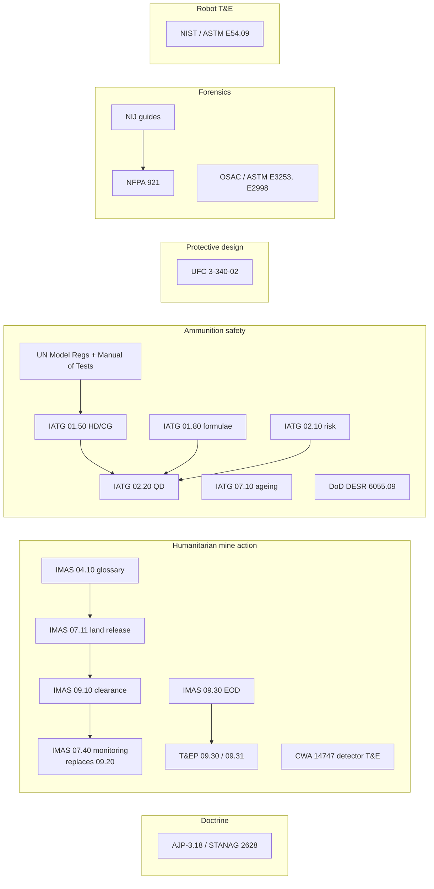

# Standards and doctrine map

This page maps the standards, doctrine and test methods that the course cites. It gives what
each one covers, what the course uses it for, where it appears, and whether you can read it for
free. The course reads standards for **definitions, classification, principles, quantitative
relations and evaluation methods**. Their operational procedures are out of scope (see the
boundary callout in each stage README). Short keys match
[curriculum/sources.md](curriculum/sources.md), and terms match the
[glossary](references/glossary.md).

**Access:** *free* free/public · *paid* paid · *restricted* distribution-limited.
**Status** follows the research files: Verified = fetched Sept 2026; Verified (index) = confirmed
by catalogue or search, direct fetch blocked.

---

## 1. NATO doctrine

| Standard | Scope | Course use | Lessons | URL | Access / status |
|---|---|---|---|---|---|
| **AJP-3.18** Ed. B v1, *Allied Joint Doctrine for EOD Support to Operations* (Sept 2023) | NATO joint EOD doctrine. It covers the fundamentals, EOD in the joint operating environment, command and control, and a Lexicon. It defines five capability subsets: EOR, EO clearance, CMD, IEDD and CBRN EOD. | The top-level taxonomy of the field; terminology (EOR, EH, IEDD, CMD); the C-IED pillars; the C2 context for incident management. | [00.1](lessons/stage-00/lesson-01.md), [00.2](lessons/stage-00/lesson-02.md), [03.1](lessons/stage-03/lesson-01.md), [03.4](lessons/stage-03/lesson-04.md), [07.2](lessons/stage-07/lesson-02.md) | https://assets.publishing.service.gov.uk/media/65d48f3f38fef90011b5b03b/AJP_3_18_EOD_EdB_V1.pdf | *free* Verified |
| **STANAG 2628** | The NATO Standardization Agreement by which nations ratify AJP-3.18, with or without reservations. Several nations record reservations for the CBRN and underwater subsets. | Explains how doctrine becomes binding across nations, and why capability subsets differ between nations. | [00.2](lessons/stage-00/lesson-02.md) | Recorded in the AJP-3.18 front matter (URL above). The STANAG text itself is not public. | *restricted* (STANAG text); front matter *free* |

## 2. Humanitarian mine action (IMAS and T&EP)

IMAS are maintained by UNMAS, with GICHD as custodian. Hub: https://www.mineactionstandards.org/

| Standard | Scope | Course use | Lessons | URL | Access / status |
|---|---|---|---|---|---|
| **IMAS 04.10** *Glossary of mine action terms, definitions and abbreviations*, Ed. 2 Amdt 13 (16 Jun 2026) | The authoritative mine-action vocabulary. | The reference for the course glossary: EO, UXO, AXO, ERW, mine, booby trap, land release, NTS, TS, clearance, CHA/SHA. | [00.1](lessons/stage-00/lesson-01.md), [03.1](lessons/stage-03/lesson-01.md), [05.7](lessons/stage-05/lesson-07.md) | https://www.mineactionstandards.org/standards/04-10/ | *free* Verified |
| **IMAS 07.11** *Land release*, Ed. 2 (16 Jan 2026) | The land-release process (NTS → TS → clearance), "all reasonable effort", land categories (cancelled, reduced, cleared) and liability. | The decision structure of 05.7. It is the reason survey-driven release beats blanket clearance, and it gives an evidence-based decision framing for 07.1. | [05.7](lessons/stage-05/lesson-07.md), [07.1](lessons/stage-07/lesson-01.md) | https://www.mineactionstandards.org/standards/07-11/ | *free* Verified |
| **IMAS 09.10** *Clearance requirements*, Ed. 2 Amdt 6 (Jan 2020) | Defines "cleared" (all EO removed or destroyed from a specified area to a specified depth), with QA/QC. | Specifying the clearance requirement as a detection-performance target; the depth parameter in search models. | [05.7](lessons/stage-05/lesson-07.md) | https://www.mineactionstandards.org/standards/09-10/ | *free* Verified |
| **IMAS 09.20** *Post-clearance inspection* — **withdrawn** | Formerly covered sampling inspection of cleared land. | Superseded by IMAS 07.40, *Monitoring of mine action organisations*, Ed. 2 (20 Jan 2016): https://www.mineactionstandards.org/standards/07-40/. The course teaches QC acceptance sampling through 07.40. | [05.7](lessons/stage-05/lesson-07.md) | (withdrawn) | 07.40 *free* Verified (index) |
| **IMAS 09.30** *Explosive Ordnance Disposal* (Amdt Sept 2022) | Humanitarian EOD of mines, ERW, submunitions and abandoned chemical weapons, plus the EOD Levels 1–3+. | An *organisational* reference for how competence is tiered. Its procedures are not used. | [00.2](lessons/stage-00/lesson-02.md) | https://www.mineactionstandards.org/standards/09-30/ | *free* Verified |
| **T&EP 09.30/01/2022** *Conventional EOD Competency Standards*, Ed. 2 | Competency categories → clusters → roots → competencies, tagged by level (L1 93, L2 89, L3 156, plus six L3+ modules). | A data model for the course's own skill map, and evidence for the awareness → understand → explain progression. | [00.2](lessons/stage-00/lesson-02.md) | https://www.mineactionstandards.org/standards/09-30-01-2022/ | *free* Verified |
| **T&EP 09.31/01** *IEDD Competency Standards* (Amdt 1, Feb 2022) | The IEDD ladder (searcher, team assistant, operator, advanced) and its six categories. | Organisational context for improvised hazards. | [00.2](lessons/stage-00/lesson-02.md), [03.4](lessons/stage-03/lesson-04.md) | https://www.mineactionstandards.org/standards/09-31-01-2019/ | *free* Verified |
| **CWA 14747-1:2003** *Humanitarian Mine Action — Test and Evaluation — Metal Detectors* (Part 2, 2008: soil characterisation) | Laboratory and blind field-trial protocols for metal detectors that measure PoD and FAR statistically, separating intrinsic sensor performance from environment and operator. | The model for experimental design in 05.1: blind trials, confidence intervals on PoD, soil as a source of domain shift. It is also the template for ML test and evaluation in 09.6. | [05.1](lessons/stage-05/lesson-01.md), [05.2](lessons/stage-05/lesson-02.md), [09.6](lessons/stage-09/lesson-06.md) | Part 1: https://www.mineactionstandards.org/standards/07-05-2003/ · Part 2: https://knowledge.bsigroup.com/products/humanitarian-mine-action-test-and-evaluation-soil-characterization-for-metal-detector-and-ground-penetrating-radar-performance | Part 1 *free* Verified; Part 2 *paid* Verified (index) |

## 3. Ammunition safety and classification (UN, IATG, DoD)

| Standard | Scope | Course use | Lessons | URL | Access / status |
|---|---|---|---|---|---|
| **UN Model Regulations** (Orange Book) Rev. 24, Part 2 Ch. 2.1 (2025) | Defines UN Class 1: divisions 1.1–1.6 and compatibility groups. | The authoritative definitions of HD and CG. | [02.3](lessons/stage-02/lesson-03.md) | https://unece.org/transport/dangerous-goods/un-model-regulations-rev-24 | *free* Verified (index) |
| **UN Manual of Tests and Criteria** Rev. 8 (2023, Amdt 1 2025), Part I | The Class 1 test series (sensitivity, thermal stability and others) that lead to classification. | Explains what "sensitivity" means operationally and how test results map to a division. **Concepts only; test procedures are skipped.** | [02.3](lessons/stage-02/lesson-03.md) | https://unece.org/transport/publications/un-manual-tests-and-criteria-rev8-2023 | *free* Verified (index) |
| **IATG 01.50** *UN explosive hazard classification system and codes*, 3rd ed. (Mar 2021) | HD 1.1–1.6 and CGs with ammunition examples, hazard codes and labels. | The primary readable source for the classification lesson. | [02.3](lessons/stage-02/lesson-03.md), [03.1](lessons/stage-03/lesson-01.md) | https://data.unsaferguard.org/iatg/en/IATG-01.50-Explosive-hazard-classification-system-IATG-V.3.pdf | *free* Verified |
| **IATG 01.80** *Formulae for ammunition management*, 3rd ed. (Mar 2021) | Hopkinson–Cranz and Sachs scaling, dynamic pressure, reflection vs angle, K-B vs K-G validity (Z ≤ 40 and Z ≤ 500), and debris and fragment models. | The citation for the scaling equations in 01.5 and 04.x, and for the empirical-fit validity ranges used in Sim D. | [01.5](lessons/stage-01/lesson-05.md), [04.1](lessons/stage-04/lesson-01.md), [04.2](lessons/stage-04/lesson-02.md), [04.4](lessons/stage-04/lesson-04.md) | https://data.unsaferguard.org/iatg/en/IATG-01.80-Formulae-ammunition-management-IATG-V.3.pdf | *free* Verified |
| **IATG 01.90** *Ammunition management personnel competences*, 3rd ed. (Mar 2021) | The competence model (behavioural, technical, performance) and roles from handler to Force Explosives Safety Officer. | Organisational context: the ammunition-management career alongside EOD. | [00.2](lessons/stage-00/lesson-02.md) | https://data.unsaferguard.org/iatg/en/IATG-01.90-Personnel-competencies-IATG-V.3.pdf | *free* Verified |
| **IATG 02.10** *Introduction to risk management principles and processes*, 3rd ed. (Mar 2021) | Risk identification, analysis, evaluation, treatment; tolerable risk. | The risk vocabulary for 04.3 and the decision framing in 07.1. | [04.3](lessons/stage-04/lesson-03.md), [07.1](lessons/stage-07/lesson-01.md) | https://data.unsaferguard.org/iatg/en/V3_IATG-02.10_en.pdf | *free* Verified |
| **IATG 02.20** *Quantity and separation distances*, 3rd ed. (Mar 2021) | QD concepts: inter-magazine, inhabited-building and public-traffic-route distances as Z·W^(1/3). | Applying scaled distance to protective separation, with YU-based exercises. | [04.3](lessons/stage-04/lesson-03.md), [04.4](lessons/stage-04/lesson-04.md) | https://data.unsaferguard.org/iatg/en/V3_IATG-02.20_en.pdf | *free* Verified |
| **IATG 07.10** *Surveillance and in-service proof*, 3rd ed. (Mar 2021) | The ammunition surveillance system, propellant chemical stability (§13) and stability surveillance (§15). | The science of ageing and stabiliser depletion, and why legacy ordnance is hazardous. | [02.3](lessons/stage-02/lesson-03.md), [03.3](lessons/stage-03/lesson-03.md) | https://data.unsaferguard.org/iatg/en/IATG-07.10-Surveillance-proof-IATG-V.3.pdf | *free* Verified |
| **DoD DESR 6055.09** *Defense Explosives Safety Regulation*, Ed. 1 Change 2 (25 Nov 2025; formerly DoDM 6055.09-M) | US explosives-safety standards: hazard classification, compatibility, QD, siting. | A national counterpart to the IATG. Read V1 and V3 to compare QD philosophy. | [02.3](lessons/stage-02/lesson-03.md), [04.3](lessons/stage-04/lesson-03.md) | https://www.denix.osd.mil/ddes/denix-files/sites/32/2022/08/DESR-6055.09-Edition1-Change-2-251208.pdf | *free* Verified |
| **MIL-STD-1316F** *Fuze Design Safety — Design Criteria* (18 Aug 2017) | Safety criteria for fuzes and S&A devices. | Only the public *principle* of independent safety features activated by different environments. It motivates the safety-and-arming state-machine abstraction in 03.2. Nothing else is used. | [03.2](lessons/stage-03/lesson-02.md) | https://everyspec.com/MIL-STD/MIL-STD-1300-1399/MIL-STD-1316F_55755/ | *free* Verified (index) |

## 4. Protective design and blast effects

| Standard | Scope | Course use | Lessons | URL | Access / status |
|---|---|---|---|---|---|
| **UFC 3-340-02** *Structures to Resist the Effects of Accidental Explosions* (2008, Change 2 2014; supersedes TM 5-1300) | Blast loading (Ch. 2), structural response and SDOF (Ch. 3), and design of protective structures. | Ch. 2 is the public route to the Kingery–Bulmash curves (incident and reflected pressure, impulse, and the reflection coefficient vs angle in Fig. 2-193). Ch. 3 supplies the SDOF and P–I concepts. It is read as a book of curves, not as a design manual. The original K-B report (ARBRL-TR-02555) is *restricted*. | [04.1](lessons/stage-04/lesson-01.md), [04.2](lessons/stage-04/lesson-02.md), [04.3](lessons/stage-04/lesson-03.md), [01.6](lessons/stage-01/lesson-06.md) | https://www.wbdg.org/dod/ufc/ufc-3-340-02 | *free* Verified (mirror) |
| **DHS-DOJ Bomb Threat Stand-Off Card** (Aug 2025) | Published public-safety evacuation and shelter distances by threat size. | A worked example that connects TNT-equivalent mass to distance through Z. | [04.4](lessons/stage-04/lesson-04.md), [07.2](lessons/stage-07/lesson-02.md) | https://www.cisa.gov/resources-tools/resources/dhs-doj-bomb-threat-stand-card | *free* Verified |
| **FEMA NIMS**, 3rd ed. (Oct 2017) | ICS, unified command, resource management. | The command interface for incident management. | [07.2](lessons/stage-07/lesson-02.md) | https://training.fema.gov/emiweb/is/is700b/handouts/national_incident_management%20system_third%20edition_october_2017.pdf | *free* Verified (index) |

## 5. Forensics

| Standard | Scope | Course use | Lessons | URL | Access / status |
|---|---|---|---|---|---|
| **NFPA 921** *Guide for Fire and Explosion Investigations*, 2024 ed. | The scientific method for origin and cause, including an explosions chapter (types, seat, damage indicators). The 2024 edition adds guidance on cognitive bias and on expressing certainty. | The hypothesis-testing discipline in 08.1 and 08.2; the bias-control link to 07.1. | [08.1](lessons/stage-08/lesson-01.md), [08.2](lessons/stage-08/lesson-02.md) | https://www.nfpa.org/product/nfpa-921-guide-for-fire-and-explosion-investigations/p0921code/nfpa-921-guide-for-fire-and-explosion-investigations-2024/92124 | *paid* (free read-only with an account) Verified (index) |
| **NIJ** *A Guide for Explosion and Bombing Scene Investigation* (NCJ 181869, 2000) | The bombing-scene workflow: response, evaluation, documentation, evidence, completion. | The process model for 08.1 and the post-blast simulator (Sim E). | [08.1](lessons/stage-08/lesson-01.md) | https://www.ojp.gov/pdffiles1/nij/181869.pdf | *free* Verified |
| **NIJ** *Crime Scene Investigation: A Guide for Law Enforcement* (NCJ 243598, 2013) | General scene integrity and chain of custody. | The evidence-tracking data model in 08.1. | [08.1](lessons/stage-08/lesson-01.md) | https://www.ojp.gov/pdffiles1/ncjrs/243598.pdf | *free* Verified |
| **TWGFEX** post-blast residue guidelines (c. 2007, hosted by NIST) | Analytical techniques ranked by how much identifying information they give; orthogonal confirmation. | "Independent evidence" as an inference principle in 08.3. | [08.3](lessons/stage-08/lesson-03.md) | https://www.nist.gov/document/twgfexrecommendedguidelinesfortheforensicidentificationofpost-blastexplosiveresiduespdf | *free* Verified |
| **ANSI/ASTM E3253-21** *Standard Practice for Establishing an Examination Scheme for Intact Explosives* (OSAC Registry since 2022) | A laboratory examination scheme for intact explosives. It succeeds TWGFEX. | What the lab does and how conclusions are structured, at the method level only. | [08.3](lessons/stage-08/lesson-03.md) | https://www.nist.gov/osac/standards-library/ansiastm-e3253-21 | Summary *free*, standard *paid*; Verified |
| **ANSI/ASTM E2998** (current 25a) *Characterization and Comparison of Smokeless Powder* (OSAC Registry) | Forensic characterisation and comparison of smokeless powder. | An example of a comparison standard: class characteristics vs individualisation. | [08.3](lessons/stage-08/lesson-03.md) | https://www.nist.gov/osac/standards-library/ansiastm-e2998-25a | Summary *free*, standard *paid*; Verified (index) |

## 6. Robot test methods

| Standard | Scope | Course use | Lessons | URL | Access / status |
|---|---|---|---|---|---|
| **NIST Standard Test Methods for Response Robots / ASTM E54.09** | Reproducible test methods for response robots: mobility (terrain, stairs), manipulation dexterity and strength, sensors, energy and endurance, radio comms, and operator proficiency. The work was partly funded for counter-IED robots. | Requirements and evaluation for 06.1. The dexterity tasks inform 06.3 and the comms tests inform 06.9. It is the evaluation blueprint for capstone C1 and the Sim G obstacle course. | [06.1](lessons/stage-06/lesson-01.md), [06.3](lessons/stage-06/lesson-03.md), [06.9](lessons/stage-06/lesson-09.md) | https://www.nist.gov/el/intelligent-systems-division-73500/standard-test-methods-response-robots · Dexterity: https://www.nist.gov/document/astm-e5409-ground-test-methods-dexterity-and-strength-2021a · C-IED training: https://www.nist.gov/document/c-ied-training-using-standard-test-methods-response-robots-v2015pdf · ASTM list: https://www.astm.org/membership-participation/technical-committees/committee-e54/subcommittee-e54/jurisdiction-e5409 | NIST *free* Verified; ASTM standards *paid* |

## 7. Quick lookup by stage

| Stage | Standards |
|---|---|
| 0 Orientation | AJP-3.18, STANAG 2628, IMAS 04.10, IMAS 09.30, T&EP 09.30/09.31, IATG 01.90 |
| 1 Physics | IATG 01.80 (scaling) |
| 2 Chemistry | UN Model Regs + Manual of Tests, IATG 01.50, IATG 07.10, DESR 6055.09 |
| 3 Recognition | IMAS 04.10, IATG 01.50, MIL-STD-1316F (principle only), AJP-3.18 |
| 4 Blast effects | UFC 3-340-02, IATG 01.80, 02.10, 02.20, DESR 6055.09, DHS-DOJ card |
| 5 Detection | CWA 14747-1/-2, IMAS 07.11, 09.10, 07.40 (replaces 09.20) |
| 6 Robotics | NIST / ASTM E54.09 |
| 7 Decisions | IATG 02.10, IMAS 07.11, AJP-3.18, NIMS |
| 8 Forensics | NIJ guides, NFPA 921, TWGFEX, ASTM E3253, E2998 |
| 9 AI & CV | CWA 14747-1 as a T&E template; NIST E54.09 for field evaluation |
